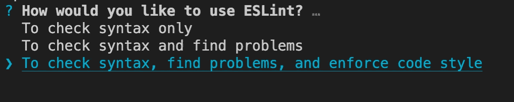
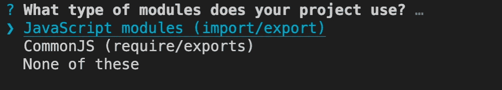
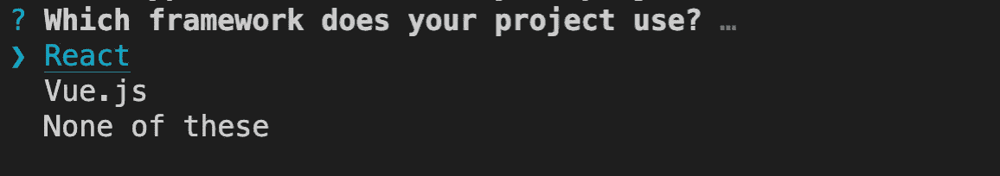
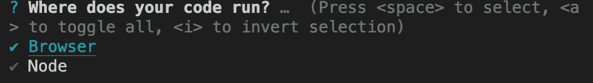
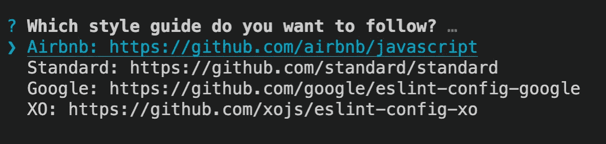
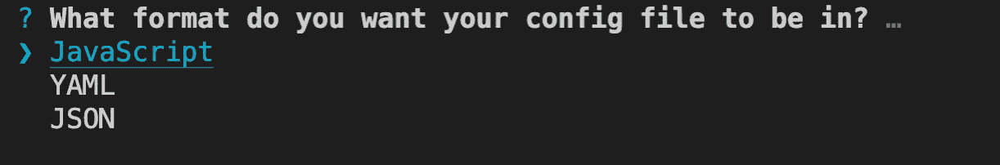
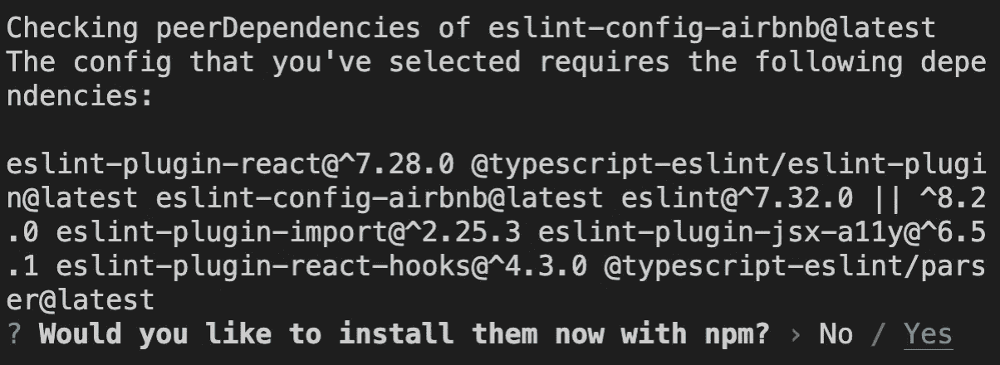
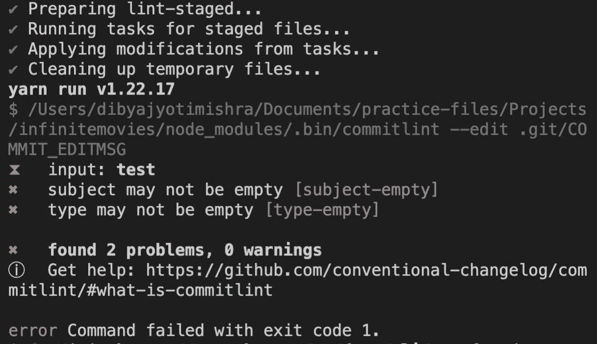

# 在您的 JavaScript 项目中配置 ESLint、Prettier 和 CommitLint。

> 原文：<https://blog.devgenius.io/enforce-strict-code-style-in-a-team-cda6f68d944b?source=collection_archive---------2----------------------->


> 所以，如果你想走得快，如果你想快速完成，如果你想让你的代码容易写，让它容易阅读。罗伯特·c·马丁。

当你在一个大型项目的团队中工作时，拥有一个干净的代码是一个真正的福音。这在调试时节省了大量的时间，并使同行代码审查非常顺利。但是你如何做到这一点呢？这很简单。组合使用 husky、pre-commit、es-lint、commitlint 和 appellister。让我们分别讨论一下。

**Husky** : Husky 是一个非常受欢迎的工具，可以让你针对你的存储库运行定制脚本。它可以与任何包含 package.json 文件的存储库无缝协作。通过确保单元测试、林挺和其他检查在每次提交前自动运行，它可以帮助提高代码质量。点击了解更多信息[。](https://typicode.github.io/husky)

**预提交** : **预提交**是`git`的预提交钩子安装程序。预提交挂钩是您希望在代码提交到远程存储库之前运行的脚本。和哈士奇不一样。你可以想象 pre-commit 是一辆车，哈士奇是它的司机。如果没有，您就无法利用预提交的潜力。

**EsLint** :由 Nicholas C. Zakas 于 2013 年 6 月开发， **ESLint** 是一款开源的 EcmaScript/Javascript 林挺工具，用于检查有问题的模式或不符合特定风格准则的代码。它使用抽象语法树(AST)来评估代码中的模式。点击阅读更多关于 AST [的信息。它是完全可插拔的，每一个规则都是一个插件，你可以在运行时添加更多。](https://en.wikipedia.org/wiki/Abstract_syntax_tree)

类似于 Eslint，commit-lint 是一个工具，它链接提交并使你的团队遵循一个特定的提交风格。它的功能相当于一个 husky 预提交挂钩，这意味着它在代码提交之前运行良好，并且在 lint 检查失败时禁止提交代码。

**更漂亮:更漂亮**是一个固执己见的代码格式化程序。它通过解析您的代码并根据自己的规则(考虑到最大行长度，必要时换行)重新打印代码来强制执行一致的风格。到目前为止，采用 beautiful 的最大原因是**停止所有正在进行的关于风格的争论**。人们普遍认为，拥有一个通用的风格指南对于一个项目和团队来说是有价值的，但是实现它是一个非常痛苦和没有回报的过程。

行..理论太多，一次消化不了，也很无聊。

让我们跳到精彩的部分…

首先从 create-react-app 模板安装一个 react 应用程序。

```
npx create-react-app bestcodeapp --template typescript
```

一旦安装完成。为了启用预提交，您需要初始化 git 存储库。让我们现在做那件事。

```
1\. git init
2\. git add .
3\. git branch -M develop
```

现在，让我们安装我们的依赖项。

```
yarn add --dev husky lint-staged prettier eslint eslint-config-airbnb eslint-config-airbnb-base @typescript-eslint/parser @typescript-eslint/eslint-plugin @commitlint/cli @commitlint/config-conventional eslint-config-prettier eslint-plugin-import eslint-plugin-jsx-a11y eslint-plugin-react eslint-plugin-react-hooks
```

一旦安装完成。让我们从配置 **eslint** 开始。

```
npx eslint --init
```



*   你应该得到类似上面图像的选项。选择第三个选项。



*   选择 Javascript 模块。然后回车。



*   因为我们在本教程中使用 react，所以您也可以继续使用其他框架。程序仍然保持不变。


*   根据您是否使用 Typescript，继续使用选项。我现在会选择**是的**。



*   选择浏览器。如果您正在编写节点 JS API，那么您需要选择第二个选项。



*   我会选 Airbnb，个人喜好。随意探索他人。



*   在 Javascript 和 JSON 之间选择一个。没关系。



*   我们已经安装了一些以上的依赖项。然而，继续进行**是**。

继续安装。完成所有安装后，您将看到一个. eslintrc.js 或. eslintrc.json，这取决于您之前选择的格式。

我们来补充一些规则。你可以在这里找到关于它们的详细文档[。我将在这里提到其中的几个。](https://eslint.org/docs/rules/)

现在向 package.json 添加一个脚本。

```
"lint": "eslint ."// To specify a specific path use:"lint": "eslint 'src/app/*.{js,jsx,ts,tsx}'"
```

现在运行:

```
yarn lint
```

如果你没有遵循上述任何规则，你肯定会看到一些错误。

现在，让我们添加 husky 作为预提交挂钩来运行它。

```
npx husky install
```

您会发现在您的根目录中创建了一个. husky 文件夹。导航到目录并运行:

```
touch commit-msg pre-commit
```

并在其中添加以下代码。

在根目录下运行:

```
touch commitlint.config.js
```

在其中，添加以下代码:

现在让我们试着提交我们的代码。

```
1\. git commit -m "testing commitlint"
2\. git remote add origin YOUR_GIT_URL
3\. git push
```

您应该会看到类似这样的错误。



将您的提交消息更改为，以解决上述错误:

```
git commit -m "chore: configure husky"
```

点击阅读更多关于常规提交[的内容。](https://www.conventionalcommits.org/en/v1.0.0/)

现在该加漂亮点了。开始于:

```
touch .prettierrc.js
```

添加以下内容。

你现在都准备好了。从你令人敬畏的项目开始。我知道这是一项漫长而耗时的任务。但是相信我，当你的项目规模扩大时，它会节省你大量的时间。目前就这些。

如果你想让我为你创建一个模板，让我知道，这样你就可以简单地克隆它，节省一些时间。

我将很快在另一个博客中赶上你。在那之前，保重。快乐编码。！**关注**我获取更多此类内容。谢了。祝你有美好的一天！