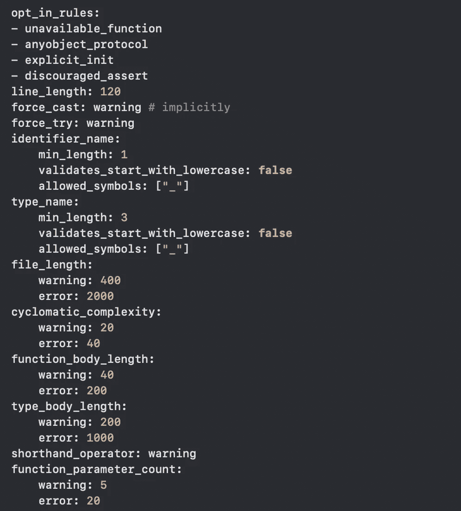
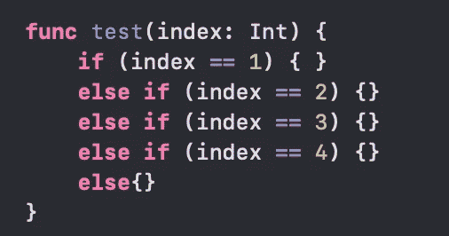

# 对 iOS 实施 Swift 风格和惯例

> 原文：<https://blog.devgenius.io/enforce-swift-style-and-conventions-for-ios-7f5047837e82?source=collection_archive---------5----------------------->

## 一种让您团队中的所有开发人员使用相同的编码标准和规则编写代码的方法

照片由来自 [Pexels](https://www.pexels.com/photo/man-in-grey-sweater-holding-yellow-sticky-note-879109/?utm_content=attributionCopyText&utm_medium=referral&utm_source=pexels) 的 [hitesh choudhary](https://www.pexels.com/@hiteshchoudhary?utm_content=attributionCopyText&utm_medium=referral&utm_source=pexels) 拍摄

当你在一个大型开发团队中工作时，保持代码整洁和更快地进行代码审查的最好方法是对所有开发人员强制执行编码标准。

在 Swift 中，您可以使用 SwiftLint 库实现这一点。它可以通过 CocoaPods 使用 Pod“swift lint”进行安装。关于如何安装库的更多信息，您可以访问 https://github.com/realm/SwiftLint

在这篇文章中，我们将涵盖一些重要的规则，我们应该为我们的项目设置。您需要在项目中创建一个新文件“. swiftlint.yml ”,我们将在其中包含我们的规则。该文件应该如下所示

如果您注意，您会看到每种规则类型的“警告”和“错误”变量。这是非常重要的，因为如果你违反了一些规则，或者只是给你一个警告，你可以强制编译器阻止你。

让我们把重点放在我认为能对你的项目产生良好影响的一些方面。

**force_cast，force_try:** 这两个都是避免零值和可能的崩溃所必需的。原力投像(let URL = URL(" https://www . Google . com ")！)意味着您将强制该对象不为空，但如果为空，应用程序将会崩溃。你需要避免在你的应用程序中使用这些，而是使用“保护让”或“如果让”。对于 force try 也应该这样做(例如在解析 json 时)。有时强制转换并不一定是不好的，例如当你转换一个 UITableViewCell 时你可以使用它们，所以我们只是把它作为一个警告而不是一个错误。

**function_parameter_count，function_body_length** :我们需要这两者来让我们的函数尽可能的简单。我们将函数 max 的参数设置为 5，将 body length(函数行)设置为 40。如果开发者需要更多，他应该拆分他的功能。(那些规则应该由整个团队决定)。万一 20 和 200 Xcode 会给你一个编译错误。

**cyclomatic_complexity** :这是一个函数的复杂度。在我们的情况下，它不应该超过 20(相信我，这是很多)。检查以下复杂度为 5 的函数。使用这条规则，您可以避免使用多个 if 语句，这会使阅读代码变得非常复杂。

复杂度为 5 的测试函数

**file_length** :好的，对于这个每个开发者可能都有不同的看法。在我们的项目中，我们的警告规则是 400，但有时我们需要更多，因为这不是一个好主意来分隔我们的类。我们决定 400 是一个好数字，如果有人不得不添加超过 400 行，那么他可以使用**//swift lint:disable file _ length**来关闭文件警告

**type_name，identifier_name** :这里需要设置一些变量或类型的命名规则。在我们的例子中，我们将 type_name 的最小值设置为 3，这是例如结构的名称和变量的标识符名称。通常在命名时，我们使用大写字母表示类型，小写字母表示标识符(在我们的例子中，我们没有强制这样做，但是这样做是个好主意)

这些是 SwiftLint 的一些基本规则。如果你把它作为 SwiftLint 安装到一个大项目中，默认情况下它会用默认值启用一些规则。您需要排除这些规则，并用您自己的配置覆盖其中一些规则。

将 SwiftLint 导入已经开发的应用程序的最佳方法是在开始时排除所有规则，一次删除一个规则，直到您的项目成功编译。

*更多内容尽在*[*blog . devgenius . io*](http://blog.devgenius.io)*。*