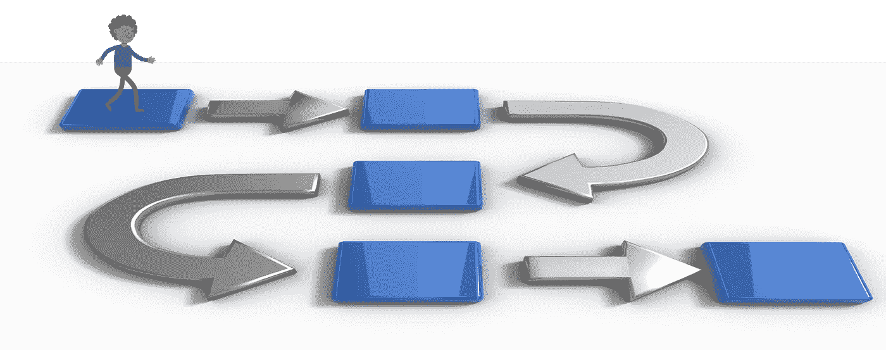
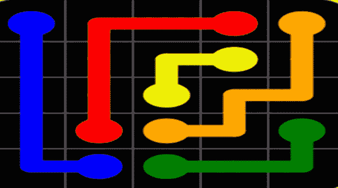

# 工程严谨至关重要。

> 原文：<https://blog.devgenius.io/engineering-rigour-matters-5013d3773ff2?source=collection_archive---------24----------------------->

随着公司、组织和个人都在想办法克服疫情带来的健康、经济和个人痛苦，重温软件工程的一些基本原则及其重要性可能是个好主意。这是一篇关于执行哲学的短文。

在我的个人经历中，我遇到过上市时间比其他任何事情都重要的情况。没有经过深思熟虑的成本效益分析。在大多数情况下，向最终用户的交付最多遇到“meh ”,最坏的情况是灾难性的失败。虽然我本质上是一名工程师，但我学会了克制自己内心的恶魔，以确保我参与交付的任何东西都能在 TTM 和质量之间取得平衡。这是建立长期盈利和稳定的产品或解决方案的唯一经过试验和测试的方法。

*   快速移动&打破东西是好的，但只是在某些领域。你正在构建一个客户会付钱给你的解决方案或产品，他们期望这是正常运行的基本前提。如果你正在构建一个原型来验证一个想法，那就另当别论了——在这方面要自由，但也要让你的用户有信心。这句格言应该是，“动作要快&打破能打破的东西”。

*   工程过程很重要，不仅仅是学术兴趣。并且不需要很长时间来构建和调整它们。过程帮助您的团队对如何处理文档化需求、构建和验证架构、如何修复缺陷、如何测试、如何雇佣合适的候选人等等有一个清晰的预先想法。

*   拥有一个适合你的过程是盈利的唯一途径。一个遵循流程的团队就像一台运转良好的机器，生产出经得起时间考验的高质量产品。

*   监督事项。仅仅有一个文档化的过程是不够的。有权威的人必须确保他们被遵守。屡次违反必须招致适当的行动。

*   文件很重要。对于您正在构建的东西以及您重用/依赖的东西。对于前者，确保您拥有正确的更新文档(帮助、手册、代码注释)。对于后者，确保您的团队清楚地理解它所使用的第三方代码。

根据我与许多行业人士的讨论，有一个普遍的共识，即现在是审查他们当前流程和执行的好时机。其目的是一旦经济前景好转，就准备好一个更强有力的交付机制。我同意。

*感谢您阅读这篇文章！我欢迎您的任何意见或疑问。我是一名独立的技术顾问，我帮助组织在利用机器学习、云计算、物联网、移动应用程序等技术开展业务的过程中导航。最近，我 a)启动、设计并制作了一个医疗保健生物反馈平台的原型，b)构建了一个大数据分析管道，c)在自然语言处理领域开创了新方法，d)使用机器学习帮助自动化业务流程，以及 e)稳定并改进了一个报告主要领域问题的 ETL 测试产品。如果您或您的组织正在寻求数字化转型方面的帮助，请发送* [*me*](https://in.linkedin.com/in/sushrut-mair-3769b62) *消息！*