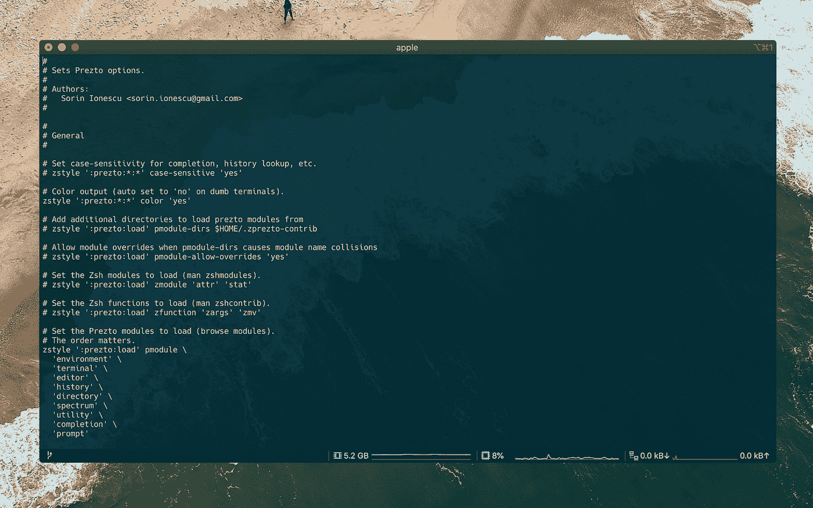
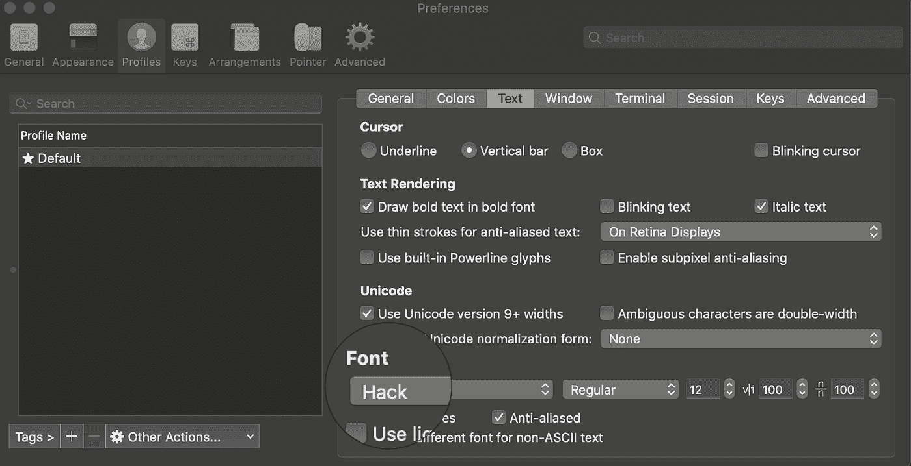
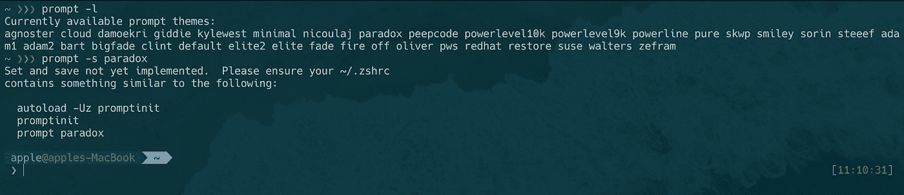
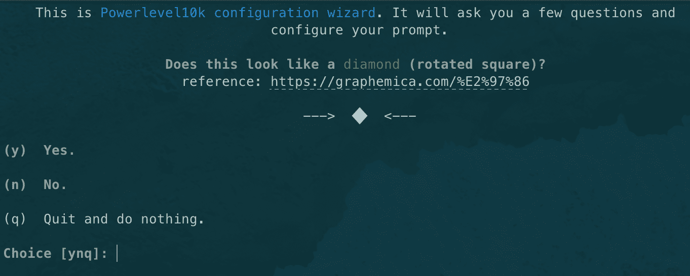
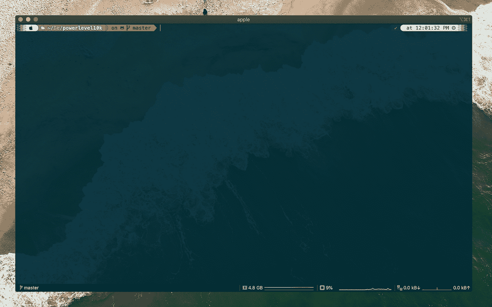

# 用 Prezto 为您的 ZSH 码头增添活力

> 原文：<https://blog.devgenius.io/enhance-your-terminal-with-zsh-and-prezto-ab9abf9bc424?source=collection_archive---------0----------------------->


照片由 [Aaron Burden](https://unsplash.com/@aaronburden?utm_source=unsplash&utm_medium=referral&utm_content=creditCopyText) 在 [Unsplash](https://unsplash.com/s/photos/sea-shell?utm_source=unsplash&utm_medium=referral&utm_content=creditCopyText)

一段时间以来，我一直使用 zsh 作为我的默认 Unix shell，它是一个扩展的 Bourne shell，有许多改进，包括 bash、ksh 和 tcsh 的一些特性。我最喜欢的贝壳之一是鱼壳。它很容易设置，我使用的许多功能都是预装的，因为它不支持 POSIX，它有一个非常可读的(fish)脚本语法。

> 为什么我从 fish 切换到 zsh，并使用 Prezto 而不是 oh-my-zsh。

后者也可能是一个缺点。我使用的许多 bash 脚本都是用 bash 编写的。这意味着 fish 不支持所有的语法。出于这个原因，我去寻找一个替代方案，并很快来到了 [zsh](https://en.wikipedia.org/wiki/Z_shell) (发音为 Z shell)。尽管 zsh 默认不支持 POSIX，但 zsh 使模拟 POSIX 成为可能。

最流行的 zsh 框架是 Oh-My-Zsh。哦，我的 zsh 为您提供了许多选项来设置您的 zsh 环境。我使用 Oh-My-Zsh 已经有一段时间了，对于大多数人来说，这是一个很好的选择。然而，在使用 Oh-My-Zsh 之后，我发现自己没有使用 Oh-My-Zsh 必须提供的许多功能。

所以我在寻找另一种选择。我很快来到了普雷斯托。*和 Oh-My-Zsh 一样，Prezto 是 Zsh 的一个配置框架。它带有自动完成，别名，功能和提示主题。*

> 如果你想添加你自己的定制配置，框架是不必要的，但是它确实使事情更容易设置。

## 我将讨论以下内容:如何安装 zsh 和 Prezto，有用的插件，主题化，别名和自定义函数等功能。

我的安装将在 macOS 上，但如果你是 Linux 用户，这不会有太大的不同。如果你使用的是 Windows，情况会略有不同。如果你想知道如何在 Windows 上安装 zsh 和 Prezto，请在评论中告诉我，这样我可以在以后添加这些步骤。

**TLDR；**

如果你喜欢马上开始，你可以[在这里](https://gist.github.com/rickdaalhuizen90/2ce9eb662e71024ca12e0635cfb44dab)下载我的 zsh 配置[。](https://gist.github.com/rickdaalhuizen90/2ce9eb662e71024ca12e0635cfb44dab)

**安装**

如果您使用的是 macOS Catalina 或更高版本，那么您可能听说过他们已经用 zsh 代替 bash 作为默认 shell 。

运行以查看您当前的 shell 是什么

```
echo $SHELL
```

如果没有安装 zsh，可以用自制。[家酿](https://brew.sh/)是 macOS 的软件包管理器。对于 Linux，你可以使用用于 windows 的 [Snapcraft](https://snapcraft.io/) 或 [Flatpak](https://flatpak.org/) 和 [Chocolatey](https://chocolatey.org/) 。在继续之前，请确保您安装了软件包管理器。

```
brew install zsh
```

然后将 zsh 设置为默认 shell:

```
chsh -s /bin/zsh
```

Zsh 使用~ / 5 启动文件。这些将在我们安装 Prezto 后可见。

```
$ZDOTDIR/.zshenv
$ZDOTDIR/.zprofile
$ZDOTDIR/.zshrc
$ZDOTDIR/.zlogin
$ZDOTDIR/.zlogout
```

> 从您的终端可以回显$ ZDOTDIR 来查看它所指的内容。默认情况下，它指的是$HOME。

*   的。每次启动 zsh 都会用到 zshenv。这是为您的环境变量，如$PATH，$EDITOR，$VISUAL，$PAGER，$LANG。
*   的。zprofile 是。zlogin 和这两个不打算一起使用。
*   的。zshrc 是我们添加别名、函数和其他定制的地方。在本教程中，我们将主要讨论. zshrc。
*   的。zlogin 在您登录 shell 时启动，但在您的. zshrc 之后。
*   的。当你关闭你的外壳时，使用 zlogout。

我们会回来的。zshrc 以后，现在我们将让它保持原样。让我们从安装 Prezto 开始。

```
git clone --recursive [https://github.com/sorin-ionescu/prezto.git](https://github.com/sorin-ionescu/prezto.git) "${ZDOTDIR:-$HOME}/.zprezto"
```

然后将以下内容复制粘贴到您的终端中:

```
setopt EXTENDED_GLOB
for rcfile in "${ZDOTDIR:-$HOME}"/.zprezto/runcoms/^README.md(.N); do
  ln -s "$rcfile" "${ZDOTDIR:-$HOME}/.${rcfile:t}"
done
```

在我们安装了 Prezto 之后，您会在 zsh 启动文件旁边的 HOME 文件夹中找到一个. zpreztorc 文件。在这里，我们编辑我们的 Prezto 选项。



*带状态栏的 iTerm2】*

**插件**

要在 zsh 中安装插件，我们需要一个插件管理器，我更喜欢使用 [zplug](https://github.com/zplug/zplug) ，但也可以随意使用任何其他的[插件管理器](https://www.reddit.com/r/zsh/comments/ak0vgi/a_comparison_of_all_the_zsh_plugin_mangers_i_used/)。Zplug 也使得安装 Oh-My-Zsh 插件没有任何麻烦成为可能。

要安装 zplug，请运行以下命令:

```
curl -sL --proto-redir -all,https [https://raw.githubusercontent.com/zplug/installer/master/installer.zsh](https://raw.githubusercontent.com/zplug/installer/master/installer.zsh) | zsh
```

我们将安装以下内容

*   Git—*Git 的标签完成库*
*   OS x*——为 macOS* 提供一些实用程序
*   Zsh 自动建议— [*鱼*](http://fishshell.com/)*—喜欢快速/不唐突的 zsh 自动建议。*
*   Fasd *—为 POSIX shells 提供对文件和目录的快速访问*
*   Enhancd *—带有交互式过滤器的下一代 cd 命令*
*   Fzf — *一个通用命令行模糊查找器。*
*   Lsdeluxe — *用颜色和图标给 ls 输出着色*
*   纱——*为* [*纱包管理器*](https://yarnpkg.com/en/) 添加常用别名和补全
*   Powerlevel10k — *带有配置向导的 zsh 的 Powerlevel10k 主题。*

这些是我使用的基本插件，每个人都不一样，所以花点时间看看哪些插件适合你。更多插件见:[牛逼的 zsh 插件](https://github.com/unixorn/awesome-zsh-plugins)。

将以下内容添加到您的~/中。zshrc 文件。

```
# Customize to your needs...
source ~/.zplug/init.zsh# Plugins
zplug "plugins/git",   from:oh-my-zsh
zplug "plugins/osx",   from:oh-my-zsh
zplug "zsh-users/zsh-autosuggestions"
zplug "clvv/fasd"
zplug "b4b4r07/enhancd"
zplug "junegunn/fzf"
zplug "Peltoche/lsd"
zplug "g-plane/zsh-yarn-autocompletions"
zplug "romkatv/powerlevel10k", as:theme, depth:1
```

然后我们运行:

```
source ~/.zshrc && zplug install
```

**添加字体**

让我们从安装一个 Nerd 字体开始，这确保了我们的主题中所有的字形和图标都被支持。

去书呆子字体网站[下载你选择的字体，我更喜欢 Hack。](https://www.nerdfonts.com/)

然后在终端中设置您的字体:



**添加主题**

Prezto 标配了许多您可以使用的主题。一旦你输入提示-l ，你会看到一个当前可用主题的列表。比如用 *prompt -s paradox* 设置一个主题。



如果你对你的主题满意，你可以把它保存在你的。zpreztorc 文件如下。在这种情况下，我们选择 powerlevel10k，这可能是最知名的主题之一。

为了设置这个，我们在 preztorc 文件中选择“主题”。

```
# Set the prompt theme to load.
# Setting it to 'random' loads a random theme.
# Auto set to 'off' on dumb terminals.
zstyle ':prezto:module:prompt' theme 'powerlevel10k'
```

然后启动 p10k 安装向导，启动方式如下:

```
p10k configure
```



按照设置向导完成后，您的 powerlevel10k 就设置好了。这是我的结果



**别名**

通用别名插件让我们可以访问我们可以使用的别名列表。但是，如果您想添加自己的别名，可以在您的。zshrc 文件。

特定别名的示例

```
# Aliases
alias untar='tar -zxvf' # Unpack .tar file
alias wget='wget -c' # Download and resume
alias getpass='openssl rand -base64 20' # Generate password
alias sha='shasum -a 256' # Check shasum
alias ping='ping -c 5' # Limit ping to 5'
alias www='php -S localhost:8000' # Run local web server
```

**自定义功能**

对于一些复杂的命令，别名是不够的，长命令很难维护。我们可以为此使用自定义函数。有几种方法可以在 zsh 中创建自定义函数。我举两个最常见的例子。

一种是在你的~/中如下定义你的函数。zshrc:

```
# Custom functions
hello_world () {
    echo "Hello world"
}
```

之后，使用 source 命令加载您的函数并如下运行它。

```
source ~/.zshrc && hello_world
```

第二种方法是定义您的自定义函数。

这将使您的 zsh 配置更有条理，而不是把所有东西都放在~/中。zshrc 文件。

当您在控制台中回显$fpath 时，您可以看到一组正在定义的目录，其中包含可以标记为自动加载的文件。要将一个文件夹添加到您的 fpath 中，我们需要在您的 *~/中添加以下内容。zshrc* 。

```
fpath=( ~/.zfunc "${fpath[@]}" )
```

然后我们检查 zfunc 是否被添加到$fpath 中。

```
source ~/.zshrc && echo $fpath | grep -o zfunc
```

最后我们需要创建一个目录~/。zfunc 带有一个“hello”文件——你可以随意命名，但这是我喜欢的方式。

```
mkdir ~/.zfunc && touch ~/.zfunc/hello
```

例如，我创建了一个简单的 hello 函数。

```
hello () {
    echo "Hello $@"
}hello
```

在您需要将函数标记为自动加载后，U 选项抑制别名扩展，z 代表使用 zsh 而不是 kash 样式:

```
autoload -Uz hello
```

记得每次更新函数的时候都要这样做:

```
source ~/.zshrc/hello
```

您可以运行后:

```
hello John
```

我们已经到了这个博客的结尾。我希望我已经为您提供了足够的信息来创建您自己的 zsh 配置。如果有任何问题或建议，请在评论中告诉我。

# 觉得这个帖子有用吗？请点击👏下面的按钮！:)

*来源:*

*   [*Z 壳手册*](http://zsh.sourceforge.net/Doc/Release/index.html)
*   [*启动文件*](http://zsh.sourceforge.net/Intro/intro_3.html)
*   [*什么应该/不应该进去。zshenv，。zshrc，。兹洛金，。zprofile，。zlogout？*](https://unix.stackexchange.com/questions/71253/what-should-shouldnt-go-in-zshenv-zshrc-zlogin-zprofile-zlogout)
*   [*如何在 zsh*](https://unix.stackexchange.com/questions/33255/how-to-define-and-load-your-own-shell-function-in-zsh) 中定义并加载自己的 shell 函数