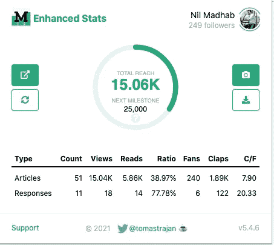
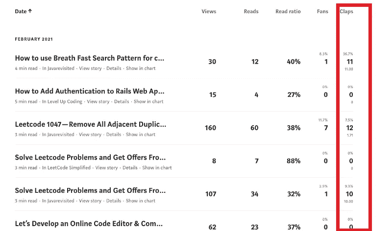
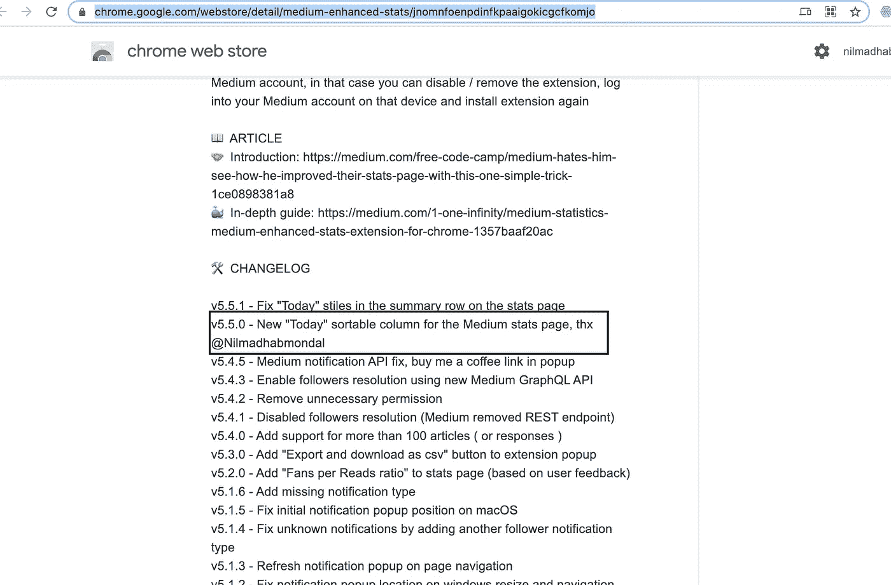
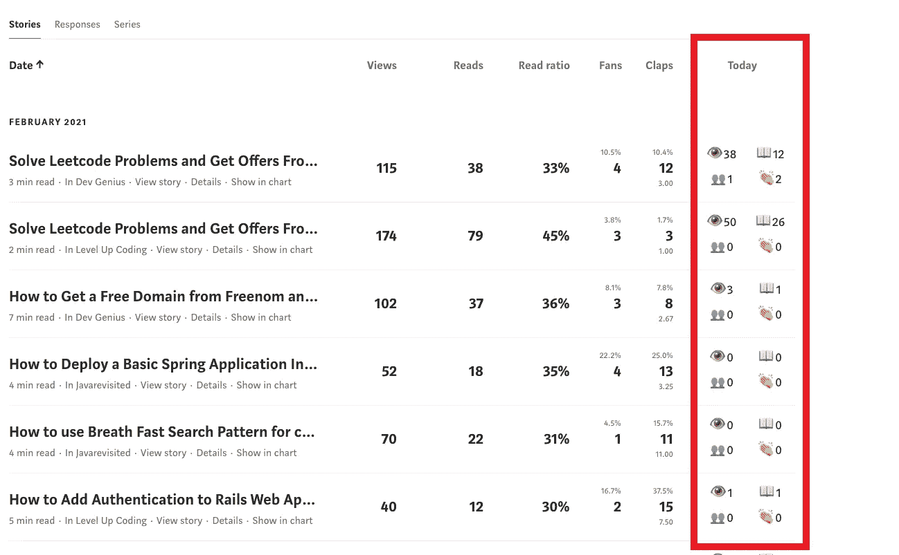
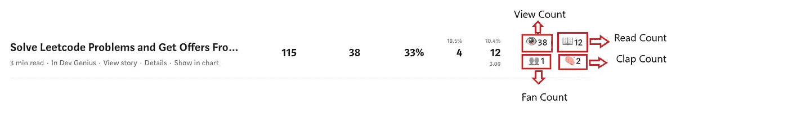
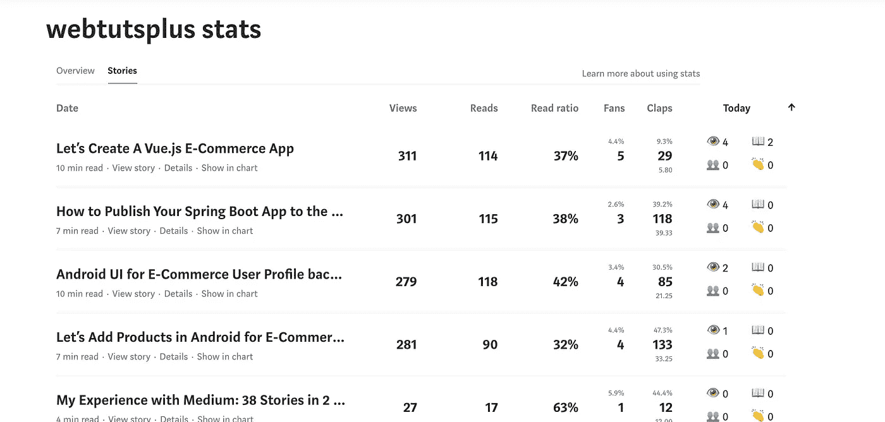

# 增强中等增强统计铬扩展

> 原文：<https://blog.devgenius.io/enhancing-the-medium-enhanced-stats-chrome-extension-c99c1d251240?source=collection_archive---------4----------------------->

我为任何关心统计数据的媒体作者添加了一个必备扩展的新功能！

丹尼尔·约瑟夫在 [Unsplash](https://unsplash.com/s/photos/technology?utm_source=unsplash&utm_medium=referral&utm_content=creditCopyText) 上的照片

**Medium enhanced Stats**是一个 Chrome 浏览器扩展，它允许 Medium 作者查看他们的统计数据的全面分类。

该扩展超越了 Medium 内置统计数据的限制，并为您的文章中的数据提供了至关重要的洞察力。

增强状态

中级增强统计扩展包括的一些流行的统计是:

*   一个图表显示了您所有媒体文章的总浏览量。
*   媒体报道和媒体回应的统计数据。一些测量的统计数据包括**浏览量、阅读量、阅读率、粉丝数、鼓掌数、粉丝与鼓掌数之比，以及发布的故事或回应总数**。
*   你也可以在中等统计部分(在图表下方)看到更详细的分类，在那里你可以看到你的故事特定的统计列表。你会注意到，除了标准的数据点(浏览量、阅读量、阅读比率和粉丝)，还有一个允许你查看文章掌声的栏。

你可以通过访问开发者 [Tomas Trajan](https://medium.com/u/360cd444e1fc?source=post_page-----5a98e60be194--------------------------------) 的 [GitHub 页面](https://github.com/tomastrajan)找到更多关于 Medium Stats 扩展的信息。

 [## 托马斯特拉扬-概述

### 热衷于前端，棱角，材料设计和打字稿🛠️🌞显然光明的未来🌞 🤝谷歌…

github.com](https://github.com/tomastrajan) 

# 进一步增强

作为一个专注的媒体作者，我非常喜欢 chrome 扩展，我每天都在使用它。然而，我想要更多的功能，

1.  我想看看今天的每篇文章有多少浏览量、阅读量、掌声和粉丝。
2.  根据今天最多的浏览次数对我的文章进行排序。

我开发了这些功能，现在任何媒体上的作者都可以通过下载 chrome 扩展看到这些功能。

我通过 Twitter 联系了托马斯，并为他的 Github 回购创建了一个拉取请求。他喜欢这个特性，并决定对其进行整合和改进。

 [## 来自 nilmadhab/nilmadhab/reads-views-today 的合并拉取请求# 12…

### 此时您不能执行该操作。您已使用另一个标签页或窗口登录。您已在另一个选项卡中注销，或者…

github.com](https://github.com/tomastrajan/medium-enhanced-stats/commit/1077c642dee5667b83152e8562ffa9e01938585f) 

他还称赞了我的特写。与他合作非常愉快，我从他的代码库中学到了很多东西。这是我的第一个开源贡献。

chrome 商店的信用点数

今日统计专栏

这些数字表示今天帖子的不同值；浏览量、阅读量、粉丝量和掌声。

 [## Nilmadhab -概述

### Developer @Booking.com | ex:三星，OYO | IIT·卡拉格普尔|企业家，webtutsplus.com 创始人分叉自…

github.com](https://github.com/nilmadhab) 

[你可以在这里找到扩展](https://chrome.google.com/webstore/detail/medium-enhanced-stats/jnomnfoenpdinfkpaaigokicgcfkomjo)

# 发布统计数据

通过我们的扩展，你也可以看到你的出版物的统计改进。

 [## 中等增强统计

### 您的文章和回复统计的总覆盖范围和摘要，只需点击一下，媒体的许多改进…

chrome.google.com](https://chrome.google.com/webstore/detail/medium-enhanced-stats/jnomnfoenpdinfkpaaigokicgcfkomjo) 

查看我详细解释代码的这个故事

 [## 让我们创建一个 Chrome 扩展来为 Medium 添加新功能

### 我们将学习如何将今天的特性添加到开源 chrome 扩展中

js .平原英语. io](https://js.plainenglish.io/lets-create-a-chrome-extension-to-add-new-features-to-medium-3da288af710e)