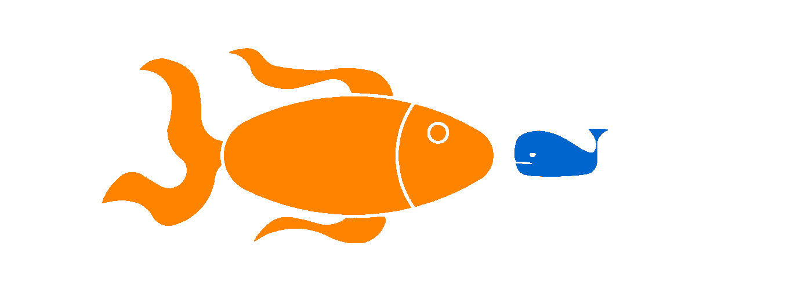
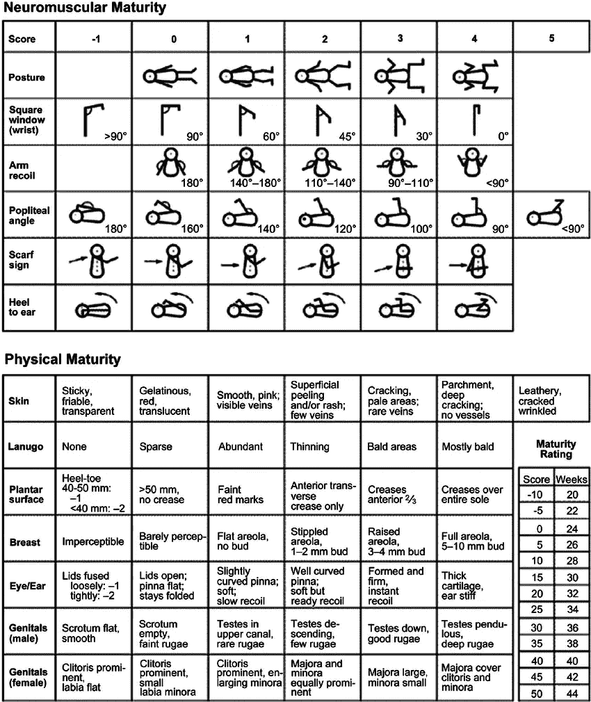
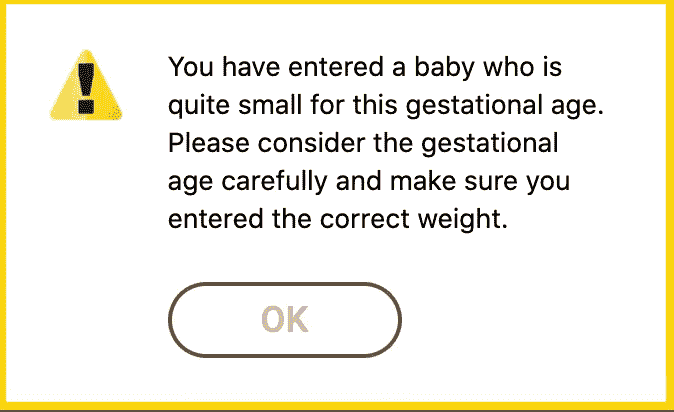
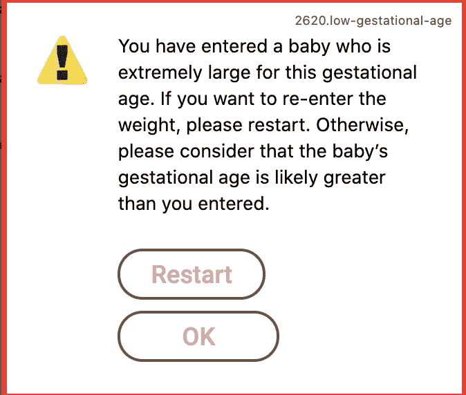
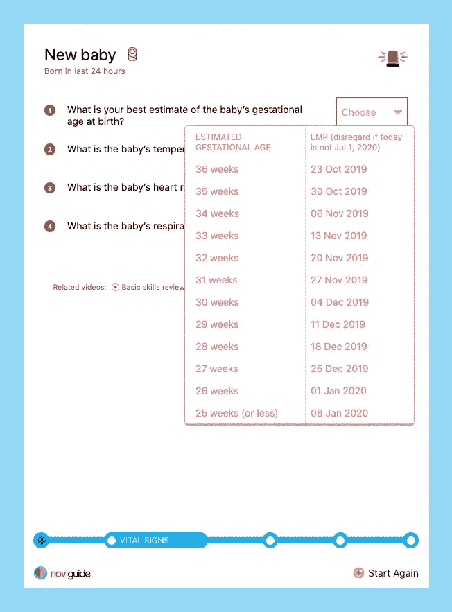

# 巨大的金鱼和小鲸鱼:一个胎龄思维实验

> 原文：<https://blog.devgenius.io/enormous-goldfish-and-tiny-whales-a-gestational-age-thought-experiment-350920f5cafb?source=collection_archive---------25----------------------->

# **简介**

婴儿是由产前护理有限的母亲所生。保健小组可能担心婴儿早产，询问母亲一些问题，试图确定出生时的胎龄。

> 你做产前超声波检查了吗？不
> 
> 你记得你最后一次月经的日期吗？不
> 
> 当你期待孩子出生的时候？我不知道

接下来，医疗团队会对婴儿进行检查，并根据检查结果估计胎龄。请原谅我们打了一个食物的比方——这就像把一个应该烤 12 分钟的披萨从烤箱里拿出来——却不知道它是什么时候开始烤的——然后检查披萨，猜猜它应该在里面呆多长时间。

# **插曲**

短暂的停顿。这有什么关系呢？下面是一个不完整的列表:

*   药物剂量是基于孕龄
*   有些疗法只适用于小于一定胎龄的婴儿
*   临床条件可以解释为早产，而不是不同的重大疾病
*   胎龄指导喂养方法
*   早产儿需要更多的监测和…
*   人们会犹豫是否让小于某一胎龄的婴儿出院

# **简介续**

因此，就像你可能会做的比萨饼问题，如果它一直冒泡到表面，聪明的人想出了评分系统。其中最著名的一个，也是我被训练使用的一个，是由 Jeanne Ballard 博士创建和迭代的。它被称为巴拉德分数或巴拉德标度。

JL 的巴拉德；JC 的 Khoury 韦迪格，K；王；埃勒斯-瓦尔斯曼，BL；Lipp，1991 年 9 月)。[“新 Ballard 评分，扩展至包括极早产儿”](http://www.jpeds.com/article/S0022-3476(05)82056-6/abstract)。*儿科杂志*。**119**(3):417–23。

从那时起，更多聪明人自然而然地转向了机器学习。如果有一组婴儿的胎龄是已知的(通过早期产科超声的黄金标准)，那么人们可以使用 Ballard 评分方法和其他指标来找到最快速的途径来进行相当准确的产后年龄评估。这项工作正在进行中，非常酷。

# **问题**

这些类型的工具在研究中有一个清晰的案例；它们可以帮助确定在缺乏广泛早期超声检查的不同环境中的早产率。但我不太确定它们是否会成为最需要孕周测定帮助的*临床*工具，在出生后**的地方——产前超声检查有限，每个提供者的早产儿数量低。这些方法旨在对所有胎龄有疑问的婴儿进行准确的产后胎龄评估。成本是医护人员所需的培训和收集输入数据所需的时间。你的投资回报取决于所收集数据的准确性。如果你的网站一年只看到少数早产儿会怎样？如果护士每三个月轮换一次科室会怎么样？我的直觉是，即使我们确定出生后年龄的能力变得越来越精确，这些评估在最不需要它们的人手中也将是最准确的——那些看到大量早产儿而熟悉评估的人，以及那些因为大量经历而不太可能犯重大约会错误的人。**

# ****一个思想实验****

**让我们降低标准。如果我们的目标不是对所有婴儿进行准确的出生后孕龄评估，而是希望*简单地最小化错误分配的孕龄带来的* ***伤害*** *会怎么样？如果我们不再努力把事情做好，而是首先努力不犯非常非常错误，会怎么样？马上，我们会有这些变化:***

*   **比起高估早产，我们更担心低估早产。想象一个怀孕 33 周的婴儿。如果助产士说婴儿是 37 周而不是 29 周，情况会更糟。为什么？我们对待小婴儿比大婴儿更保守。给婴儿贴上 29 周的标签可能会导致一些额外的干预和较慢的喂养；给婴儿打电话 37 周可能会导致一个真正应该在医院监护的婴儿的危险出院。**
*   **少担心一次投掷击中靶心，多担心每次投掷都刚好落在目标上。我们倾向于抓住极端。一个真的 34 周，叫 36 周的宝宝，并不理想。但是一个 31 周的宝宝，叫 38 周，问题就大了。**

**现在让我们缩小一点。如果我们想将错误分配的胎龄对所有婴儿的伤害最小化，而不仅仅是我们面前的这个婴儿呢？然后，我们会再次担心捕捉极端，但在网站的水平。**

*   **哪些网站称每个小婴儿都早产？**
*   **哪些网站有异常的孕周模式？**
*   **哪些网站的年龄体重比模式不是正态分布？**

# ****一个亚思想实验****

**让我们把 100 名新生儿学家和新生儿护士聚集在一个房间里。我们告诉他们，有一个 2 公斤重的男婴，估计胎龄正好 33 周。这个体重/年龄组合接近第 50 百分位。然后我们告诉团队，实际上，关于孕龄有一些问题。我们告诉小组，我们将向他们提供一些关于婴儿的信息，之后他们需要决定是否要仅根据这些信息**来调整估计值**。但是我们让自己很难。我们没有告诉团队任何身体上的发现——比如脚长或乳腺芽直径——我们只给他们提供直接来自医院课程的信息。**

## **案例 A***

1.  **这个婴儿需要 CPAP 的呼吸支持 2 周**
2.  **这个婴儿在没有鼻饲管的情况下，经过 5 周的时间才能够通过口腔进食所有的营养**
3.  **这个婴儿经常呼吸暂停/心动过缓**

***对于非医学读者来说，这些都是随着早产的增加而出现频率更高的特征**

## **案例 B**

1.  **这个婴儿从不需要呼吸支持**
2.  **这个婴儿进行了测试，但从来没有发展，黄疸需要光疗**
3.  **该婴儿在第 8 天出院，饮食良好，体重增加。**

**你觉得这 100 个新生儿专家会怎么做？我不确定。就个人而言，我**不会**投票调整情况 A，因为我遇到过符合这种描述的 33 周大的婴儿。案例 B 更难一些。我可能会问自己一些我通常不会问的奇怪问题，比如从未出现黄疸的 33 周早产儿的百分比是多少？我在哪里能找到答案呢？！在这种情况下，我可能也不会投票调整。**

**到目前为止还好。现在让我们假设你告诉 100 名专家团队，在 X 医院出生的 33 周的婴儿中有 99%符合描述的情况(反之亦然)。你觉得这家医院有问题吗？我猜会有很多人举手。**

# ****为不出错而设计****

**人们如何设计一个系统来最小化人群中的孕龄误差？让我们从一些假设开始:**

1.  **倾向于指定与实际年龄相差甚远的孕龄的网站也可能存在其他问题。让我们考虑到低容量的网站和设施与轮流护士。**
2.  **我们还假设在分配孕龄时的性能是一条钟形曲线，具有低性能和高性能的*位置*。**

# **在护理点**

## **步骤 1:体重与年龄**

**第一步是当护士或助产士输入不太可能符合胎龄的体重时，提醒她们。这是为了捕捉小鲸鱼和大金鱼。助产士接生一个 33 周重 1.2 公斤的婴儿。这个年龄的 100 个婴儿中，大约 98 个会更重。在这种情况下，助产士应该以某种方式意识到这个婴儿在护理点是“小于胎龄”**。如果助产士说 33 周的胎儿重 3.5 公斤(z 值+4.07——极不可能)，助产士会在护理点**看到一个警告**说这是极不可能的，并被要求提供新的数据或提示寻求帮助。在看到不太可能的组合后，我们最近把这个功能放到了我们的 [NoviGuide](http://www.noviguide.com) 软件中。看起来是这样的:****

********

**这可能会让你感到惊讶，但这些警报都不会在我们最先进的电子医疗记录系统中弹出。没有什么可以阻止有人把一个 24 周大的婴儿放进电脑，这个婴儿的体重和足月婴儿一样。**

## ****第二步:年龄与呼吸窘迫****

**让我们看看一个 28 周的早产儿。医生说，婴儿在没有辅助的情况下呼吸良好，氧饱和度正常。仅基于这一点，这个婴儿实际上是 28 周的可能性降低了。类似于上述体重警告的另一个警告机会(旁注:这是另一个博客的主题，不在指南中。世界上没有任何指导方针会告诉你“当你有一个婴儿没有因室内空气而呼吸困难，并且妊娠年龄低于 XX 周，请重新考虑妊娠年龄。”这是一个专家意见的领域，软件可以为指南设计提供信息。我们的软件中还没有这个，但是很容易添加。**

## ****第三步:年龄与呼吸暂停和心动过缓****

**类似的想法在这里。新的呼吸暂停和心动过缓，尤其是严重事件，应提示进行全面评估，在其他原因中寻找感染。对于被确定为足月或晚期早产的婴儿，如果没有明确的病因(如感染)，这一警告也可能会促使重新评估孕龄。这个数据点可以用体重和呼吸困难进行三角测量。巨大的金鱼——被鉴定为非常早产的婴儿，但在医院过程中没有呼吸暂停和心动过缓，应该扬起眉毛。**

## **第四步:年龄与喂养**

**你现在明白了——一个极度早产的婴儿，他正在通过嘴吃很多东西，并且体重增加(巨大的金鱼=眉↑)，一个大于 36 周的婴儿，在一定的天数后，他不再通过嘴吃东西(小鲸鱼=眉↑)。同样，体重和呼吸困难也可能被考虑在内。**

**你可以继续保持这种精神，结合各种因素来捕捉游过的小鲸鱼和大金鱼。**

# **在数据仪表板上**

**如果你查看一个网站的数据，发现一个胎龄分配模式(以周为单位)在 28 周、32 周和 36 周出现峰值，而在 27 周、29 周、30 周、31 周、33 周等相对较少的情况下会怎样？好吧，首先，你会看到每个人的数据，这些数据都是那些在精确测定年代的地方研究过这个问题的人的数据。你可能还会看到峰值是 4 的倍数，并怀疑医护人员是否会问母亲“你怀孕几个月了？”无论哪种方式，你都会知道有问题。**

**让我们考虑设计数据仪表板。在这里，我认为想象一个地区卫生官员坐在她的办公室里是有帮助的。她时间有限。她正试图找出她应该去 30 个站点中的哪一个，并就产科病史采集和产后评估(如果有时间的话)进行在职培训。**

****第一步:孕周分布****

**年龄的模式是什么？胎龄分配是否遵循预期模式？有尖刺吗？**

****第二步:孕龄 vs 资源 vs 转移****

**指定的孕龄是否与生产基地的产后转移记录一致？例如，在没有新生儿呼吸护理的场所，是否有标记为 28 周的婴儿留在该场所并出院回家？是否有大量 34-36 周的婴儿因护理升级而被转移？**

****第三步:重新接纳****

**体重低于 2.5 公斤的足月新生儿再次入院的数量是否高于预期？**

# **一大堆警告**

**这种方法有很多限制。它基于一个有着深刻和明显缺陷的想法——如果有人问“5+5 是什么？”在某种程度上，答案 8 比答案 3 更好。如果一名护士在平板电脑上输入一个 34 周的婴儿重 1.0 公斤(不太可能，z 值-2.99)，电脑说“再试一次”——这真的能让我们有所收获吗？如果护士不重新询问病史或再次检查婴儿，而只是调整年龄直到计算机接受，那真的更好吗？(可能不会，但我说“可能”是因为如果软件随后根据年龄变化给出较慢的初始喂食进度和更合适的药物剂量，那么可能？).它可以掩盖真实的尖峰信号。想象一下，在一个社区中，所有的孕妇都在整整 32 周的时候接受传统疗法，这引发了早产。理论上，卫生官员可能会将这一数据误解为糟糕的约会标志，而不是真正的峰值，但这种风险可能一直存在。**

**最重要的警告——它有一个独立于研究的目的，根本不会有助于更好地理解一个社区中早产的真实比率。**

# **谁需要巴拉德乐谱？**

**如果你在谷歌上搜索“谁需要 Ballard 评分”,你会得到一些好的答案:当婴儿比预期年龄大或小时，或者胎龄不确定。第一个对软件来说是显而易见的——软件可以立即分析体重和年龄的 z 分数，并从字面上规定一个“巴拉德分数”(并帮助计算巴拉德分数)。软件还可以向护士显示每个胎龄对应的末次月经日期(尽管这是一个不完美的测量)。这是我们的样子:**

****

**但是第二个标准——“孕龄不确定”——很有意思。在没有额外人体测量数据的情况下，护士已经收集的数据能否表明孕周至少是“不确定的”并建议进一步评估？我认为是这样，但最极端的是大金鱼和小鲸鱼。但是大金鱼和小鲸鱼很重要——当涉及到精确的产后胎龄测定时，它们实际上处于最危险的境地。同样重要的是，我们已经有了捕捉它们的网。**