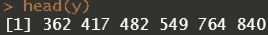
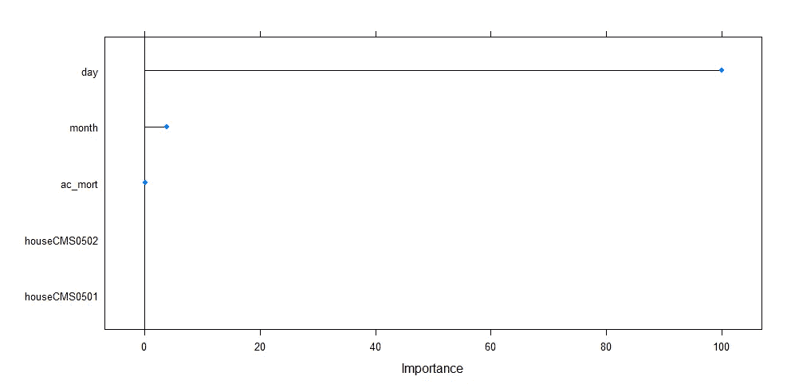

# 模拟肉鸡的生长和死亡率

> 原文：<https://blog.devgenius.io/ensemble-models-using-caret-in-r-d54e4e646968?source=collection_archive---------0----------------------->

## 在 R 中使用集合模型

在这篇文章中，我将向你展示如何使用 R 中的[脱字符包轻松地组合模型。组合模型通常被称为](https://topepo.github.io/caret/)[集合模型](https://towardsdatascience.com/ensemble-models-5a62d4f4cb0c)，有许多方式来构建和交织集合。合奏最大的优势也是最大的限制，这就是它的力量。通过组合模型，您希望每个模型增加一些其他模型没有看到的东西，从而提高预测准确性。然而，这些嵌合体模型几乎无法解释，因为它们实际上是由其他模型组合而成的。

也许最大的问题是创建这些模型有多容易，尤其是现在有了可用的软件。这也让机器学习的承诺变得可笑。因此，这篇文章主要是关于创造合奏，但也是关于创造合奏的危险，这不仅仅是过度配合。而是不知道你一开始做了什么。当你表现出预测的准确性时，这在开始时是好的，但是当你不能再解释这个模型时，就糟糕了。

让我们开始吧。

首先，我将向您展示一些数据是怎样的。这个想法是模拟动物的生长曲线。给你，一只鸡。


每栋房屋手工测量的每日生长量。每家有多轮。和往常一样，方差随着均值的增加而增加。


由 house 绘制。你现在可以看到多轮。

然后，我们将开始更深入地研究 caret 包。在开始运行几个模型之前，我们需要为并行处理建立一个集群，创建一个测试和训练数据集(这里由房屋完成，因此我们在训练数据集中有每个房屋)，并确定训练程序。在这里，你可以看到交叉验证和引导。在整个练习中，我将坚持十重交叉验证。

```
> dim(training)
[1] 965  10
> dim(testing)
[1] 317  11
```


预言者



结果

我将总共运行七个模型:

1.  线性回归
2.  随机森林
3.  多元自适应回归样条
4.  惩罚模型
5.  弹性网
6.  支持向量机
7.  梯度推进

你会看到使用这些模型是多么容易，因此也是多么危险。

首先使用 AIC 逐步选择进行线性回归。


可变重要性图


测试集结果。


测试集结果的可视化。

接下来是随机森林模型。我只是使用标准的网格搜索来让模型运行起来。


可变重要图


结果基于在每次分割时随机抽样作为候选变量的变量数。


结果呢。左侧是校准图，右侧是生长曲线预测。

然后，多元自适应回归样条。



可变重要性图和总体预测与观察。


惩罚回归


λ决定了应用的收缩量


弹性网。


重复交叉验证结果


支持向量机


重复交叉验证的成本函数


梯度推进


提升迭代次数


现在，我们已经非常快速地运行了几个模型，让机器学习来完成它的工作。我现在想做的是比较这些模型，看看它们在一些标准的性能指标上表现如何。


梯度推进很容易胜过其他模型，但你也要小心让这些指标引导你。例如，MARS 模型也不错，但与梯度推进/随机森林/支持向量机相比，它更容易解释。因此，这种模式很可能是首选模式。


比较模型的单样本 t 检验。在这里，我比较了弹性网和火星模型。这些测试看起来不错，但老实说，它们增加的很少，因为最终模型的选择需要基于不仅仅是预测准确性。

是时候建立集合模型了。从模型列表中，我将选择线性回归、梯度推进、支持向量机和 MARS 模型。正如你所看到的，整体模型是单独构建的，使用的训练程序与我单独构建模型时使用的相同。因此，[caret 中的集合模型过程不是关于权衡早期模型的结果，而是关于创建新的集合模型。](https://cran.r-project.org/web/packages/caretEnsemble/vignettes/caretEnsemble-intro.html)

我将使用 glm 程序堆叠模型。创建并绘制预测值，以便与观测值进行比较，或在观测值之上进行比较。最后，如果我的数据集中只有前 12 天的数据，我想看看模型的表现。


每个独立型号的结果。


通过 GLM 叠加和使用 10 叶交叉验证的叠加预测精度。


每所房子、每一轮和每天的观察值。如你所见，我删除了所有超过第 12 天的值。


校准图。


观察和预测。


观察和预测

我希望你能看到建立这些集合模型是多么容易。非常容易。更好的办法是确定模型的最终用途，你对能够解释你的模型的重视程度，以及确定一个单一的模型是否也可以取代一个整体。最后一个原因通常是线性回归仍然被使用的原因，因为它并不总是关于获得最佳预测模型。

如果有任何问题，请告诉我！

尽情享受吧！