# 进入 DevOps: 01 Git 基础

> 原文：<https://blog.devgenius.io/entering-into-devops-01-git-basics-2898fbbb4b5c?source=collection_archive---------5----------------------->

作为一名超过 15 年的 IT 专业人员，在不同的级别:**个人贡献者- >团队领导- >经理- >主管- >领导者/个人贡献者**并且具有与全球各地的人打交道的经验，我想写一个关于 DevOps 工具及其用法的系列文章。挑战是多方面的，因为有许多工具，每个工具都有自己的学习曲线，并且每个工具都根据市场需求非常频繁地变化。
那些不按照这些技术成长的人，会被自动淘汰。过去几年，我一直在指导初级团队成员，我意识到，在试图成为“万金油”的过程中，我们开始失去基本的核心概念。事实上，我也在无意识地重复着同样的动作，没有意识到发生了什么，也没有意识到我为什么要这样做，希望一切都会为我好起来。
通过这些文章，我想分享帮助我理解整个 DevOps 工具的信息。这篇文章是关于“Git”的。

让我们开始吧…

**什么是饭桶？与 SVN、CVS 等软件一样，它是一个版本控制软件，提供基本的核心功能。
1。跟踪代码更改。
2。协作编写代码。
3。《时间旅行》回到以前的版本
4。恢复到以前的版本**

**Git vs GitHub？**
→ Git 是一个版本控制软件，在本地运行，不需要互联网。
→ GitHub 是云中 Git 存储库的托管服务，使协作变得更加容易。

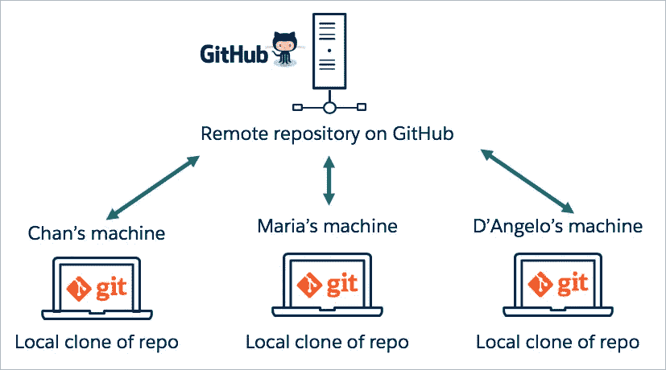

**如何配置 Git？git 支持许多配置选项，我们可以使用下面的命令列出所有可用的选项。**

```
% man git-config
```

你需要设置的第一件事是你的名字和电子邮件地址，让 Git 知道“你是谁？”。

```
#Setting user.name
% git config --global user.name parjun8840
#Validating user.name
% git config user.name
parjun8840
# Setting user.email
% git config --global user.email noreply@gmail.com
#Validating user.email
% git config user.email 
noreply@gmail.com
```

什么是 Git 存储库？
**Git 仓库**跟踪并保存对 **Git** **项目**中的文件所做的所有更改的历史。它将这些数据保存在一个名为**的目录中。git** ，也称为**存储库文件夹**。让我们创建一个。

```
% mkdir firstRepo
% cd firstRepo 
% git init
hint: Using 'master' as the name for the initial branch. This default branch name
hint: is subject to change. To configure the initial branch name to use in all
hint: of your new repositories, which will suppress this warning, call:
hint: 
hint: git config --global init.defaultBranch <name>
hint: 
hint: Names commonly chosen instead of 'master' are 'main', 'trunk' and
hint: 'development'. The just-created branch can be renamed via this command:
hint: 
hint: git branch -m <name>
Initialized empty Git repository in /Users/arjunpandey/gitrepos/firstRepo/.git/
% ls -lart
total 0
drwxr-xr-x 12 arjunpandey staff 384 Dec 31 15:30 .git
```

**什么是 git 工作流？**
有三个重要领域需要 git。它们是工作树、临时区域(也称为索引)和本地存储库。在 git 存储库中工作时，文件和修改将从工作树移动到暂存区，并在本地存储库中完成。

对本地存储库的每个提交都充当项目的一个时间点快照，我们可以在给定的时间点恢复整个项目。
**提交=项目的时间点快照=将多个文件中的组变化记录为快照**

工作目录中的每个文件可以处于两种状态之一:**被跟踪或未被跟踪。**
**跟踪的文件**是上次快照中的文件，以及任何新转移的文件。简而言之，被跟踪的文件是 Git 知道的文件。
**未跟踪的文件**是所有其他的东西——工作目录中的任何文件，它们不在您的最后一个快照中，也不在您的暂存区中。

**工作目录:**这个区域也被称为 Git 的“未跟踪”区域，或者换句话说 Git 不跟踪这个区域中的文件。如果您进行了更改，但没有显式地将它们保存到 git，您将会丢失对文件所做的更改。

**暂存区:**暂存区可以被描述为您下一次提交的预览。当您创建一个 git 提交时， **Git 获取暂存区中的更改，并将它们作为一个新的提交**。您可以在临时区域中添加和删除变更。Git 没有一个专用的暂存目录来存储一些表示文件更改的对象(blobs)。取而代之的是，它使用一个名为 index (inside。git 目录)。

**存储库:**本地存储库是您的。git 目录。您在本地存储库中看到的主要是所有的检查点或提交。

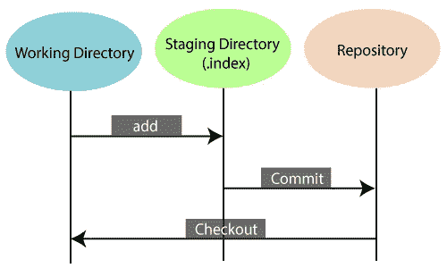

Git 中的三个重要领域

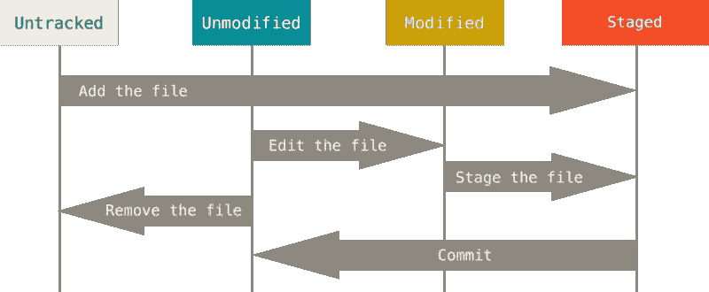

文件状态的生命周期

**什么是原子提交？**
原子的意思是要么全部要么什么都没有——要么一切成功要么全部失败。
→已知 git 具有**原子操作**，即环境问题不会导致 Git 将一半的文件提交到存储库中，而留下其余的文件。
→同样，您签入的代码也应该具有每次提交的原子性(**原子提交**)。每次提交应该只与一个特性/缺陷相关。不要提交与两个特性/错误相关的内容。原子提交更容易恢复、删除和修改。

让我们进行第一次提交

```
% touch name.go contact.go

% git status
On branch vvmaster

No commits yet

Untracked files:
  (use "git add <file>..." to include in what will be committed)
 contact.go
 name.go

nothing added to commit but untracked files present (use "git add" to track)

% git add .

% git status
On branch master

No commits yet

Changes to be committed:
  (use "git rm --cached <file>..." to unstage)
 new file:   contact.go
 new file:   name.go

% git commit -m "first commit"
[master (root-commit) 9d66e2d] first commit
 2 files changed, 0 insertions(+), 0 deletions(-)
 create mode 100644 contact.go
 create mode 100644 name.go

% git status
On branch master
nothing to commit, working tree clean
% 
```

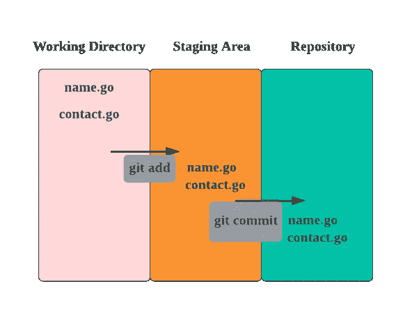

上述示例的工作流程

# **让我们学习几个命令**

1)git add:git add 命令将工作目录中的变更添加到登台区。它告诉 Git 您希望在下一次提交中包含对特定文件的更新。然而，git add 并没有真正以任何显著的方式影响存储库——直到您运行 git commit，更改才被实际记录下来。

2) git commit:将变更从临时区域提交到本地存储库。每次提交都会将新版本的项目记录到存储库的历史中。

3) git 日志:用于显示存储库中的提交历史。git log 的高级特性可以分为两类:
→格式化日志输出-
“—one line”:flag 将每次提交压缩成一行。默认情况下，它只显示提交 ID 和提交消息的第一行。

```
git log - oneline
```

→过滤提交历史-
按数量:git 日志最基本的过滤选项是限制显示的提交数量。

```
git log -3
```

再创建一个提交并执行所有上述命令

```
% touch address.go
% git add .
% git commit -m "adding second commit"
[master 03bf850] adding second commit
 1 file changed, 0 insertions(+), 0 deletions(-)
 create mode 100644 address.go

arjunpandey@Arjuns-MacBook-Pro firstRepo % git log           
commit 03bf8506492dc913855a59049d21323244b1c6ad (HEAD -> master)
Author: parjun8840 <noreply@gmail.com>
Date:   Sat Dec 31 22:35:53 2022 +0900

    adding second commit

commit 9d66e2d9a476f0a2a676da4993928e65f7bd8331
Author: parjun8840 <noreply@gmail.com>
Date:   Sat Dec 31 21:51:05 2022 +0900

    first commit
arjunpandey@Arjuns-MacBook-Pro firstRepo % git log --oneline 
03bf850 (HEAD -> master) adding second commit
9d66e2d first commit
arjunpandey@Arjuns-MacBook-Pro firstRepo % git log -1       
commit 03bf8506492dc913855a59049d21323244b1c6ad (HEAD -> master)
Author: parjun8840 <noreply@gmail.com>
Date:   Sat Dec 31 22:35:53 2022 +0900

    adding second commit
arjunpandey@Arjuns-MacBook-Pro firstRepo % git log -1 --oneline
03bf850 (HEAD -> master) adding second commit
arjunpandey@Arjuns-MacBook-Pro firstRepo % 
```

# **改写历史**

Git 或任何版本控制系统都是一个**时间机器**我们可以回到过去并撤销更改。Git 有几种机制来存储历史和保存更改。这些机制包括:Commit-amend、git rebase 和 git reflog

更改最后一次提交(及时返回):git commit — amend
在这个例子中，我们将看到一个非常基本和有用的场景。
→要提交的文件:2
→用户忘记提交 1 个文件
→创建新的提交将增加历史记录&也不会给审查您工作的人留下很好的印象。

如果你想和我一起学围棋，你可以从这里下载安装[https://go.dev/dl/](https://go.dev/dl/)。

```
% cat ~/.zshrc 
export PATH=/opt/homebrew/bin:/usr/local/go/bin:$PATH
% source ~/.zshrc 
% cat name.go 
package main
import "fmt"
func main() {
 fmt.Println("My name is: Arjun")
}

Or you can just write any text in "name.go"
```

注意:go 并不是强制性的，我只是想通过使用上面的 go 例子让事情变得更实际。

```
% git add name.go 
% git commit -m "Add name.go"
[master 7ede2ba] Add name.go
 1 file changed, 5 insertions(+)
% git status
On branch master
nothing to commit, working tree clean
%
```

意识到您忘记了:(1)将更改添加到文件 contact . go to previous commit(2)commit 不正确

```
% git status        
On branch master
Changes not staged for commit:
  (use "git add <file>..." to update what will be committed)
  (use "git restore <file>..." to discard changes in working directory)
  modified:   contact.go

no changes added to commit (use "git add" and/or "git commit -a")
% git add contact.go 

% git commit --amend
hint: Waiting for your editor to close the file... 
Add content to contact.go & name.go

# Please enter the commit message for your changes. Lines starting
# with '#' will be ignored, and an empty message aborts the commit.
#
# Date:      Tue Jan 3 10:42:00 2023 +0900
#
# On branch master
# Changes to be committed:
#       modified:   contact.go
#       modified:   name.go
arjunpandey@Arjuns-MBP firstRepo % git status        
On branch master
nothing to commit, working tree clean
% 
% git log --oneline
33475db (HEAD -> master) Add content to contact.go & name.go
03bf850 adding second commit
9d66e2d first commit
 % 
```

# **忽略文件和目录**

Git 将您的工作副本中的每个文件视为以下三种情况之一:
**跟踪-** 之前已经暂存或提交的文件；
**未跟踪-** 尚未暂存或提交的文件；或者
**忽略-**Git 被明确告知忽略的文件。

被忽略的文件通常是构建工件和机器生成的文件，它们可以从您的存储库源获得，或者不应该被提交。一些常见的例子有:
。依赖缓存，例如/node_modules 或/packages
的内容。编译后的代码，如。o，。pyc 还有。类文件
。构建输出目录，例如/bin、/out 或/target
。运行时生成的文件，如。日志，。锁，或者。tmp
。隐藏的系统文件，如。DS_Store 或者 Thumbs.db
。个人 IDE 配置文件，如。idea/workspace.xml

在本例中，将生成一个 go 工件并将其放入。我们生成了一个名为“name”的工件，它是一个可执行的二进制文件。

```
% go build name.go
arjunpandey@Arjuns-MBP firstRepo % ls -lrt
total 3792
-rw-r - r - 1 arjunpandey staff 0 Dec 31 22:35 address.go
-rw-r - r - 1 arjunpandey staff 79 Jan 3 10:32 name.go
-rw-r - r - 1 arjunpandey staff 19 Jan 3 10:43 contact.go
-rwxr-xr-x 1 arjunpandey staff 1931650 Jan 3 11:21 name
arjunpandey@Arjuns-MBP firstRepo % ./name
My name is: Arjun
%
#Running git status, shows we have an untracked file
% git status
On branch master
Untracked files:
  (use "git add <file>..." to include in what will be committed)
 name

nothing added to commit but untracked files present (use "git add" to track)
% 
```

**被忽略的文件在一个名为**的特殊文件中被跟踪**。gitignore** 在您的存储库的根目录下签入。没有显式的 git ignore 命令:相反。当你有想要忽略的新文件时，必须手工编辑和提交 gitignore 文件。。gitignore 文件包含与存储库中的文件名匹配的模式，以确定它们是否应该被忽略。

```
% git status
On branch master
Untracked files:
  (use "git add <file>..." to include in what will be committed)
  name

nothing added to commit but untracked files present (use "git add" to track)

#Adding gitignore file 
% cat .gitignore 
#Ignoring a particular file
name
#.log, debug.log, logs/debug.log
*.log
#Appending a slash indicates the pattern is a directory. 
#logs/debug.log, build/logs/latest/debug.log
logs/

% git status
On branch master
Untracked files:
  (use "git add <file>..." to include in what will be committed)
  .gitignore

nothing added to commit but untracked files present (use "git add" to track)
% 
% git add .gitignore
% git commit -m "Adding gitignore file"
[master b2f2ca7] Adding gitignore file
 1 file changed, 8 insertions(+)
 create mode 100644 .gitignore
#We do have binary file still present in the working doirectory
% ls -lrta
total 3800
drwxr-xr-x   3 arjunpandey  staff       96 Dec 31 14:51 ..
-rw-r--r--   1 arjunpandey  staff        0 Dec 31 22:35 address.go
-rw-r--r--   1 arjunpandey  staff       79 Jan  3 10:32 name.go
-rw-r--r--   1 arjunpandey  staff       19 Jan  3 10:43 contact.go
-rwxr-xr-x   1 arjunpandey  staff  1931650 Jan  3 11:21 name
-rw-r--r--   1 arjunpandey  staff      182 Jan  3 11:35 .gitignore
drwxr-xr-x   8 arjunpandey  staff      256 Jan  3 11:35 .
drwxr-xr-x  12 arjunpandey  staff      384 Jan  3 11:39 .git 
```

# **Git 分支**

一个分支代表一个独立的开发路线。分支充当编辑/暂存/提交过程的抽象。您可以将它们视为请求全新的工作目录、临时区域和项目历史的一种方式。新提交记录在当前分支的历史记录中。

如果你**想更深入一点**到分支:
每次提交都获得一个哈希值，git 在内部使用这些哈希值。在 Git 中，一个分支是指向一个特定提交的指针，而一个提交是你的存储库在特定时间点的快照。
你的分支指针随着你的每一次提交而移动。
**重新定义分支-**Git 中的分支只是指向其中一个提交的轻量级可移动指针。Git 中默认的分支名称是 master。

```
% git log --pretty=raw
commit b2f2ca7916b181bace0f3f37344cf90076694aeb
tree 38d62a9b464743efc50fd7ffbad5e59e37cd1298
parent 33475db3ee49dbdf7b2e72d46378fc702dae0351
author parjun8840 <noreply@gmail.com> 1672713552 +0900
committer parjun8840 <noreply@gmail.com> 1672713552 +0900

    Adding gitignore file

commit 33475db3ee49dbdf7b2e72d46378fc702dae0351
tree 1189289675346e3956e0fae8fdb4fef404dfe2e0
parent 03bf8506492dc913855a59049d21323244b1c6ad
author parjun8840 <noreply@gmail.com> 1672710120 +0900
committer parjun8840 <noreply@gmail.com> 1672710711 +0900

    Add content to contact.go & name.go

commit 03bf8506492dc913855a59049d21323244b1c6ad
tree c31cd4d8074a58b329172852fb176ad27e509923
parent 9d66e2d9a476f0a2a676da4993928e65f7bd8331
author parjun8840 <noreply@gmail.com> 1672493753 +0900
committer parjun8840 <noreply@gmail.com> 1672493753 +0900

    adding second commit

commit 9d66e2d9a476f0a2a676da4993928e65f7bd8331
tree f743e78d93c5feaacac9bdaad989e22509b2e584
author parjun8840 <noreply@gmail.com> 1672491065 +0900
committer parjun8840 <noreply@gmail.com> 1672491065 +0900

    first commit
%

We can see the parent field, which connects the commit with its parent(s). Also the tree field, which connects the commit with a tree object.
Commits make the skeleton of the history, with other objects and refs attached to them.
It’s a directed graph structure.
```

注意:Git 中的“主”分支不是一个特殊的分支。它和其他分支完全一样。几乎每个存储库都有一个的唯一原因是默认情况下 git init 命令创建了它，大多数人都懒得去修改它。

以组字开始分支名称: **bug 或 wip 或特性**。
示例:WIP-8840-简称-taskname 8840-指任务/问题的工单 id。

**Git checkout** 是用于**创建和切换分支的旧命令。**它也可以用于**从某次提交中恢复变更**。但是 git checkout 做的不止这些。

```
git branch: List all of the branches in your repository.
git branch <branch>: Create a new branch called ＜branch＞. This does not check out the new branch.
git branch -d <branch>: Delete the specified branch. This is a “safe” operation in that Git prevents you from deleting the branch if it has unmerged changes.
git branch -m <branch>: Rename the current branch to ＜branch＞.
git branch -a: List all remote branches. (Don't worry about this now we will see it later)
git switch: Switch to a specified branch. Optionally a new branch could be created with either -c, -C, automatically from a remote branch of same name.
```

```
Using"switch" command to create and switch to the branch in a single command.
You can use "branch" command to create branch and then use "switch".
You can also use "checkout" command but refrain it from using this old style.
* show the current branch

% git branch
* master
% git switch -c wip-8840-user-module
Switched to a new branch 'wip-8840-user-module'
% git branch
  master
* wip-8840-user-module
%
% git commit -a -m "addded 2 users"
[wip-8840-user-module c6bf0b0] addded 2 users
 1 file changed, 7 insertions(+)
arjunpandey@Arjuns-MBP firstRepo %
% git commit -a -m "added code for multiple users"
[wip-8840-user-module 14e8101] added code for multiple users
 1 file changed, 1 insertion(+), 1 deletion(-)
%
```

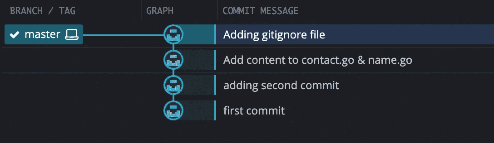

仅主分行

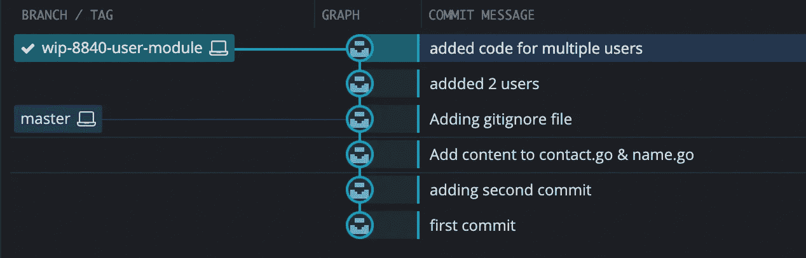

有 2 个新提交的分支

**【头】**分支，通常这也被称为“主动”或“当前”分支。它是指向当前分支的指针，默认情况下，它指向分支中的最新提交。

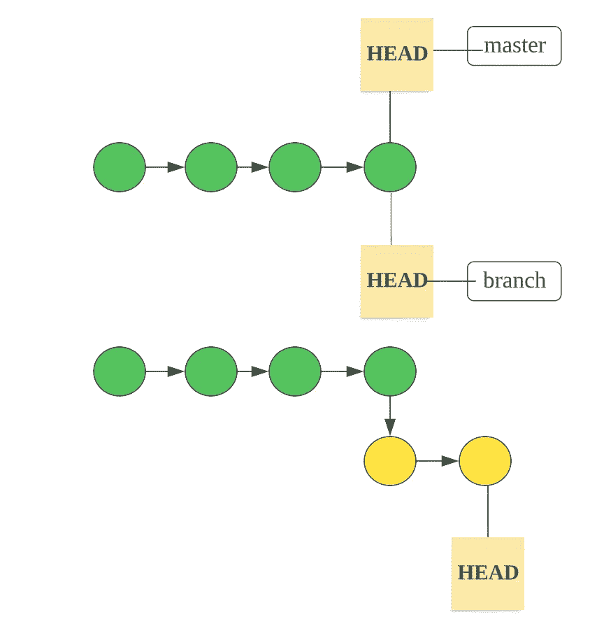

头指针随着新的提交而移动

```
==> HEAD points to new commit

% git log --oneline              
14e8101 (HEAD -> wip-8840-user-module) added code for multiple users
c6bf0b0 addded 2 users
b2f2ca7 Adding gitignore file
33475db Add content to contact.go & name.go
03bf850 adding second commit
9d66e2d first commit

% git switch master                          
Switched to branch 'master'
% git commit -a -m "added parjun8840 address"     
[master e0e124c] added parjun8840 address
 1 file changed, 8 insertions(+)
arjunpandey@Arjuns-MBP firstRepo % git status
On branch master
nothing to commit, working tree clean
%
% git log --oneline
e0e124c (HEAD -> master) added parjun8840 address
b2f2ca7 Adding gitignore file
33475db Add content to contact.go & name.go
03bf850 adding second commit
9d66e2d first commit
```

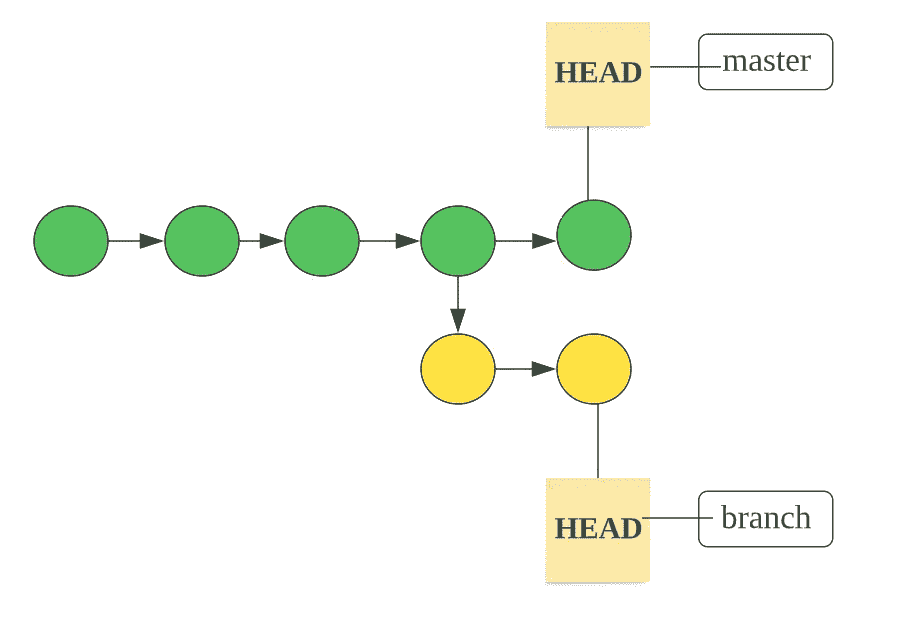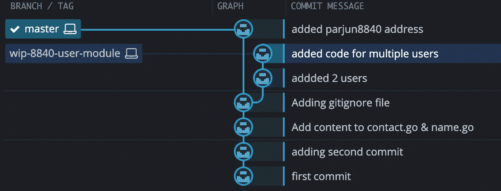

主分支和 WIP-8840-用户模块分支图形表示

**Git checkout vs switch**

```
+-----------+--------------------+--------------------------------------------+
|   previous command          |      new command       |     Description      |
+-----------+--------------------+--------------------------------------------+
| git checkout <branch>       | git switch <branch>    | Switch branches      |
| git checkout                | N/A                    | restore the contents |
| git checkout -b <branch>    | git switch -c <branch> |Create branches       |

+-----------+--------------------+--------------------------------------------+
```

```
 ==> Checkout demo to restore the contents from Git repository.
Even the staged changes also will be overwritten. 

% cat contact.go     
#This is a comment
I messed up with this file
I need to revert latest changes from the last snapshot or commited version.

% git status         
On branch master
Changes not staged for commit:
  (use "git add <file>..." to update what will be committed)
  (use "git restore <file>..." to discard changes in working directory)
 modified:   address.go
 modified:   contact.go

no changes added to commit (use "git add" and/or "git commit -a")

#Restoring address.go
% git checkout address.go
Updated 1 path from the index
% git status             
On branch master
Changes not staged for commit:
  (use "git add <file>..." to update what will be committed)
  (use "git restore <file>..." to discard changes in working directory)
 modified:   contact.go

no changes added to commit (use "git add" and/or "git commit -a")

#Restoring multiple files or working directory
% git checkout -f        
% git status     
On branch master
nothing to commit, working tree clean 
```

# **合并分支机构**

git merge —将两个或更多的开发历史结合在一起。
git merge 命令允许你将 git 分支创建的独立开发线整合到一个分支中。
当前分支将被更新以反映合并，但目标分支将完全不受影响。同样，这意味着 git merge 通常与 git 开关结合使用，用于选择当前分支，而 git branch -d 用于删除过时的目标分支。

Git merge 将把多个提交序列合并成一个统一的历史。

假设存在以下历史记录，并且当前分支是“主分支”:

```
 A---B---C topic
       /
   D---E---F---G master 
```

那么“git merge topic”将重放在主题分支上做出的改变，因为它从主分支(即 E)分叉，直到它在主分支之上的当前提交，并且在新的提交中记录结果以及两个父提交的名称和来自用户的描述改变的日志消息。

```
 A---B---C topic
         /         \
    D---E---F---G---H master
```

第二种语法(“git merge — abort”)只能在合并导致冲突后运行。git merge — abort 将中止合并过程，并尝试重建合并前的状态。

**快进合并**
没有新的“合并提交”被创建
不是“实际上”合并分支，所有 Git 必须做的集成历史是将当前分支顶端移动(即，“快进”)到目标分支顶端。这有效地组合了历史，因为从目标分支可到达的所有提交现在都可以通过当前分支获得。
然而，如果分支已经分叉或者当没有到目标分支的线性路径时，快速前进合并是不可能的。

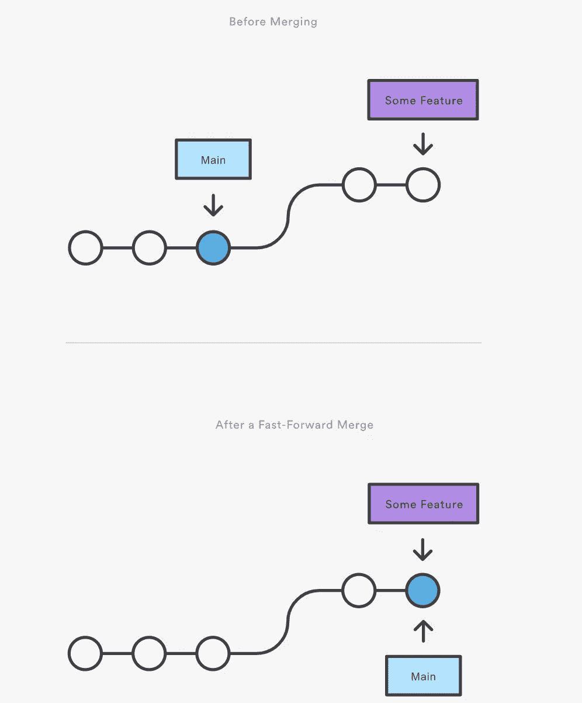

快进合并

让我们创建一个分支“bug-8840-pagination ”,并提交对 contact.go 的更改

```
==> Before merging
% git branch
* master
  wip-8840-user-module
% git switch -c bug-8840-pagination
Switched to a new branch 'bug-8840-pagination'
%
% git branch
* bug-8840-pagination
  master
  wip-8840-user-module
%

% git log --oneline
fea3e9b (HEAD -> bug-8840-pagination) Edited contact.go
e0e124c (master) added parjun8840 address
b2f2ca7 Adding gitignore file
33475db Add content to contact.go & name.go
03bf850 adding second commit
9d66e2d first commit
% 

==> As you can see the changes are linear from master branch to the tip of the target branch
```

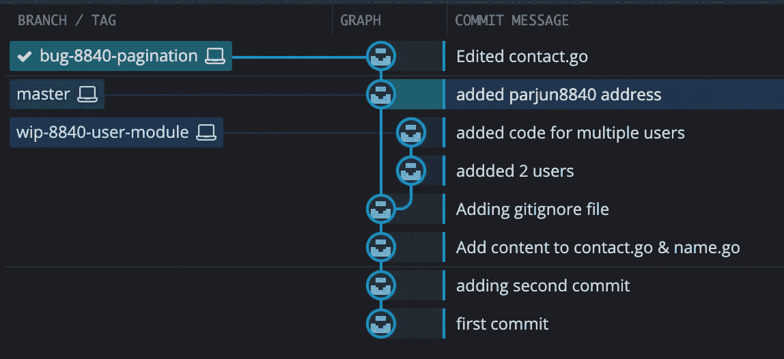

上述状态的图形表示

```
% git switch master
Switched to branch 'master'
%
% git merge bug-8840-pagination
Updating e0e124c..fea3e9b
Fast-forward
 contact.go | 1 +
 1 file changed, 1 insertion(+)
% git log --oneline            
fea3e9b (HEAD -> master, bug-8840-pagination) Edited contact.go
e0e124c added parjun8840 address
b2f2ca7 Adding gitignore file
33475db Add content to contact.go & name.go
03bf850 adding second commit
9d66e2d first commit
%
```

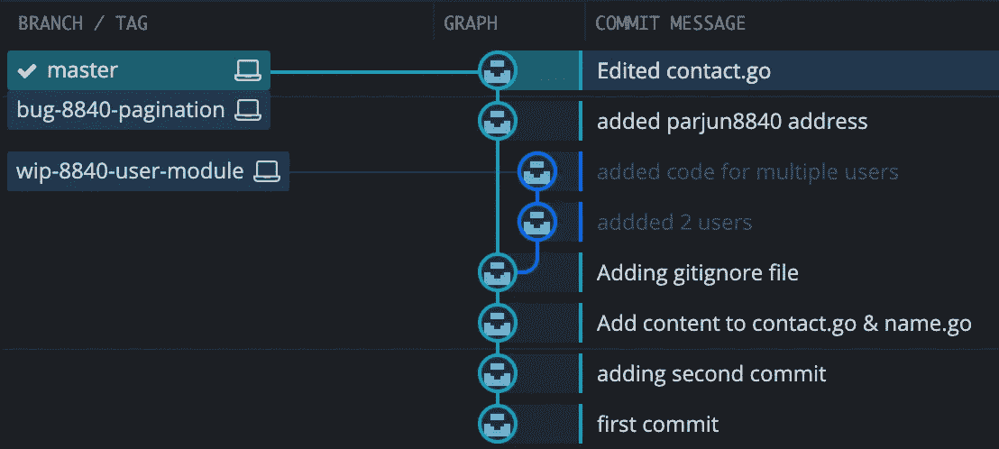

主& bug-8840-分页指向相同的提交，但没有新的提交

**三向合并**
当从当前分支到目标分支没有线性路径时。
在三路合并中，Git 使用三次提交来生成合并提交；两个分支尖端和它们的共同祖先。

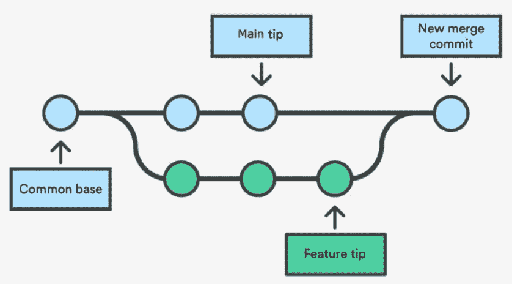

三向合并导致新的合并提交

从主分支创建一个分支“wip-8840-authentication”后，对主分支进行新的提交。

```
% git switch -c wip-8840-authentication
Switched to a new branch 'wip-8840-authentication'
% vim name.go 
% git commit -a -m "made changes to name.go"       
[wip-8840-authentication cfa1fb9] made changes to name.go
 1 file changed, 1 insertion(+)
% vim contact.go 
% git commit -a -m "made changes to contact.go"
[wip-8840-authentication 122f7cc] made changes to contact.go
 1 file changed, 3 insertions(+)
%
% git log --oneline                                    
122f7cc (HEAD -> wip-8840-authentication) made changes to contact.go
cfa1fb9 made changes to name.go
1926717 (master) merged branch wip-8840-user-module
fea3e9b (bug-8840-pagination) Edited contact.go
e0e124c added parjun8840 address
14e8101 (wip-8840-user-module) added code for multiple users
c6bf0b0 addded 2 users
b2f2ca7 Adding gitignore file
33475db Add content to contact.go & name.go
03bf850 adding second commit
9d66e2d first commit
%

% git switch master
Switched to branch 'master'
% vim address.go 
% git commit -a -m "made changes to address.go"
[master 4d66ed2] made changes to address.go
 1 file changed, 3 insertions(+), 1 deletion(-)
% git log --oneline
4d66ed2 (HEAD -> master) made changes to address.go
1926717 merged branch wip-8840-user-module
fea3e9b (bug-8840-pagination) Edited contact.go
e0e124c added parjun8840 address
14e8101 (wip-8840-user-module) added code for multiple users
c6bf0b0 addded 2 users
b2f2ca7 Adding gitignore file
33475db Add content to contact.go & name.go
03bf850 adding second commit
9d66e2d first commit 
```

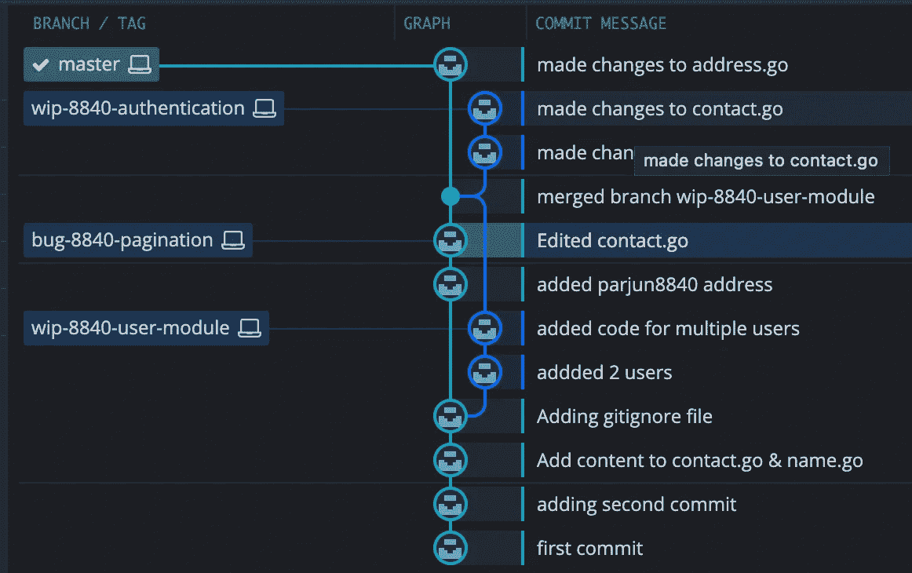

分支和提交的图形表示

```
% git merge wip-8840-authentication
hint: Waiting for your editor to close the file... 
Merge branch 'wip-8840-authentication'
# Please enter a commit message to explain why this merge is necessary,
# especially if it merges an updated upstream into a topic branch.
#
# Lines starting with '#' will be ignored, and an empty message aborts
# the commit.

Merge made by the 'ort' strategy.
 contact.go | 3 +++
 name.go    | 1 +
 2 files changed, 4 insertions(+)
% git status
On branch master
nothing to commit, working tree clean

% git log --oneline                
02605a6 (HEAD -> master) Merge branch 'wip-8840-authentication'
4d66ed2 made changes to address.go
122f7cc (wip-8840-authentication) made changes to contact.go
cfa1fb9 made changes to name.go
1926717 merged branch wip-8840-user-module
fea3e9b (bug-8840-pagination) Edited contact.go
e0e124c added parjun8840 address
14e8101 (wip-8840-user-module) added code for multiple users
c6bf0b0 addded 2 users
b2f2ca7 Adding gitignore file
33475db Add content to contact.go & name.go
03bf850 adding second commit
9d66e2d first commit
% 
```

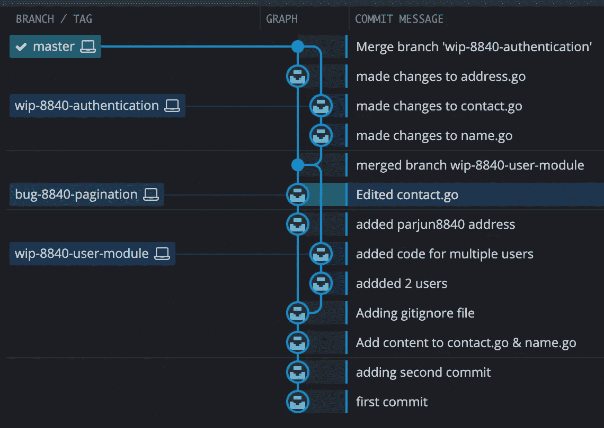

**解决冲突的三向合并**
如果你试图合并的两个分支都改变了同一个文件的相同部分，Git 将无法决定使用哪个版本。出现这种情况时，它会在提交合并之前停止，以便您可以手动解决冲突。
有多种合并策略(选择和丢弃哪些变更)

```
==> switch to 'wip-8840-user-module' branch and check history
% git switch wip-8840-user-module
Switched to branch 'wip-8840-user-module'
% git log --oneline
14e8101 (HEAD -> wip-8840-user-module) added code for multiple users
c6bf0b0 addded 2 users
b2f2ca7 Adding gitignore file
33475db Add content to contact.go & name.go
03bf850 adding second commit
9d66e2d first commit

==> switch to 'master' branch and check history
% git switch master
Switched to branch 'master'
% git log --oneline
fea3e9b (HEAD -> master, bug-8840-pagination) Edited contact.go
e0e124c added parjun8840 address
b2f2ca7 Adding gitignore file
33475db Add content to contact.go & name.go
03bf850 adding second commit
9d66e2d first commit

% git merge wip-8840-user-module
Auto-merging contact.go
CONFLICT (content): Merge conflict in contact.go
Automatic merge failed; fix conflicts and then commit the result.
% cat contact.go 
#This is a comment
<<<<<<< HEAD
#Added second comment
=======
parjun8840:
  email: noreply-arjun@gmail.com
  address: amsterdam
sam:
  email: noreply-sam@gmail.com
  address: amsterdam

>>>>>>> wip-8840-user-module
% vim contact.go 
% cat contact.go 
parjun8840:
  email: noreply-arjun@gmail.com
  address: amsterdam
sam:
  email: noreply-sam@gmail.com
  address: amsterdam
% git status
On branch master
You have unmerged paths.
  (fix conflicts and run "git commit")
  (use "git merge --abort" to abort the merge)

Changes to be committed:
  modified:   name.go

Unmerged paths:
  (use "git add <file>..." to mark resolution)
  both modified:   contact.go

% git commit -a -m "merged branch wip-8840-user-module"
[master 1926717] merged branch wip-8840-user-module
% git log --oneline                                    
1926717 (HEAD -> master) merged branch wip-8840-user-module
fea3e9b (bug-8840-pagination) Edited contact.go
e0e124c added parjun8840 address
14e8101 (wip-8840-user-module) added code for multiple users
c6bf0b0 addded 2 users
b2f2ca7 Adding gitignore file
33475db Add content to contact.go & name.go
03bf850 adding second commit
9d66e2d first commit
```

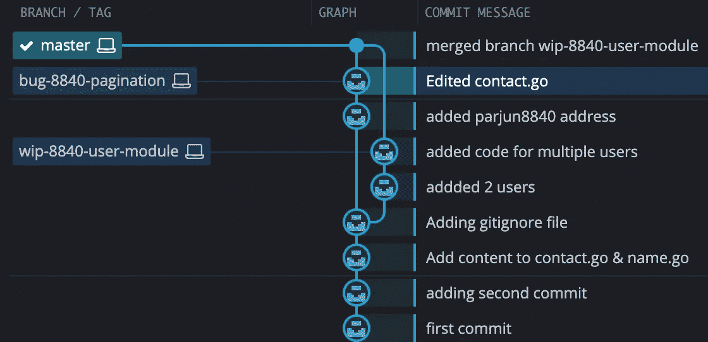

# 储藏和清洁

git stash 命令获取您未提交的更改(暂存)，保存它们供以后使用，然后从您的工作副本中恢复它们。

在一些紧急的情况下，你可能不得不转换分支去做一些其他的事情。问题是，你不想提交一个完成了一半的工作，这样你就可以在以后回到这个点。这个问题的答案是 git stash 命令。暂时搁置(或隐藏)你对工作副本所做的修改，这样你就可以做其他的东西，然后回来重新应用它们。如果您需要快速切换上下文和处理其他事情，但是您正在进行代码更改，还没有准备好提交，那么隐藏是很方便的。
有两种可能: **1)我的更改随我一起到达目的地分支(**未跟踪的文件 **) 2) Git 如果检测到潜在的冲突就不让我切换(**已修改的文件 **)**

```
1) My change comes with me to the destination branch (untracked files)

(master)$vim README.md
(master)$git status
On branch master
Untracked files:
  (use "git add <file>..." to include in what will be committed)
  README.md

nothing added to commit but untracked files present (use "git add" to track)
(master)$git switch bug-8840-pagination                                     
Switched to branch 'bug-8840-pagination'
(bug-8840-pagination)$git status
On branch bug-8840-pagination
Untracked files:
  (use "git add <file>..." to include in what will be committed)
  README.md

nothing added to commit but untracked files present (use "git add" to track)
```

```
2) Git won't let me switch if detects potential conflicts. I have to either commit or stash the current work

(master)$git status
On branch master
Changes to be committed:
  (use "git restore --staged <file>..." to unstage)
  modified:   name.go

Changes not staged for commit:
  (use "git add <file>..." to update what will be committed)
  (use "git restore <file>..." to discard changes in working directory)
  modified:   address.go

(master)$git switch bug-8840-pagination
error: Your local changes to the following files would be overwritten by checkout:
  name.go
Please commit your changes or stash them before you switch branches.
error: Your local changes to the following files would be overwritten by checkout:
  address.go
Please commit your changes or stash them before you switch branches.
Aborting
(master)$
(master)$git stash
Saved working directory and index state WIP on master: 02605a6 Merge branch 'wip-8840-authentication'

#You can run git stash several times to create multiple stashes, and then use git stash list to view them.
(master)$git stash list
stash@{0}: WIP on master: 02605a6 Merge branch 'wip-8840-authentication'
(master)$
(master)$git switch bug-8840-pagination
Switched to branch 'bug-8840-pagination'
(bug-8840-pagination)$vim contact.go 
(bug-8840-pagination)$git commit -a -m "changed contact.go in branch bug-8840-pagination"
[bug-8840-pagination e4c3edd] changed contact.go in branch bug-8840-pagination
 1 file changed, 1 insertion(+)
(bug-8840-pagination)$git status
On branch bug-8840-pagination
nothing to commit, working tree clean
(bug-8840-pagination)$git switch master
Switched to branch 'master'

(master)$git status
On branch master
nothing to commit, working tree clean
(master)$git stash list
stash@{0}: WIP on master: 02605a6 Merge branch 'wip-8840-authentication'
arjunpandey@Arjuns-MBP firstRepo % (master)$git stash pop
On branch master
Changes not staged for commit:
  (use "git add <file>..." to update what will be committed)
  (use "git restore <file>..." to discard changes in working directory)
  modified:   address.go
  modified:   name.go

no changes added to commit (use "git add" and/or "git commit -a")
Dropped refs/stash@{0} (7145ff8932ef5e4a0282377de179d25e690c8697)
(master)$git status
On branch master
Changes not staged for commit:
  (use "git add <file>..." to update what will be committed)
  (use "git restore <file>..." to discard changes in working directory)
  modified:   address.go
  modified:   name.go

no changes added to commit (use "git add" and/or "git commit -a")
(master)$git commit -a -m "stash example modified address.go name.go"
[master 6806b24] stash example modified address.go name.go
 2 files changed, 3 insertions(+), 1 deletion(-)
```

**应用隐藏:**
→您可以使用 git stash pop 重新应用先前隐藏的更改。弹出您的存储会从您的存储中移除更改，并将它们重新应用到您的工作副本。

```
(master)$git status
On branch master
nothing to commit, working tree clean
(master)$git stash list
stash@{0}: WIP on master: 02605a6 Merge branch 'wip-8840-authentication'
(master)$git stash pop
On branch master
Changes not staged for commit:
 (use "git add <file>…" to update what will be committed)
 (use "git restore <file>…" to discard changes in working directory)
 modified: address.go
 modified: name.go
no changes added to commit (use "git add" and/or "git commit -a")
Dropped refs/stash@{0} (7145ff8932ef5e4a0282377de179d25e690c8697)
```

→或者，您可以将更改重新应用到您的工作副本，并**通过“git stash apply”将它们保存在您的存储库**中。

**清理你的储藏:**
→如果你决定不再需要某个特定的储藏，你可以用“git stash drop”删除它。

→或者，您也可以使用“git stash clear”删除您的所有库存

```
 (master)$git stash drop stash@{1}
Dropped stash@{1} (17eff97fd8251df6163117cb9e58c1f62a5e7cdb)

(master)$git stash list 
stash@{0}: WIP on master: 6806b24 stash example modified address.go name.go

(master)$git stash clear
(master)$git stash list 
(master)$
```

这部分到此为止。下一部分将会在 GitHub 上详细介绍…请跟随我的[medium.com](https://medium.com/@parjun8840)、[linkedin.com/in/arjun-pandey](https://www.linkedin.com/in/arjun-pandey)来激励我&继续关注这个系列的下一部分…

谢谢你耐心的耐心阅读…

**关于本系列的下一部分，请点击此链接** [**GitHub 基础知识**](https://medium.com/@parjun8840/entering-into-devops-02-github-basics-492974a3c964)

我想强调 2 个要点:
→请不要直接更改 master/main branch。
→发现文章中的错误/误导信息？抱歉。！请尽快帮我修改。