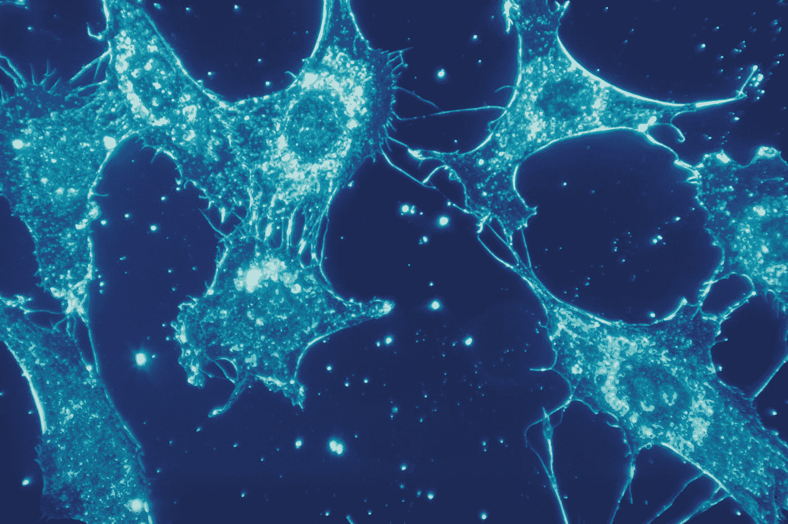

# 进入人工智能迷宫

> 原文：<https://blog.devgenius.io/entering-the-artificial-intelligence-maze-d58fb6eb5554?source=collection_archive---------10----------------------->

本杰明·艾略特在 [Unsplash](https://unsplash.com?utm_source=medium&utm_medium=referral) 上拍摄的照片

人工智能的话题既广泛又复杂，被虚假的营销、误解和不切实际的希望所拖累。像科学中的一切一样，如果你有商业支持，一切都会变得更容易，因此人工智能也是如此。如今的一切都贴上了人工智能或机器学习的标签，以获得某种现实和现代主义的光环。应用程序是否真的使用了这些技术，似乎没人太在意。它有邮票，所以它必须更好。

如果人工智能由发明它的科学来解释，计算机科学家将不会留下深刻印象:人工智能由实现自然智能方面的算法组成，以给出它们的结果。这个句子很枯燥，但是里面有很多东西。在这篇文章中，我们将试图解释什么是人工智能，什么不是人工智能，是什么让它工作，以及计算机科学家认为自然智能是什么。所有这些都将成为一个小的文章集，详细介绍当今使用的最重要的人工智能算法。这些文章还将帮助您理解软件产品上的 AI 或 ML 标签的含义，以及如何识别欺诈性营销。

## 生物学和计算机科学

照片由[国立癌症研究所](https://unsplash.com/@nci?utm_source=medium&utm_medium=referral)在 [Unsplash](https://unsplash.com?utm_source=medium&utm_medium=referral) 上拍摄

如果我们想了解人工智能，我们需要了解科学家对自然智能的看法。这是一个不可能在一篇文章中涵盖的任务，但我们可以采取直观的捷径。例如，你不能让鱼爬树，但你可以看到它选择食物，选择特定的路径，适应新的环境和生活条件。所有这些都是一种生物智能。是的，鱼不会说话，也不会使用工具，但这些高级功能并不是智能的起点。智能始于自然选择，这是一种推动生物系统适应和生存的力量。

除此之外，我们还可以增加多种功能，从最基本的到最高级的:可变性、适应性、记忆力、注意力广度、专注度、语言处理、分类等等。但所有这些都是智力的特征，是智力自我表现的方式。那么，在更基本的层面上，智力是什么呢？科学家们可能会吹嘘并使用奇特的量子力学在神经层面上进行解释，也许在原子层面上进行解释，但最终的最终解释仍然难以捉摸。我们对智能的了解，不亚于我们对导致时空量子波动的原因的了解。它们之所以“存在”,是因为夸克就是这样工作的。为什么它们会那样工作，这个问题不是针对科学的，而是针对那些想要设计一个新宇宙的建筑师的:尽管我们不想那样，不是吗？

尽管计算机科学家不想要一个新的宇宙，但他们肯定希望在他们的应用中有一个新的大脑。这是因为人脑能够以极高的效率和极低的功耗对系统进行自然分类。这也不仅仅是关于训练有素的科学家。孩子们以惊人的速度了解他们的整个环境。语言、面孔、直觉物理学:一切都是在孩子出生后的两到三年内学会的。是的，大部分是从父母那里模仿来的，但是因为我们不能从根本上定义自然智力，我们必须得出结论，模仿也是它的一个特征。

## 翻译情报的尝试

布雷特·乔丹在 [Unsplash](https://unsplash.com?utm_source=medium&utm_medium=referral) 上的照片

那么计算机科学家做了什么呢？他们看到了生物系统是如何工作的，他们看到他们能够优化自己的行为，以适应他们面临的问题，他们的环境和他们生存的需要，他们想知道他们是否可以在一个算法中实现所有这些。但是生物系统是如何适应和解决问题的呢？蚂蚁是如何找到食物的？如果蚂蚁能够在没有像人类一样复杂的大脑的情况下找到食物，那么肯定有一种算法能够模仿这种对食物的搜索，并可能将其转化为对科学有用的东西，比如搜索路线，在不可靠的互联网上搜索活动的网页镜像。

这就是人工智能的最终定义。它不是关于你的人造敌人试图在射击游戏中躲避你的射击。敌人最好使用带有 if 和 elses 的直接算法来躲避你的射击。这不是战略游戏中的寻路。同样，路径寻找有更好的数学算法，工作得很好，甚至更好。这不是谷歌学习你在地图上的位置，并建议广告。如果你只是使用传统的统计公式，这些功能会更容易。数据挖掘的核心是统计科学，而不是人工智能。

人工智能只是将生物解决方案翻译成代码。在这一系列文章中，我将讨论到目前为止已经探索过的几种翻译方法。还有很多，当然，我们可以去的地方没有限制，但我在这里介绍的是基本的，在实际工业环境中更容易掌握和使用的。所以，事不宜迟，下面是这个系列的计划，随着文章的准备，要点将更新为链接:

1.  [进化算法:进化的理论方面](/evolutionary-algorithms-theoretical-aspects-of-evolution-c7dd021d8bd3)
2.  [遗传算法:应用进化](/genetic-algorithms-applied-evolution-1c3afa0f7f3f)
3.  [多智能体算法:粒子群优化](/multi-agent-algorithms-particle-swarm-optimization-6f11e6b35736)
4.  [大脑建模:神经网络](/modelling-the-brain-neural-networks-6b1149fef1cc)
5.  [附录:关于神经网络的一些想法](/addendum-a-few-thoughts-on-neural-networks-4541b5fe5700)

每篇文章将涵盖一大类人工智能算法，我将尽可能简单易懂地解释它。我还将尝试涵盖虚假营销，以及被宣传为人工智能但不是人工智能的东西，以及真正的人工智能解决方案是什么样子的。

我希望这个系列会有用，不仅仅是对软件开发人员:他们已经知道什么是人工智能。它更多的是对一个变态主题的简短探索，试图将科学放回它在这个严重和虚假营销主题中的位置。

我也希望你能从这个系列中学到一些新的东西，即使你知道并在你的应用程序中使用人工智能。一点点刺激和探索不会有坏处。所以，让我们一起踏上这个旅程吧。我敢肯定，我们读完之后都会对人工智能和自然智能更加好奇。