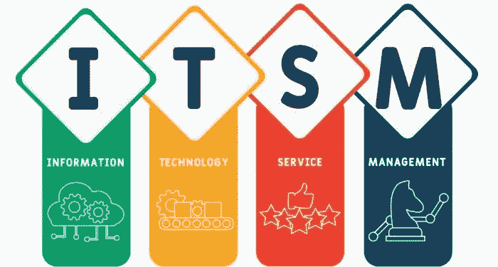

# 走进世界 ITSM

> 原文：<https://blog.devgenius.io/entering-the-world-itsm-ec2ca5c7714b?source=collection_archive---------20----------------------->

## ITSM 简介

“你知道 ITSM 是什么吗？你听说过吗？”。这两个问题为我进入 ITSM 的世界铺平了道路。在我实习的早期，有人问过我这些问题。幸运的是，带着这些问题，我得到了一个在 ITSM 工程团队工作的机会。在这里，我收集了这次旅行中我对 ITSM 的了解。

IT 服务通过使用信息技术来帮助实现重要的业务目标。为组织管理这些服务简称为 **IT 服务管理**，简单来说，我们称之为 **ITSM** 。

根据维基百科，

> **信息技术服务管理(ITSM)是指组织为设计、构建、交付、运营和控制向客户提供的信息技术(IT)服务而开展的活动。**

ITSM 是一种设计、交付、管理和改进企业使用信息技术方式的战略方法。其核心理念是以一致可靠的方式交付 IT 即服务。

这可能涉及从建立和维护 IT 基础设施到向最终用户提供技术支持和培训的方方面面。以 ITSM 为例，假设我们在问“我怎样才能得到一台新的笔记本电脑？”。然后我们必须做的是，我们必须通过门户网站提交请求，创建一个包含所有相关信息的票证，并启动一个可重复的工作流。然后，票证将被路由到 IT 团队的队列，在那里对传入的请求进行优先级排序和处理。

ITSM 的一个重要组成部分是信息技术服务台，它是信息技术相关问题的中心联络点。IT 服务台负责处理来自用户的请求，并与适当的团队或个人协调解决这些请求。这可能包括从硬件和软件问题的故障排除到如何使用各种系统和应用程序的培训和支持。

ITSM 有核心流程。通过这些过程，ITSM 提高了效率。一些 ITSM 进程是

*   事故管理
*   问题管理
*   变更和发布管理
*   请求管理等。

企业可以使用大量的 ITSM 框架。它确保正确的 ITSM 流程、人员和技术到位。ITIL (IT 基础设施库 **)** 、六适马和 CMMI(能力成熟度模型集成)是 ITSM 框架的一些例子。

结构化的 ITSM 方法使 IT 与业务目标保持一致，提高生产率和效率，并节省时间和资金。

最后，ITSM 可以被认为是连接组织的 IT 专业人员和需要 IT 服务的最终用户的桥梁。

欢迎来到 ITSM 世界！！！