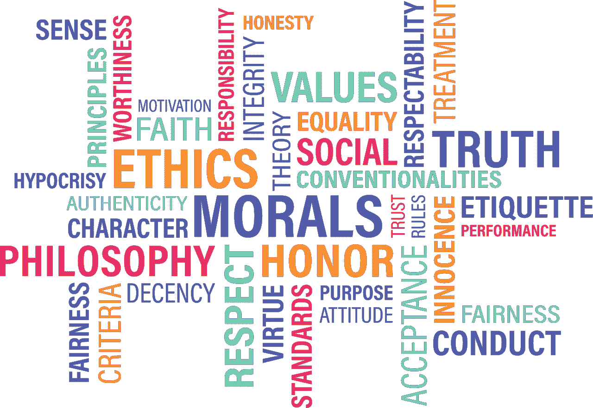

# 企业 UX 是一个道德和伦理问题

> 原文：<https://blog.devgenius.io/enterprise-ux-is-a-moral-and-an-ethical-issue-dc8f09d1363f?source=collection_archive---------33----------------------->

我们在《共同精神》的文章中看到了很多关于 web 的关注，而不是关于客户用户体验对您的应用程序和整个生态系统有多重要的流行叙事。

在我个人看来，就用户体验而言，没有人比苹果做得更好，而一个有凝聚力的生态系统也是如此。

我确信苹果是世界上许多面向客户的应用程序和公司的灵感来源，因为他们知道用户体验对他们的生存和应用程序的采用是多么重要。

这并没有错，事实上，这在 2020 年至关重要，未来将会非常好地利用你的经验来留住你的客户。

如果你想一想，为什么卓越的用户和客户体验更容易留住客户(UX 和 CX)？这可以归结为一件非常简单的事情，人们/人类喜欢不去想/少想/尽可能少想，以完成他们生活中的大多数任务。这可以归结为使我们成为人类的一个非常基本的首要原则:意志力的有限性。

现在，众所周知，在关于人类的研究文献中，人们在某一天的意志力是有限的，除非他们可以通过某些策略来弥补。人的意志力消耗得越快，他们的经历/表现就越糟糕。

因此，当应用程序被设计为以这样一种方式“仅仅工作”,即用户以最少的能量扩展人均任务时，用户/客户将会上瘾/逗留更长时间，即使这意味着支付相对更高的价格，因为在一天结束时，大多数人的基本人类需求在他们开始使用应用程序时得到了满足，他们希望完成任务，并希望在他们的生活中获得更有趣、更有用和更令人满意的东西。

但是你可能会问，Vidy，这和用户体验/客户体验是一个道德和伦理问题的争论有什么关系呢？

我反过来问的问题是，如果你读了我上面说的，我说的是人类的经验和人类的意志力。现在的问题是，在你的企业工作的员工不是人吗？你的员工在你的企业里工作，是拥有无限意志力的机器人吗？

根据我的经验，就企业应用程序而言，我注意到了一些非常糟糕的事情。大多数项目，特别是我曾经参与的所有面向内部的项目，几乎从未花任何有价值的时间去尝试“同情”实际的工作人员，我的意思是有一些考虑，因为用户确实抱怨一些事情，但全面的执行时间和资源没有分配到任何 it 应用程序的最重要的方面，即用户体验。

事实上，根据我们在 zdnet.com 和其他网站上发现的许多研究，我们知道，如果用户体验的每个细节都没有经过深思熟虑/精心设计，那将会产生巨大的负面经济影响。

除了金钱方面，想想工具栏用户体验，人们每天都在使用这个软件，实际上占了他们生活的 1/3。请记住，他们也是人，意志力有限，糟糕的用户体验会导致过度使用意志力，降低他们对工作的满意度和幸福感。

考虑到低技能的可怜的工人感到困在他们的工作中，无法享受并以最佳状态工作，即使是在这些低技能的工作中，因为糟糕/不充分的用户体验，他们每天都在耗尽精力。

这种精疲力竭不仅对他们的精神和身体健康有意想不到的后果，而且延伸到他们的家庭，特别是他们的孩子，因为现在当他们回家时，他们没有意愿和精力给孩子们一些东西。

直到最近，我们人类过去大多生活在小村庄里，但每个人都认识每个人，村庄就像我们的大家庭，这是我们生活和工作的地方。

在现代社会中，我真的相信我们的工作场所就是我们大家庭中的同事所在的村庄，我们和他们一起分享生活中的许多事情，即使这仅仅意味着每天要在一起生活八个小时。

设计糟糕的应用程序导致效率低下，这是需要尽快解决的现实问题。

赞助此类申请的企业高管应该认识到公司底线的金钱优势，以及他们对在他们的组织/公司工作的人的道德和伦理责任。

有什么更好的方式来传达公司的社会责任，以表明对公司/组织影响的最直接的社交圈的责任。