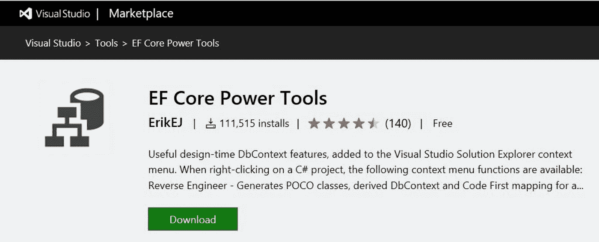
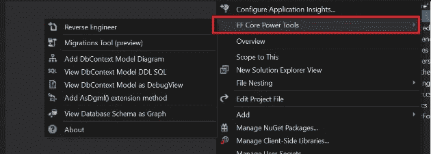
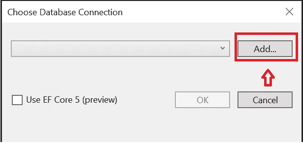
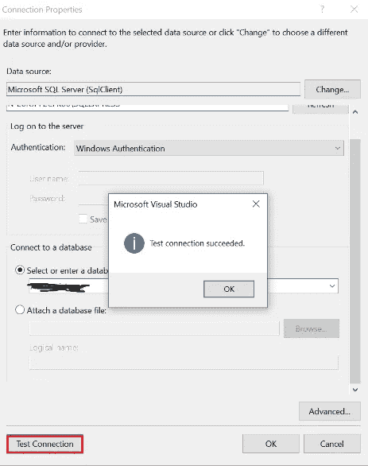
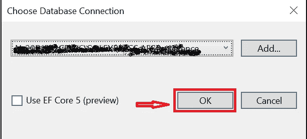
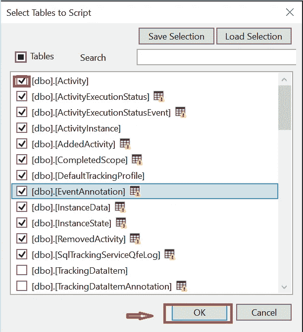
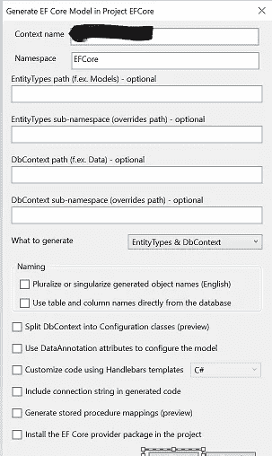
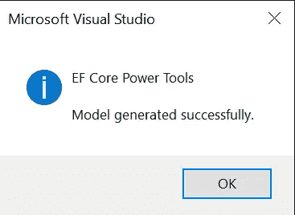

# ASP.NET 核心 Web API 中的实体框架核心功能工具

> 原文：<https://blog.devgenius.io/entity-framework-core-power-tools-in-asp-net-core-web-api-a1e7dee56534?source=collection_archive---------3----------------------->

EFCore 电动工具-扩展

在这篇文章中，我们将学习 EF Core Power Tools，基本上新版本的 EF Core 使用起来非常简单，就像我们已经在[使用的实体数据模型一样。NET 框架](https://www.bacancytechnology.com/blog/net-framework-vs-net-core)和这个 EF 核心工具在开发过程中有帮助。让我们深入这个问题。

**英孚核心电动工具是什么？**

EF 核心电动工具是最强大的扩展。它提供了许多选项，如逆向工程，以生成基于实体类的数据库表，并生成模型图。它也有助于使用代码优先方法开发的现有脚本的迁移。EF Core Power Tools 可以选择在图形视图中生成数据上下文图和实体类之间的关系。

**这个工具对我有什么帮助？**

有了这个工具，我们可以获取一个现有的数据库并执行逆向工程，这意味着从您现有的数据库中生成所有的类。

# EF 核心——电动工具中的逆向工程是什么？

逆向工程的行为类似于实体数据模型，它在代码中生成我们数据库的表作为实体类，还基于我们的数据库生成 Db 上下文类。

链接下载-> [英孚核心电动工具](https://marketplace.visualstudio.com/items?itemName=ErikEJ.EFCorePowerTools)

请确保您的计算机上至少安装了 Visual Studio 2017，以便使用 EF Core。

下载后，点击，并安装。但是不要忘记重启 Visual Studio 来完成安装

创建一个项目->打开 Visual Studio，你会发现一个名为创建新项目的选项->点击它

->选择 ASP.NET 核心网络应用->点击下一步按钮。

->给出项目名称，然后单击创建。

->选择 ASP.NET 核心 3.1 版本以及 API，然后单击创建。

将创建一个具有 API 结构的示例项目。

右键点击项目，你会发现一个选项安装，英孚核心电动工具

**第一步**

图一

点击逆向工程，你会发现数据库连接选项。

**第二步**

图二

单击“添加”以连接数据库服务器

**第三步**

图三

1.  在文本框中提供 SQL Server 名称，并确定您使用的是 Windows 还是 SQL 身份验证。
2.  在选择或输入数据库下选择数据库。
3.  单击 Test Connection(测试连接),检查连接配置是否正确。
4.  点击确定。

**第四步**

图 4

就这么定了！与数据库的连接将显示在选定的下拉列表中->单击确定。

**第五步**

图五

选择要包含在项目中的表，然后单击 OK。

**第六步**

图 6

默认情况下，它将添加数据库名称作为上下文名称，如果需要，您可以更改它，并且默认情况下，它还将选择 Entitytypes & DbContext

->点击确定。

您将得到一个确认，如下所示。

图 7

最后…带有数据库上下文的模型类已经自动生成。这就是使用 EF 核心电动工具的简单之处。

 [## JayKrishnareddy/EFCorePowerTools

### Asp.net 核心 API 中的 Usgae 和集成。为 JayKrishnareddy/EFCorePowerTools 开发做出贡献，创建一个…

github.com](https://github.com/JayKrishnareddy/EFCorePowerTools) 

# 摘要

在本文中，我们了解了 EF Core Power Tools 在 ASP.NET 核心 Web API 中的集成和使用。

感谢您的阅读，请在评论区告诉我您的问题、想法或反馈。感谢您的反馈和鼓励。

继续学习…！