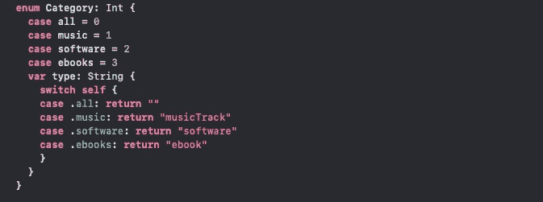
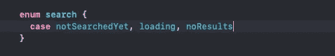
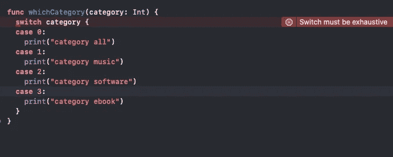
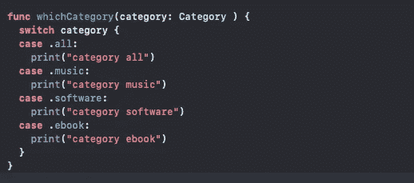
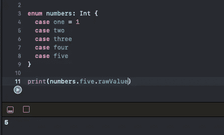
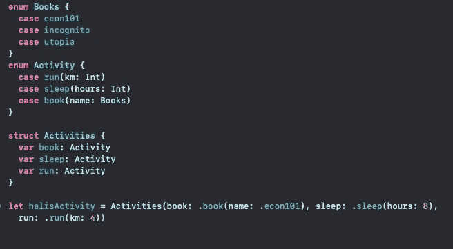

# Swift 中的枚举

> 原文：<https://blog.devgenius.io/enumerations-in-swift-92ee15188987?source=collection_archive---------3----------------------->

img1

根据 apple 的文档，枚举是一组相关的值，它帮助我们以类型安全的方式工作。枚举帮助我们枚举值。

枚举是用 enum 关键字定义的。在枚举范围中，枚举有个事例。这种情况定义枚举状态。当我们说状态时，它当然可以是任何东西。在上面的例子中，我们有类别枚举，运行时类别的状态必须是这 4 种状态(全部，音乐，软件，电子书)。

我们也可以用逗号分隔的方式创建枚举。

img2

在 img2 搜索枚举中没有类似 String 或 Int 的任何类型，但在 img1 中有 Int，我们可以调用 Categorie 的原始值。

我们之前说过 enum 在运行时必须有一个状态。所以我们不必考虑其他情况。

img3

在 img3 中，类别是整数而不是枚举，当试图实现我们的逻辑时，我们必须考虑其他整数。因为类别可以是任何整数。Xcode 为我们提供了错误来涵盖其他情况。但是如果我们使用枚举来构建相同的逻辑，我们就不需要考虑其他情况。因为在运行时枚举只能处于其状态。

img 4

我们之前讨论过原始值，在 swift enums 中有不同的特性。比如我们有这样的数字枚举:

img 5

如果我们给第一个枚举一个原始值 1，而其他的是连续枚举，那么它们就自动有原始值。

枚举的另一个特性是你可以创建带有相关值的枚举

img 6

有了这个特性，我们可以更具体地描述我们的枚举。在示例 img6 中，我们可以指定运行的 kms 图书名称和睡眠时间。