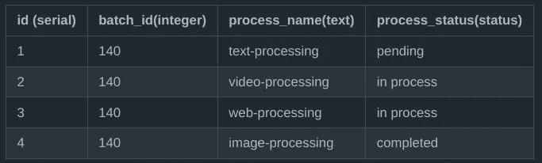

# PostgreSQL 中的枚举&何时使用它们

> 原文：<https://blog.devgenius.io/enums-in-postgresql-when-to-use-them-abb7559156ee?source=collection_archive---------7----------------------->

有没有遇到过这样的情况，您需要在表的某一列中有有限的特定值？我也遇到过类似的情况。我需要跟踪一些进程的状态。以下是可能的解决方案:

# 解决方案

1.  如果您真的不在乎或者真的很急，您可以创建一个文本列，并确保每个人都用固定的、预先指定的值插入/更新该列。
2.  如果您真的关心一致性，您可以创建一个外键表来存储所有这些数据，并使用外键来引用它。这是一个更好的解决方案。但是对于不经常更新的静态值来说，还有更好的方法。
3.  您可以使用自定义枚举类型。这就像创建一个包含常量的外来表，但是没有这些麻烦要好得多。

# 那么什么是枚举呢？

> 枚举(enum)类型是包含一组静态有序值的数据类型。它们相当于许多编程语言中支持的枚举类型。枚举类型的一个例子可能是一周中的几天，或者一段数据的一组状态值。

在这篇博客中，我们将讨论如何在 PostgreSQL 中创建和使用枚举

# 1.创建自定义枚举类型

在这个特定的例子中，我们将创建一个 enum 来跟踪任何进程的状态。

这将在公共模式中创建一个名为 status 的新类型，现在您可以在创建列时使用它作为您的数据类型。

# 2.创建使用该枚举的表

接下来，让我们创建一个表，通过使用 enum 作为其中一个列的类型来跟踪不同流程的状态。

# 3.将数据插入 process_tracker

表格:

# 4.使用错误的值插入/更新 process_status？

现在，如果您尝试用不正确的值更新/插入 process_status 列，您将会得到一个错误。

> *永远不要选择犯错，而只是努力避免犯错，这总是好的。使用 enums 可以做到这一点，而不必创建不同的表和外键约束。*

# 5.改变枚举类型值

使用枚举的另一个好处是，如果您想要更改枚举值，您可以更改名称，它们将自动反映在使用该值的所有记录中。

现在，该表将看起来像这样

# 结论:

因此，不要对具有选项/选择值的列使用文本字段。如果它们是动态的，并且不断变化，或者您只有一个很长的选择列表，那么一个外国表就是一条路要走。但是如果表中某一列的值是有限的，并且不会改变，那么就使用枚举。

# 参考

*   [Postgresql 枚举文档](https://www.postgresql.org/docs/current/datatype-enum.html)
*   [关于变更类型的更多信息](https://www.postgresql.org/docs/current/sql-altertype.html)