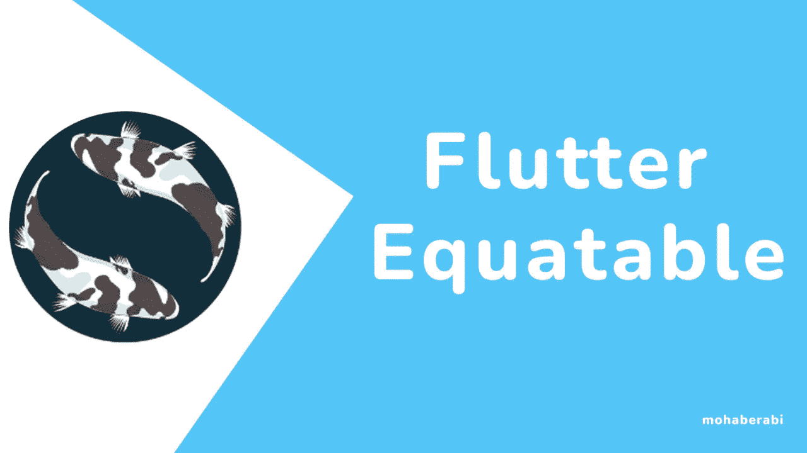
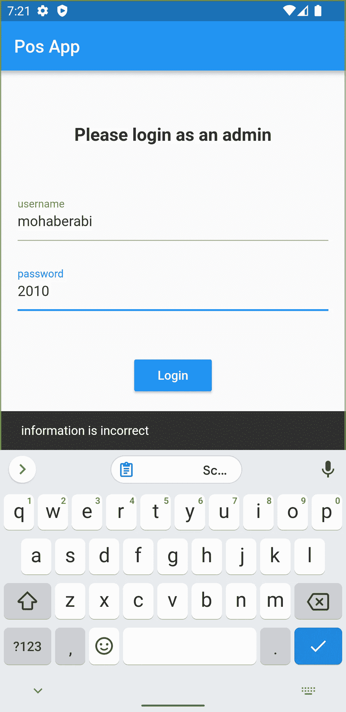
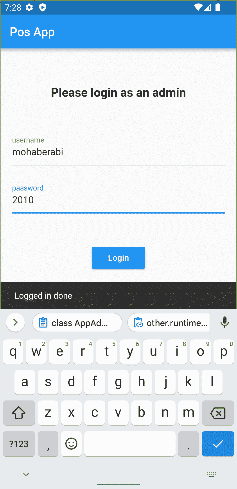

# 等效颤振完全指南

> 原文：<https://blog.devgenius.io/equatable-flutter-the-complete-guide-9f3604e12222?source=collection_archive---------6----------------------->

学习在你的 flutter 应用中使用等价包，以及为什么使用它是重要和有用的



# 目录

> **什么是等价的，为什么要用**
> 
> **实施**

Equatbale 是一个包，在 dart 和 flutter 中有助于覆盖 **==** 和 **hashcode**

**什么是 hashcode？**

> hashcode 是一个添加到语言的 Object 类中的 integar 值，所有的实例或子类都扩展它，这意味着任何对象都有它的 hashcode
> 
> 它在**哈希**中被**哈希表**数据结构用来存储内存中的指令或对象
> 
> 使用这个 hashcode 来比较对象的对象比较
> 
> 也就是说，如果一个类中的两个对象有相同的数据成员值，那么两个对象有相同的 hashcode，这意味着它们是相等的

想象一下，我们现在有一个 POS 应用程序需要管理员登录来添加、删除和管理数据，我们的管理员是一个对象，这是一个类，所以我们现在需要为它创建一个模型

**首先创建一个新的颤振项目**

在 create **adminModel.dart** 中创建一个名为 model 的新目录

然后添加下面的代码

```
class AppAdmin {
  final String userName;
  final String password;
  const AppAdmin({required this.password, required this.userName});

}
```

现在创建一个名为 **screens** 的新目录，创建 **admin_screen.dart** 并用下面的代码替换你的主字段

```
void main() async {
  runApp(const MyApp());
}

class MyApp extends StatelessWidget {
  const MyApp({super.key});

  @override
  Widget build(BuildContext context) {
    return MaterialApp(
        title: 'Admin Pos Equatable Example',
        debugShowCheckedModeBanner: false,
        theme: ThemeData(
          primarySwatch: Colors.blue,
        ),
        home: AdminScreen());
  }
}
```

将下面的代码也粘贴到 **admin_screen.dart** 中

```
import 'package:flutter/material.dart';
import 'package:mofeed/admin/admin.dart';

class AdminScreen extends StatelessWidget {
  const AdminScreen({Key? key}) : super(key: key);

  @override
  Widget build(BuildContext context) {
    final usernam = TextEditingController();
    final password = TextEditingController();
    return Scaffold(
      appBar: AppBar(
        title: const Text('Pos App'),
      ),
      body: Center(
        child: Padding(
          padding: const EdgeInsets.all(20.0),
          child: Column(
            mainAxisAlignment: MainAxisAlignment.center,
            children: [
              Text(
                'Please login as an admin',
                style: TextStyle(
                    color: Colors.black,
                    fontSize: 20,
                    fontWeight: FontWeight.bold),
              ),
              const SizedBox(
                height: 50,
              ),
              TextFormField(
                controller: usernam,
                decoration: InputDecoration(labelText: 'username'),
              ),
              const SizedBox(
                height: 20,
              ),
              TextFormField(
                controller: password,
                decoration: InputDecoration(labelText: 'password'),
              ),
              const SizedBox(
                height: 50,
              ),
              MaterialButton(
                onPressed: () {

                },
                child: Text(
                  'Login',
                  style: TextStyle(color: Colors.white),
                ),
                color: Colors.blue,
              ),
            ],
          ),
        ),
      ),
    );
  }
}
```

我们只是创建一个本地登录屏幕，为我们的管理员创建一个登录对象

所以将创建一个常量对象，另一个我们将在你的构建方法中从用户那里获取创建这个对象

```
Widget build(BuildContext context) {
  final usernam = TextEditingController();
  final password = TextEditingController();
  final admin1 = AppAdmin(password: '2010', userName: 'mohaberabi');
```

然后在你的材料按钮下面添加代码

```
MaterialButton(
  onPressed: () {
                  final admin2 = AppAdmin(
                      password: password.text.trim(),
                      userName: usernam.text.trim());
                  if (admin1 == admin2) {
                    ScaffoldMessenger.of(context).showSnackBar(
                        SnackBar(content: Text('Logged in done')));
                  } else {
                    ScaffoldMessenger.of(context).showSnackBar(
                        SnackBar(content: Text('information is incorrect')));
                  }
                  print(admin2.hashCode);
                  print(admin1.hashCode);
  },
  child: Text(
    'Login',
    style: TextStyle(color: Colors.white),
  ),
  color: Colors.blue,
),
```



在控制台中

我/扑动(8560): 378344142
我/扑动(8560):329704114

两个不同的 hashcode，还有 app 说 info 不正确，那是因为 hashcode 不一样，要让它们相等，我们需要让 hashcode 相等，回到模型类，覆盖下面的那些方法

```
class AppAdmin {
  final String userName;
  final String password;
  const AppAdmin({required this.password, required this.userName});
  @override
  int get hashCode => Object.hash(password.hashCode, userName.hashCode);

  @override
  bool operator ==(Object other) =>
      identical(this, other) ||
      other is AppAdmin &&
          runtimeType == other.runtimeType &&
          userName == other.userName &&
          password == other.password;
}
```

然后再次返回管理屏幕，并按下按钮



在控制台中

I/颤振(8560):176079861
I/颤振(8560):176079861
I/颤振(8560):真

我们已经完成了比较，这里等价的规则是什么，equatable 只用一行简单的代码就可以完成所有这些，让我们来看看如何完成

首先在 pubsbec.yaml 文件中安装 equtable

```
equatable: ^2.0.5
```

然后转到模型类导入，删除 operator 和 hashcode 方法

```
import 'package:equatable/equatable.dart';
```

然后扩展等价和重写方法

```
import 'package:equatable/equatable.dart';

class AppAdmin extends Equatable {
  final String userName;
  final String password;
  const AppAdmin({required this.password, required this.userName});

  @override
  List<Object?> get props => [userName, password];
}
```

再次运行应用程序，它应该给出相同的结果

但是如果我的类是另一个类的子类，我该怎么办，我不需要写所有的操作符和 hashcode 代码，简单等价类有一个 mixin

```
import 'package:equatable/equatable.dart';
import 'package:flutter/material.dart';

class AppAdmin extends ChangeNotifier with EquatableMixin {
  final String userName;
  final String password;
  AppAdmin({required this.password, required this.userName});

  @override
  // TODO: implement props
  List<Object?> get props => [userName, password];
}
```

这就是等价的

**如果这篇文章帮到你了为我鼓掌**

我很高兴听到你的任何评论，如果我做错了什么，也请帮助我。

**感谢阅读。**