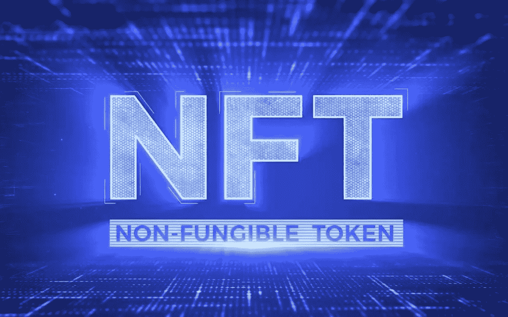
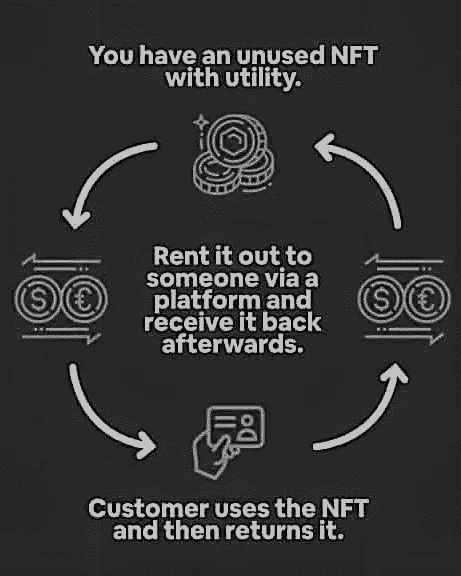
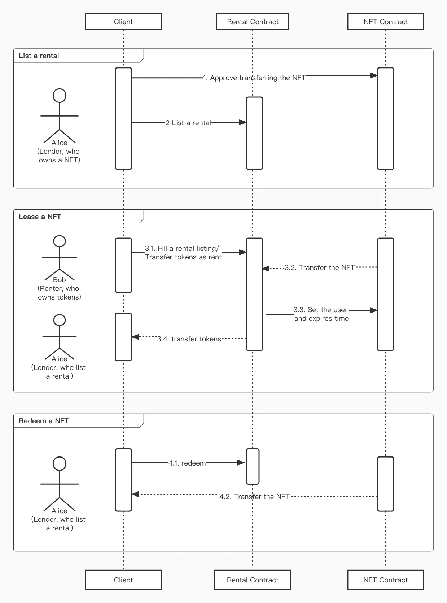

# ERC-4907:NFT 租赁标准

> 原文：<https://blog.devgenius.io/erc-4907-the-nft-rental-standard-edb60fe6527b?source=collection_archive---------0----------------------->

## 一种新的以太坊令牌标准 ERC-4907 使可出租的非功能性传输成为可能

NFT(不可替换的令牌)

今天我们就来了解一下 **ERC-4907，2022 年 6 月 28 日以太坊开发团队通过终审的新 NFT 租赁标准**，成为**第 30 个** ERC 标准。现在，**新的以太坊令牌标准 ERC-4907** 使得可出租的 NFT 成为可能。

**ERC-4907，**允许 **NFT** 车主允许另一个人在指定的时间内使用他们的 NFT。该时间结束后，用户将不再能够访问 NFT。

**玩即赚(P2E)** 视频游戏在加密和游戏领域仍是一个相对较新的现象。话虽如此，这个行业有着巨大的增长潜力，因为它将两个每个人都渴望的东西强有力地结合在一起:**娱乐和金钱**。

随着 NFT 租赁服务的不断发展，进入 P2E 已经变得更加容易。他们允许玩家租一台 NFT，没有任何虚拟的附加条件，并从他们产生的收入中给贷方提成。反过来，非可替代物的所有者有机会获得额外的被动收入。

首先，我们将为初学者浏览一下 NFTs 的基本概述。我们继续吧。

# 什么是 NFT

**NFT，或不可替代代币**，是一种特殊的加密货币，其中每个代币代表某个*事物*的所有权，该事物是唯一的(*不可替代的*)。一个 **NFT** 是一个**独特的数字资产**，不能直接用另一个数字资产替换。许多实物资产也是不可替代的。例如，房地产是不可替代的，因为每一部分都是独一无二的。

如果你想了解更多关于 **NFTs** 的内容，可以在这里 阅读我之前的故事 [**。**](https://medium.com/coinmonks/what-are-nfts-non-fungible-tokens-explained-f3a3d8d18ed7)

NFT 是围绕数字所有权和创造者经济发生的最有趣的事情之一。它们为艺术家和开发者打开了一个全新的可能性世界。

NFTs

# 以公用事业为重点的非技术产业的增长趋势

经济和技术正在推动现实生活用例的兴起。他们不断改进和支持新的和创新的产品和服务的开发。越来越多的公用事业应用推动了 NFT 市场的发展。

**即玩即赚**和**元宇宙**游戏的迅速出现和发展帮助了 **NFT** 市场的增长。NFT 的实际使用案例和拥有机会越来越多，预计将在未来几年推动市场上升。因此，专注于这一领域的租赁市场可能会在 NFT 市场的发展中发挥重要作用。

# 什么是 NFT 出租

NFT 租赁公司的运作方式与现实世界中的其他租赁公司一样。假设你想要一辆豪车，暂时用几天。最划算的方法不是买一辆新车，而是在规定的天数内租一辆车，并在月经结束后归还给车主。同样，这个想法是**暂时租一辆 NFT** 几天，一旦你的租期结束，就归还给合法的主人。

NFT 出租

# 为什么 NFT 租房很重要

国家森林公园可以有各种各样的公共设施，NFT 出租也有很多好处。

**NFT 出租**让**业主**和**租户**双方受益。对于租房者来说，它提供了一个加入 NFT 社区或利用 NFT 公用事业的机会，否则他们将负担不起，即使只是很短的一段时间。**所有者**开始将他们的 NFT 货币化，从非流动性资产中赚取被动收入，否则这些资产可能会闲置在他们的数字钱包中，收集虚拟灰尘。在游戏领域，NFTs 租赁的这些优势对于高净值游戏玩家和普通玩家来说显然是双赢的。

NFT 租房的潜力是巨大的。数字艺术、元宇宙土地和各种游戏资产都可以出租。随着区块链游戏、公会和元宇宙的大规模采用，NFT 租赁市场将在未来几年蓬勃发展。这将导致用户、公会和项目持有大量闲置的 NFT。因此，支持活跃的租赁市场以降低参与成本并通过租金收入回报现有用户的参与至关重要。

# NFT 租赁的当前方法

目前有两种方式出租非功能性出租汽车:

*   **抵押租赁**
*   **无抵押租赁**

在这两种方法中，所有者会将 NFT 的所有权转让给使用者，并附带一些抵押品或条件，以确保租赁期结束后租赁者将归还所有权。一旦 NFT 被出租，原主人对其没有控制权，这就产生了许多潜在的风险。此外，当租赁期到期时，所有者必须手动收回他们的资产，这是一个复杂且昂贵的过程，尤其是在同时租赁多个资产时。

由于 **ERC-4907** 的引入，所有者和租赁者的角色现在是分开的，并有一个到期日，这意味着租赁者的特权自动到期，无需任何进一步的链上操作。

# 双重角色 NFT 租赁标准(ERC-4907)

**ERC-4907** 为 **NFT 标准**增加了一个新角色，划分谁是 NFT 的所有者，谁是使用者——使得**“租”**成为可能。租户可以使用 NFT，直到贷款期限结束，自动将 NFT 交还给其所有者。

**ERC-4907** 标准是 **ERC-721** 的扩展，在应用层引入了**双重角色****【拥有者】**和**【使用者】**。ERC-4907 通过自动“到期”功能简化了 NFT 租赁，该功能强制用户执行有时间限制的角色。这一创新的特性使得 NFTs 在默认情况下是可出租的；所有者不再需要手动撤销用户权限，消除了繁琐的流程和另一个连锁交易。

ERC-4907 很容易通过添加几行代码来实现。采用这种模式作为 NFTs 的标准可能会加速 NFT 生态系统的进一步创新和发展。

租赁流程

# **协议报价:**

*   **实现简单:**易于实现，并提供了*向后兼容性。*
*   **NFT 的角色:**有了双重的"*所有者*"和"*用户*"角色，管理贷方和借方在 NFT 上能做什么和不能做什么就变得容易多了。
*   **上线时间管理**(`expires`)**:**NFT 的“*用户*”在租期结束后自动撤销。
*   轻松的第三方集成:NFT 的所有者现在可以将 NFT 出租给一些用户，同时在抵押贷款平台上使用 NFT。租赁使用“*用户*角色，抵押使用 NFT 的“*所有者*角色。
*   **让 NFT 变得更容易接近:**租用 ERC-4907 NFT 根本不需要 OC 或任何抵押品，因为承租人可以使用 NFT，但不能转让或改变其用户身份，到期后会自动撤销。这为用户租赁和使用 NFT 提供了更多的机会。
*   **增加市场流动性:**随着元宇宙和 Web3 的不断扩张，越来越多的人，包括那些负担不起或根本不想购买游戏内资产或虚拟土地的人，将选择租赁 NFT 来获得他们的利益。随着时间的推移，这将大大增加 NFT 市场的流动性。

# 你能在哪里租到 NFT

**NFT 房屋租赁市场仍然相对较小。这就是为什么 NFT 还没有很多租房市场。最受欢迎的是伦夫特、维拉和特拉瓦 reNFT。**

# **总结**

我们讨论了 NFT 租赁标准 ERC-4907 及其工作原理和租赁系统的原因。 **ERC-4907** 是一个重要的标准，它消除了借贷 NFT 时对抵押品的需求。如果它被广泛采用为 NFT 创作和编程的标准，它将为 NFT 所有者、购买者、市场和艺术家开启更安全和更有利可图的可能性。

也读了，

 [## 什么是 NFT？描述了不可替换的令牌

### 关于不可替换令牌(NFT ),您只需要知道

medium.com](https://medium.com/coinmonks/what-are-nfts-non-fungible-tokens-explained-f3a3d8d18ed7) 

## 在 Linkedin 上关注我，保持联系

[https://www.linkedin.com/in/ishanshahzad/](https://www.linkedin.com/in/ishanshahzad/)