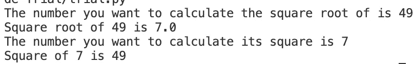
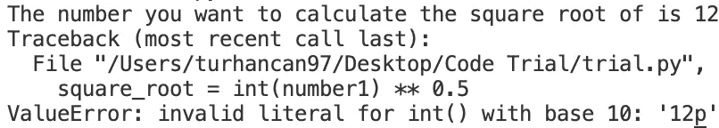
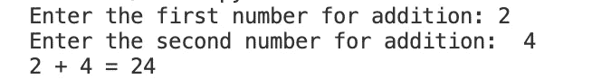
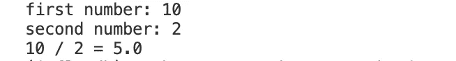
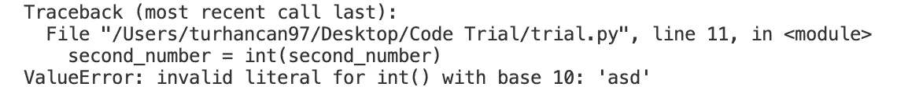
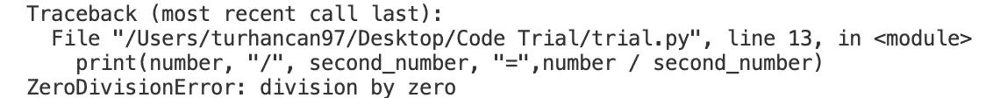
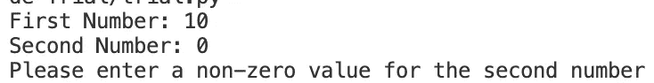
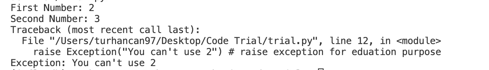
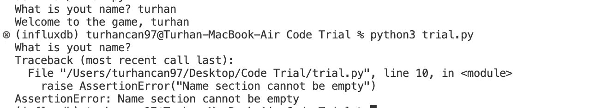

# Python 编程语言中的错误捕获

> 原文：<https://blog.devgenius.io/error-capture-in-python-programming-language-cdf9434a8c2b?source=collection_archive---------13----------------------->

大家好！！！我们将讨论如何在 Python 中捕获错误。这是我在 Medium 上的第一篇英文帖子。我希望你会喜欢读它。所以让我们开始吧！！！

https://media.giphy.com/media/LPFmCBiTjEzcUeluCW/giphy.gif

当我们刚接触编码时，通常我们写的所有程序都基于一个共同的假设。也就是说，我们假设程序总是按照我们希望用户使用的方式来使用。例如，当我们编写一个添加数字的程序时，我们假设用户将总是输入数字数据。然而，尽管我们用心良苦，事情并不总是如我们所愿。例如，正如我们所说，如果程序是基于用户输入一个数字，我们不能确定用户将总是输入一个数字。

例如，想象我们编写一个这样的程序:

输出将如下所示:



代码的输出

在试图理解这些代码中的问题之前，让我们先看一下代码。

如您所见，这里我们根据用户将要输入的数字进行平方根和平方运算。你知道，我们可以用这些代码中的**运算符来计算一个数的任何次方。例如，我们可以使用**运算符来计算 15⁸是什么:

```
>> 15 ** 8
2562890625
```

如你所知，我们也可以用这个运算符来计算一个数的平方。因为毕竟，一个数的平方是这个数的 2 次方:

```
>> 15 ** 2
225
```

同理，如果我们计算一个数的 0.5 次方，我们就求出了那个数的平方根(有意义:)。

```
>> 225 ** 2
15
```

现在我们已经检查了我们的代码，我们可以开始检查这个程序有什么问题。

只要用户输入一个数值，这个程序就会运行。但是，如果用户输入的不是数字，而是其他东西，会发生什么呢？

例如，如果用户(有意或无意地)在上面的程序中输入一个字母而不是一个数字，他/她将得到如下错误:



代码 2 的输出

你写的程序出现这样的错误是正常的。然而，从最终用户的角度来看，对于用户来说，更有意义的是得到一条消息，更清楚地解释什么是错的或者他/她做错了什么，而不是像上面这样的错误消息。上面的错误消息对程序员来说可能有意义，但对最终用户来说却完全无法理解！

您的程序在运行时出现这样的错误是正常的。因为您试图执行的操作依赖于用户输入某种类型的数据。在这里，作为程序员，你的工作是预测程序在执行过程中可能出现的错误，并相应地在程序中采取一些预防措施。在本节中，我们将尝试了解如何采取这些预防措施。


## 错误类型

值得记住的是，“错误”的概念是多维的。特别是，我们需要从编程的角度来研究错误的概念意味着什么。

在本节中，我们将在三个不同的标题下讨论错误:

*   程序员错误
*   程序缺陷(Bug)
*   例外

首先说一下程序员错误。

程序员错误是由编写程序的人的粗心直接造成的明显错误。例如，以下代码包含一个程序员错误:

```
>> print "Hello World!"File "<stdin>", line 1
   print "Hello World!"
                         ^
SyntaxError: invalid syntax
```

这个错误消息中让我们感兴趣的部分在最后一句:SyntaxError。

这些错误是由编程语言的一个特性的误用引起的，或者更简单地说，是由程序员的打字错误引起的。程序员的错误通常表现为语法错误。这些错误通常由程序员发现，并在程序到达用户之前由程序员纠正。与其他错误相比，这些类型的错误易于检测。因为这些错误会妨碍你的程序运行，所以不可能不注意到它们…

程序缺陷，也称为 bug，要复杂得多。有缺陷的程序通常运行时没有任何错误。然而，程序产生的输出并不是你所期望的。例如，您可能在程序中犯了一个公式错误。在这种情况下，您的程序运行起来好像没有任何问题，但是计算结果是错误的，因为公式不正确。例如，程序包含一个类似上面的缺陷:

在这个程序中，当用户输入数据时，我们的程序不会做加法，而是字符串连接，如下图所示。由于这样的程序在执行过程中不会出错，所以很难发现问题，尤其是在大型程序中。换句话说，你认为运行正常的程序实际上可能隐藏着一个错误。



代码的输出

同样地，不小心使用 ***eval()*** 函数的程序也存在安全缺陷。换句话说，这样的程序有一个安全缺陷。正如我们所说的，程序缺陷是多维的，比我们在这里描述的要复杂得多。

先说第三类，例外。顾名思义，异常是程序执行过程中出现的异常情况。例如，让我们看看这个程序:



除法程序的输出

这里我们写了一个程序，将第一个数除以第二个数。这个程序可以做任何类型的除法。但是这里我们需要考虑两件事:

用户可以输入非数字数据类型，而不是数字。例如，用户可以为第一个数字键入 10，为第二个数字键入“asd”。

用户可以尝试将一个数除以 0。例如，用户可以为第一个数字写 12，为第二个数字写 0。

在第一种情况下，我们的程序给出以下错误:



第一个数字是 10，第二个是 asd



第一个数字是 12，第二个是 0

这里的问题是，您试图使用 int()函数将非数字数据转换成数字，并且您试图将一个数字除以 0。在数学中，数字不能被 0 整除。

我们在这两个例子中看到的 **ValueError** 和 **ZeroDivisionError** 是例外。换句话说，当需要一个数字时，用户输入非数字数据或试图将一个数字除以 0 是一种异常情况，会导致我们编写的程序生成异常。

由此，我们回顾了错误、bug 和异常之间的区别，但值得一提的是，这三个概念之间的区别是微妙的:这三个概念之间的区别是微妙的。换句话说，你可能会看到它们在很多地方互换使用。

## 尝试…除了…

在上一节中，我们讨论了错误和捕捉错误，但是我们如何捕捉它们呢？

Python 使用 try… except…块来捕捉错误。我们举个例子:

我们知道，当我们想要将数据转换成数字时，如果用户输入字母值数据而不是数字值数据，我们的程序就会崩溃。因此，根据用户输入的数据类型，int(first_number)和 int(second_number)代码可能会产生错误。这就是为什么我们把这些代码放在 try 块中，因为我们知道它们会抛出一个错误。

同样，我们知道，如果用户在数据转换过程中输入了不适当的数据，就会产生 ValueError 错误。因此，我们将在 except 块中写入的错误类型的名称将是 ValueError。因此，我们编写了下面几行代码来捕获 ValueError:

```
except ValueError:
    print("Please enter only numeric values")
```

使用这段代码，我们为 Python 提供了以下命令:

如果在 try 块中指定的操作过程中遇到 ValueError，请忽略它，并且不显示通常向用户显示的错误信息。相反，向用户显示警告，请只输入数字！

现在让我们的代码在除以 0 时采取预防措施。当一个数被 0 整除时，Python 会抛出 ZeroDivisionError。那么我们可以写一个这样的代码:

正如你所看到的，我们试图在我们知道 Python 会抛出 ZeroDivisionError 的情况下捕捉这种类型的错误。这样，我们不会向用户显示无意义和复杂的错误信息，更糟糕的是，不会导致程序崩溃，而是产生更容易理解的信息。上面的代码还展示了如何在同一代码中捕捉两种不同的错误类型。

## 尝试…除了…作为…

假设您希望向用户显示您编写的错误消息以及在出现错误时的原始错误消息。在这种情况下，以下结构会很有用:

## 尝试…除了…别的…

如果用户输入字母而不是数字，我们会得到一个 ValueError 错误。我们用表达式 except ValueError:捕捉这个错误，并通过在错误发生时向用户显示一条消息来防止程序崩溃。但是我们知道，当我们运行这段代码时，ValueError 并不是 Python 能够给出的唯一错误。如果用户试图将一个数除以 0，Python 将抛出 ZeroDivisionError。

通过这种方式，我们可以捕获 ValueError 错误和 ZeroDivisionError 错误。这些代码的特殊之处在于 except…块是基于单个 try…块的。所以这里我们把所有的代码都塞进了一个 try…块。然后，在 except…块的帮助下，我们捕捉这个块中发生的任何错误。但是如果我们愿意，我们也可以选择将代码中给出的错误分组:



代码的输出

我们是这样做的:借助于第一个 try… except…块，我们首先用 int(input())函数检查来自用户的数据是否是一个数字。然后我们打开一个 else…块，在其中我们激活第二个 try… except…块。这里我们执行除法运算。如果用户在除法过程中输入数字 0，我们将借助 except ZeroDivisionError 语句来处理可能的错误。以这种方式编码的好处是，它帮助我们保持对错误的一些控制。感谢上面的代码，我们给出了一种“一次来一个！”错误消息。因此，在每个块中，我们只接收到我们期望接收到的错误。比如上面第一个 try…块中的转换操作只能返回 ValueError，而 else:块之后的 try…块中的操作只会返回 ZeroDivisionError。由于我们上面使用的结构，我们可以在适当的时候单独处理每个错误。相比之下，在本章开头的 try… except 块中，ValueError 和 ZeroDivisionError 都是可能的。因此，我们将所有错误压缩到一个 try…块中。这里，else:块解决了这种拥塞。

## 尝试…除了…最后…

finally…块最重要的特性是，无论程序执行过程中是否出现错误，它都会被执行。如果程序中有一部分必须执行，您可以将该部分写在 finally…块中。

finally…块在文件操作中特别有用。

## 上升

有时，在我们编写的程序中，我们可能希望向用户显示“Python 风格”的错误消息，即使用户的操作在正常情况下不会产生错误。在这种情况下，Python 为我们提供了一个名为 raise 的语句。借助该语句，我们可以生成特定于情况的错误消息。让我们举个例子:



代码的输出

在这里，如果用户输入数字 2，将向用户显示一条错误消息并退出程序。在这段代码中，我们使用了一般的错误消息异常。我们不能写任何想写的东西来代替异常。我们只能编写用 Python 定义的错误消息。例如名称错误、类型错误、零分错误、io 错误等…

## 维护

有时当我们在程序中犯了一个错误，我们可能很难发现它。我们可以通过使用 print 函数来找到这个错误，但是如果我们的程序在屏幕上打印了太多的内容，这可能会被忽略。在这种情况下，我们可以使用 assert 语句。assert 语句也是引发错误的一种快捷方式。但是，我们只能使用 assert 引发 AssertionError 类型的错误。通常使用 raise 会更好。正如我们所说，assert 用于快速识别代码中的错误。现在让我们想象我们有这样的代码:



有空名称和没有空名称的输出

我们可以使用 assert 编写如下代码:

```
name = input("What is yout name? ")
assert len(name) != 0 , "Name section cannot be empty"
print("Welcome to the game, " + name)
```

在这里，表达式可以是布尔值，即 True 或 False，也可以是可用于布尔值函数的对象(就像 if 一样)。因此，如果表达式的值为 True，我们的 assert 语句将不起作用，但如果为 False，它将起作用。换句话说，我们需要在断言表达式中写入我们希望为真的条件，以便它在为假时引发错误。

## 摘要

在了解了语法错误和异常之间的区别之后，您了解了在 Python 中引发、捕捉和管理异常的不同方法。您注意到了本文中的以下选项:

*   允许你在任何时候抛出一个异常。
*   `assert`使您能够验证是否满足某个条件，如果不满足就抛出异常。
*   在`try`子句中，所有语句都被执行，直到遇到异常。
*   `except`用于捕获和处理 try 子句中遇到的异常。
*   `else`允许您编写只有在 try 子句中没有遇到异常时才运行的代码段。
*   `finally`使您能够执行应该一直运行的代码段，不管之前是否遇到任何异常。

在本文中，我们已经详细了解了如何在 python 中处理错误。谢谢你花时间阅读它。

如果您有任何问题或想要联系我，我所有的社交媒体账户都在下面的链接上。

[](https://turhancankargin.me/) [## 图尔汗能卡金|家

### 这是图尔汗·坎·卡金的作品集。

turhancankargin.me](https://turhancankargin.me/) 

来源:

[](https://realpython.com/python-exceptions/) [## Python 异常:介绍-真正的 Python

### 立即观看本教程有一个由真正的 Python 团队创建的相关视频课程。和书面的一起看…

realpython.com](https://realpython.com/python-exceptions/) [](https://python-istihza.yazbel.com/) [## Python 程序 lama Dili - Yazbel Python Belgeleri

### 如果您在笔记簿型论坛上提问，而不是发表评论，您可以更快地得到答案…

python 集成开发工具](https://python-istihza.yazbel.com/)