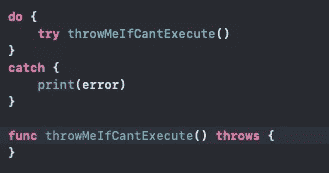
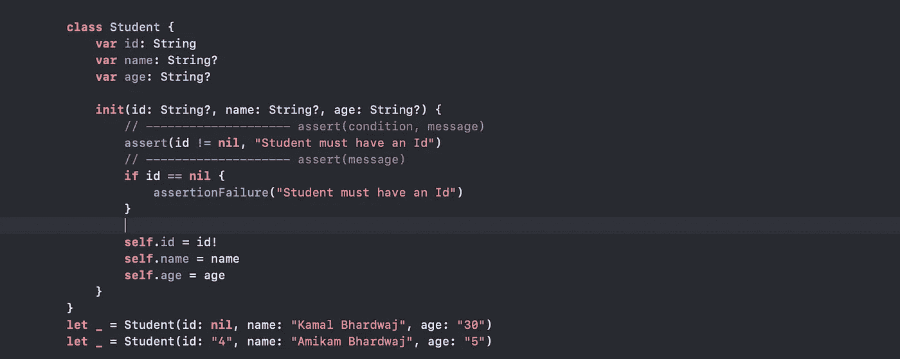
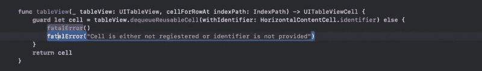

# Swift 中的错误处理器

> 原文：<https://blog.devgenius.io/error-handlers-in-swift-dce7153d9fe7?source=collection_archive---------7----------------------->

错误处理对代码质量有很大的贡献。这也使得程序员意图更加明显。如今，Swift 在传播和处理错误方面发展得更好。本文将讨论一些错误处理程序及其使用和影响。此外，在不同的配置模式下使用时会有所不同。

错误要么是程序员的错误，要么是 OS/IDE 的缺陷，响应或处理这种意外行为就是错误处理。简单！！
让我们列出 swift 中一些可用的错误处理程序:

1.  扔，试着接住
2.  主张
3.  前提
4.  致命错误

这些错误更像是编程和运行时错误处理程序。编程错误是那些逻辑错误或未处理的情况。另一方面，由 OS/IDE/API 故障引起的运行时错误。

为了处理编程错误，swift 提供了断言、前提条件和致命错误处理程序。另一方面，try-catch 是处理运行时错误的传统而有效的方法。Swift 允许 throw 方法帮助尝试捕捉技术。此外，swift 还提供可选的<t>、结果<t>和 try？(投掷的例子)。</t></t>

要更深入地了解基础知识，请查阅官方文档— [快速错误处理程序](https://docs.swift.org/swift-book/LanguageGuide/ErrorHandling.html)

**Throw，Try-Catch** :处理错误的全时间成功方法，swift 中也提出了 Try-Catch 方法与 *throw* 。抛出产生一个类 error 错误实例。抛出错误表示期望中的异常发生，并打破正常流程以达到期望。它有这样的表达:

应该在函数定义中使用 throws 关键字作为后缀来定义预计会失败的方法。因此，在 do-try-catch 对的帮助下，可以很好地处理运行时错误！在这上面再加两分钱， *Throw，try-catch* 是可撤销的方法。

为什么，用在哪里？是的，应该考虑当-

*   错误不可能在方法内部处理。
*   需要改变控制流
*   在一个 catch 方法中必须处理多个错误

当应用程序期望来自不同实体的输入时，Throw 总是有用的。谁可能导致不同类型的输入，空，数据转换问题预计会发生。

**可选，尝试**是处理小错误的另一种方式，或者在正常执行中避免空值。最佳做法是在以下情况下使用这些工具-

*   将变量转换为数据类型
*   解析 API
*   只读计算属性
*   带投掷的计算函数

此外，我想在这里同意，使用可选的，尝试，强制包装是完全值得商榷的。每个开发人员都可以根据自己的理解来使用它。

投掷，试抓可以用试来缩短吗？试试看。这里你最好知道。& !。

**结果**表示成功&失败并出现错误。与 Optional 不同，它更有帮助，并提供导致失败的有用上下文。它与错误相关联，并且具有更多信息。它在以下情况下很有用—

*   异步完成处理程序中可能会出现错误。(回调、API 调用等。)
*   当成功和失败都被认为是预期的输出时。

**断言:**它有助于处理编程错误和条件测试，这应该只发生在错误的逻辑或代码。例如:忘记设置 storyboardId、单元格标识符等。断言仅对开发模式有效，在生产中会被跳过。*所以在生产中开发者肯定需要照顾回退*。

Assert 是追踪编程错误的合适工具。这在没有关键问题且 app 具有除终止之外的替代证明动作的情况下是有用的。因为它只会在开发中崩溃的应用程序，所以应用程序必须在生产中添加失败的回退。为分析或崩溃报告添加代码可以帮助在即将到来的版本中修复/检测问题。让我们用例子来验证一下—

所以在上面的例子中，学生必须有 Id，并且为了验证我们已经在断言的帮助下添加了 check。在上面的例子中，同样的事情被两种不同的方法处理，开发者可以使用其中的任何一种。此外，消息不是必需的，如果开发人员不传递它，它的默认值为空。再次提醒，这个断言在生产应用程序中不起作用，所以这里最好使用回退代码。

前置条件:这与断言 is 的行为相同。唯一的区别是前提条件将在开发和生产中终止应用程序。它也没有任何返回类型。如果你能把上面例子中的关键字“assert”替换成“precondition ”,那就完美了。

前提条件在以下情况下很有用—

*   函数需要参数来消费，脚本必须运行等。

**致命错误**:是的，顾名思义，这是应用程序的手榴弹。它会无条件终止应用程序。它应该只用于错误，使应用程序声明终止是唯一合理的行动。与其他处理程序不同的是，它的返回类型是“never ”,因此可以用在错误没有什么可返回的地方。

*因此，与其他处理程序相比，fatalError 会将失败消息添加到崩溃报告中，而其他处理程序则不会。*

致命错误建议仅在以下情况下使用—

*   错误至关重要
*   没什么可退的。

在上面的例子中，我已经展示了如何在代码中使用 fatalError 的两种方法。像这里一样，函数期望一个单元格返回，但是编程错误会导致没有单元格。所以返回和错误可以用 fatalError 来处理。

快速错误处理策略可以分为:

*   可恢复:`Optional`、`Result`、`throw`；
*   以及不可恢复:`assert()`、`precondition()`、`fatalError()`。

不可恢复策略通常更适合处理逻辑错误；可恢复是针对运行时错误的。选择最明智的策略有助于提高代码质量，并使程序员的意图更加清晰。

感谢反馈，任何在牛奶通道下的东西。

编码快乐！！！