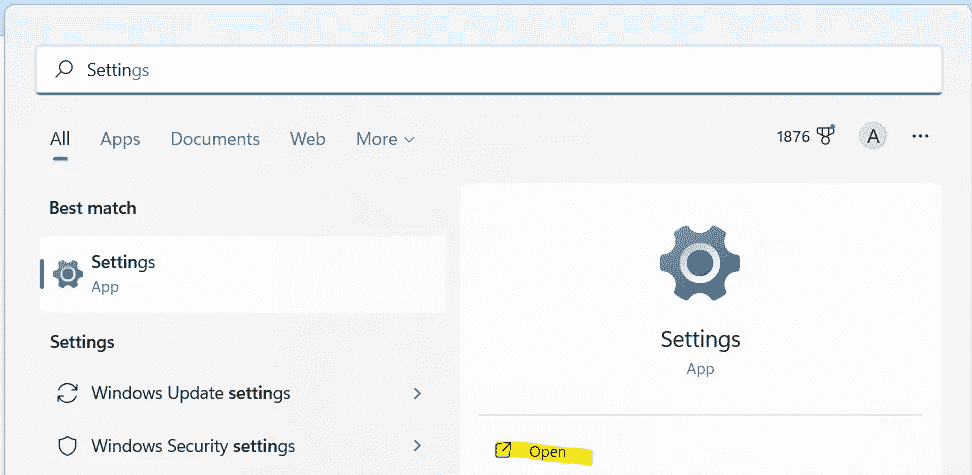
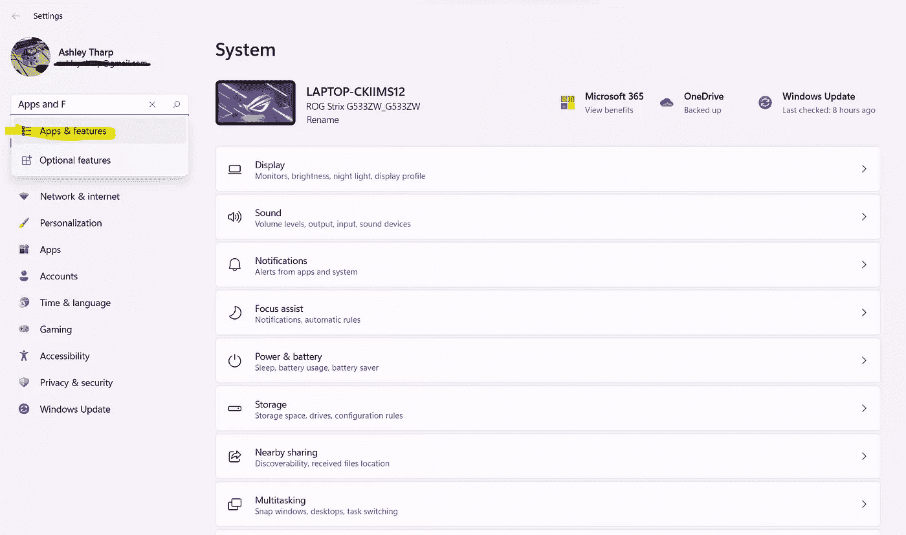
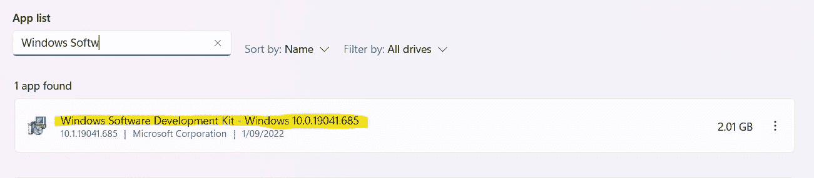
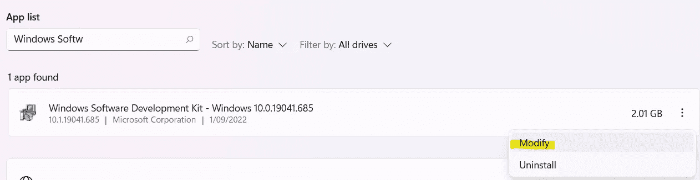
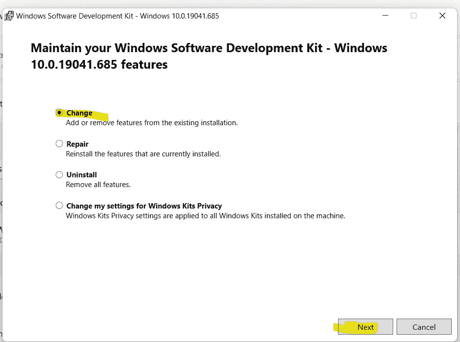
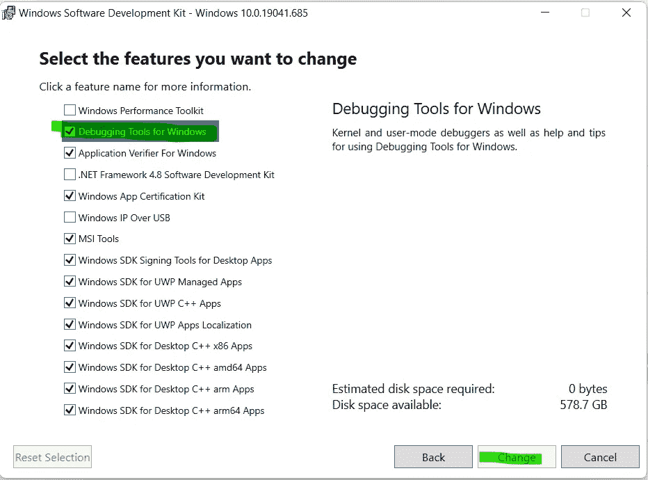

# 错误:在 Windows 上用 VS2019 C++编译时，找不到 PDBCOPY.EXE 的安装

> 原文：<https://blog.devgenius.io/error-unable-to-find-installation-of-pdbcopy-exe-when-compiling-with-vs2019-c-on-windows-2c5e33692345?source=collection_archive---------7----------------------->

完整的错误消息:

```
ERROR: Unable to find installation of PDBCOPY.EXE, which is required to strip symbols. This tool is included as part of the 'Windows Debugging Tools' component of the Windows 10 SDK ([https://developer.microsoft.com/en-us/windows/downloads/windows-10-sdk](https://developer.microsoft.com/en-us/windows/downloads/windows-10-sdk)).
       while executing task <Strip Platform="Win64" BaseDir="" Files="#Strip Tools for Installed Win64" OutputDir="" Tag="#Installed Build Win64 Files" />
       at (981) 
```

## 怎么修

您需要添加 Windows SDK 附带的 Windows 调试工具。这里面有失踪的 pdbcopy.exe。

# [如果已经安装了 SDK，添加 Windows 调试工具](https://docs.microsoft.com/en-us/windows-hardware/drivers/debugger/debugger-download-tools#adding-the-debugging-tools-for-windows-if-the-sdk-is-already-installed)

打开设置，



导航至应用和功能，



选择 Windows 软件开发工具包，



然后选择修改



选择“更改”单选按钮选项，然后单击“下一步”按钮。



为 Windows 添加调试工具。



另外，我重启机器，重新编译，错误信息消失了。

# 参考

[1]【pdbcopy.exe】安装构建尝试运行失败？。[https://forums . unrealengine . com/t/installed-build-fails-trying-to-run-pdcopy-exe/88759/2](https://forums.unrealengine.com/t/installed-build-fails-trying-to-run-pdbcopy-exe/88759/2)

[2] PDB 复制工具窗口。[https://support . Microsoft . com/en-us/topic/pdb copy-tool-1eb 343 a 1-52e 1-816 c-451 c-e 569 cef 6b 297](https://support.microsoft.com/en-us/topic/pdbcopy-tool-1eb343a1-52e1-816c-451c-e569cef6b297)

[3]PDBCopy.exe 从 15.5 开始失踪。[https://developer community . visual studio . com/t/pdbcopyexe-missing-from-155/168414](https://developercommunity.visualstudio.com/t/pdbcopyexe-missing-from-155/168414)

[4]下载 Windows SDK。[https://developer . Microsoft . com/en-us/windows/downloads/windows-SDK/](https://developer.microsoft.com/en-us/windows/downloads/windows-sdk/)

**【5】**下载 Windows 调试工具。[https://docs . Microsoft . com/en-us/windows-hardware/drivers/debugger/调试器-下载-工具](https://docs.microsoft.com/en-us/windows-hardware/drivers/debugger/debugger-download-tools)