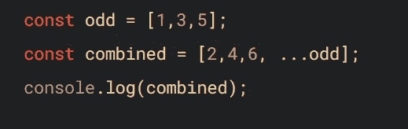

# ES6 默认参数+扩展运算符

> 原文：<https://blog.devgenius.io/es6-default-parameters-spread-operator-9709fc575f13?source=collection_archive---------2----------------------->

ES6 是 2015 年 6 月 17 日发布的 JavaScript 新标准。这个新版本包括许多新特性，在用 JavaScript 编写代码时可以利用这些特性。

我将谈论哪些特性是我最喜欢的，我将解释如何在您的 web 应用程序中使用它们。

## 默认参数-

如果你正在读这篇文章，我假设你已经理解了什么是函数，并且知道如何将参数传递给函数来改变返回值的结果。

在这个例子中，我将演示如何在函数中创建默认参数，以防没有值被传递给该参数。

假设我们想要创建一个名为 sum 的函数，它将两个值相加，然后像这样传递给函数

首先，我们将向函数传递两个整数，并记录结果。

返回值

如你所见，我们得到了想要的结果。函数 sum 返回 2 和 2 的和。

但是如果我们试图调用只有一个参数的函数会发生什么呢？

用 1 个参数调用了函数

我们拿回 NaN(不是一个数字)

该函数能够传入第一个参数，但是当它试图将第一个参数添加到第二个参数时，它返回了 NaN，因为您不能将一个值添加到一个不存在的值。

这个问题的解决方案是为我们的一个参数使用一个默认参数。

传递默认参数

我们说 num2 = 1，就是说“如果没有值传递给这个参数，就给它一个默认值 1。”

所以现在当我们调用只有一个参数的函数时，我们会得到一个值 3

返回值

## 传播算子

我想介绍的另一个 ES6 特性是 Spread 操作符。

(…)

spread 运算符允许您展开可迭代对象的元素，例如数组、映射或集合。

您可以使用 spread 操作符从数组中复制内容，并且可以按照自己的意愿使用这些项。扩展运算符非常有用，可以用在许多不同的情况下。

下面是一个使用 spread 运算符的示例

我们可以使用以下语法将一个数组的内容连接成一个新的数组。

我们可以使用另一种语法做同样的事情。

我们使用 push 方法将所有动物的内容放入 arr 数组中

arrive）

这些是如何使用这些功能的基本示例。在应用程序中使用这些标准还有许多其他方式。ES6 提供了很多东西，我认为在编写 JavaScript 时尽可能尝试使用这些标准是一个很好的实践。

感谢阅读！