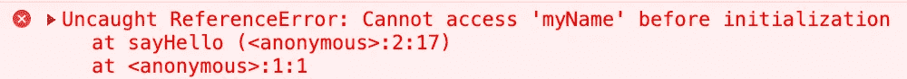

# [ES6] let 关键字—真实生活

> 原文：<https://blog.devgenius.io/es6-let-keyword-real-life-cb8291b4f395?source=collection_archive---------12----------------------->

本文通过 ES6 `**let**`关键字，结合现实生活中的例子和解释。

`**let**`关键字的特征:

*   引入块范围。
*   无法重新声明。
*   必须在使用前声明。

# 引入块范围

在 ES6 之前，没有所谓的**块范围**。只有:

*   功能范围。
*   全球范围。

块作用域防止从块外部访问变量(在块内部声明)。这只能通过使用`**let**`关键字(或者，`**const**`)来完成。并且，`**ReferenceError**`是你将得到的。

```
{
  **let** count = 1;
}
console.log(count); // <= outside access, ReferenceError
```


访问块范围变量时出现 ReferenceError

与`**var**`关键字相比，你可以自由地从一个块中访问任何变量，没有任何例外，因为一旦使用`**var**`声明，变量就在函数作用域下(或者在另一种情况下在全局作用域下)。

# 无法重新申报

当你试图重新声明一个已经使用`**let**`关键字声明的变量时，会抛出一个`**SyntaxError**`(重新声明一个变量意味着使用已经声明的变量的相同名称)。

```
**let** name;
**let** name; // <= SyntaxError
```


使用 let 关键字重新声明变量时出现语法错误

与`**var**`关键字相比，你可以随时自由地重新声明变量，没有任何例外。

# 必须在使用前声明

当试图使用一个没有使用`**let**`关键字声明的变量时，您将收到一个`**ReferenceError**`。

```
**function** sayHello() {
    console.log(myName);
    **let** myName = "Mike";
    console.log("Hello", myName);
}
sayHello(); // <= ReferenceError
```



在声明之前尝试访问变量时出现 ReferenceError

与`**var**`关键字相比，你可以自由地对此。

```
**function** sayHello() {
    console.log(myName);
    **var** myName = "Mike";
    console.log("Hello", myName);
}
sayHello(); // There is no exception here
// The output on the console:
// undefined
// Hello Mike
```

在 JS 中，有一个提升术语，可以将上述功能解释为:

```
**function** sayHello() {
    **var** myName; // Declare the variable without initialization
    console.log(myName);
    myName = "Mike";
    console.log("Hello", myName);
}
sayHello(); // There is no exception here
// The output on the console:
// undefined
// Hello Mike
```

这就是为什么你会在输出的第一行看到`undefined`，因为`myName`没有初始化就被声明了。

# 容易出错的问题可以通过 let 关键字解决

```
**function** print() {
    **for** (**var** i = 0; i < 10; i++) {
        // This is the block        
        setTimeout(function () {
            console.log(i);
        }, 0);
    }
}
print(); // Ten times with the same value of 10
```

变量`i`不在块作用域(改为函数作用域)是可以理解的。结果，`i`一直增加，直到中断循环，该循环为 10，并绑定到在`setTimeout`中传递的回调函数。

在`**let**`之前，我们可以使用 JS 闭包和 life(**I**immediately**I**nvoked**F**function**E**expression)来处理这个问题。

```
**function** print() {
    **for** (**var** i = 0; i < 10; i++) {
        setTimeout((**function** (val) {
            **return** function () {
                console.log(val);
            };
        })(i), 0);
    }
}
```

解释:

*   `setTimeout`中传递的表情就是生活。
*   循环的每一次迭代都将创建一个全新的函数(由 life 返回),该函数在 life 调用时绑定到`i`的值(依次从 0 到 9)。

现在，使用`**let**`关键字很容易达到预期的输出。

```
**function** print() {
    **for** (**let** i = 0; i < 10; i++) {
        setTimeout(**function** () {
            console.log(i);
        }, 0);
    }
}
```

关注:

*   循环语法的第一部分只执行一次。
*   引入块范围`i`应该在循环的每一次迭代中重新声明，这是`**let**`关键字不允许的。

遵循 [**运行时语义:CreatePerIterationEnvironment(perIterationBindings)**](https://262.ecma-international.org/6.0/#sec-createperiterationenvironment)，这个可以这样理解:

```
**function** print() {
    **for** (**var** i = 0; i < 10; i++) {
        {
            **let** val = i;
            setTimeout(**function** () {
                console.log(val);
            }, 0);
        }
    }
}
```

解释:

*   当在循环语法的第一部分使用`**let**`时，JS 将改为使用`**var**`并将循环体包装在一个范围内。
*   在块内部，JS 将使用`**let**`引入一个块作用域，这个作用域将由`setTimeout`中传递的回调函数使用。
*   这意味着，回调函数的每次迭代将被绑定到不同的`val`和不同的值(与使用 IIFE 时相同——如上所述)。

**【问题】:**我能试试吗:

```
**function** print() {
    **for** (**var** i = 0; i < 10; i++) {
        {
            **var** val = i;
            setTimeout(**function** () {
                console.log(val);
            }, 0);
        }
    }
}
```

**【答案】**，对，可以。但是你会得到一个 10 次 10 次的结果，因为在一个函数作用域下，直到循环结束之前`val`仍然会引用`i`，这意味着每次迭代回调函数都会引用同一个值，并且值会增加。

# 警告

以上仅是我对`let`关键字及其工作原理的理解。我尊重并愿意和热切地接受任何评论和反馈，以更深入地理解这一点。

最后，我非常感谢您花时间阅读这篇文章。

回头见。

真诚，