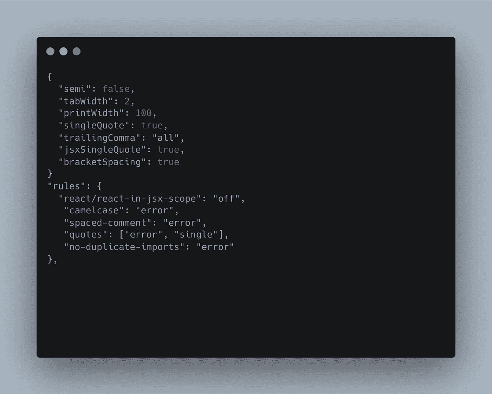
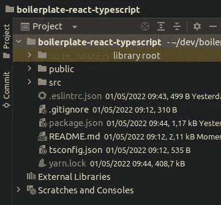

# 2022 年 ESLint+beauty+Typescript 和 React

> 原文：<https://blog.devgenius.io/eslint-prettier-typescript-and-react-in-2022-e5021ebca2b1?source=collection_archive---------0----------------------->



让一个新项目为开发做好准备可能有点难，特别是如果你使用 React、Typescript、ESLint 和 pretty，但是今天我将帮助你以一种简单的方式正确地设置 React 项目。

通常，问题是每次你必须设置 ESLint 和 Prettier 时，你都要去网络上搜索一篇文章，而这篇文章很可能没有更新。通常，他们使用大量的插件和非默认配置。

我们打算用 ESLint 和 Prettier 的基本配置，少一些头疼。

创建 react 应用:

```
➜ yarn create react-app boilerplate-react-typescript --template typescript
or 
➜ npx create-react-app boilerplate-react-typescript --template typescript 
➜ cd boilerplate-react-typescript
```

`--template typescript`:用于创建 ReactJS 类型脚本项目，而不是 JavaScript。

## 什么是 ESLint？

ESLint 是一个 JavaScript 林挺开源项目，用于发现代码中的问题和语法问题，它将帮助我们找到只有在运行时才能发现的错误逻辑。

要安装 ESLint:

```
➜ yarn add -D eslint
or 
➜ npm install eslint --save-dev
```

安装 ESLint 后，我们必须初始化配置文件:

```
➜ npx eslint --init
```

在这里，我们将回答一些关于我们项目的问题:

```
? How would you like to use ESLint? … 
  To check syntax only
▸ To check syntax and find problems
  To check syntax, find problems, and enforce code style
```

选择“检查语法和发现问题”,因为稍后我们将使用更漂亮的代码来加强代码风格。

```
? What type of modules does your project use? … 
▸ JavaScript modules (import/export)
  CommonJS (require/exports)
  None of these
```

选择 JavaScript 模块主要是因为 ReactJS 用到了。

```
? Which framework does your project use? … 
▸ React
  Vue.js
  None of these
```

选择“反应”作为我们的框架。

```
? Does your project use TypeScript? ‣ No / Yes
```

为 TypeScript 选择“是”。

```
? Where does your code run? …  (Press <space> to select, <a> to toggle all, <i> to invert selection)
✔ Browser
✔ Node
```

选择“浏览器”,因为 ReactJS 在浏览器上运行。

```
? What format do you want your config file to be in? … 
  JavaScript
  YAML
▸ JSON
```

在这里，您可以自由选择任何选项，但是我将使用 JSON 作为我的格式。

```
The config that you've selected requires the following dependencies:eslint-plugin-react@latest @typescript-eslint/eslint-plugin@latest @typescript-eslint/parser@latest
? Would you like to install them now with npm? ‣ No / Yes
```

如果您使用的是 NPM，请选择“是”，如果不是，请选择“否”，然后复制软件包并:

```
➜ yarn add -D eslint-plugin-react@latest @typescript-eslint/eslint-plugin@latest @typescript-eslint/parser@latest
```

现在，ESLint 包用您选择的格式创建了一个. eslintrc 文件:



在继续之前，我们必须安装与 ESLint 相关的 TypeScript 插件，为此:

```
➜ yarn add -D eslint-plugin-import @typescript-eslint/parser eslint-import-resolver-typescript
```

如果一切顺利，您的 eslintrc 文件应该如下所示:

```
{
    "env": {
        "browser": true,
        "es2021": true
    },
    "extends": [
        "eslint:recommended",
        "plugin:react/recommended",
        "plugin:@typescript-eslint/recommended"
    ],
    "parser": "@typescript-eslint/parser",
    "parserOptions": {
        "ecmaFeatures": {
            "jsx": true
        },
        "ecmaVersion": "latest",
        "sourceType": "module"
    },
    "plugins": [
        "react",
        "@typescript-eslint"
    ],
    "rules": {
    }
}
```

让我们安装更漂亮的，然后编辑 eslint 和更漂亮的配置文件。

首先，什么更漂亮？

漂亮是一个代码样式格式化器，不同于 ESLint，漂亮只是格式化代码样式，并不寻找语法问题。

像`max-len, no-mixed-spaces-and-tabs, keyword-spacing, comma-style`这样的规则是 Prettier 中一些流行的格式规则。

像`no-unused-vars, no-extra-bind, no-implicit-globals, prefer-promise-reject-errors`这样的规则在 ESLint 是很常见的。

在这种情况下，我更喜欢 ESLint 来搜索问题和语法错误，让代码看起来更漂亮。

要安装得更漂亮:

```
➜ yarn add -D prettier eslint-config-prettier eslint-plugin-prettier eslint-plugin-react-hooks
```

安装后，您必须创建 prettierc 文件:

```
➜ touch .prettierrc
```

此时你有一个空白。prettierrc 文件和一个默认的 eslintrc 文件，所以下一步是配置 eslintrc 文件。

打开您的 eslintrc 文件。

如果您打算在项目中使用 Jest，请在“env”中添加以下几行:

```
{
    "env": {
        "browser": true,
        "es2021": true,
	"jest": true // Add this line!
    },
	...
}
```

要将更漂亮与 eslint 一起使用，您需要更改扩展对象:

```
{
	...
	"extends": [
	  "eslint:recommended",
	  "plugin:react/recommended",
	  "plugin:@typescript-eslint/recommended",
	  "prettier" // Add this line!
	],
	...
}
```

ESLint 的主要部分是规则对象。在这里你可以放任何你认为对你的项目和团队有益的规则。

我的基本配置如下:

```
{
	...
	"rules": {
        "react/react-in-jsx-scope": "off",
        "camelcase": "error",
        "spaced-comment": "error",
        "quotes": ["error", "single"],
        "no-duplicate-imports": "error"
  },
	...
}
```

如果你想了解更多关于 ESLint 规则，你可以查看[规则](https://eslint.org/docs/rules/)页面。

要使用我们安装的插件，请更新 eslintrc 文件中的插件对象:

```
"plugins": ["react", "react-hooks", "@typescript-eslint", "prettier"],
```

在 ESLint 中最后要设置的是 ESLint-import-resolver-typescript。只需在 eslint 配置文件中添加设置键。

```
{
	...
	"settings": {
    "import/resolver": {
      "typescript": {}
    }
  }
}
```

最后，我们将设置。在文章的乞求下创建的 prettierrc 文件。

我对 prettierrc 文件的基本配置是:

```
{
  "semi": false,
  "tabWidth": 2,
  "printWidth": 100,
  "singleQuote": true,
  "trailingComma": "all",
  "jsxSingleQuote": true,
  "bracketSpacing": true
}
```

但是如果你想了解更多，请查看[选项](https://prettier.io/docs/en/options.html)页面。

最后，我们必须在 package.json 中添加脚本:

```
{
	...
	"scripts": {
	  ...
	  "lint": "eslint src/**/*.{js,jsx,ts,tsx,json}",
          "lint:fix": "eslint --fix 'src/**/*.{js,jsx,ts,tsx,json}'",
          "format": "prettier --write 'src/**/*.{js,jsx,ts,tsx,css,md,json}' --config ./.prettierrc"
        },
...
}
```

基本上:

*   lint:将搜索问题，但不会修复
*   lint fix:将搜索并尝试修复问题。
*   format:将调用更漂亮的来修复代码样式。

在这一点上，你可能已经和林挺有了一个完整的 ReactJS 项目。如果你遇到一些错误或问题，不要犹豫，在下面评论。

你想要一篇关于别的东西的文章吗？别等了，在下面留下评论，我会努力的。

如果你喜欢关于 Git、Linux、生产力技巧、Typescript 和 Python 的内容，请在 Medium [上关注我。](https://medium.com/u/d708e403f9f9?source=post_page-----4829a118eb2-----------------------------------)

如果你觉得这篇文章很有用，请与你的朋友分享，保存起来以备后用，并给出一个👏。

回头见。

[](https://github.com/itsbetma/boilerplate-react-typescript) [## GitHub-its betma/boilerplate-react-typescript

### 这个项目是用 Create React App 引导的。在项目目录中，您可以运行:在…中运行应用程序

github.com](https://github.com/itsbetma/boilerplate-react-typescript) 

…

要了解更多信息:

*   [https://prettier.io/](https://prettier.io/)
*   [https://eslint.org/](https://eslint.org/)