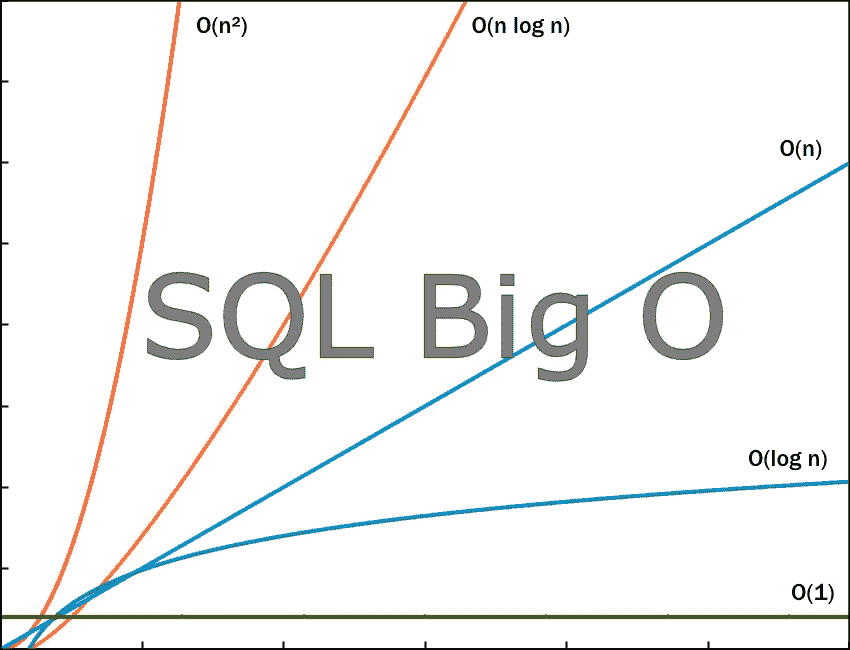
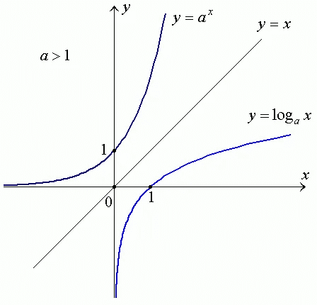

# 估算 Java 和 SQL 查询的时间复杂度。

> 原文：<https://blog.devgenius.io/estimate-time-complexity-of-java-and-sql-query-afa13a88a981?source=collection_archive---------0----------------------->

在性能和复杂性之间艰难抉择的 Java 和 SQL 示例。

大 O 符号着眼于算法性能的上限来定义其最坏情况下的行为。它着眼于算法的渐近行为，并描述了由 n 表示的输入的大小。

我喜欢使用 T-SQL，所以我结合了不同的时间复杂度。

当然，我们可以使用 SQL 表的索引来提高速度。

聚集索引在磁盘上进行物理排序，每个表只能有一个聚集索引。简单索引是按逻辑排序的，一个表可以有许多这样的索引(对于重要字段)。

这种符号的理论逻辑很简单:

首先，我们有两个 SQL 表:User 和 Post。

**常数时间复杂度 O(1)**

`SELECT TOP 1 u.Name FROM User u`

如果随着输入大小的增加，算法所花费的时间不变并且保持恒定，则该算法具有 O(1)性能的复杂度。该算法不依赖于输入的大小。

`SELECT COUNT(*) FROM User`

a)基于计数统计，它具有 O(1)

b)但是在使用主键的情况下，复杂度是 O(log(n))

c)或 O(n)复杂性，没有主键

或 O(1)的 Java 实现:

**线性时间复杂度 O(n)** — 随其输入的大小线性增长。

`SELECT u.Name FROM User u`

O(n)的 Java 示例:

`for (int i = 0; i < arr.length; i++) System.out.println( arr[i]);`

其中`arr.length` 是循环的(n)大小。

**也有很多不同的组合，基于 O(n):**

A)哈希连接的复杂度为 O(M + N)，其中 N 是哈希表，M 是查找表。

`SELECT u.Name, p.Comment, p.Date FROM User u JOIN Post p
ON u.Id = p.UserId WHERE u.Status=True and u.Name LIKE ‘Donald Trump%’`

哈希联接首先扫描或计算整个构建输入，然后在内存中构建一个哈希表(如果它符合内存授权)。

b)合并连接通常具有 O(M+N)的复杂度，但是它取决于索引的使用。

如果两个表在连接的列上都没有索引，那么首先需要对两个表进行排序，这样复杂度看起来更像 O(M log M + N log N)。它是对两个表进行排序的时间加上扫描它们的时间的总和。

`SELECT u.Name, p.Comment, p.Date FROM User u, Post p
WHERE u.Id = p.UserId and u.Status=True and p.NumAnswers >0`

如果只有一个表在连接的列上有索引，那么只有一个没有索引的表需要在合并步骤发生之前进行排序，这样复杂度看起来就像 O(M + N log N)。

c)嵌套连接的复杂度通常为 O(M * N)。当一个或两个表都很小，少于 10 条记录时，这种连接是有效的。

`SELECT u.Id, u.Name, p.Id, p.Comment FROM User u
LEFT OUTER JOIN Post p ON u.Id = p.UserId`

**基于对数和指数逻辑的下一级复杂性:**

对数语法是: **log x(z) = y.** 举例:log2(8) = 3

把这个读作“z 的对数底 x 等于 y”。看看这些变量与之前的方程相比如何。如果我们以此为基数，把它提高到结果，我们就得到想要取对数的数字。它基本上是指数的反义词。

将某物提升到指数的语法是: **x^y = z**

我们通常把它理解为“x 的 y 次方等于 z”。变量 z 是 x 乘以自身的 y 倍。

**对数时间复杂度 O(log(n)) —** 时间执行与输入大小的对数成正比。

`SELECT u.Name FROM User u WHERE u.Id = N`

`for (int i = 0; i < arr.length; i=i*2) System.out.println( arr[i]);`

**线性时间复杂度 O(n log(n)) —** 嵌套循环:运行时间与输入的 n log n 成正比增长。

这种运行时间经常出现在“分治算法”中，该算法递归地将问题分成子问题，然后在 n 个时间内将它们合并，例如:合并排序算法。

如果使用 aggregation with GROUP BY 或 sort with ORDER BY，则复杂度为 O(n log(n))。

`SELECT * FROM User u, Post p WHERE u.Id = p.UserId and u.Id = N`

要执行 GROUP BY，您必须遍历所有项目，因此这意味着 O(n)。
数据排序的时候，你已经花了 O(n log(n))的时间来排序了。

`SELECT p.Date, COUNT(p.PostId) FROM Post p
GROUP BY p.Date ORDER BY p.Date DESC`

# 更极端的是:

**多项式时间复杂度 O(n^m)** —计算取决于附加循环的数量。

**二次时间复杂度 O(n ) —** 交叉连接也称为笛卡尔连接

用于输入大小 n 的算法执行几乎两倍(n)的步骤，并且该算法所用的时间随着输入大小的增加而二次变化，该算法被认为具有 O(n)的复杂度。

`SELECT u.Name, p.Comment FROM User u, Post p WHERE u.id = p.UserId`

Java 的典型例子是经典的冒泡排序:

**O(n )** —立方时间与 O(n⁴)…的 O(n)等原理相同

**指数时间复杂度 O(m^n)** — 与输入大小的某个指数因子成比例增长。

通常，它们将是 O(m^n)，其中 n 是涉及的每个表的记录数量，m 是被连接的表的数量。

一个 *O(2^n)* 时间算法的 Java 例子:

**阶乘时间复杂度 O(n！)**
算法必须极其缓慢。运行缓慢的算法的一个最简单的例子是在旅行推销员问题的一串著名算法中找到每个排列，或者查找[伽马函数](https://en.wikipedia.org/wiki/Gamma_function)。

或者只是为了模拟，MSSQL 如何将行显示为计算阶乘 5:
1，2，6，24，120

**结论:**

SQL 语言从 70 年代开始为人所知，并在编程世界的任何地方使用。我们编写 SQL 查询，并尝试预测各种查询特性的性能。Big O 理论允许我们在将自己的 SQL 查询发布到产品中之前进行深入思考。

**参考文献:**

 [## 时间复杂度

### 在计算机科学中，时间复杂度是计算复杂度，它描述了…

en.wikipedia.org](https://en.wikipedia.org/wiki/Time_complexity)  [## 了解你的复杂性！

### 你好。这个网页涵盖了计算机科学中常用算法的空间和时间复杂性。当…

www.bigocheatsheet.com](https://www.bigocheatsheet.com/)  [## 大 O 符号和面试问题

### 大 O 符号面试问题为顶级面试问题提供了扩展的大 O 符号。什么是大 O…

www.lavivienpost.com](https://www.lavivienpost.com/big-o-notation-interview-questions/)