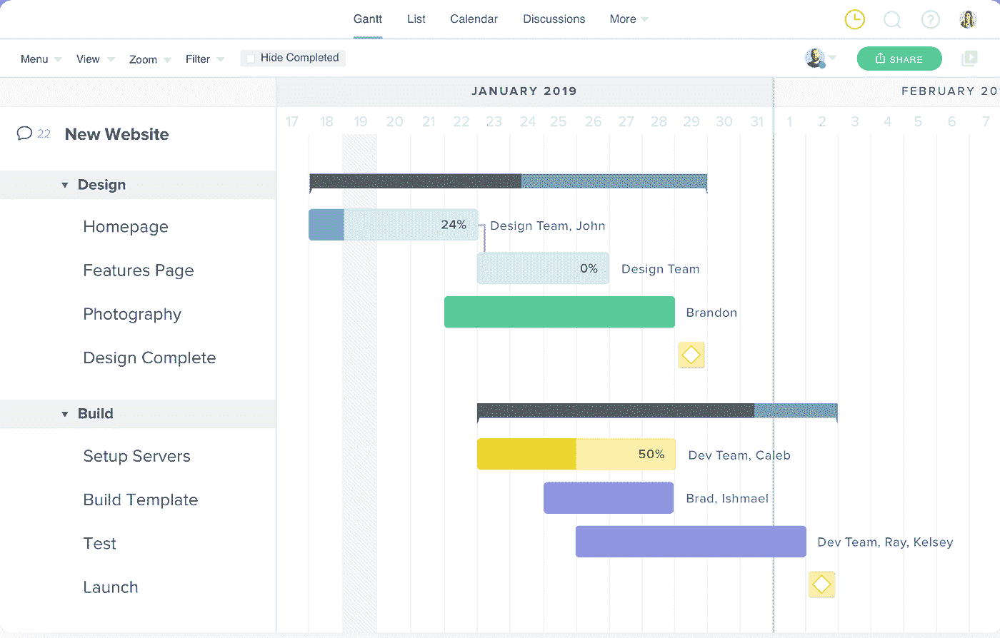

# 估计工程时间

> 原文：<https://blog.devgenius.io/estimating-engineering-time-7e8622db8bf?source=collection_archive---------21----------------------->

尼古拉斯·托马斯在 [Unsplash](https://unsplash.com?utm_source=medium&utm_medium=referral) 上拍摄的照片

在技术主管的所有职责中，提供准确的工程时间估计无疑排在前三位。从表面上看，给定一个设计模型或架构草案，获得一个粗略的估计听起来很容易。然而，当涉及到细节时，事情就变得困难多了。在这篇文章中，我将分享 4 个步骤来提供一个准确的、可跟踪的、最新的工程时间表。

# 定义里程碑

> “需要多长时间才能建成？”

如果你是工程师，这一点你不会陌生。在大多数情况下，工程师可能会当场思考并给出一个大概的数字。

但实际上，这并不是一个正确的问题，因为“构建”是一个非常模糊的定义。

它可能是介于“勉强运行”和“公共发布就绪”之间的任何东西。对于任何发布软件产品/功能的人来说，他们知道这种差距可以用几个月甚至几个季度来衡量。

因此，与其问这个问题，不如让我们先弄清楚以下里程碑的定义:

1.  **代码完成**:所有主要功能都实现了，软件能够产生设计的结果，但可能包含很多 bug 和问题
2.  **内部测试就绪**:“Alpha”版本，这意味着主工作流中没有重大错误，所有日志记录和仪表板都已就位
3.  **公测就绪**:“Beta”版本，所有已知问题均已修复。准备向更高流量的公众用户开放。
4.  **公开发布**:准备发货

在明确了上述里程碑需要完成的工作之后，技术主管可以将工作分解成更小的项目。然后加在一起进行时间估计。

# 想象进展

通常，一个项目会有多名工程师并行处理不同的堆栈。如何处理依赖关系？

嗯，最好的方法是使用“甘特图”:一种条形图，通过显示活动和当前状态之间的依赖关系来说明项目进度。

线条图

就像上面提到的截图一样，有了甘特图，任何人都可以很容易地找到当前的状态，它的依赖关系和所有的工作项目。

现在制作这样的图表很容易，网上有很多“甘特图制作工具”。或者如果你比较守旧，Excel 或者 Google Sheets 也行。

# 保留一些缓冲

*设定一个过于乐观的时间表可能会给团队带来很大的负担。*

相反，保留至少 20%的缓冲时间至关重要，这意味着如果代码完成的计算结果是 1 名工程师 10 周。通常建议申请 12 周，为所有潜在问题留出 2 周的缓冲时间，包括:

1.  业务逻辑更新
2.  发现的设计问题
3.  意想不到的技术困难
4.  被相关服务阻止
5.  服用 PTO 的队友
6.  外星人来访等..

不要着急，在构建高质量的产品上多花一点时间总是比运送一个有问题的产品，然后再修复要重要得多。

# 不断更新

最后一步是“沟通”。在实施阶段，任何事情都可能发生。作为一名专业的 TL，职责之一就是让所有人了解项目的当前状态。

为了减少沟通的摩擦:

1.  只保留一个“真理之源”。它可以是每周的项目帖子，或者是“只读”的项目状态图表链接。
2.  状态应该简短明了:“进行中”、“延迟”或“阻止”。

当一些意想不到的事情发生时，或者时间表被调整时，TL 应该利用现有的渠道让所有的利益相关者都知道。因此他们可以相应地调整他们的时间表。