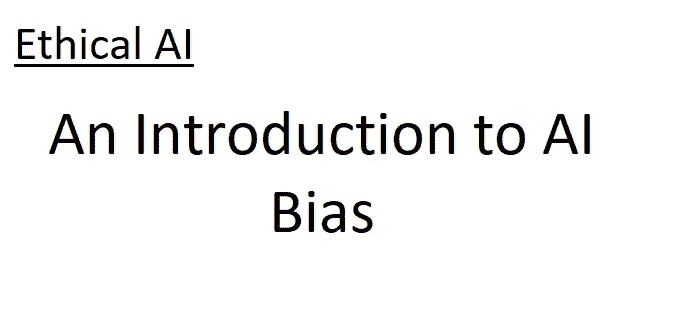

# 伦理人工智能:偏见导论

> 原文：<https://blog.devgenius.io/ethical-ai-an-introduction-to-bias-dd580fd3f79f?source=collection_archive---------17----------------------->

## 关于人工智能系统偏见的辩论是伦理人工智能的核心。在这篇文章中，我将解释人工智能偏见的关键方面，以及理解它的重要性。

# 介绍

这是我打算写的关于伦理人工智能的几篇文章中的第一篇。我将关注人工智能中的偏见和可解释性，以及这两个概念如何导致伦理问题和解决方案。在这篇文章中，我将介绍什么是人工智能偏见，以及它为什么重要。

关键要点是:

*   人工智能偏差是一个系统误差，而不是人工智能造成的误差
*   人工智能偏见最常见的来源是其创造者提供的数据
*   人工智能的偏见并不比人类少(它们甚至可能更有偏见)，而且它们肯定不客观

# 人工智能到底是什么？

人工智能(AI)是一个用来描述任何能够采取看似智能的行动的计算机系统的术语。人工智能有很多形式，其中大多数都属于更具体的术语“机器学习”，这就是我在这里谈论的那种人工智能。

那么机器是如何学习的呢？如果给定一些数据和要做的工作，人工智能可以使用这些数据来完成工作，那么机器就可以学习。例如，使用一年中的温度和日期(数据)来预测一个城市(目标)的冰淇淋销量将是机器学习/人工智能的一种(非常简单)形式。

大多数最好的现代人工智能都是“神经网络”。这些神经网络是由人脑松散地激发出来的；它们的工作原理相对复杂，但是对于本讨论，您应该了解两个主要属性:

*   神经网络是“黑匣子”——很难直观地理解它们为什么做出或不做出某些决定。
*   神经网络(像所有机器学习一样)必须从数据中学习。他们的表现取决于给他们的数据。

# 那么什么是人工智能偏见呢？

首先，让我们考虑一个例子。假设我想制造一个 AI 来辨别图片中的某个动物是狗还是狼。理想情况下，如果动物实际上是狼，人工智能应该说“狼”，并且只有在那时。同样，只有当动物实际上是狗时，它才应该说“狗”。

在这个例子中，偏见是什么意思？

首先，我需要澄清几个术语。机器学习涉及许多不同类型的“偏差”;有些是有意的，有用的，但有些不是有意的，有潜在的危害。

> 出于本文的目的，我将把“人工智能偏差”定义为人工智能犯下的任何系统性错误。

我们再来看看狗/狼 AI。人工智能不会是完美的(没有人工智能是完美的)，所以它有时会把狗叫做狼，反之亦然。那是错误。然而。*单凭这一点是不会有失偏颇的。*

偏见是系统性的。例如，想象一下，人工智能只能看到雪地里狼的照片，而看不到雪地里的狗。狗和狼看起来非常相似，所以人工智能很可能会根据雪的存在与否(这是非常明显的)来决定是将图像称为“狗”还是“狼”。事实上，这种情况确实发生过[1]。

在这种情况下，人工智能在系统层面上做出了错误的决定——它的错误不是随机的，而是由于人工智能的学习趋势，而不是我们人类所说的“真正”趋势。

那是偏见。

# 所以那个 AI 失败了不是吗？

回顾狗/狼人工智能，很容易认为人工智能没有完成它的工作，它“应该”知道看照片中的动物，而不是背景。然而，这是一种错误的看待方式。

> 有偏见的人工智能不仅在做他们的工作，而且在某些情况下做得非常好。

大多数人工智能(到目前为止)通常不理解动物的概念，或雪的概念，或对一项任务“重要”的概念。它没有上下文。在上面的例子中，人工智能只被给了两个数据集，并被告知一个被称为“狗”，另一个被称为“狼”。然后，他们被要求找出两个数据集之间最显著的差异。

这种差异是雪的存在对人工智能没有任何意义。它完全按照要求做了。

这就是为什么偏见是危险的。偏见是指人工智能完全按照要求去做，而人类没有意识到这不是他们的本意。这有点像精灵的愿望——如果创造者不小心，人工智能可能不会了解他们的意图。

# 偏见从何而来？

偏见可能来自许多方面，但大多数都与所涉及的数据有关。这可能是数据中意想不到的模式(如狼和雪的同时出现)，但也不一定如此。

数据不足也是一个主要问题。假设人工智能必须给一幅图像贴上狗或猫的标签。如果有 999 张狗的图像，而只有 1 张猫的图像，AI 可以在不学习任何东西的情况下，通过总是说“狗”来获得 99%以上的准确率。由于人工智能只关注它做得有多好(按照某种标准)，它可能会认为这是最好的选择。

“中毒”数据也是人工智能的一个大问题。它指的是由攻击者提供给人工智能以引入偏见的数据。比如微软在互联网上发布了一个名为“Tay”的公共 bot[1]。在不到一天的时间里，原本友好的 AI 不得不被拿下，因为它发布了各种各样的新纳粹推文(以及许多其他极具攻击性的评论)。为什么呢？微软让在线社区用它来训练它[1]，一些 Twitter 用户负责剩下的工作。(我不明白为什么微软认为这是个好主意。)

偏见还有很多其他方式可以在更技术性的层面上进入人工智能。决定包括什么数据，从谁或什么地方获取数据，甚至数据来自什么时候，都将影响 AI [1]。如果这些数据中存在系统性偏差，人工智能将会反映这种偏差。

# 那么解决这个问题难道不应该很简单吗？

很遗憾没有。人工智能通常需要大量的数据(数百万个样本)来有效地学习。遇到一个现代的、没有历史偏见的、没有非预期相关性的大型数据集是极其困难的。

然而，有许多方法可以减少偏差。这包括积极主动地分析数据中的意外模式，并选择适当的数据源。但这也意味着积极分析人工智能的输出，并检查其是否存在意外偏差。

由于大多数人工智能都是黑箱，很难判断一个决策是来自偏见，还是由于数据中有意义的趋势。人工智能可解释性的领域在这里很有帮助，因为它让你问人工智能数据的哪些部分导致它做出某个结论。虽然这个领域仍然很小，但随着人们意识到解释人工智能决策的重要性，它正在迅速发展。

# 结论

人们常说，如果孩子表现不好，那是父母的过错——这是真的。当一个人工智能表现很差(或有偏见)，那是创造者的错。人工智能只能根据给它的数据采取行动——如果给它有偏见的数据，它将学会复制这种偏见。

AI 绝不是客观的。它没有摆脱人类的任何偏见或谬误。这种偏见可以小心翼翼地减轻，学会这样做是人工智能创造的关键部分。

作为最后一点，我想提一下，一些人工智能偏见的情况可能远比这里列出的更危险。无法识别一只狗是无害的。但如果人工智能无法在系统层面上检测到癌症，这可能会影响成千上万的患者。

这个帖子到此为止；我会休息一段时间直到新年。祝大家节日快乐！

关键要点是:

*   人工智能偏差是一个系统误差，而不是人工智能造成的任何误差
*   人工智能偏见最常见的来源是其创造者提供的数据
*   人工智能的偏见并不比人类少(它们甚至可能更有偏见)，而且它们肯定不客观

# 参考

1.  罗塞利，德鲁&马修斯，吉纳&塔拉加拉，妮莎。(2019).人工智能中的管理偏差。WWW ' 19:2019 年万维网大会的配套会议录。539–544.10.1145/3308560.3317590.