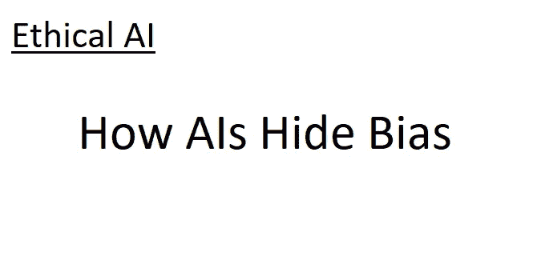

# 伦理人工智能 II:人工智能如何隐藏偏见

> 原文：<https://blog.devgenius.io/ethical-ai-ii-how-ais-hide-bias-d437cbf00958?source=collection_archive---------17----------------------->

## 试图纠正人工智能偏差对于负责任的人工智能使用至关重要。但这种修正有时可能只是隐藏，而不是消除偏见。以下是方法。

# 介绍

这是我写的关于人工智能偏见的系列博客中的第二篇。如果你没有读过第一本书，我建议你浏览一下简介[这里的](/ethical-ai-an-introduction-to-bias-dd580fd3f79f)以获得要点。

本文将涵盖人工智能偏见的不同方面:人工智能“隐藏的偏见”，它可以逃避一些更明显的试图从人工智能中消除偏见的尝试。与我以前的帖子不同，我计划带你浏览一个粗略的人工智能设计，向你展示偏见可能蔓延的最关键领域。

这篇文章的要点是:

*   人工智能创造的每一步——从选择它将做的工作到给它数据——都可能引入偏见。其中许多是不容易预见的。
*   减轻人工智能偏见的行为也隐藏了剩余的偏见，使其更难消除。
*   人工智能偏见不能完全消除，但可以通过适当的护理来减轻。

# 知道正确的问题

假设 Example College 想要使用人工智能来帮助筛选申请人，作为招生过程的一部分*。学校决定选择最有机会在大学成功的学生——这是一个合理的目标。他们告诉身边的数据科学家去做。

数据科学家必须回答的第一个问题是“在大学里成功意味着什么？”这是成绩最高的吗？毕业后安置收入最高的工作？毕业 5 年后收入最高？

> 这里有一个重要的部分:根据这些标准中的一个最“成功”的人可能不是根据其他标准成功的人。因此，这是偏见可能蔓延的第一个地方。

简单地选择一个衡量成功的标准将会使人工智能偏向那些最符合这个标准的人。假设他们将使用 5 年后最高收入的指标，假设这反映了学生毕业后的职业发展情况。

问题来了:根据《的确，爱尔兰教师的平均工资是€16.65 英镑/小时[1]。对于一个计算机工程师来说，这是€39.48 [2]。5 年后，这种差异一定会被看到。因此，如果使用成功的衡量标准，人工智能将倾向于更喜欢计算机工程专业的学生，而不是教育专业的学生。

用最高分来衡量也可能有类似的偏差:在大学期间长时间工作的学生可能分数较低，因为他们学习的时间较少。但是如果他们能够利用他们在大学的关系在毕业后找到一份好工作，他们不是成功了吗？

用 Roselli 等人的术语来说，这就是“替代数据”问题[3]。当一些事情很难衡量时(比如在大学的成功)，代理人经常被用来代表它。但是代理人的选择往往从一开始就对人工智能有偏见。

# 了解正确的数据

让我们继续大学招生的例子。一旦选择了成功的衡量标准(我们不需要担心讨论哪个)，就该开始收集数据了！

幸运的是，Example College 拥有所有往届学生的数据。设计师们意识到，在人工智能中包括种族和性别显然是不允许的——让人工智能访问这些特征实际上是要求它基于这些特征进行歧视。毕竟，人工智能不理解种族或性别的概念——对它来说，它们只是不同的类别。如果一个人与成功有很好的关联，他会利用这一点。

所以人工智能的设计者们简单地去掉了这些特征。人工智能现在不可能基于种族或性别进行歧视，对吗？

> 不对。正如替代数据可以用来替代人工智能的目标指标(在大学的成功)，它也可以替代任何其他特征:包括种族或性别。当它这样做时，它有效地隐藏了偏见的存在。

但是怎么做呢？Roselli 等人指出了一些显而易见的问题:邮政编码(在美国的背景下)通常可以代表种族，因为许多社区主要由同一种族的人组成[3]。购买史可以成为医疗状况的代理[3]。诸如此类。

例如大学，也许课外活动可以代替这些——也许男人和女人更喜欢某些运动。这使得人工智能能够在其决策中隐含地使用性别——所有这些对设计者来说都是隐藏的。

但是它为什么要这样做呢？我们假设，比如 5 年后的收入作为大学成功的衡量标准(如上)。这立刻带来了另一个偏见来源:在爱尔兰，女性的收入中位数比男性低 8%左右。

如果收入被用作衡量标准，那么人工智能将有很强的理由使用代理来识别性别:这样做会泄露预测学生毕业后的收入；即“成功”。它可以做到这一切，而无需将性别(或任何其他此类信息)输入模型。

# 那么这意味着什么呢？

创造一个人工智能真的很容易做到，但是很难做对。设计师有责任主动识别偏差来源并消除它们。一旦人工智能被创建，就必须对其进行无意识的偏差测试，并迭代地重新创建，直到偏差被尽可能地减轻。

但是偏见只能被减轻。你永远不能确定没有。

为什么？因为人工智能倾向于使用替代数据和寻找设计者不希望的趋势，这意味着它总是能够找到偏差。而且，在几乎所有的情况下，这种偏见都会隐藏在替代目标和替代数据的背后。

偏见只是智力的一部分；人类也没有摆脱它。但它是可以理解、衡量和减轻的。也许最重要的是，它可以(也应该)发表。在人工智能中发现的任何偏见——在创造期间或之后——都应该与人工智能一起发布。就像出版人工智能对环境的影响一样，出版偏见是给予它适当关注的第一步，也是激励更多研究来最小化它的第一步。

# 最后一点

我想起了与道格拉斯·亚当斯的《银河系漫游指南》的某种类比。人工智能“深度思考”被问及“生命、宇宙和一切”的含义是什么。对此，它给出了答案 42。

当然，它的创造者会问它这是什么意思——生命的意义怎么会是一个数字呢？计算机回答道，很合理:*你没有理解这个问题。*

这就是艾。人工智能错误和人工智能偏差将一直存在。但是，如果创造人工智能的人没有考虑到它们并对它们做出解释，情况将会糟糕得多。最后，你认识的魔鬼总比你不认识的好。

无论如何，这篇文章的要点是:

*   人工智能创造的每一步——从选择它将做的工作到给它数据——都可能引入偏见。其中许多是不容易预见的。
*   减轻人工智能偏见的行为也隐藏了剩余的偏见，使其更难消除。
*   人工智能偏见不能完全消除，但可以通过适当的护理来减轻。

# 笔记

*   *根据欧盟法律，仅基于人工智能/自动化系统做出此类决定是被禁止的。

# 参考

1.  【indeed.com 爱尔兰教师工资
2.  [电脑工程师工资在爱尔兰(indeed.com)](https://ie.indeed.com/career/computer-engineer/salaries)
3.  罗塞利，德鲁&马修斯，吉纳&塔拉加拉，妮莎。(2019).人工智能中的管理偏差。WWW ' 19:2019 年万维网大会的配套会议录。539–544.10.1145/3308560.3317590.