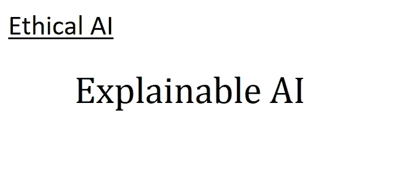

# 伦理人工智能 III:可解释的人工智能

> 原文：<https://blog.devgenius.io/ethical-ai-iii-explainable-ai-54b1c08603f?source=collection_archive---------8----------------------->

## 可解释的人工智能(XAI)提供了几种方法来检测人工智能的偏见。然而，它并不完美，如果不小心使用，可能会引入不同的偏差。

# 介绍

这是我第三篇关于伦理人工智能的博客。在我以前的文章中，我已经研究了人工智能的偏见，在这篇文章中，我将看看一种被建议用来对抗这种偏见的方法:可解释的人工智能，有时被称为 XAI。

关键要点是:

*   对于人工智能来说，可解释性并没有明确的定义，但是在这种情况下，我认为它是解释为什么人工智能做出它所做的决定的能力。
*   这种形式的可解释性可以通过多种方式实现。这些包括找到人工智能关注的问题，通过类比进行解释，或者创建另一个“解释者人工智能”来解释最初的人工智能。
*   解释可以通过指出人工智能在如何做出决策方面的缺陷来帮助识别人工智能中的偏见。
*   如果对人工智能系统的解释做得不好，它们可能会产生误导。

# 可解释是什么意思？

令人惊讶的是，这是一个考虑不周的问题。Lipton [1]指出，即使在人工智能研究人员中也没有一致的定义，甚至对可解释人工智能的目标也没有一致的看法。

例如，一些团体将可解释性定义为终端用户理解人工智能程度的度量，并将其目标视为促进人类与计算机的交互[2]。其他人将可解释性视为一种工具，主要用于研究人员理解他们的人工智能为什么会做出这样的决定，目的是帮助他们改善其性能[3]。

为了这篇文章的目的，我将看看利普顿所说的“事后可解释性”——给定人工智能做出的决定，解释人工智能为什么做出该决定的能力。这可以有几种不同的形式，我将在下面描述。

# 人工智能使用了哪些数据？

解释人工智能为什么做出决定的第一种方式相当简单:只要问它在做出决定时最“关注”的是数据的哪一部分。

在直觉层面上，这试图复制人类如何回答关于我们做什么的许多问题。设想一位家长带着孩子过马路。父母可能会在走到街上之前突然停下来，促使孩子问“为什么我们现在不能过马路？”家长可能会回答“路上有辆公共汽车，我们必须等它过去。”从这一点来看，很明显，当父母决定停下来的时候，他们正在看着那辆车，并且因为它而做出那个决定。

对于人工智能来说，这在计算机视觉的背景下可以得到最好的理解，计算机视觉试图让人工智能理解图像。这可能是任何事情，从社交媒体帖子上的面部识别到检测无人驾驶汽车中道路上的行人。

这些方法所做的是，它们给 AI 一个图像，并要求它描述它(例如，决定谁的脸存在，或者决定道路中是否有行人)。在内部，人工智能使用图像中颜色数据的等式来做出这个决定。隔离图像中对方程影响最大的部分可以用来表示 AI 在做出决定时“正在看”或“关注”的图像区域[1]。

# 它认为哪些数据最相似？

解释人工智能决策的另一种方式是问人工智能，它认为还有哪些例子与它刚刚做出决策的例子最相似。这些其他的例子可以，不严格地说，被看作是人工智能在当前案例中做出同样决定的“动机”。

一个很好的直觉是人类倾向于用类比来解释事物。如果给一个人一片叶子，并问他们如何知道这是一片橡树叶，他们可能会回答“它看起来像我见过的所有其他橡树叶”。他们所做的是根据他们所做的其他决定(并且被认为是正确的)来解释他们的决定。

作为人工智能的一个例子，想象一个用于医疗保健的人工智能来检测皮肤癌。可以给 AI 一部分皮肤的图像，并询问那里是否存在癌症。如果人工智能说“是”，那么它可以被要求显示两到三个它以前见过的最相似的例子；这本质上是一种允许人工智能说“我知道这是癌症，因为它看起来像其他也显示癌症的图像。”

值得注意的是，这并不意味着人工智能使用了任何特定的方法。这是一种允许人工智能告诉你它认为最相似的东西的方式，不管这种相似性在创建人工智能时是否被使用过。然而，在任何情况下，知道人工智能认为最相似的是什么，对于理解它如何做出决定是有用的。

# 另一个 AI 认为它在做什么？

是的，这是一些试图解释人工智能的方法。基本的想法是让人工智能用简单的语言文本来解释，就像它在做决定时“写下”它的推理一样。

但是这里有一个警告:这不是人工智能做决定的方式。人类可能用语言思考，但人工智能目前几乎总是用数学关系来思考。如果你想得到简单明了的解释，一个不同的人工智能必须提供这种解释。

因此，虽然这可能直观地试图模仿人类如何解释我们如何解决问题或编写指导手册，但它并不完美。

正如 Lipton [1]所概述的，这种工作方式的基本思想是创建一个人工智能，它可以查看另一个人工智能使用的数学和它做出的决策。“解释者人工智能”然后试图找到模式，并学习用普通语言文本来表达它们。如果“解释者人工智能”确实找到了有意义和可靠的模式，这可能有助于深入了解其他人工智能如何做出决定。

# 解释作为识别偏见的工具

关于人工智能为什么做出决定的解释可以作为人工智能偏见的一个检查点:它做出决定的原因有意义吗？人工智能是专注于我们知道对任务至关重要的数据部分，还是已经找到了机会相关性？人工智能是否依赖于可以作为属性代理的数据，这些属性通常会受到种族或性别等偏见的影响？

有了可解释的人工智能(XAI)，有一些工具可以更直接地解决这些问题。

例如，考虑我之前描述的关于人工智能被训练区分狼和狗的例子[4，5]。几乎所有的狼都在雪地里，大多数狗都在室内。因此，人工智能学会了区分室内环境中的雪而不是狗和狼[4，5]。预计 XAI 可以证明人工智能不是在看动物，而是在看背景；事实上，最初的作者就是这么做来证明他们的 XAI 方法的[5]。

充分利用 XAI 可以极大地帮助识别偏见——这是消除偏见的第一步。结合其他层面(如数据层面)的偏差主动检查，这可能是一个非常有用的工具。然而，它并不完美。

# 作为偏见来源的解释

我应该重复一遍，我关注的是“事后”可解释性，遵循利普顿的术语[1]。这是研究中的一个普遍趋势，因为它有能力回答许多研究者在考虑可解释性时认为重要的问题。

然而，这也是一个可以有一些问题的问题；利普顿指出，过度关注事后解释可能会无意中导致人工智能优化，对自己的行为给出非常合理但具有误导性的解释[1]。正如我以前说过的，人工智能只知道如何优化给定的目标。如果解释的合理性是一个目标，但它们的有效性不是，那么人工智能将被期望给出合理但潜在(尽管不一定)误导的解释。

这意味着，糟糕的解释可能会有偏差——就像任何其他人工智能/计算系统一样。但这一次，偏见不仅影响了最初的 AI，还影响了人类如何看待正在被解释的 AI。像其他任何事情一样，在设计解释时必须小心谨慎，以确保它们是可靠的。

最重要的是，虽然我上面描述的方法很有用，但是在实践中使用时它们都有警告。虽然解释可以帮助消除偏见，但解释本身并不完美:因此，即使在使用可解释的人工智能技术后，在人工智能中发现无偏见并不意味着偏见不存在。假设 XAI 是解决所有人工智能偏差的灵丹妙药，可能会导致原本会被忽略的偏差。

# 最后一点

这里还有很多我没有谈到的。可解释性还有其他完全不同的方面(例如解释 AI 的算法或内部元素[1]，或者构建更直接可解释的 AI，因为它们基于形式逻辑进行推理和预测[3])。虽然这解释了理解可解释性和偏见的一些重要主题，但它并不全面。如果想了解更多，推荐利普顿[1]。

目前，这篇文章的要点是:

*   对于人工智能来说，可解释性并没有明确的定义，但是在这种情况下，我认为它是解释为什么人工智能做出它所做的决定的能力。
*   这种形式的可解释性可以通过多种方式实现。这些包括找到人工智能关注的问题，通过类比进行解释，或者创建另一个“解释者人工智能”来解释最初的人工智能。
*   解释可以通过指出人工智能在如何做出决策方面的缺陷来帮助识别人工智能中的偏见。
*   如果对人工智能系统的解释做得不好，它们可能会产生误导。

# 参考

1.  利普顿，Z. C. (2018)。模型可解释性的神话。Commun。ACM，61(10)，36–43。doi:10.1145/3233231
2.  霍夫曼，罗伯特&米勒，谢恩&克莱因，加里&利特曼，乔丹。(2018).可解释人工智能的度量:挑战与展望。
3.  比安奇、费德里科&罗西耶洛、加埃塔诺&科斯塔贝洛、卢卡&帕尔莫纳里、马特奥&米内尔维尼、帕斯夸莱。(2020).知识图嵌入和可解释人工智能。10.3233/SSW200011。
4.  罗塞利，德鲁&马修斯，吉纳&塔拉加拉，妮莎。(2019).人工智能中的管理偏差。WWW ' 19:2019 年万维网大会的配套会议录。539–544.10.1145/3308560.3317590.
5.  里贝罗，M. T .，辛格，s .，& Guestrin，C. (2016)。“我为什么要相信你？”:解释任何分类器的预测。第 22 届 ACM SIGKDD 知识发现和数据挖掘国际会议论文集，1135–1144。在美国加州旧金山举行。土井指数:10.1145/293486363637