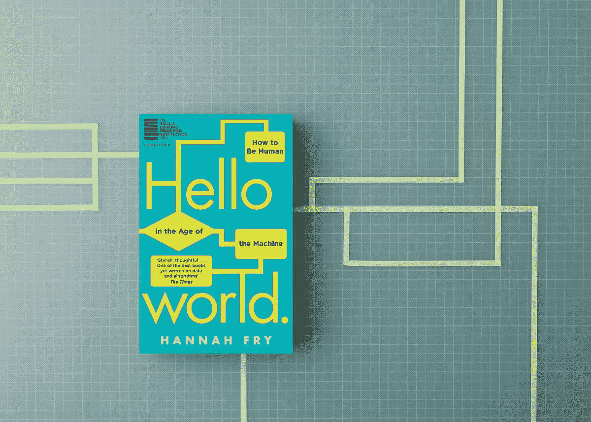
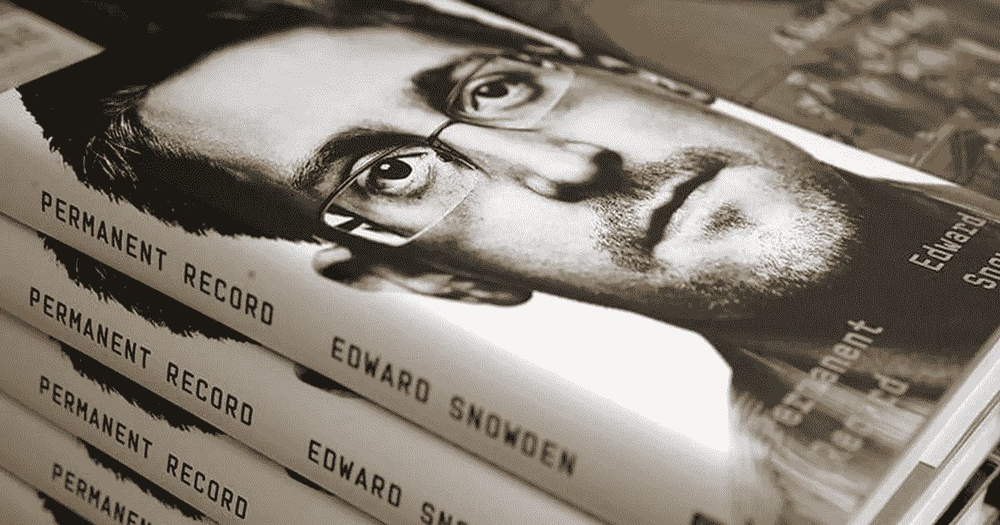
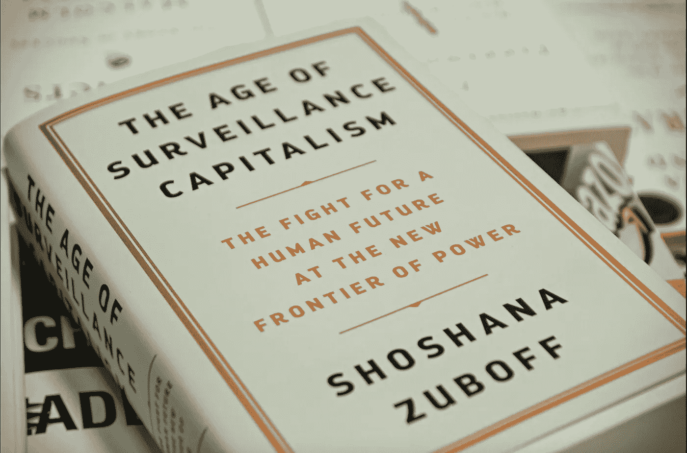
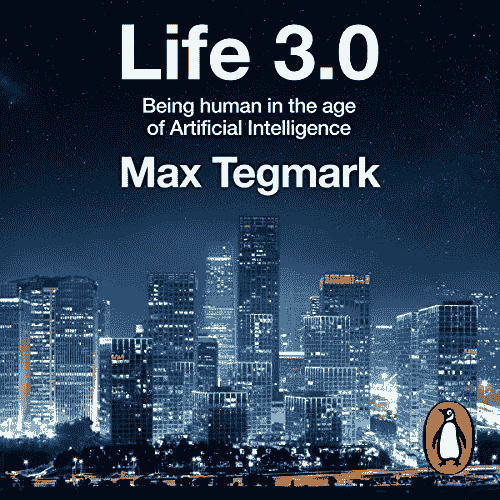
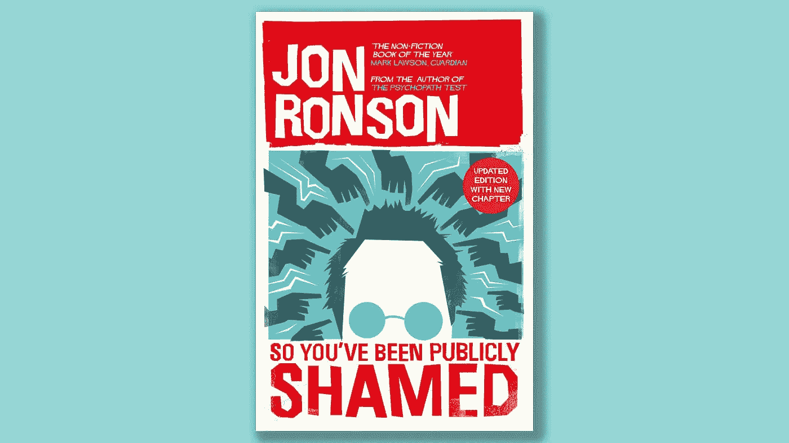

# 伦理计算:让你开始思考的 6 本书

> 原文：<https://blog.devgenius.io/ethical-computing-6-books-to-start-you-thinking-6d6bc0b5249a?source=collection_archive---------7----------------------->

## 6 本书的推荐涉及计算和软件工程中的对错主题。

我在攻读学位期间学到的软件和硬件都在监狱里——判决推荐算法、自导导弹和无人驾驶汽车，但很少有人花时间讨论伦理。而是通过一些课外阅读来探索我所在领域的对与错。以下是我喜欢的一些书的选集:

## 汉娜·弗莱的《你好，世界》

《Hello World》是对现实世界中算法、人工智能和机器学习的简单介绍。Fry 向我们展示了这些强大的工具是如何被用来为善和为恶的，它们是如何取代人类的，以及至关重要的是，在哪些情况下人类的洞察力仍然是关键。在我看来，弗莱在乐观主义者和技术怀疑论者之间取得了恰当的平衡，他简单地解释了技术如何有能力让生活变得更好，但只有在适当的指导、监管和人类支持下。

**最适合:**年轻的程序员或科技领域的初学者

**购买自:**[Bookshop.org](https://uk.bookshop.org/books/hello-world-how-to-be-human-in-the-age-of-the-machine/9781784163068)，[亚马逊](https://www.amazon.co.uk/Hello-World-How-Human-Machine/dp/1784163066/ref=sr_1_1?crid=BF9V77UBWAFA&dchild=1&keywords=hello+world+hannah+fry&qid=1617128746&sprefix=hello+world+hanna%2Caps%2C142&sr=8-1)

## 安娜·维纳的《恐怖谷》

《恐怖谷》详细描述了一个女人往返于硅谷的旅程。安娜·维纳(Anna Wiener)在她的回忆录中探讨了软件以及同样重要的软件开发者的伦理问题。维纳谈到了拥有太多数据的开发人员窥视他们客户的生活，被性骚扰丑闻困扰的公司，以及在一个痴迷于益智的科技兄弟的世界中约会。

**最适合:**想更多了解女性在科技领域的经历的男性

**购买来源:**[Bookshop.org](https://uk.bookshop.org/books/uncanny-valley-seduction-and-disillusionment-in-san-francisco-s-startup-scene/9780008296865)，[亚马逊](https://www.amazon.co.uk/Uncanny-Valley-Seduction-Disillusionment-Franciscos/dp/0008296863/ref=sr_1_1?crid=26WQ9S131S8JS&dchild=1&keywords=uncanny+valley&qid=1617128802&sprefix=uncanny+valle%2Caps%2C148&sr=8-1)

## 爱德华·斯诺登的永久记录

2013 年，美国国家安全局承包商爱德华·斯诺登向记者泄露了机密文件。这些文件概述了秘密和非法的大规模监视平民正在进行的国家安全局，美国政府的其他分支机构，以及盟国情报机构在国外。斯诺登现在流亡俄罗斯，被视为叛徒和英雄。泄露的文件引起了对美国政府的广泛批评，并引发了一场关于个人隐私权的讨论，这场讨论一直持续到今天。在他的自传中，斯诺登描述了他发现的虐待行为，以及他在决定泄露文件之前经历的道德反复。

**最适合:**锡纸帽佩戴者

**购买自:**[Bookshop.org](https://uk.bookshop.org/books/permanent-record-9781529035698/9781529035698)，[亚马逊](https://www.amazon.co.uk/Permanent-Record-Edward-Snowden/dp/1529035694/ref=sr_1_1?dchild=1&keywords=permanent+record&qid=1617128868&sr=8-1)

## 监控资本主义的时代

Shoshana Zuboff 创造了这个术语来定义从我们的数据中提取价值的产品和服务的当前时代。Zuboff 解释了你的数据是如何从你身上提取的，谁在做，它是如何使用的，以及为什么你应该关心。Zuboff 详细介绍了你的行为是如何被反对的，以使你买东西，为人们投票，并以一种更可预测的模式生活。除非你在过去的 20 年里一直是一个生活在岩石下的勒德分子，否则你是这个系统中不知情的参与者，所以至少你应该知道它的存在及其运作方式。

**最适合:**如果你喜欢长篇大论

**购买来源:**[Bookshop.org](https://uk.bookshop.org/books/the-age-of-surveillance-capitalism-the-fight-for-a-human-future-at-the-new-frontier-of-power-barack-obama-s-books-of-2019/9781781256855)，[亚马逊](https://www.amazon.co.uk/Age-Surveillance-Capitalism-Future-Frontier/dp/1781256853/ref=sr_1_1?crid=1G7MA8CZN7HIA&dchild=1&keywords=age+of+surveillance+capitalism&qid=1617128922&sprefix=age+of+sur%2Caps%2C146&sr=8-1)

## 马克斯·泰格马克的《生活 3.0》

《生活 3.0》探讨了高级人工智能将如何改变世界的问题。如果机器在许多任务上比人类做得更好，我们还需要普遍的基本收入吗？人们怎么还能感觉到生活的目标呢？此外，在一个人工智能足够聪明可以自我完善的世界里，人类会被排除在这个等式之外吗？Tegmark 强调了我们现在可以采取的步骤，以便人工智能帮助我们实现我们想要的未来。

**最佳适合:**科幻迷

**购买自:**【Bookshop.org】T2，[亚马逊](https://www.amazon.co.uk/Life-3-0-Being-Artificial-Intelligence/dp/0141981806/ref=sr_1_1?dchild=1&keywords=life+3.-&qid=1617128992&sr=8-1)

## 所以你被乔恩·容森公开羞辱了

这也许是一个奇怪的附加条件，但请和我在一起。在《所以你被公开羞辱》中，龙森讲述了几个人物的经历，他们受到了公众的极大厌恶、嘲笑或愤怒。我认为这是相关的，因为随着这本书的继续，这种羞辱越来越多地在网上出现。Ronson 谈到了依靠注意力发展的平台在不断升级的愤怒中所起的作用，以及为在线骚扰者提供匿名只会使他们更加恶意。龙森还讨论了如何通过互联网的长期记忆，一个错误可以跟随人们的余生。《所以你被公开羞辱》强调了技术对公共话语的影响，并讨论了“被遗忘”的数字权利的价值。

**最适合:**一个有问题收藏的 Twitter Stan

**购买来源:**[Bookshop.org](https://uk.bookshop.org/books/so-you-ve-been-publicly-shamed/9780330492294)，[亚马逊](https://www.amazon.co.uk/So-Youve-Been-Publicly-Shamed-ebook/dp/B0196HJ6OS/ref=sr_1_4?dchild=1&keywords=jon+ronson&qid=1617129044&sr=8-4)