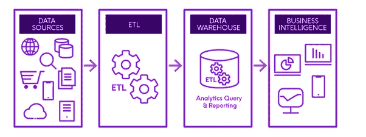
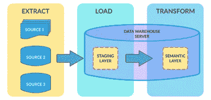

# ETL 与 ELT

> 原文：<https://blog.devgenius.io/etl-vs-elt-d00da0fa101b?source=collection_archive---------2----------------------->

随着技术的发展，技术实施的时代发生了变化。数据是整个行业所有实施类型的中心。谈论 RDBMs/数据库系统用于存储和处理行业“数据”的旧时代。考虑到处理海量数据、存储和分析的存储和计算需求日益增长，数据仓库实施开始取代一些数据库系统。在同一个应用程序、企业设置中实现数据库和数据仓库系统近年来很常见。数据库系统用于 OLTP 实现和特性支持。数据仓库系统用于 OLAP 实现。

OLTP —满足系统中实时事务处理的需要

OLAP —迎合指令性和预测性分析。最初，这被广泛用于数据仓库系统中历史数据的说明性分析。最近，这也被用于在数据仓库系统上使用机器学习模型来运行预测分析。

要设置 DB 或 DW 系统，需要将异构源、目标系统集成在一起。数据提取/接收、转换、存储@ DB/DW、基于 DB/DW 的分析/BI 是“数据”实施中广泛使用的阶段。

ETL 是 OLTP 和 OLAP 实现中常用的实现。这是一个单一的平台/框架，用于集成异构系统作为源/目标，并在运行时处理数据，然后在 DB/DW 层存储/保存。

***什么是 ETL？***

ETL 是 Extract，Transform，Load 的缩写。市场上有几种工具可以满足组织的 ETL 需求。ETL 可以使用市场上可用的工具来实现，也可以作为框架来实现，以集成各种技术、工具和开源产品来服务于 ETL 的目的。

Informatica、Datastage、AbInitio、Pentaho 是一些广泛使用的 ETL 工具/平台，用于集成、处理、动态转换数据并加载到 DW/DB 层。

通过 ETL 实施–

**E —提取** —连接到异构数据源，从其他 DB/DW 系统、文件系统、实时系统、结构化或半结构化数据提取中读取数据。这被称为源集成。

**T —转换** —从源系统读取数据后，运行数据转换，如过滤、排序、聚合、转换、新字段派生、查找(参考数据或维度数据)、连接、合并、SCD、序列生成、组合键生成等。这些应用于数据读取和处理，以将数据传递到目标层。

**L —加载** —完成数据处理和转换后，数据被写入目标系统。可以加载到数据库、数据仓库、文件、流馈送，加载到任何其他下游应用程序。这被称为目标整合。

所有这些阶段/步骤都可以使用基于单一 GUI 的工具来实现，如 Informatica、Datastage 等。或者这些层也可以使用任何其他开源、数据库服务、Hadoop 工具等来实现。

**ETL 的利与弊—**

*优点-*

单一平台实现提取、转换和加载。可以作为企业工具在组织内部实现 ETL

在运行时处理和加载数据

在开发作业时，可以通过单一窗口/GUI 实现异构集成

利用 ETL 服务器/内存/缓存的强大功能动态处理数据

*缺点—*

重载作业需要时间来完成，因此需要长时间运行

对于大容量处理，性能可能会受到影响

许可和维护成本取决于工具、设置 ETL 工具的服务器选择(核心、cpu)

对中小型企业来说很昂贵

***什么是 ELT？***

ELT 近年来被广泛使用，取代了 ETL 实现。有了 ELT，ETL 实现的一些缺点可以被克服。这是速度最快、适应性最强的过程，可以利用 DB/DW 系统的能力比 ETL 实现更快地转换数据。目前，这种实现在数据仓库和数据湖中非常常见。

数据湖—数据湖是一个集中式存储库，允许您存储任何规模的所有结构化、半结构化和非结构化数据。数据可以按原样存储，而不必首先结构化数据，并运行不同类型的分析-从仪表板和可视化到大数据处理、实时分析和机器学习，以指导更好的决策。

Hadoop 是数据湖系统的内部实现之一。Hadoop/Bigdata 在整个行业中被广泛用于存储、处理、利用他们的“数据”来生成和获得对“数据”的洞察。

**E —提取** —可以连接异构数据源以从其他 DB/DW 系统、文件系统、实时系统、结构化或半结构化数据提取中读取数据的阶段。这被称为源集成。这也被称为从源系统获取原始数据到 DW/DB/数据湖层。这也可以作为一个接收步骤，将数据以原始格式从源系统接收到 DW/DataLake 系统。

**L — Load** —一旦从源系统中读取数据，就将其装载/加载到数据湖或数据仓库系统中。最常见的是，该步骤用于将原始数据加载到数据仓库或数据湖系统的着陆/原始/暂存层。

**T —转换** —从源系统按原样/以原始格式加载数据后，运行数据转换，如过滤、排序、聚合、转换、新字段派生、查找(参考数据或维度数据)、连接、合并、SCD、序列生成、组合键生成等。这些应用于数据读取和处理，以将数据传递到 DW/数据湖系统的目标层。这些转换以 SQL 的形式运行，或者使用 DW 或 Data Lake 等本机实用程序运行。

使用这种方法/实现，转换负载被推到 DW 或数据湖。这利用了数据仓库/数据湖的强大功能来高效地并行处理数据。

**英语教学的优点&缺点—**

*优点—*

比 ETL 更容易、更快地实现

与 ETL 相比更便宜，因为 DW /数据湖资源可以使用商用硬件进行扩展

高效、可扩展的实施，从而缩短了作业执行时间和上市时间

原始数据可用于数据仓库层，可用于分析实施

*缺点–*

如果使用各种开源工具来实现 ELT for Data Lake 实现，维护/运营开销会稍微高一点

需要对数据仓库/数据湖系统实施适当的清理、归档或汇总，以避免保留/存储不需要的数据，从而降低系统成本并提高性能

> 关注我的下一篇博客，看看如何使用 Google 云平台在云上实现 ETL 和 ELT！