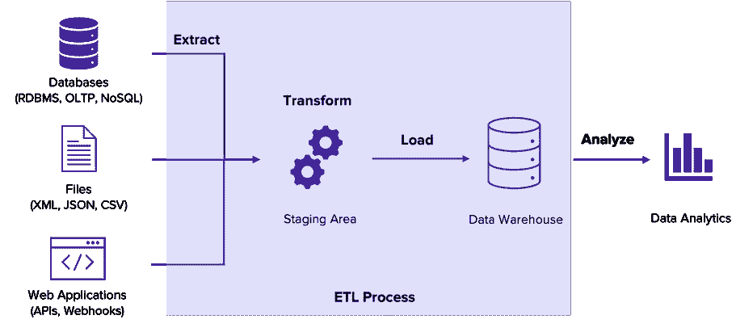
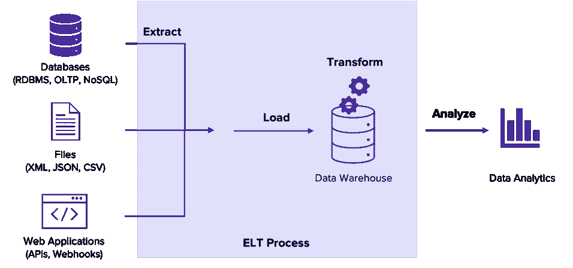

# ETL 与 ELT

> 原文：<https://blog.devgenius.io/etl-vs-elt-e6f6d067f5a9?source=collection_archive---------15----------------------->

如果你曾经接触过**数据分析/管理**工作，你肯定很容易听说过这些**术语**，所以今天让我们了解它们是什么，以及它们是如何与**如此相似**又如此**不同**(俄国和乌克兰..嗯..).

图片提供， [**Unsplash**](https://unsplash.com/photos/JKUTrJ4vK00)

# **ETL，又名提取转换负载**

它指的是…的过程

**提取—** 从数据库(如 MongoDB 和 MySQL)中读取**原始数据**的过程。**收集的数据**通常来自各种**不同的**来源。

**转换**—**将从提取阶段提取的**数据转换为所需的**形式的过程，以便将其放入另一个数据存储中，并由**进一步处理**。它通常通过使用**规则**或**查找**表格或通过将数据与**其他**数据组合来发生。**

而且，

**加载**—**将**数据写入**目标**数据库/仓库的过程。通常，当数据被写入**新**位置时，它就准备好由**商业智能** ( **BI** )解决方案或**分析**进行分析。

下面可以看到整个过程的概述，

图片由 [**全景**](https://blog.panoply.io/etl-vs-elt-the-difference-is-in-the-how) 提供

在 **ETL** 过程中，来自**一个或多个源**/数据仓库的数据被提取，然后在应用转换**规则**和**格式化**之后，以指定的**格式**复制到数据仓库。

这是一个 It 流程，来自各种来源的数据可以放在一个地方，就像一个数据仓库，以编程方式分析业务洞察。它为商业智能( **BI** ) **解决方案**做出了相当大的贡献。

# ELT，又名，提取负载转换

它指的是…的过程

**提取——**读取**和从各种**源**复制数据的**过程。

**加载** —提取完成后，数据**管道**将来自不同来源的数据复制到**目标**系统(数据仓库或数据湖)。

而且，

**转换** —现在数据已经**加载**到**目标**系统中，分析师或组织可以执行他们需要的任何**转换**。通常，组织以不同的方式转换原始数据，用于业务流程，例如，社交媒体反馈和目标营销搜索。

以下是**流程**的整体概述。

图片提供， [**全景图**](https://blog.panoply.io/etl-vs-elt-the-difference-is-in-the-how)

# ETL 和 ELT 的比较

**ETL** 工具**需要**处理引擎在加载**数据**到目的地之前运行转换**。**

而使用 **ELT** ，企业使用**处理**引擎来**高效地**在目标系统内转换数据。**删除**中间步骤简化了数据加载过程，使其**实用**高效。

最终 **ELT** 是旧的提取、转换和加载(ETL)过程的现代**变体，其中转换发生在数据加载之前。在加载阶段之前运行**转换**会导致更加**复杂的**数据复制过程。**

使用 **ELT** 会给你带来更好结果的一些用例:

*   当您有大量数据要处理时:如果手头的项目有大量数据需要加载和分析，使用 ELT 会很有好处。与 ETL 相比，使用 ELT 在一个地方收集数据花费的时间更少。加载后，ELT 将使用云存储中的快速处理能力来执行数据转换。
*   当你需要快速存储数据时:ELT 工具可以在比 ETL 更短的时间内收集所有的原始数据。
*   **当您需要原始历史数据用于未来分析时:**如果企业从分析数据趋势中受益，则有必要将原始历史数据保存在手边，ELT 将您的所有原始数据存储在数据仓库中，因此在分析期间没有必要重新加载数据。
*   **当你需要一个灵活的数据集成过程:**如果一个公司有经常变化的数据源和格式，ELT 会创建一个灵活的过程来迎合这些需求。

> **参考文献**
> 
> [https://www.webopedia.com/definitions/etl/](https://www.webopedia.com/definitions/etl/)
> 
> [https://www.stitchdata.com/resources/what-is-elt/](https://www.stitchdata.com/resources/what-is-elt/)
> 
> [https://blog . panoply . io/ETL-vs-ELT-the-difference-is-in-the-how](https://blog.panoply.io/etl-vs-elt-the-difference-is-in-the-how)
> 
> [https://www.oracle.com/in/integration/what-is-etl/](https://www.oracle.com/in/integration/what-is-etl/)
> 
> [https://www.ibm.com/cloud/learn/elt](https://www.ibm.com/cloud/learn/elt)

如果你喜欢这篇文章，**关注**我，你也可以做以下事情。

我们上 **LinkedIn** 连线吧:

[https://www.linkedin.com/in/tripathiadityaprakash](https://www.linkedin.com/in/tripathiadityaprakash)

或者我的**网站**:

[https://tripathiaditya.netlify.app/](https://tripathiaditya.netlify.app/)