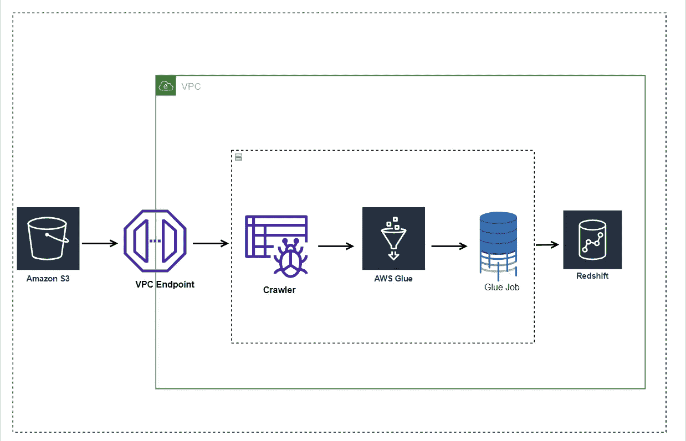
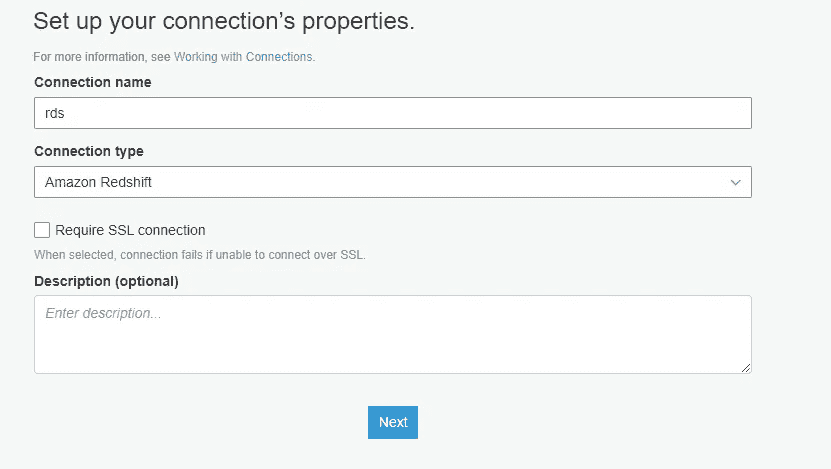
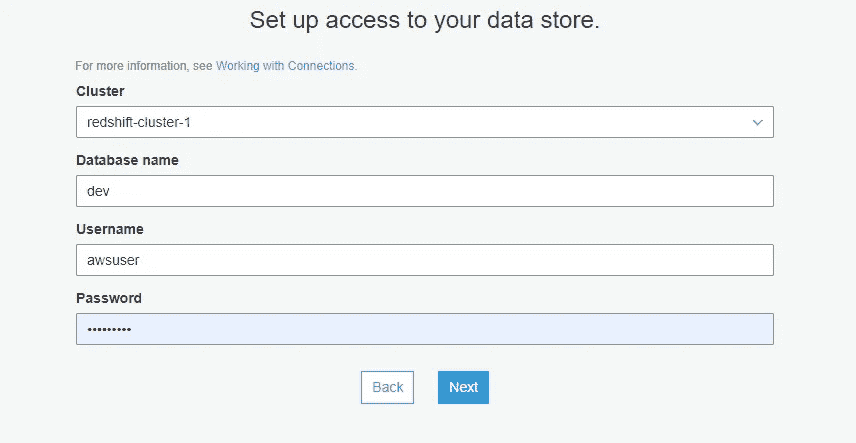
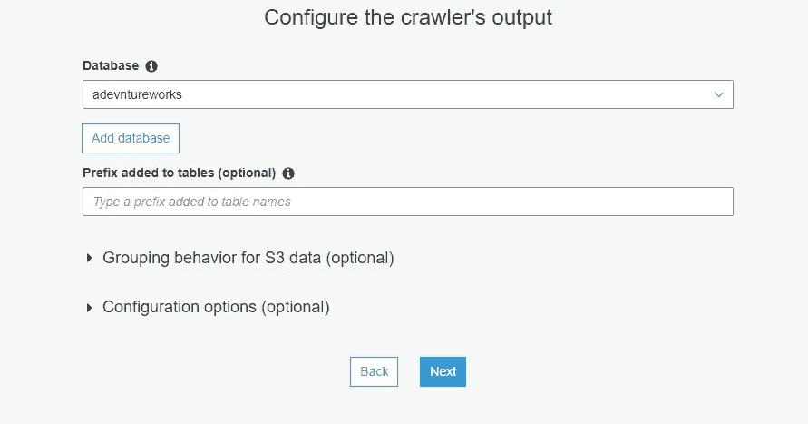
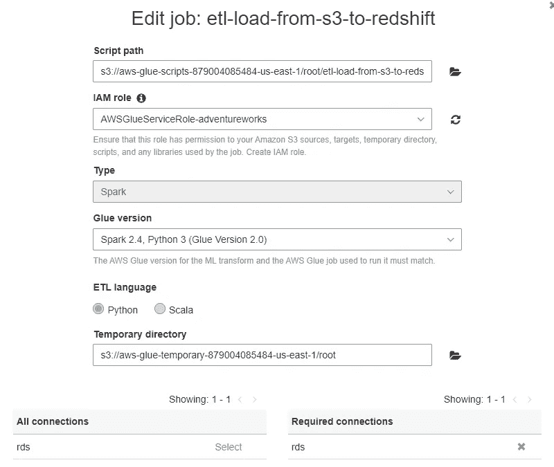
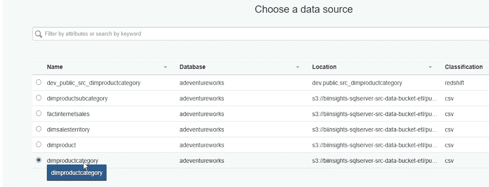
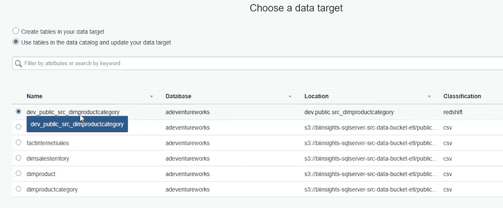
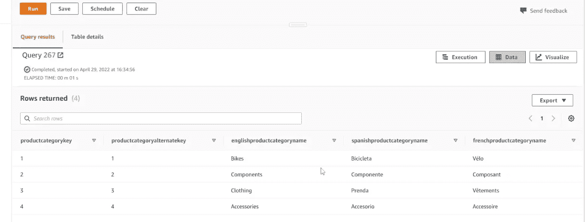

# 使用 AWS Glue 的 ETL:从 S3 将数据加载到 AWS Redshift 中

> 原文：<https://blog.devgenius.io/etl-with-aws-glue-load-data-into-aws-redshift-from-s3-9626001a112c?source=collection_archive---------1----------------------->

**使用 AWS 胶水，S3 和红移**

使用 AWS 胶水的 ETL

AWS Glue 是一个无服务器的 ETL 平台，可以轻松地发现、准备和组合用于分析、机器学习和报告的数据。AWS Glue 提供了数据集成平台所需的所有功能，因此您可以快速开始分析您的数据。当新数据可用时，AWS Glue 可以运行您的 ETL 作业。当新数据在亚马逊 S3 可用时，我们可以按计划或通过触发器运行 Glue ETL 作业。我们可以将这个新数据集作为 ETL 作业的一部分放入数据湖中，或者将它移到关系数据库(如 Redshift)中，以便进一步处理和/或分析。

在[上一期](/setup-aws-redshift-cluster-with-external-connectivity-6d3a04d60399)中，我们创建了一个红移星团。我们在红移数据库中创建了一个表。今天，我们将使用 AWS Glue 服务执行提取、转换和加载操作。

如果你喜欢视觉效果，那么我在 [YouTube](https://www.youtube.com/watch?v=daiKZLtHqVY) 上有一个附带的视频，里面有完整设置的演示。

今天我们将:

*   从 AWS 胶配置 AWS 红移连接
*   创建 AWS Glue Crawler 来推断红移模式
*   创建一个粘合作业，将 S3 数据加载到 Redshift 中
*   从查询编辑器和 Jupyter 笔记本中查询红移

让我们在 AWS Glue 服务中定义一个到 Redshift 数据库的连接。AWS Glue Crawlers 将使用这个连接来执行 ETL 操作。

AWS 粘合红移连接

AWS Glue 将需要红移集群、数据库和凭证来建立到红移数据存储的连接。

红移连接详细信息

现在我们可以定义一个爬虫了。我们给爬虫取一个合适的名字，并保持默认设置。该爬虫将从红移数据库中推断模式，并在 Glue Catalog 中创建具有相似元数据的表。我们将数据存储设置为上面定义的红移连接，并提供一个到红移数据库中的表的路径。

粘爬虫加红移

我们将 Glue crawler 的结果保存在拥有 S3 表的同一个 Glue 目录中。这将有助于源表和目标表的映射。

粘合履带输出位置

AWS 粘合作业(遗留)执行 ETL 操作。我们使用 UI 驱动的方法来创建这个作业。它将需要附加到 IAM 角色和 S3 位置的权限。Glue 创建了一个执行实际工作的 Python 脚本。

AWS 粘合作业

在这个作业中，我们从 Glue 目录中选择源表和目标表。

S3 源表

红移目标表

AWS Glue 自动映射源表和目标表之间的列。一旦我们保存了这个作业，我们就会看到 Glue 生成的 Python 脚本。我们可以编辑这个脚本来添加任何额外的步骤。我们将保存此作业，它将在“作业”下变为可用。Glue 为我们提供了按计划运行作业的选项。一旦作业被触发，我们就可以选择它并查看当前状态。从这里可以访问作业和错误日志，日志输出在 AWS CloudWatch 服务中可用。第一次对作业进行排队时，它确实需要一段时间来运行，因为 AWS 提供了运行该作业所需的资源。成功完成作业后，我们应该会在红移数据库中看到数据。我们可以使用红移查询编辑器或本地 SQL 客户端进行查询。

红移查询的结果

我们将在此结束本次会议，在下一次会议中，我们将通过 AWS CloudFormation 自动化红移集群。所以，下次和我一起。

**结论:**

*   我们已经通过 AWS Glue 成功配置了 AWS 红移连接
*   我们创建了 AWS Glue Crawler 来推断红移模式
*   我们已经创建了一个胶合工作加载 S3 数据到红移数据库
*   我们从 Jupyter 笔记本上建立了到红移数据库的连接，并用 Pandas 查询了红移数据库