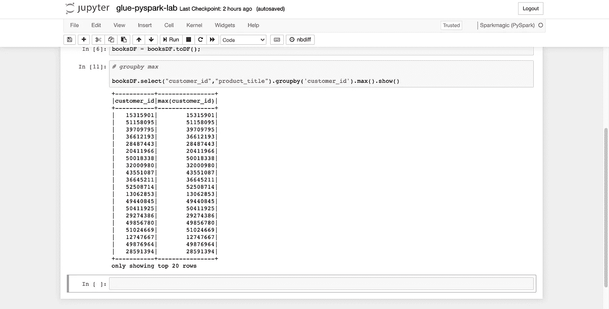

# 在[Amazon reviews dataset]上使用 Glue 和其他 AWS 服务的 ETL 第一部分

> 原文：<https://blog.devgenius.io/etl-with-glue-and-other-aws-services-on-amazon-reviews-dataset-2e1f6b7580cf?source=collection_archive---------16----------------------->

```
We are going to build end to end ETL pipeline using AWS Glue service. This post is a practical lab where any beginner can follow through to know more about Glue and associated services in AWS to create a ETL pipeline. There will be no theory and its mostly practical.
```

源代码

[https://github.com/ramthulsi/glue-etl](https://github.com/ramthulsi/glue-etl)

# 实验室介绍

# 使用的服务


# 我们在这个实验室做什么？

```
We are going to build end to end ETL pipeline using AWS Glue service
```

# 架构图


# 让我们开始:

# 01-S3:

我们将使用 S3 作为存储数据集的源

# 创建 S3 存储桶来托管数据集

> 选择时段名称，并选择要创建时段的区域


# 查看详细信息并创建一个存储桶:


# 下载数据集

该数据集可通过以下链接获得:

 [## 亚马逊客户评论数据集

### 亚马逊客户评论(又名产品评论)是亚马逊的标志性产品之一。在二十多年的时间里…

s3.amazonaws.com](https://s3.amazonaws.com/amazon-reviews-pds/readme.html) 

现在让我们将数据复制到本地机器，然后复制到我们刚刚创建的 BUCKET


# 02 胶水:

本节进一步分为 3 个部分:

a.胶粘履带车

b.GlueStudio

c.Glue-ETL-Labs

## a.胶水爬行器:

Glue Crawler 用于从 S3 加载原始数据，然后我们可以转换数据并进行 ETL

# 数据转换和 ETL

## 为原始数据加载创建粘合爬虫


> 在 AWS 粘附菜单上，选择爬网程序。


*   单击添加爬网程序。
*   输入 *amazon-glueetl-lab* 作为初始数据加载的爬虫名称。
*   或者，输入描述。这也应该是描述性的，易于识别，然后单击下一步。

# 选择数据存储，搜索所有文件夹，然后单击下一步


## 在“添加数据存储”页面上，进行以下选择:

*   对于“选择数据存储”，单击下拉框并选择“S3”。
*   对于在中对数据进行爬网，请选择“我的帐户”中的指定路径。
*   对于包含路径，浏览到存储 CSV 文件的目标文件夹，例如 S3://S3://Amazon-dataset-reviews-thulasi/analysis

## 单击下一步


## 在“添加另一个数据存储”页面上，选择“否”,然后单击“下一步”。


## 在“选择 IAM 角色”页面上，进行以下选择:

选择选择现有的 IAM 角色。

对于“我是”角色，创建新的“我是”角色并为其命名。例如:“AWSGlueServiceRole-glue-ETL-role”

## 单击下一步。


## 在“为此 crawler 创建调度”页上，对于频率，选择按需运行，然后单击下一步。


## 在 Configure crawler 的输出页面上，单击 Add database 为我们的 Glue 目录创建一个新的数据库。

输入 glue-etl 作为您的数据库名称，然后单击 create

对于配置选项(可选)，选择“更新数据目录中的表定义”并保留其余的默认配置选项，然后单击 Next。


## 查看摘要页面，记录包含路径和数据库输出，然后单击 Finish。爬虫现在准备运行。


## 勾选爬虫名称，点击运行爬虫按钮。


Crawler 会将状态从 starting 改为 stopping，等到 crawler 回到 ready 状态(这个过程需要几分钟)，可以看到它已经创建了 glue-etl 表，对于 1.2GB 的数据用了不到一分钟的时间。

## 在 AWS Glue 导航窗格中，单击数据库>表。您还可以单击 glue-etl 数据库来浏览这些表。


# 数据验证:

## 在 glue-etl 数据库的 Tables 部分，单击“analysis”表。


您可以看到 Glue crawler 已经创建了我们从 S3 选择的数据集的模式。

# 检查数据库模式详细信息

*   点击左上角的编辑表格，你可以看到表格的所有细节，如大小，记录数等。


# 更改列的名称。

*   *点击你想要编辑的列并保存。


# 添加额外的列

*   单击右上角的 Edit Schema，您可以添加新列


# 监视

*   一旦爬虫处于就绪状态，您就可以检查爬虫日志的状态


# b.GlueStudio:

## GlueStudio 练习

先决条件为要保存的输出数据创建一个新的 s3 输出存储桶，或者在同一个初始存储桶中创建一个`outputs`文件夹。在本实验中，我将使用同一个 S3 存储桶和输出文件夹来保存 Glue Studio 的输出数据。

`Bucket-Name: amazon-dataset-reviews-thulasi` `output-Folder: outputs`

## 在左侧导航窗格中的 ETL 下，单击 AWS Glue Studio。


# 点击查看工作


*   选择图表顶部的数据源— S3 存储桶。
*   在“数据源属性— S3”下的右侧面板中，从下拉列表中选择`glue-etl`数据库。
*   对于表格，选择`analysis`表格。


## 选择 ApplyMapping 节点。在右边的转换面板中，将下拉列表中`customer_id`列的数据类型改为 double。


*   选择图形底部的数据目标——S3 时段节点，并在下拉列表中将格式更改为`JSON`。请随意处理类型，删除转换输出的列等。
*   在“S3 目标位置”下，选择“浏览 S3”浏览到“亚马逊-数据集-评论-thulasi”桶，选择“输出文件夹”项目，然后按“选择”。

或者添加存储桶路径

`s3://amazon-dataset-reviews-thulasi/outputs/`


*   最后，选择顶部的 Job details 选项卡。在名称下输入`glue-etl-lab-studio`。
*   对于 IAM 角色，由于输出文件夹位于同一个 S3 存储桶中，所以我选择了与 Crawler 相同的角色。请随意创建具有新权限的新角色，或者使用新的 s3 存储桶更新相同的角色
*   向下滚动页面，在作业书签下的下拉列表中选择禁用。

注 Glue ETL 根据作业中定义的工作线程数编写多部分上传输出文件。如果您需要大型文件，请保持较低的工作人员数量(最少 2 个)


按右上角的保存按钮创建作业。

在标题中看到成功创建作业的消息后，单击运行按钮启动作业。

从左侧的导航面板中选择作业，以查看您的作业列表。

从左侧的导航面板中选择 Monitoring，以查看正在运行的作业、成功率/失败率和各种其他统计数据。


# c.glue-ETL/实验室

# 集合函数练习

先决条件为要保存的输出数据创建一个新的 s3 输出存储桶，或者在同一个初始存储桶中创建一个`outputs`文件夹。在本实验中，我将使用同一个 S3 存储桶和输出文件夹来保存 Glue Studio 的输出数据。

`Bucket-Name: amazon-dataset-reviews-thulasi` `output-Folder: outputs`

# 先决条件

*   确保您已经完成了`01-gluecrawler`实验，并将您的图书数据放在数据目录中
*   同样，为从`Amazon Reviews Dataset`复制的服装数据集创建数据目录

# 创建开发端点

*   在左侧窗格中选择“Dev Endpoints ”,然后单击“add endpoint”


*   为端点和角色赋予一个新的，然后单击 next eg: glue-etl-endpint，AWSGlueServiceRole-glue-ETL-role


*   跳过网络配置，因为我们不会在本实验的 VPC 中运行笔记本电脑。单击下一步


*   您可以上传您的本地机器 ssh 密钥以在本地访问它。出于本实验的考虑，我将跳过这一步，单击“Next”并创建 endpoinot


*   终端准备就绪需要几分钟时间，它将显示为“PROVISIONING”


*   就绪状态


*   选择已创建的端点，并在操作下拉列表中选择`Create SageMaker Notebook`


*   为笔记本和各自的角色命名(创建新角色或选择具有所需 S3 权限的现有角色)。跳过默认选项的其余部分，然后单击“Create”。


*   等待，直到笔记本电脑从启动状态变为就绪状态


就绪状态


*   转到 AWS Glue 控制台，单击左侧菜单中的笔记本选项，然后选择笔记本并单击打开笔记本按钮。
*   在下一个弹出屏幕上，单击确定按钮。它将在新的浏览器窗口或标签中打开 jupyter 笔记本。在笔记本窗口中，点击新下拉菜单下的 Sparkmagic (PySpark)选项。


*   将笔记本重命名为`glue-pyspark-lab`


*   它将在新的浏览器窗口或选项卡中打开笔记本文件。将下面的 PySpark 代码片段复制并粘贴到笔记本单元格中，然后单击 Run。它将创建粘合上下文。Glue 上下文连接 Spark 会话，并提供对数据湖目录表的访问。

```
import sys
from awsglue.transforms import *
from awsglue.utils import getResolvedOptions
from pyspark.context import SparkContext
from awsglue.context import GlueContext
from awsglue.job import Job

glueContext = GlueContext(SparkContext.getOrCreate())
```


*   启动 SparkSession 并获取 Glue 上下文需要一些时间。等待确认消息，说明 SparkSession 作为“spark”可用。


*   在 notebook 单元格中复制以下 PySpark 代码片段，然后单击 Run。等待执行完成。它将为数据库`glue-etl`(图书评论数据集)中的数据目录表`analysis`加载 dynamicframe


*   您可以通过运行以下命令来检查模式

`booksDF.printSchema()`


booksDF.count()


# 形容

*   您可以使用 describe 方法来查看特定列的统计信息。方法通常用于数字列或数字特征。运行以下 PySpark 代码片段来检查 product_title 列的统计信息。


您还可以将 groupby 方法用于特定列以及单独的聚合函数。运行以下 PySpark 代码片段，查看每个 star_rating 的计数。


*   逐一运行以下 PySpark 代码片段，查看每个 product_title 的 customer_id 的最小值、最大值、平均值和总和。

# 福建话


# 最大



# 平均


# 总和


# Orderby

可以使用 orderBy 方法按升序或降序对特定列的数据帧进行排序。逐一运行下面的 PySpark 代码片段，按照 total_votes 先升序或降序对 Dataframe 进行排序。


# 数据转换和 ETL

# 连接

# 合并和拆分练习

先决条件为要保存的输出数据创建一个新的 s3 输出存储桶，或者在同一个初始存储桶中创建一个`outputs`文件夹。在本实验中，我将使用同一个 S3 存储桶和输出文件夹来保存 Glue Studio 的输出数据。

`Bucket-Name: amazon-dataset-reviews-thulasi`

# 先决条件

*   确保您已经完成了`01-gluecrawler`实验，并且在数据目录中有您的图书数据
*   同样，为从`Amazon Reviews Dataset`复制的服装数据集创建数据目录

# 创建开发端点

*   在左侧窗格中选择“Dev Endpoints ”,然后单击“add endpoint”

您可以使用与聚合函数相同的 dev 端点。

# 合并和分割数据集

*   当创建 ETL 作业时，通常会使用多个数据集，并使用它们进行转换。这种转换可能类似于将两个数据集合并在一起，或者将一个数据集拆分成两个或更多个数据集。在本任务中，您将学习合并和拆分数据集。
*   运行下面的 PySpark 代码片段，它从`analysis`表中的`appareldb`和`glue-etl`数据库加载 Dynamicframe 中的数据。


*   逐一运行下面的 PySpark 代码片段，检查两个 Dynamicframes 的模式。您会发现这些框架将 customer_id 作为公共键或字段。您可以根据 customer_id 字段连接 booksDFDF 和 apparelDF Dynamicframes。
*   运行以下 PySpark 代码片段，根据 customer_id 字段连接 booksDFDF 和 apparelDF Dynamicframes。使用 printSchema 方法和 count 方法检查合并框架的架构以及新的记录计数。

注意:如果数据的大小很大，您可能会在笔记本中得到内存限制超过错误。确保根据数据集的大小使用正确的笔记本实例。


*   如果您可以看到两列 customer_id 和。customer_id 应在键上加入。你可以使用 drop_fields 方法来删除。客户标识字段。
*   您可以基于列垂直拆分 Dynamicframe。使用 SplitFields 方法将 Dynamicframe 拆分为 dynamic frame 的集合。运行下面的 PySpark 代码片段，将 booksDFDF 框架分成两个框架 productsDF 和 restDF。productsDF 有三列 customer_id、product_id 和 product_title。restDF 将拥有剩余的列。您可以使用 keys 方法来检查 Dynamicframe 集合 colwiseCollection 中 Dynamicframe 的创建。


*   逐一运行下面的 PySpark 代码片段，检查两个 Dynamicframes productsDF 和 restDF 的模式。


*   与按列拆分类似，您可以基于行水平拆分 Dynamicframe。使用 SplitRows 方法，该方法根据为行指定的条件将 Dynamicframe 拆分为 dynamic frame 的集合。运行下面的 PySpark 代码片段，将 booksDF 框架分成两个框架，上面的评级为 3，下面的评级为 3。两个框架具有相同的列，但一个框架的评级值高于 3，另一个框架的评级值低于 3。您可以使用 keys 方法来检查 Dynamicframe 集合中 Dynamicframe 的创建


*   逐一运行下面的 PySpark 代码片段，检查上面的两个 dynamic frame star_rating 和下面的 star _ rating 3 中 star _ rating 列的前 20 个值。


*   数数


*   到目前为止，您已经在研讨会中学习了如何在数据框架内和跨数据框架操作数据

# 在下一篇博客中，我们将讨论

*   使用 Athena 进行分析，使用“QuickSight”进行可视化
*   Sagemaker
*   数据布鲁

感谢您的阅读。这是我的第一个博客，我知道我会犯错误，并总是欢迎反馈和纠正。