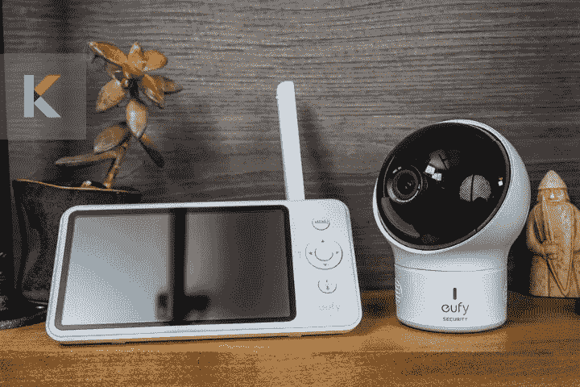
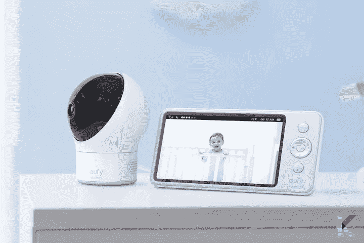
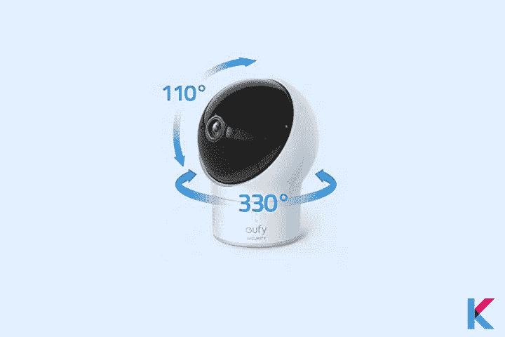
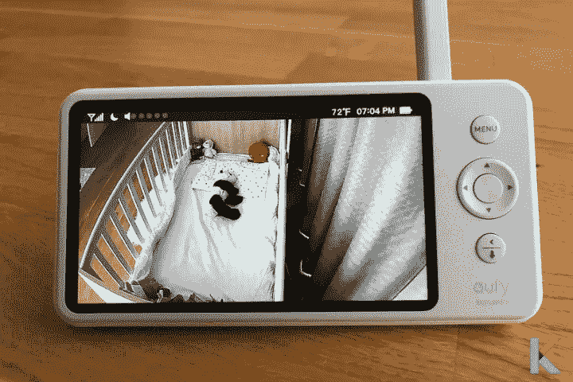
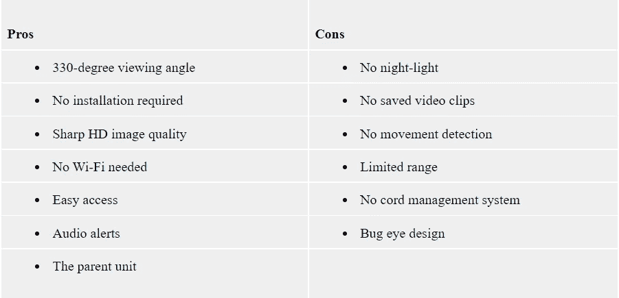
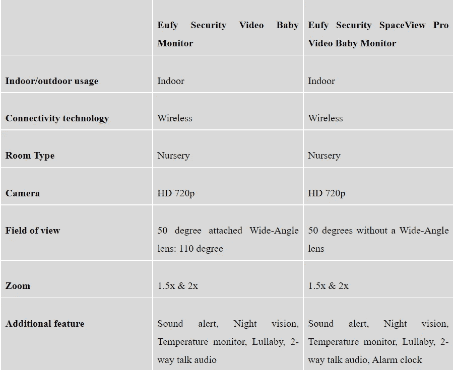
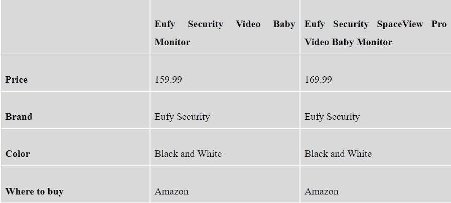

# Eufy 安全太空观婴儿监视器[2021 年全面审查]

> 原文：<https://blog.devgenius.io/eufy-security-spaceview-baby-monitor-abcb60c0a718?source=collection_archive---------11----------------------->

你想一边享受生活，一边照看你的宝宝吗？或者你是一个一心多用的妈妈？那么，不要浪费你的宝贵时间谷歌婴儿监视器了。当你的宝宝哭闹时，即使你在睡觉，你也可以立即从 Eufy 这样的婴儿监视器中得到提醒。别担心。这 Eufy SpaceView 婴儿监视器审查将涵盖你需要知道的一切。

***在这篇文章中，你会学到:***

*   什么是 Eufy SpaceView 婴儿监视器？
*   Eufy SpaceView 婴儿监视器的盒子里是什么？
*   Eufy SpaceView 父设备
*   Eufy 婴儿监视器的利与弊
*   非 W-Fi 显示器-这是什么意思？
*   Eufy SpaceView vs SpaceView Pro
*   安装
*   安全:Eufy SpaceView 黑客攻击
*   我为什么应该购买 Eufy Baby SpaceView 显示器？
*   价格比较

# 什么是 Eufy SpaceView 婴儿监视器？

[Eufy SpaceView 婴儿监视器](https://kodmy.com/eufy-spaceview-baby-monitor/)是首款家用高清婴儿监视器，具有清晰的 720p 视频。它与 Eufy SpaceView Pro 具有所有相同的功能和相同的摄像头。如果你是新父母，这款华丽、可靠、易用的婴儿监视器是一个很好的选择，它是一个设计巧妙的系统，有一个有趣的摄像头和一个优秀的父母监视器。

Eufy SpaceView 婴儿监视器

你不想花时间配置相机连接到你的 Wi-Fi 网络，它是从相机直接流式传输到您的便携式父母单位。此外，你可以选择 5 首轻松的摇篮曲，这样有助于宝宝入睡。你知道 Eufy 是一个为你的[智能家居](https://kodmy.com/smart-home-technology/)提供智能安全摄像头和智能家电的品牌。因此，我们可以毫无疑问地信任 Eufy 婴儿监视器。

**在购买之前，比较并检查您的智能设备的兼容性**

*与同类产品比较*

现在，你对 Eufy 有些了解了。有时，如果你对功能感到好奇，你可以很容易地[将 Eufy SpaceView Pro 与 Eufy Security Baby monitor](https://kodmy.com/compare/smart-baby-monitors?modelList=eufy-spaceview-pro,eufy-security) 进行比较。我确定。你可以在这里找到最好的对比。

*检查与智能助手的兼容性*

有一种简单的方法可以检查与谷歌助手、亚马逊 Alexa 和 Siri 语音助手的兼容性。您只需选择您的智能设备，然后单击兼容性按钮。因此，如果你想[检查智能家居设备与你喜欢的生态系统的兼容性](https://play.google.com/store/apps/details?id=com.knovik.canda)你可以在这里下载 Canda——谷歌助手兼容性检查器。

Android 用户- [从 Play Store 下载](https://play.google.com/store/apps/details?id=com.knovik.canda)

对于 iPhone 用户- [从 App Store 下载](https://apps.apple.com/us/app/canda-compatibility-checker/id1630339464)

# 覆盖了从枕头到小脚趾的每一个角落

你可以从角落看到角落，也可以从地板看到天花板，因为它可以将镜头平移 330°，倾斜 110°。因此，您可以使用附带的镜头将视图扩展到 110 度。当你的宝宝开始走路和跑来跑去的时候，这有助于你和他保持联系。

平移镜头 330°并倾斜 110°

Eufy SpaceView 系列怎么样？无论你在家里的什么地方都可以移动，因为它覆盖 460 英尺-1000 英尺的范围，可以让你看着你的小家伙。它不像普通的 240p 显示器婴儿显示器。它显示了比普通显示器多 10 倍的清晰画面，因为它有一个 5 英寸 720p 的大型视频婴儿监视器。

# 可充电电池

它使用高容量 2900mAh 可充电电池提供 15 小时的监控。因此您可以随时轻松办理入住手续。此外，它还是英国、澳大利亚和加拿大最好的 Eufy SpaceView 婴儿监视器。然而，SpaceView Pro 的显示器比 SpaceView 的电池更大。它持续 1 小时以上。

# 感到安全有保障

即使您在家里的其他地方，您也可以通过清晰的双向音频与宝宝直接交流。你可以把 Eufy 相机放在任何你想放的地方，甚至是墙上。并且，不用担心连接。你可以相信无线 FHSS 传输。这个安全和私人的直播流是给你的。

# 声音激活警报

当摄像机周围有噪音时，您会收到警报。这个功能在晚上你需要休息的时候很有用。你也可以随意定制 Eufy。

相反，看看我们的[爱洛婴儿监视器](https://kodmy.com/arlo-baby-monitor/)的文章，找到一个适合你和你的小家伙。

如果你对智能家庭自动化感兴趣，你可能会对给你的小家伙最好的婴儿监视器感兴趣，并且[比较 Eufy SpaceView Pro 与 Eufy Security 婴儿监视器](https://kodmy.com/compare/smart-baby-monitors?modelList=eufy-spaceview-pro,eufy-security)以选择最好的一个。

快一点！[从亚马逊以 169.99 美元](https://amzn.to/2ZuXoCH)获得 Eufy SpaceView pro 婴儿监视器。

你还可以从沃尔玛花 99.99 美元买到 Eufy 附加婴儿相机单元。

# Eufy SpaceView 婴儿监视器的盒子里是什么？

你想知道 SpaceView 盒子里有什么吗？这是所有在盒子里的东西。

*   1 个母监视器单元
*   1 个婴儿相机单元
*   1 个带螺钉的壁挂式支架
*   2 根 USB 电源线

# Eufy SpaceView 父设备

Eufy SpaceView 婴儿监视器

Eufy 父母单位干净，易于使用。您可以将它放在带支架的桌子上，因此不必担心 Eufy 显示器的更换。如果你想扩大信号范围，它有一个可伸缩的天线。此外，它有一个 5 英寸的屏幕显示器和一个播放婴儿相机中 720p 视频的屏幕。如果需要，您可以关闭父显示器的屏幕以节省电池。但是，如果在您的宝宝身上检测到噪音，它会自动打开。

# Eufy 婴儿监视器的利与弊

# 非 W-Fi 显示器-这是什么意思？

Wi-Fi 婴儿路由器和非 Wi-Fi 婴儿路由器是您可以选择的两种类型的视频馈送监视器。Wi-Fi 婴儿路由器通过您的家庭网络直接连接到移动应用程序。但非 Wi-Fi 婴儿路由器配有一个父母单位(专用于您的显示器的屏幕)。

你听说过用无线电频率将视频和声音从摄像机传输到便携式监视器吗？这种非 Wi-Fi SpaceView 显示器就是其中一个例子。此外，还有许多 Wi-Fi 婴儿监视器，如 Arlo 婴儿监视器和 [Nanit plus](https://www.pcmag.com/reviews/nanit-plus) 。这些显示器对您的宝宝有很多有用的功能。但是 Wi-Fi 显示器存在一些问题。

[从亚马逊以 159.99 美元](https://amzn.to/3jJb1W8)获得 Eufy 安全婴儿监视器。

# Eufy SpaceView vs SpaceView Pro

# 安装

当考虑设置时，它非常简单。您只需打开父单元，然后两者立即连接。你可以随意选择三种摆放方式。作为第一种选择，你可以把它放在书架或其他凸起的表面上。作为第二种选择，您可以使用附带的套件将其安装在墙上。尽管如此，你可以用一个看起来像夹子的附件把它安装在婴儿床上。哇！没有繁琐的配置或额外的设置步骤。

# 安全:Eufy SpaceView 黑客攻击

不用费心去黑。没有被黑的机会。它使用加密的 FHSS 无线电信号。它导致最少的黑客攻击和安全漏洞。它通过无线 2.4 GHz FHSS 连接与其母设备相连。所以，它比 WiFi 监视器更安全。你担心你孩子的安全吗？然后你必须把它放在离宝宝安全距离的地方，以限制电磁辐射暴露。当考虑 Eufy SpaceView 与 Eufy SpaceView S 时，唯一的区别是，这款 SpaceView S 配有一个额外的夹子，可以将相机直接安装到婴儿床上。我们不建议这样做，因为辐射暴露。

# 为什么我应该购买 Eufy 婴儿监视器？

支持 Wi-Fi 的智能家居设备往往存在安全问题，包括婴儿监视器、安全摄像头等。有时，它可能会被入侵者攻击。因此，一个支持 Wi-Fi 的婴儿监视器可能不值得花费时间或冒这个风险。你不必建立另一个帐户，记住另一个密码，或者将 SpaceView 与你的手机配对，因为它没有 Wi-Fi。

相反，SpaceView 使用 FHSS 无线电连接向手持设备发送数据。它更容易安装，更安全，即使停电也能让你照看你的孩子。此外，这款 SpaceView 还附带一年标准保修。另外，你可以[在这里下载 Eufy SpaceView 用户手册](https://cdn.babygearessentials.com/user-manual/eufy-spaceview-user-manual-baby-gear-essentials.pdf)。

# 价格比较

**我们的选择**

如果你正处于抚养孩子的阶段，SpaceView 是一个很好的选择，它是我们最喜欢的即插即用婴儿监视器。当你睡觉的时候，你可以睡个好觉，因为夜视技术会持续监控你的宝宝。当然，你可能会有不同的看法！我觉得这篇 Eufy SpaceView 婴儿监视器评论对你很有帮助。

然而，它比顶级 Wi-Fi [智能安全摄像头](https://kodmy.com/best-home-security-cameras/)和健康跟踪系统如 Arlo Baby monitor 和 Nanit plus 便宜。我们都知道，并非一切都是完美的。但总的来说，你可以选择 Eufy SpaceView。