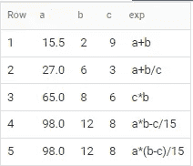
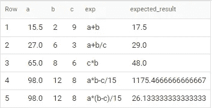
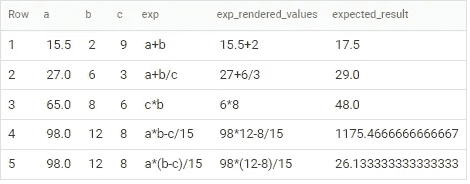
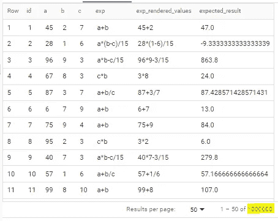
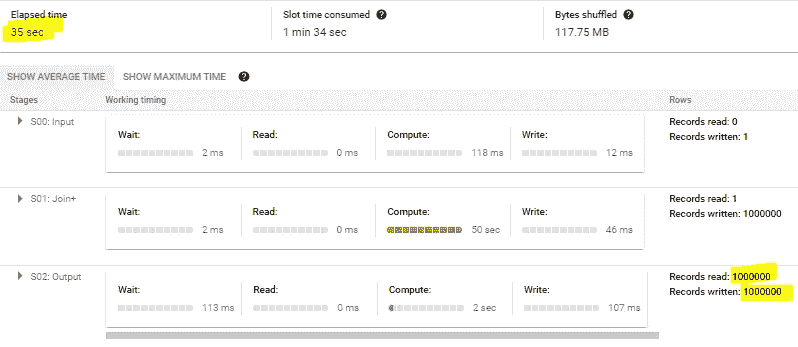

# 使用 BigQuery 计算不带值的算术表达式

> 原文：<https://blog.devgenius.io/evaluate-arithmetic-expressions-without-values-using-bigquery-a4abd99f0932?source=collection_archive---------7----------------------->

## 用列名代替值来计算算术表达式怎么样？以一种可扩展的方式？而使用 SQL 呢？


由 [Gayatri Malhotra](https://unsplash.com/@gmalhotra?utm_source=medium&utm_medium=referral) 在 [Unsplash](https://unsplash.com?utm_source=medium&utm_medium=referral) 上拍摄的照片

对于一些编程语言如 Scala、Python、Java 等。，没什么大问题，也不难处理。但是对于 SQL 来说，这并不容易，尤其是当我们需要扩展的时候。

**本文的目的是向您展示如何以可扩展的方式实现这一点。**

当然，有几种方法可以解决这个问题，如果能看到其他人指出这些方法，那就太好了。

## **让我们从一个简单的例子开始**

假设您有一个包含字符串列的表，其中包含一个表达式，其他列作为变量引入，目标是用各自的值替换列名，并在运行时计算表达式。



根据上面的例子，预期的结果应该是这样的:



现在想象一个有数百万行的表，每一行都有不同的表达式，只需运行一个 SQL 查询，就能很快得到所有结果。**使用 BigQuery** 是可能的。

# 解决方案

在我们的方法中，我们使用 BigQuery [标准 SQL](https://cloud.google.com/bigquery/docs/reference/standard-sql/introduction) 、 [SQL 和 JavaScript UDF](https://cloud.google.com/bigquery/docs/reference/standard-sql/user-defined-functions)。我们创建了两个函数来支持我们的解决方案:

*   `**fn_render_values_in_expression**`:用相应行中的值替换列名。输出是一个字符串表达式。我们应该提到这篇 [StackOverflow 帖子](https://stackoverflow.com/questions/65048929/bigquery-extract-keys-from-json-object-convert-json-from-object-to-key-value-a)作为将 JSON 转换成键值表的代码的灵感；
*   `**fn_evaluate_expression**`:对渲染后的表达式求值并输出结果。

## **功能逻辑**

1.  将表列转换为 [JSON 字符串](https://cloud.google.com/bigquery/docs/reference/standard-sql/json_functions#to_json_string)，并作为函数参数传递；
2.  将表达式列作为函数参数传递；
3.  将 JSON 转换成键值表(`kv`)；
4.  [将](https://cloud.google.com/bigquery/docs/reference/standard-sql/string_functions#split)表达式元素拆分成表格的行(`ex`)；
5.  将`ex`表与`kv`表映射:**如果匹配则返回** `**kv.value**` **否则返回**`**ex.value**`；
6.  将最终输出聚合为单个字符串；
7.  计算表达式字符串。

## **代码**

我们邀请您访问 [GitHub](https://github.com/brbep/bigquery-cool-features-standard-sql/blob/main/examples/evaluate-arithmetic-expressions.md) 以获取您可能感兴趣的内容。

```
CREATE TEMP FUNCTION fn_evaluate_expression(expr STRING) RETURNS FLOAT64 LANGUAGE js AS 
R"""
  return eval(expr);
""";CREATE TEMP FUNCTION fn_render_values_in_expression(json_values STRING, expression STRING) AS (
(
    /*
      json_values = columns/values converted to JSON format
      expression = expression with the column name to be mapped
    */    

    /* 
      Transform JSON into TABULAR format
      StackOverflow code inspiration: [https://stackoverflow.com/questions/65048929/bigquery-extract-keys-from-json-object-convert-json-from-object-to-key-value-a](https://stackoverflow.com/questions/65048929/bigquery-extract-keys-from-json-object-convert-json-from-object-to-key-value-a)
    */
    WITH kv_table AS (
      SELECT
        ARRAY(
            SELECT AS STRUCT 
              LOWER(TRIM(SPLIT(kv, ':')[OFFSET(0)])) as key, 
              TRIM(SPLIT(kv, ':')[OFFSET(1)]) as value
            FROM t.kv AS kv
          ) AS key_value  
      FROM UNNEST([STRUCT(SPLIT(TRANSLATE(json_values, '{}"', '')) AS kv)]) AS t
    ),

    kv_table_col_values AS (
      SELECT
        kv.key,
        IF(LOWER(kv.value) = 'null', NULL, kv.value) AS value
      FROM kv_table
      CROSS JOIN UNNEST(key_value) AS kv
    ),/* Transform EXPRESSION into TABULAR format */
    expression_table AS (
      SELECT 
        TRIM(col) AS col
      FROM UNNEST(SPLIT(REGEXP_REPLACE(REPLACE(expression, ',', ' '), r'\b', ','), ',')) AS col
    )

    /* Render VALUES in EXPRESSION */
    SELECT
      REPLACE(STRING_AGG(IF(c.key IS NULL, m.col, c.value)), ',', '')
    FROM expression_table AS m
    LEFT JOIN kv_table_col_values as c
      ON LOWER(m.col) = c.key
    WHERE
      NULLIF(TRIM(m.col), '') IS NOT NULL
)
);WITH base_table AS (
  SELECT 15.5 AS a, 2 AS b, 9 AS c, 'a+b' AS exp
  UNION ALL SELECT 27, 6, 3, 'a+b/c'
  UNION ALL SELECT 65, 8, 6, 'c*b'
  UNION ALL SELECT 98, 12, 8, 'a*b-c/15'
  UNION ALL SELECT 98, 12, 8, 'a*(b-c)/15'
)SELECT 
  * ,
  fn_render_values_in_expression(TO_JSON_STRING(t), exp) AS exp_rendered_values,
  fn_evaluate_expression(fn_render_values_in_expression(TO_JSON_STRING(t), exp)) AS expected_result
FROM base_table AS t
```

该代码将产生以下结果:



## **现在，让我们扩展我们的查询**

在本例中，基表已经扩展到 1M 行。下图显示了查询结果和执行细节。



查询结果



执行细节

您可以用以下代码重现它:

```
CREATE TEMP FUNCTION fn_evaluate_expression(expr STRING) RETURNS FLOAT64 LANGUAGE js AS 
R"""
  return eval(expr);
""";CREATE TEMP FUNCTION fn_render_values_in_expression(json_values STRING, expression STRING) AS (
(
    /*
      json_values = columns/values converted to JSON format
      expression = expression with the column name to be mapped
    */    

    /* 
      Transform JSON into TABULAR format
      StackOverflow code inspiration: [https://stackoverflow.com/questions/65048929/bigquery-extract-keys-from-json-object-convert-json-from-object-to-key-value-a](https://stackoverflow.com/questions/65048929/bigquery-extract-keys-from-json-object-convert-json-from-object-to-key-value-a)
    */
    WITH kv_table AS (
      SELECT
        ARRAY(
            SELECT AS STRUCT 
              LOWER(TRIM(SPLIT(kv, ':')[OFFSET(0)])) as key, 
              TRIM(SPLIT(kv, ':')[OFFSET(1)]) as value
            FROM t.kv AS kv
          ) AS key_value  
      FROM UNNEST([STRUCT(SPLIT(TRANSLATE(json_values, '{}"', '')) AS kv)]) AS t
    ),

    kv_table_col_values AS (
      SELECT
        kv.key,
        IF(LOWER(kv.value) = 'null', NULL, kv.value) AS value
      FROM kv_table
      CROSS JOIN UNNEST(key_value) AS kv
    ),/* Transform EXPRESSION into TABULAR format */
    expression_table AS (
      SELECT 
        TRIM(col) AS col
      FROM UNNEST(SPLIT(REGEXP_REPLACE(REPLACE(expression, ',', ' '), r'\b', ','), ',')) AS col
    )

    /* Render VALUES in EXPRESSION */
    SELECT
      REPLACE(STRING_AGG(IF(c.key IS NULL, m.col, c.value)), ',', '')
    FROM expression_table AS m
    LEFT JOIN kv_table_col_values as c
      ON LOWER(m.col) = c.key
    WHERE
      NULLIF(TRIM(m.col), '') IS NOT NULL
)
);WITH base_table AS (
    SELECT
      id,
      CAST(RAND()*100 AS INT64) AS a, 
      CAST(RAND()*10 AS INT64) AS b, 
      CAST(RAND()*10 AS INT64) AS c,
      CASE 
        WHEN MOD(id, 6) = 0 THEN 'a+b' 
        WHEN MOD(id, 5) = 0 THEN 'a+b/c' 
        WHEN MOD(id, 4) = 0 THEN 'c*b' 
        WHEN MOD(id, 3) = 0 THEN 'a*b-c/15' 
        WHEN MOD(id, 2) = 0 THEN 'a*(b-c)/15' 
        ELSE 'a+b'
        END AS exp
    FROM UNNEST(GENERATE_ARRAY(1, 100)) AS id --Increase the range to scale
)SELECT 
  * ,
  fn_render_values_in_expression(TO_JSON_STRING(t), exp) AS exp_rendered_values,
  fn_evaluate_expression(fn_render_values_in_expression(TO_JSON_STRING(t), exp)) AS expected_result
FROM base_table AS t
```

我们希望这些信息是有用的！

> 特别感谢[安东尼奥·维拉斯](https://www.linkedin.com/in/vilaresantonio)，他为此内容做出了贡献。