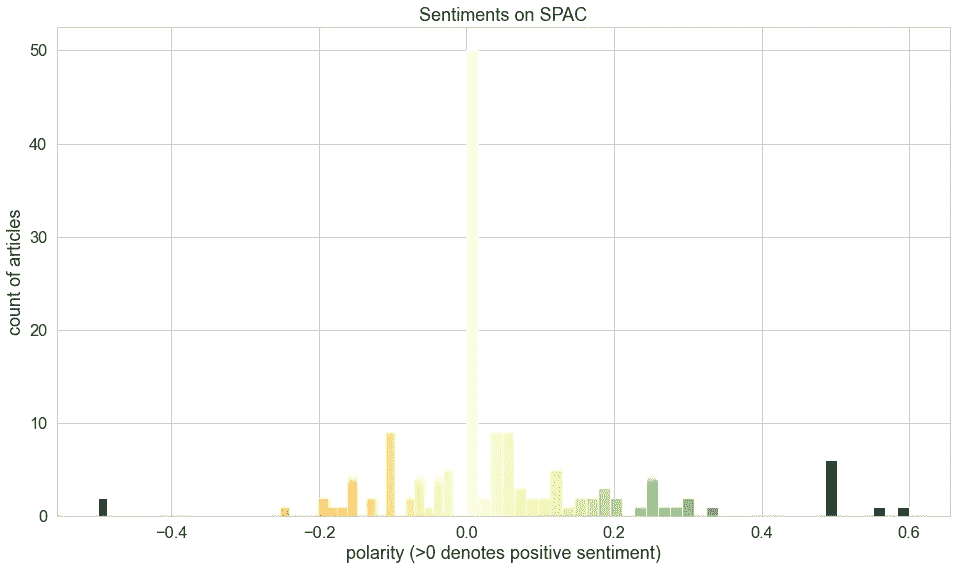
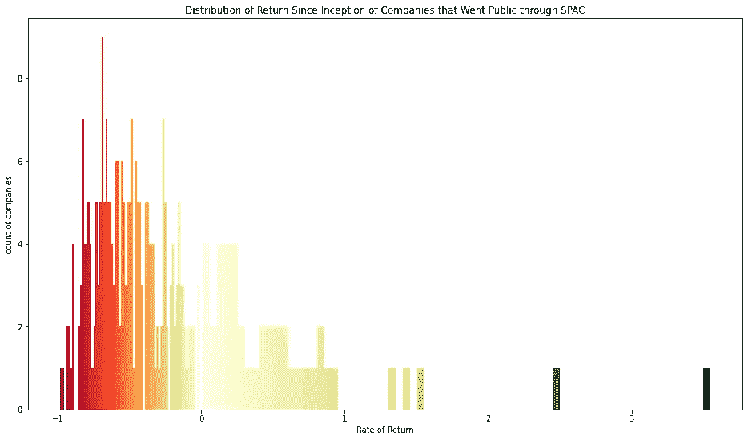
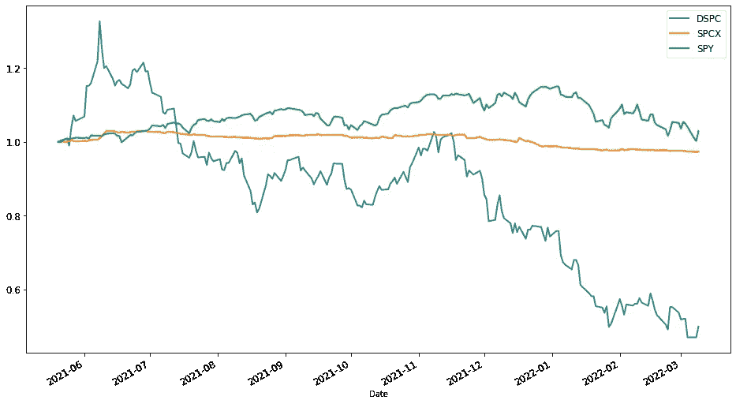
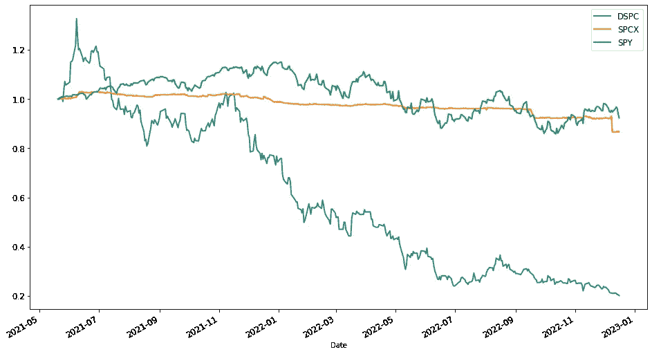

# 使用情绪分析、发散颜色直方图和其他 Python 技术评估特殊目的收购公司的资产类别

> 原文：<https://blog.devgenius.io/evaluating-spac-as-an-asset-class-using-sentiment-analysis-diverging-color-histogram-and-other-80c2bff706a?source=collection_archive---------18----------------------->

特殊目的收购公司(特殊目的收购公司)是一家上市公司，旨在与目标公司合并并使其上市。该项目于 2022 年 3 月进行，以评估 SPACs(特殊目的收购公司)的风险回报状况，此前 2021 年特殊目的收购公司的炒作已经过去，特殊目的收购公司和去空间公司(通过特殊目的收购公司计划上市的公司)的业绩数据已经有了更丰富的记录。

数据和代码可以在我的 GitHub 知识库中找到:[https://GitHub . com/namofvietnam/spac _ sensition _ and _ quantitative _ analyses](https://github.com/namofvietnam/spac_sentiment_and_quantitative_analyses)

# 行动纲要

*   特殊目的收购公司一直是一个有争议的话题，在《华尔街日报》的 148 篇文章中，正面和负面的观点各半
*   84%通过特殊目的收购公司上市的公司(去空间化公司)从一开始就产生了负回报
*   在 2021 年 5 月至 2022 年 3 月期间，在标准普尔 500 投资 1 美元，会比在 SPCX(空白支票特殊目的收购公司基金)或 DSPC(去间隔化公司)投资 1 美元产生更好的回报
*   尽管新加坡证交所和 DSPC 证交所与标准普尔 500 的相关性较低，但将它们中的任何一个纳入市场投资组合，都不太可能降低风险、提高回报
*   DSPC 可能会增加投资组合的标准差(风险)
*   SPCX 可能会降低回报，但可能会提供一定的稳定性
*   SPCX 的一只基金有朝一日将成为可与 DSPC 相媲美的公司，这可能会增加投资组合的风险
*   将特殊目的收购公司基金和去间隔化公司纳入投资组合，将需要仔细分析和积极管理

# 方法学

该项目包括 Python 中的以下技术(访问我的 [GitHub 库](https://github.com/namofvietnam/spac_sentiment_and_quantitative_analyses)了解更多细节和代码):

*   **用*硒*刮《华尔街日报》关于特殊目的收购公司文章的标题和摘要**
*   **情感分析**以及可视化文章的情感分布
*   **从 [Spactrack.io](https://spactrack.io/spacs/) 中收集**去空间化公司的业绩数据
*   **使用 ***发散颜色直方图*** 可视化**去间隔公司的收益分布
*   **用 *yfinance* 软件包查询 S & P 500、SPCX(特殊目的收购公司 ETF)、DSPC(去间隔 ETF)的**表现
*   绘制 SPY、SPCX 和 DSPC 的相对收益图，评估一美元投入这些资产类别后的表现

# 项目详情

特殊目的收购公司一直是街上的热门话题。这份简短的报告探讨了特殊目的收购公司的情绪，分析了特殊目的收购公司基金和去空间化公司(通过特殊目的收购公司上市)的表现。我用 Selenium 从《华尔街日报》上收集了 354 篇提到“特殊目的收购公司”的文章，过滤出 148 篇标题或副标题中包含关键词“特殊目的收购公司”的文章。理论上，这些文章会以特殊目的收购公司为主题。(如果你对 Selenium 的刮码感兴趣，请访问我的 [GitHub repo](https://github.com/namofvietnam/spac_sentiment_and_quantitative_analyses) )。

# 对《华尔街日报》标题的情感分析显示，特殊目的收购公司是一个有争议的话题

特殊目的收购公司一直是一个有争议的话题，消极和积极的情绪平均分布在 148 篇文章中(在标题和副标题中)，这是由 TextBlob 确定的，text blob 是一个用 Python 进行情绪分析的机器学习包。下面的直方图按“极性”显示了特殊目的收购公司文章的数量。正极性意味着积极的情绪；负极性消极情绪，颜色越深表示情绪强度越高。

《华尔街日报》提及特殊目的收购公司文章的情感分布

# 大多数去间隔化公司产生负回报

非间隔公司的表现没有关于特殊目的收购公司文章的情绪分布均匀。通过特殊目的收购公司上市的 284 家[公司中，84%有负回报，集中在亏损。](https://spactrack.io/spacs/)

上市公司通过 SPACs 上市后的收益分配

与标准普尔 500 (SPY)相比，特殊目的收购公司基金(由 ETF SPCX 跟踪)和特殊目的收购公司合并公司(由 DSPC 跟踪)的回报较差。在 2021 年 5 月至 2022 年 3 月期间，投资者只投资标准普尔 500 会更好。

在 2021 年 5 月 19 日(DSPC 成立之时)至 2022 年 3 月 9 日期间，在 SPY 上投资 1 美元的回报率会高于在其他两只 ETF 上投资 1 美元的回报率。最不稳定的是通过特殊目的收购公司上市的公司。当市场上涨时，它们爆发了，但也经历了 2021 年 7 月至 8 月的大幅回调。然后，它们与市场相关联，但自 2021 年 1 月下旬市场下跌以来，它们经历了更深的跳水。鉴于正回报的低概率和高波动性，人们应该对可能通过特殊目的收购公司上市的基础公司进行仔细分析。与此同时，在仍在寻找目标公司的时候，特殊目的收购公司的空白支票基金并没有太大动作。一些投资者认为这种现象给他们的投资组合带来了稳定性。

# 讨论投资组合管理的含义

关于投资组合管理，通常建议拥有低相关性或负相关性的资产，这样当一些资产(或更广泛的市场)下跌时，一些其他资产可能会上涨，从而平滑冲击，降低下跌风险，并可能产生更高的回报。从这个角度来看，特殊目的收购公司基金和去间隔公司可能在投资组合中有一些价值，因为将 SPCX 或 DSPC 纳入 SPY 的投资组合最有可能降低投资组合的总相关性。然而，由于 SPCX 和 DSPC 没有中期或长期的积极表现，所以很难说通过纳入 SPCX 或 DSPC 来降低相关性是否有助于管理风险，或者只是降低整体回报。

另一个考虑是，当一个人投资于 SPCX 中的一些特殊目的收购公司基金时，在某个时候，特殊目的收购公司基金会找到一个目标，合并并上市，从而成为一家将在 DSPC 上市的公司。从历史上看，SPCX 和 DSPC 具有很高的相关性，因此，无论是有意还是无意，将 SPCX 和 DSPC 都包括在内，都不一定会降低投资组合的风险。

到目前为止，我已经含蓄地将投资组合的“风险”定义为它的标准差(或方差的平方)。这个“风险”的概念很棘手，原因有二。首先，增加一项不相关的资产并不总是会导致一个新的投资组合的方差低于当前投资组合的方差，特别是当这项额外的资产具有更高的方差时(例如，DSPC 的方差比 SPY 大得多)。其次，标准差和相关性是基于重要但经常被忽略的假设(例如，没有异常值、正态分布等)的统计度量。).例如，DSPC 远非正态分布，也没有异常值:负回报的天数超过了短暂的狂喜期，可以发现大的峰值(向下比向上多)。这些现象表明，DSPC 的衰落可能有一个根本的潜在原因，我认为这与公司的质量有关，这些公司需要一条 IPO 的捷径，而不是必须经过传统 IPO 的严格评估过程。这种基本原则使得统计方法变得不合理:将一种更有可能系统性下跌的资产纳入一个人的投资组合中，理由是它在某种程度上与当前投资组合在统计上不相关或负相关，这几乎是不合理的。

# 结论

这个项目在探索的层面上探索了特殊目的收购公司和去空间化公司的风险回报特征，重点是可视化和讲故事。出于投资组合管理的目的，人们必须深入研究资产的标准差、相关性和其他统计数据。资产之间的相互关系的主题需要广泛的覆盖，超出了本项目的范围，因为资产在时间上是一起移动的，因此需要考虑时间序列。

# 奖金

该项目于 2022 年 3 月结束。当我最近在 12 月份重新审视这个项目时，我发现投资 SPCX 和 DSPC 的损失会更大。事实证明，SPCX 并不像许多人想象的那样稳定。尽管如此，未来可能会出现一些意外:或许某个事件或政策会重新引发人们对 SPCX 的兴趣，或者帮助 DSPC 公司表现更好。然而，我个人并不期待这样的奇迹会发生。

**免责声明**

本人 Nam Nguyen 目前没有持有报告中提及的任何证券，无论是股票所有权、期权还是其他衍生工具。我自己撰写了这份报告，并表达了我自己的判断，这些判断仅限于对机制和过程的解释，并不代表具体证券价格的变动。我既没有从本报告中提到的任何证券公司获得报酬，也没有与这些公司有任何其他业务关系。

截至本报告完成之时，Nam Nguyen 尚未被正式指派担任资产管理或投资顾问。因此，本报告仅供参考，不得视为投资建议。我不能对所附信息和个人判断造成的任何后果负责，也不承担任何责任。