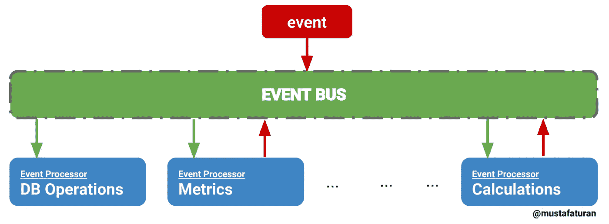

# 事件代理—比较开源选项

> 原文：<https://blog.devgenius.io/event-brokers-comparing-open-source-options-7dafdc6666fa?source=collection_archive---------7----------------------->

照片由 Unsplash 网站上的 Moritz Kindler 拍摄

在构建分布式应用程序时，您可能有任意数量的需要相互通信的单独服务。以这种方式构建应用程序的主要挑战之一是使服务之间的通信尽可能快速和无缝。

起初，每次发生特定的动作或事件时，让服务根据需要直接相互连接可能更容易。随着您的应用程序变得越来越复杂，不同事件的数量也越来越频繁和复杂，这就变得非常混乱。

在应用程序的早期阶段，服务之间看起来像是直观的一对一对话，但很快就变成了一个令人困惑的数据迷宫，向四面八方飞去，使调试和优化代码变得几乎不可能。添加一个新特性会在迷宫中增加一层，这种复杂性的叠加会将您快速简单的开发体验变成令人难以置信的艰苦工作。

不仅跟踪数据流极其困难，而且每个单独的事件都会为您的应用程序创建新的依赖关系。如果一个服务中的关键事件联系到另一个服务，而另一个服务又联系到另一个服务，那么这三个服务按照特定的顺序相互依赖。这些单独服务中的任何一个出现问题，都会完全中断链中每个人的功能！

来自[穆斯塔法·图兰](https://medium.com/u/444712df251a?source=post_page-----7dafdc6666fa--------------------------------)和药剂实验室

这些问题的解决方案是创建一种特定类型的服务——一种监听所有其他服务并根据需要发出信号的中央管理器。这被称为事件或消息代理。

事件代理消除了所有额外的依赖性，因为其他服务现在只需要从代理发送和接收消息。如果一个服务出现任何问题，其他服务能够无缝运行，只要它们与代理的通信保持完整，从而大大减少停机时间和由奇怪的数据流引起的意外问题。服务之间的通信现在是异步的，更加动态，新的特性更容易实现。

对于较小的应用程序，构建自己的最小事件代理来管理服务可能是可行的。我建议至少尝试一次，只是为了感受一下这种服务是如何工作的，这种设计的日常管理，以及您可能会想到什么样的扩展特性。但是，这种模式已经存在很久了，已经有很多不可思议的解决方案供你使用！

我将看看目前使用的三个最流行的开源事件代理:RabbitMQ、Apache Kafka 和 NATS。(其他专有的云平台选项，如 Google cloud pub/sub、Azure Event Hubs 或 Grid，以及 Aws ServiceBroker 或 Kinesis 是后续博客文章的主题。)

最流行的开源消息代理是 RabbitMQ 。它是语言不可知的，这意味着您可以使用任何您喜欢的语言来实现它。它足够轻量，可以部署在云、集群或镜像上。它利用高级消息队列协议进行异步消息传递，并且可以通过许多附加组件和分析软件进行扩展。

[Kafka 是来自 Apache](https://kafka.apache.org/intro) 的发布-订阅(pub/sub)消息系统。它很容易实现，而且非常强大。它比大多数其他选项有更多的数据持久性。许多大公司都在使用 Kafka，并且认为它非常可靠。

[NATS 速度极快，延迟极低](https://nats.io/about/)，适用于没有数据持久性的高频小型消息传递。NATS 是我将在目前的项目中尝试的服务，并计划在未来写更多有深度的帖子。

希望这是对事件/消息代理概念的一个很好的介绍。这是一个非常强大的概念，所有现代大型 web 应用程序都在使用它，而用来扮演这一角色的各种开源协议和服务真正塑造了 web 的基础设施和功能。

 [## 事件总线实现

### 事件驱动架构模式是一种分布式异步架构模式，用于创建高度可伸缩的反应式

medium.com](https://medium.com/elixirlabs/event-bus-implementation-s-d2854a9fafd5)  [## 现代信息系统研究——卡夫卡、RabbitMQ 和 NATS 流

### 分布式消息传递系统构成了大数据流、云原生应用和微服务的核心

arxiv.org](https://arxiv.org/abs/1912.03715)  [## 现代开源消息:Apache Kafka，RabbitMQ，NATS，Pulsar 和 NSQ

### # NATS:Ruby then Go https://nats.io/ NATS 最初是用 Ruby 构建的，并取得了可观的 15 万条消息/秒的成绩…

medium.com](https://medium.com/@philipfeng/modern-open-source-messaging-apache-kafka-rabbitmq-nats-pulsar-and-nsq-ca3bf7422db5)