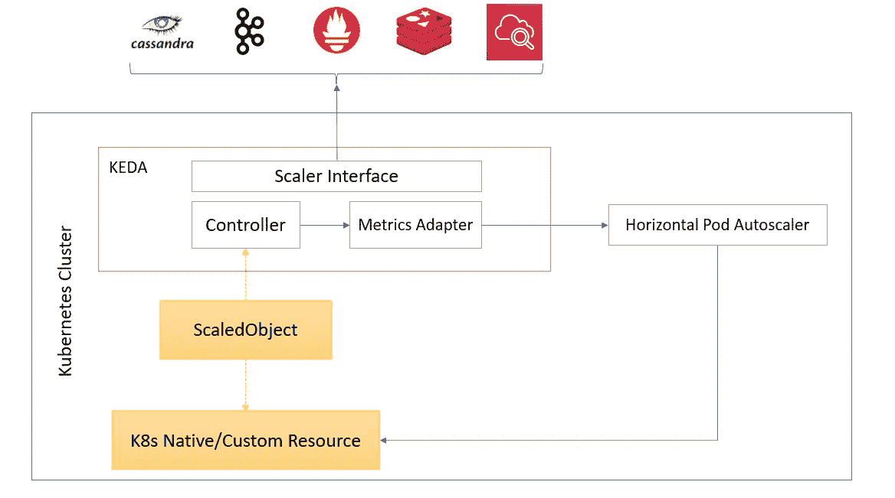
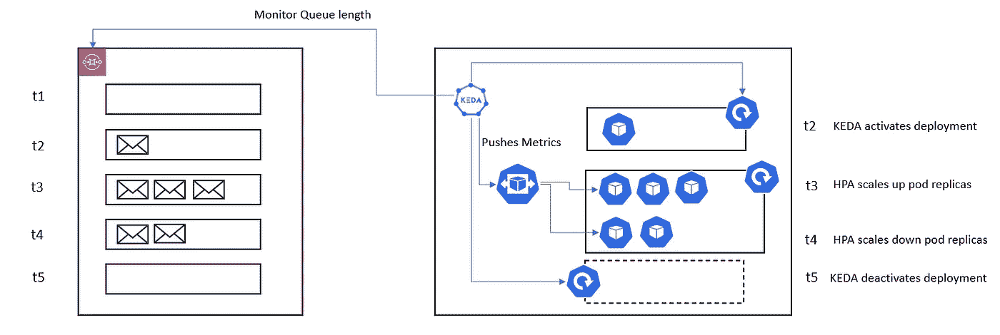

# K8s 的事件驱动自动缩放器

> 原文：<https://blog.devgenius.io/event-driven-autoscaler-for-k8s-2e24ebfa62e?source=collection_archive---------12----------------------->


在 [Unsplash](https://unsplash.com/s/photos/reaction?utm_source=unsplash&utm_medium=referral&utm_content=creditCopyText) 上由[纳迪尔·西吉](https://unsplash.com/@nadir_syzygy?utm_source=unsplash&utm_medium=referral&utm_content=creditCopyText)拍摄的照片

Kubernetes 对象的事件驱动激活

Kubernetes 附带了水平 Pod Autoscaler，用于根据某些指标(CPU 和内存)自动扩展 K8s 资源。当指标来自 K8s 本身时，HPA 工作得最好。它确实支持外部指标，但是它的设置很复杂，并且每个集群只支持一个指标服务器。这里我说的外部指标是指来自外部非集群对象(如 Cloudwatch)的指标。此外，HPA 不能将资源缩减到零。这意味着它只能在 1 到 n 之间调整资源。此外，它不能对外部指标采取行动。

HPA 限制:

*   **有限的外部指标支持**
*   **缩小到零是不可能的**

为了克服这些限制，我们可以利用 KEDA。

# Kubernetes 事件驱动自动缩放器



KEDA 是一个轻量级的开源组件，基于外部事件激活(从 0 到 1)和停用(从 1 到 0)资源。KEDA 与标准的 Kubernetes HPA 一起工作，并可以通过向其发送外部指标来扩展其功能。从 1 到 n 以及从 n 到 1 的缩放由 HPA 完成。KEDA 让我们在事件驱动的规模上明确地映射我们想要使用的应用程序，而其他应用程序继续照常运行。

> 1.KEDA →激活|向上扩展(0 → 1)
> 
> 2.KEDA → HPA →向上/向下扩展
> 
> 3.KEDA →停用|按比例缩小(1 → 0)

# KEDA 拓扑

## 缩放器(事件源)

这些是外部源接口，允许我们连接到它们并从源获得定制的指标。

[查看此链接，获取受支持事件源的完整列表。](https://keda.sh/docs/2.8/scalers/)

## CRDs

CRD 定义了所需的/期望的缩放行为。

*   **scaled objects**—scaler 和 K8s 工作负载(如部署、有状态集和其他 CRD)之间的关系。
*   **ScaledJobs** —定标器和 K8s 作业的关系。

> 部署`ScaledObject`也会创建 HPA 对象，但是，部署 ScaleJob 不会创建任何 HPA 对象。如果是规模化作业，所有的规模化作业均由 KDA 完成。

**KEDA 操作员:** KEDA 操作员作为代理工作，能够根据配置的事件停用和激活 k8 部署。KEDA 操作符在 k8 集群中作为一个独立的容器运行。

**KEDA 度量适配器:** KEDA 度量适配器将队列长度或流延迟等事件数据暴露给水平 Pod 自动缩放器，以驱动缩放。更简单地说，它将缩放器获得的指标转换成 HPA 可以使用的格式。

## 证明

监控事件源的身份验证配置或秘密。这些定义了连接外部事件源所需的安全对象，如 API 密钥、secret 和 cert。有两种类型的身份验证对象:

*   触发认证
*   ClusterTriggerAuthentication

## 安装 KEDA 操作器:

```
#Adding the Helm repo
helm repo add kedacore [https://kedacore.github.io/charts](https://kedacore.github.io/charts)
helm repo update
kubectl create namespace keda
helm install keda kedacore/keda --namespace keda
```

上述命令将注册 CRD 并启动两个 pod:

```
keda-operator
keda-operator-metrics-apiserver
```

设置 KEDA 以监控 SQS 队列并扩展部署中的工作人员(my-sqs-consumer)。[SQS 定标器的参考。](https://keda.sh/docs/2.8/scalers/aws-sqs/)

```
apiVersion: v1
kind: Secret
metadata:
  name: role-secrets
  namespace: keda-demo
data:
  AWS_ROLE_ARN: <encoded-iam-role-arn>---
apiVersion: keda.sh/v1alpha1
kind: TriggerAuthentication
metadata:
  name: keda-trigger-auth-aws-credentials
  namespace: keda-demo
spec:
  secretTargetRef:
  - parameter: awsRoleArn
    name: role-secrets
    key: AWS_ROLE_ARN
---apiVersion: keda.sh/v1alpha1
kind: ScaledObject
metadata:
  name: aws-sqs-queue-scaledobject
  namespace: keda-demo
spec:
  scaleTargetRef:
    apiVersion: apps/v1
    kind: Deployment
    name: my-sqs-consumer
  pollingInterval: 5
  cooldownPeriod: 10
  idleReplicaCount: 0
  minReplicaCount: 1
  maxReplicaCount: 3 
  fallback:
    failureThreshold: 3
    replicas: 2 
  triggers:
  - type: aws-sqs-queue
    authenticationRef:
      name: keda-trigger-auth-aws-credentials
    metadata:
      queueURL: <my_queue_url> 
      queueLength: 1
      awsRegion: "us-east-1"
      identityOwner: operator 
```

我跳过了这里的 IRSA 场景。在 EKS 和 AWS IAM 之间进行配置。



KEDA 时间轴 w . r . t SQS 队列中的邮件数

上图描述了 KEDA 如何使用 SQS 队列。t1，t2..tn 代表各种事件时间。

> 注意:要自动缩放自定义资源，对象的 CRD 必须定义`/scale`子资源。
> `subresources:
> scale:`

气流也支持 KEDA 的情况下，我们使用芹菜工人。这个自动缩放器根据处于`queued`或`running`状态的任务数量来调整活动的芹菜工人数量(从 0 到 n 或相反)。与 KEDA 一起运行气流带来了最好的两个世界。Kubernetes 的弹性通过 KEDA 和快速跟进、低开销优化 CeleryExecutor 和 workers 提供动力。

```
helm install airflow apache-airflow/airflow **\**
    --namespace airflow **\**
    **--set executor=CeleryExecutor \
    --set workers.keda.enabled=true**# Metrics collection SQLSELECT
    ceil(COUNT(*)::decimal / {{ .Values.config.celery.worker_concurrency }})
FROM task_instance
WHERE state='running' OR state='queued'
```

*注意:用 KEDA 缩减长期运行的任务是一个公开的问题。所以，我不建议生产使用。*

感谢阅读！！