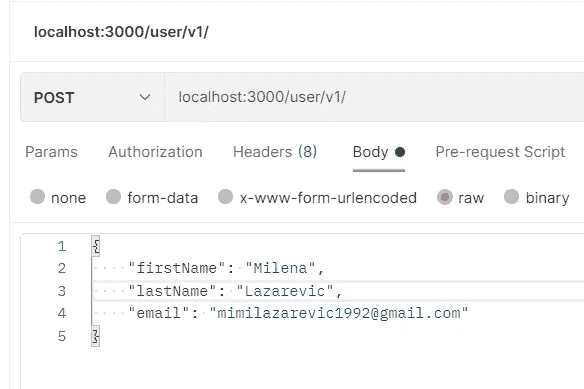
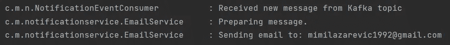
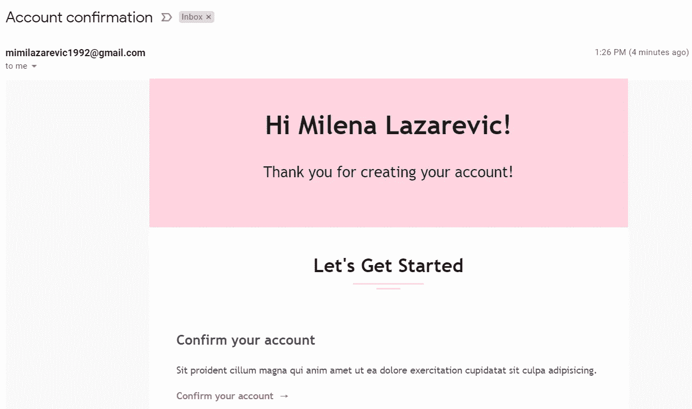

# 基于 Spring 云流的事件驱动微服务

> 原文：<https://blog.devgenius.io/event-driven-microservices-with-spring-cloud-stream-e034eee3f394?source=collection_archive---------0----------------------->

## 使用 Spring Cloud Stream 和 Apache Kafka 消息代理发布和使用消息


弗朗兹·卡夫卡的雕像，照片由桑德罗·冈萨雷斯在 [Unsplash](https://unsplash.com?utm_source=medium&utm_medium=referral) 上拍摄

# 介绍

事件驱动架构需要深谋远虑，创建脚手架以集成流行的事件流平台可能会变得复杂。Spring Cloud Stream 是一个消息驱动的微服务应用框架，它为各种消息代理、RabbitMQ、Apache Kafka、Kafka Streams、Amazon Kinesis 等提供绑定器实现。该框架可以简化事情，并允许我们轻松地为不同的平台构建消息发布和消费，方法是避开所选平台的特定实现细节，并使用已经熟悉的 Spring 习惯用法和 Spring 接口。

在这篇文章中，我们将使用 Apache Kafka 消息代理。

> 杰伊·克雷普斯(Jay Kreps)选择以作者弗朗兹**卡夫卡**的名字给软件命名，因为它是“一个为写作而优化的系统”，他喜欢**卡夫卡的**作品。
> 来源:[维基百科](https://en.wikipedia.org/wiki/Apache_Kafka#:~:text=Kafka%20was%20originally%20developed%20by,and%20he%20liked%20Kafka's%20work.)

在我的上一篇文章中，我们使用 Spring 应用程序事件在每次客户预订时触发电子邮件发送。

[](/automate-emails-using-spring-application-events-apache-freemarker-eeccf0c56b75) [## 使用 Spring 应用程序事件和 Apache FreeMarker 自动化电子邮件

### 使用 FreeMarker 模板引擎发送包含动态 HTML 内容的电子邮件

blog.devgenius.io](/automate-emails-using-spring-application-events-apache-freemarker-eeccf0c56b75) 

现在，我们将在此基础上构建，以了解 Spring 云流架构。我们将把该应用程序分成两个通过消息进行通信的微服务。我们将创建用户服务，这将处理用户管理和通知服务，将负责发送不同的通知，在这种情况下，电子邮件。

用户服务将成为消息生产者(发布者)，它将在每次创建新用户帐户时向 Kafka 主题发布消息。通知服务将成为消息使用者，它将使用消息队列中的消息并对这些消息做出反应，而无需由用户服务显式调用。
通过使用消息通信，我们还可以添加新功能，通过让用户监听消息队列中的消息来对用户服务的变化做出反应，并允许我们的服务进行扩展。

# 属国

Spring Cloud Stream 应用程序具有一个中间件中立的核心，并通过*绑定*在由外部代理公开的目的地之间进行通信。建立绑定所需的代理特定细节由*绑定器*实现处理。将卡夫卡绑定器实现添加到 User 服务和 Notification 服务中的`gradle.build`或`pom.xml`文件以及其他需要的依赖项中。

```
dependencies **{
  ...**
   implementation 'org.springframework.cloud:spring-cloud-stream'
   implementation 'org.springframework.cloud:spring-cloud-stream-binder-kafka'
  ...
**}**
```

# 通知业务

由于 Notification 服务将使用由 User 服务发布的消息，让我们创建一个`Consumer` bean。Consumer 表示接受单个输入参数的操作。在这种情况下`UserDto`将持有关于注册用户的信息，比如他的名字和电子邮件地址。

绑定是源和目标之间的桥梁，在函数式编程模型中，绑定名称默认为:

*   投入— `<functionName> + -in- + <index>`
*   产出— `<functionName> + -out- + <index>`

*其中* `*in*`和*以及* `*out*`分别对应 T21 的绑定类型、输入或输出。

为了提高可读性，我们可以通过使用以下属性将*隐式绑定名称*映射到*显式绑定名称*，为绑定提供更具描述性的名称:

```
spring.cloud.stream.bindings.eventConsumer-in-0.destination= notification-events
```

# 用户服务程序

由于这是一个按需事件，我们需要注入一个`StreamBridge` bean，它将允许我们将数据发送到一个输出绑定，从而在非流应用程序和 Spring Cloud Stream 之间创建一个桥梁。为了触发源绑定的创建，我们使用`spring.cloud.stream.source=supplier`属性，其中我们声明了源的名称。然后，我们使用`spring.cloud.stream.bindings.supplier-out-0.destination=notification-events`属性为其提供与 Notification 服务中相同的显式名称。对于`streamBridge.send()`方法，我们传递一个 POJO，它将经过相同的例程，就好像它来自于 Function 或 Supplier 一样。

# 码头工人

为了运行它，你需要安装卡夫卡和 Zookeeper，我使用 Docker 来运行卡夫卡和 Zookeeper 以及其他的微服务。下面是一段`docker-compose.yml`片段:

使用微服务`application.proeprties`中的`spring.cloud.stream.kafka.binder.brokers=kafka`属性提供 Kafka binder 所连接的代理列表。默认是`localhost`。如果你运行 Kafka 的端口不是默认的`9092`，你可以使用`spring.cloud.stream.kafka.binder.defaultBrokerPort`属性。

设置好一切后，我们现在可以向用户服务发送请求了。



我们可以在通知服务的日志中看到它收到了消息。



电子邮件成功到达



*注意，Spring Cloud Stream 使用 Spring Retry 库，每当消息处理过程中出现异常时，框架都会多次尝试重试相同的消息(默认为 3 次)。*

# 最后的话

Spring Cloud Stream 让处理异步消息变得很容易。它采用函数式编程模型，用 Java 的函数接口将 Kafka 生产者、消费者和加工者定义为供应者、消费者和函数。您只需定义一个供应商、消费者或功能 Spring Beans，Binder 将处理与所选代理的集成，允许您的代码专注于业务逻辑并保持中间件中立。

完整演示项目的源代码可在 [GitHub](https://github.com/Milena92/event-driven-ms) 上获得。