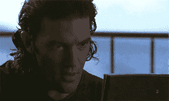
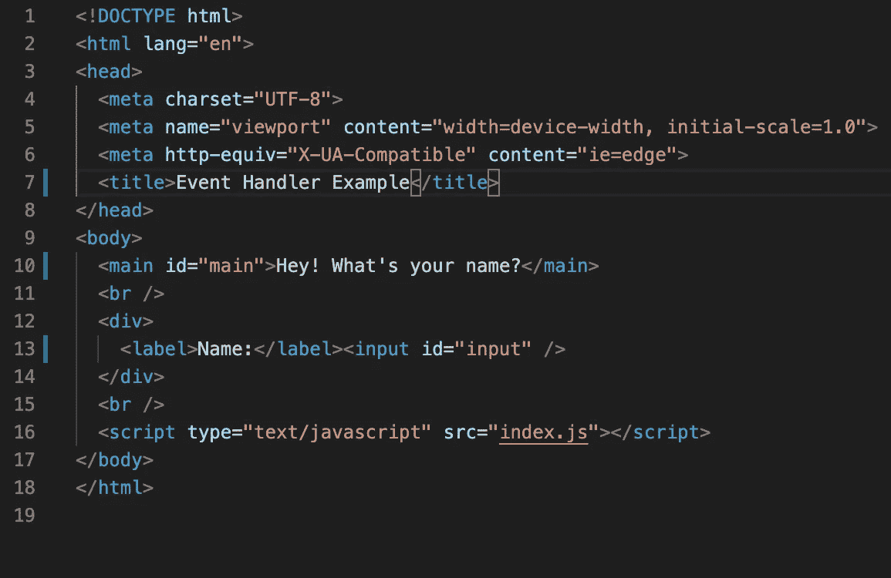
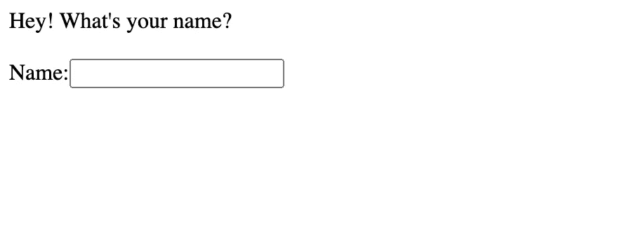
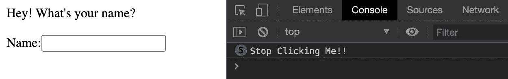

# Javascript 中的事件处理:初学者指南

> 原文：<https://blog.devgenius.io/event-handling-in-javascript-a-beginners-guide-1f5a01574798?source=collection_archive---------23----------------------->


关于 JavaScript，我学到的最有趣的方面是事件处理。

作为一个编程新手，我经常想知道在幕后发生了什么样的魔法，让我在网络上导航，点击页面，调整页面大小，填写表格，提交表格，就像一篇文章，记住一幅图像……这样的例子不胜枚举。不知何故，我期望它本身是一种复杂的编程语言，但我并不期望它完全归功于一些听起来像“事件处理程序”的基本东西。用户体验的关键以及应用程序/网站的最终成功可能要归功于事件处理程序，它们被放置在哪里，以及它们如何决定网站或应用程序的用户体验。

事实上，听起来令人难以置信的哲学(#fakedeep)，当你想一想，我们的大部分互动都是通过我们的手机进行的。我们用它们来计划我们的日子，组织我们的生活，娱乐我们自己…我们如何进行这些活动是由事件处理者决定的。你可以说事件处理程序相当于我们的生活方式。



我的书——《与丘克一起哲学思考》将于 1 月 32 日出版。给自己弄一份拷贝！

好了，回到事件处理程序的技术方面。

它们是如何设置和工作的？

在向 JavaScript 代码添加事件处理程序时，您应该已经创建了项目/网站/应用程序的 HTML 基础/结构。事件处理程序使您的代码具有交互性。它们本质上是你创建项目的基本 HTML 代码后的“下一步”。您不会使用事件处理程序来创建[节点](https://stackoverflow.com/questions/24974621/what-is-a-node-in-javascript#:~:text=A%20%22node%22%2C%20in%20this,document%22%20and%20%22element%22.) (HTML 元素)…。好吧，从技术上来说你可以，但是让我们把注意力集中在基础上。

这里有一个事件处理程序如何工作的基本例子。

下面是我的基本 HTML 结构，它位于我的 index.html 文件中。在这里，在

<main>标签中，我添加了一个问候“你叫什么名字？”邀请用户输入他们希望如何被识别。我还添加了</main>



index.html

在网页上，它看起来像下面这样:



在我的 index.js 文件中(我所有的 Javascript 代码都将位于该文件中)，我将添加我的事件处理程序。

首先，我需要找到我想要添加事件处理程序的元素。对于本例，我希望将事件处理程序添加到 id 为“input”的输入字段中。因此，我将使用“getElementbyId”方法定位它，并使用“const”将其添加到变量中，因为变量的内容不会改变。我也可以使用“querySelector”方法，如下所示:

```
const input = document.getElementById("input");ORconst input = document.querySelector("#input")
```

接下来，我将把事件处理程序添加到变量名中。

*边注——事件处理程序有很多，这里列出了最流行的*[](https://developer.mozilla.org/en-US/docs/Web/Events)**和一个* [*列表*](http://help.dottoro.com/larrqqck.php) *其中的事件处理程序在各种浏览器上都受支持。**

```
*input.addEventListener*
```

*现在我已经将事件处理程序添加到节点中(通过变量名)，我需要添加我希望 Javascript 监听的事件。在这里，我希望它监听用户在输入字段中的鼠标点击，所以我将添加“click”作为第一个参数。*

```
*input.addEventListener(“click”, () => {*
```

*接下来，我将添加所谓的“回调函数”，这是事件发生后应该发生的事情。我在控制台日志中添加了，每当用户用鼠标点击输入字段时，它应该向控制台日志发送一个字符串，说“停止点击我！!"*

```
*input.addEventListener(“click”, () => {console.log(“Stop Clicking Me!!”)})*
```

*Et，瞧！每当用户点击输入字段时，消息将如下所示发送到控制台日志，消息旁边的数字是用户点击字段的次数:*

**

*….这就是基本事件处理程序的工作方式。根据事件处理程序的设置，一旦用户触发了一个事件(在上面的例子中，是一次点击)，事件处理程序就会查看回调函数并做出相应的响应。*