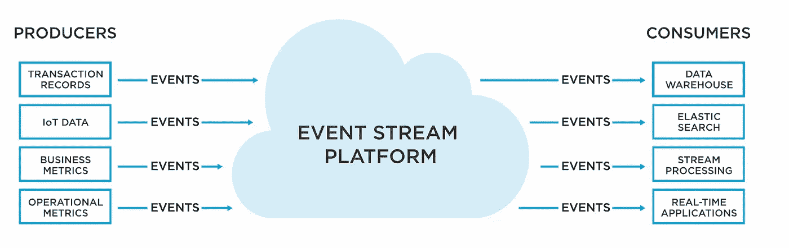
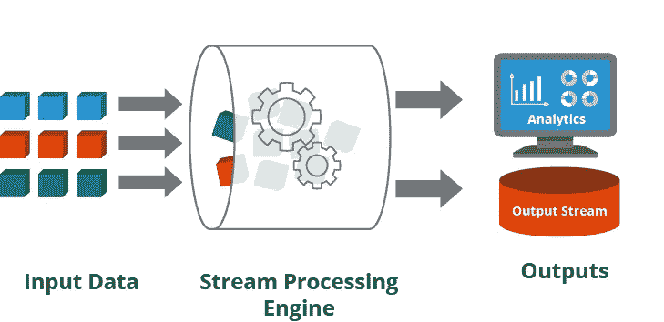
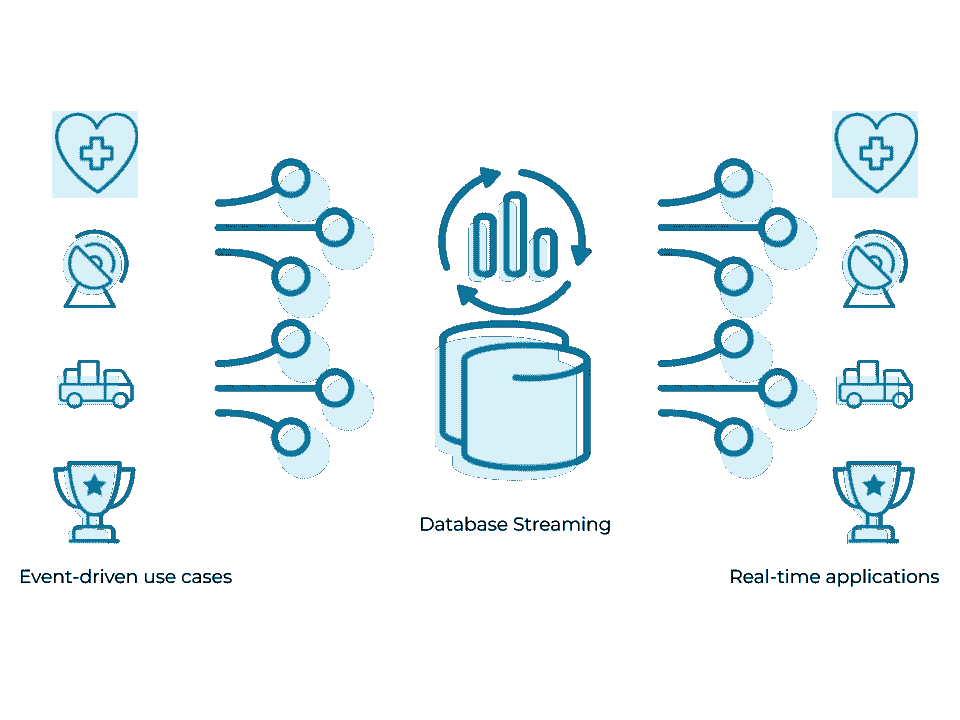
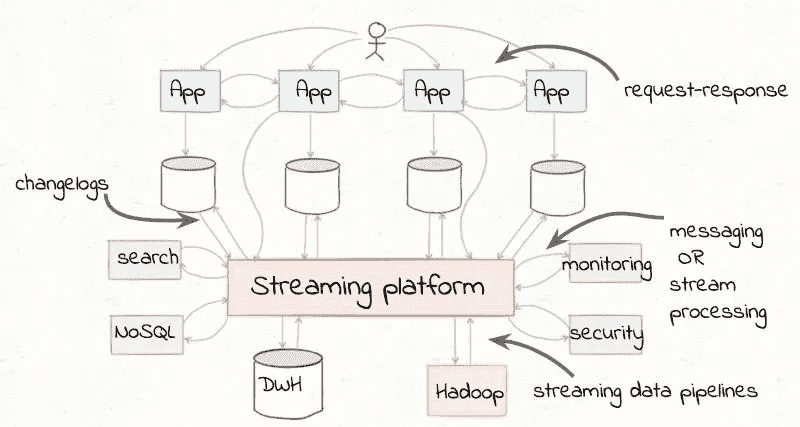
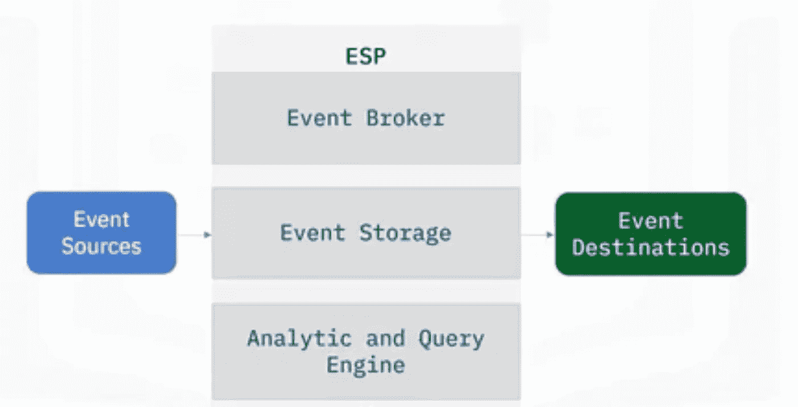
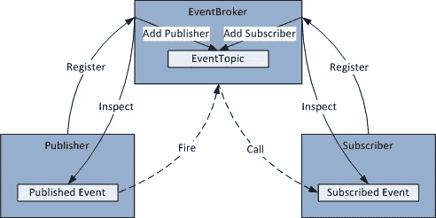

# 事件流平台

> 原文：<https://blog.devgenius.io/event-processing-platform-4d950c4ff3e3?source=collection_archive---------8----------------------->

图片来自 tibco.com

在研究什么是**事件流平台**是以及它是如何工作的之前，最好先了解一下事件到底是什么

**事件:**事件是一种解释实体可观察到的状态随时间更新的数据，如房间温度、CRUD 操作、I/O 周期

事件可以有不同的格式，一些常见的格式有

*   日期、数字和纯文本实例的基本类型
*   实例的键值格式
*   复杂类型，如 JSON、XML、字节列表和元组

## 事件流

事件流处理(ESP)是一个将数据从一个地方连续传输到另一个地方的过程，简而言之，就是数据点从产生它的系统到想要使用它的系统的连续流动。事件源和事件目的地之间正在进行的事件传输称为事件流。

图片来自互联网

需要注意的主要一点是，我们也可以传输聚合数据。例如，从原始数据到特定时间间隔的特定点的某种分析、转换(更改数据类型、格式等)、丰富(非规范化不同的模式和数据点以实现所需的分析)

## ESP 是如何工作的？

图片来自互联网

事件流处理与批处理系统完全不同，也很复杂。问题是

是什么让 ESP 变得如此复杂？

在 ESP 中，我们需要处理单个数据点，这意味着处理一个时间点的小数据集，而不是整个数据集。

## 数据生产者和消费者的松散耦合

ESP 的行为类似于各种源和目的地之间的中间层，并提供统一的接口。假设我们有不同微服务的多个来源，我们应该向其中发送数据。为了更好的理解，最好的方法是什么？

图片来自 tibco.com

服务名称订单需要向客户发送数据和付款。类似地，名为 transaction 的服务更新另一个服务客户和事件。它可能需要大量的 API 逻辑，并且看起来仍然不是一个可伸缩的解决方案，不需要创建单独的 API 来将数据发送到不同的目的地。ESP 缓解了这种问题。因此，所有事件源只需要将事件发送到 ESP，而不是发送到单个事件目的地。另一方面，事件目的地只需要订阅一个 ESP，并且只使用从 ESP 发送的事件，而不是单个事件源。这也提供了单一的信任来源，并且没有事件读取一致性的风险

## ESP 的基本组件

ESP 中有三个重要的概念

图片来自 IBM 工程

这些概念中的每一个都被设计为容易和可容忍地执行和管理流

1-事件代理

双事件存储

3-分析和查询引擎

## **1-事件代理:**

来自代码项目的图像

事件代理是 ESP 的核心组件。代理负责接收和消费事件。

> Event broker 提供了一些最重要的特性，比如松耦合、线程同步、多个发布者/订阅者、弱引用。

它主要由 3 个部分组成。

in gester:in gester 的唯一目的是起草准确接受来自巨大事件源的事件。

**处理器**:处理器层负责压缩、解压缩、加密、解密和序列化、反序列化等

**消费:**消费提供从事件存储中读取的数据，并从它们的查询引擎提供给目的地执行分析

## **双事件存储**

它被设计用来存储从不同来源接收的事件。事件存储可以是你的任何数据库(SQL 或 NoSQL)，云存储等

## **3-分析和查询引擎**

非常重要的是，它负责查询和分析存储的事件，并帮助从数据中发现洞察力

## 你应该采用 ESP 的地方

事件流平台被广泛应用于我们需要实时分析的场合

*   实时信用评分，
*   客户关系管理(CRM)，
*   [销售点的欺诈检测](https://www.sisense.com/dashboard-examples/telecom/fraud-analytics/)
*   针对个人客户

其中当前数据在系统稳定性和性能中起着至关重要的作用

## **顶级 ESP 可用**

一些流行的流媒体平台包括

*   阿帕奇风暴
*   阿帕奇卡夫卡
*   阿帕奇弗林克

阿帕奇火花

阿帕奇火花

阿帕奇卡夫卡

阿帕奇弗林克