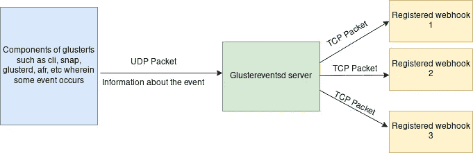

# Glusterfs 中的事件功能

> 原文：<https://blog.devgenius.io/eventing-feature-in-glusterfs-e842d5f9bc5?source=collection_archive---------4----------------------->

这篇文章是关于 glusterfs 中被称为事件的特性之一。顾名思义，这与 glusterfs 中发生的任何事件相关，可能是卷创建、卷删除、地理代表事件、对等事件等等。

问题是它是如何被捕获的？这就是这篇文章的内容…

# 它是如何工作的

现在，如果你是一个已经探索过或者热衷于在引擎盖下寻找的人，那么你会注意到 glusterfs 代码中一个叫做 gf_event 的东西。(如果你还没有，你可以通过 [github/glusterfs](https://github.com/gluster/glusterfs) 浏览 github 中的 glusterfs，或者如果你很想开始使用这个功能，请转到下一部分)



事件流

现在，我们可以将一个事件视为 glusterfs 中发生的一些重大变化，例如卷创建。

现在，当用户通过 cli 触发卷创建时，请求将被推送到 glusterd，卷创建所需的操作将完成，一旦成功完成，在 cli 显示成功消息之前，将调用 gf_event 函数，传递的参数是刚刚创建的卷信息。

现在，gf_event 将在内部调用 _gf_event 函数，该函数创建 UDP 套接字并推送消息。

在另一端，我们有一个名为 glustereventsd 的服务，它有一个 UDP 服务器监听任何传入的数据包。一旦它接收到数据包，它将被解析，然后最终被推送到所有已注册监听事件的 web 挂钩。

我想我们现在可以进入命令了…让我们用事件弄脏我们的手吧！

# 使用事件

在继续这些步骤之前，让我先弄清楚我使用的是什么环境。我用的是 Fedora 32 VM，Glusterfs 的版本是 9dev(主分支)。

让我们先从 web-hook 开始，也就是说，除了我们简单的 API 服务器，什么都没有。

现在我在这里使用一个简单的 flask 应用程序。您可以使用它，甚至可以使用 glusterfs 中 events/tools/eventsdash.py 上的 flask 应用程序。

这个简单的 Flask 程序有两条路径，都服务于 POST 方法。

1.  一条路线为**/**。
2.  **【倾听】**的一条路线。

端口是 9000，为了显示输出，我打开了调试模式。

既然 flask 应用程序已经准备好了，让我们继续讨论 glusterfs 中的事件部分，这个部分必须打开。

我们需要启动 glustereventsd 服务，所以..

```
[root@server1 ~]# systemctl start glustereventsd
[root@server1 ~]# systemctl enable glustereventsd
Synchronizing state of glustereventsd.service with SysV service script with /usr/lib/systemd/systemd-sysv-install.
Executing: /usr/lib/systemd/systemd-sysv-install enable glustereventsd
[root@server1 ~]#
```

一旦事件启动，我们需要启动 flask 应用程序并将其注册为 webhook。

```
[root@server1 home]# python3 flask_client.py 
 * Serving Flask app "flask_client" (lazy loading)
 * Environment: production
   WARNING: This is a development server. Do not use it in a production deployment.
   Use a production WSGI server instead.
 * Debug mode: on
 * Running on [http://0.0.0.0:9000/](http://0.0.0.0:9000/) (Press CTRL+C to quit)
 * Restarting with stat
 * Debugger is active!
 * Debugger PIN: 353-160-127
```

下一步是注册 webhook。为此，我们将使用命令 gluster-eventsapi。检查状态，

```
[root@server1 ~]# gluster-eventsapi status
Webhooks: None+-----------+-------------+-----------------------+
|    NODE   | NODE STATUS | GLUSTEREVENTSD STATUS |
+-----------+-------------+-----------------------+
| localhost |          UP |                    OK |
+-----------+-------------+-----------------------+
[root@server1 ~]#
```

在注册之前，让我们检查一下我们是否能够与 flask 应用程序通信，

```
[root@server1 ~]# gluster-eventsapi webhook-test [http://0.0.0.0:9000/](http://0.0.0.0:9000/)
+-----------+-------------+----------------+
|    NODE   | NODE STATUS | WEBHOOK STATUS |
+-----------+-------------+----------------+
| localhost |          UP |             OK |
+-----------+-------------+----------------+
[root@server1 ~]#
```

因此，节点和 webhook 都启动了。在检查烧瓶输出时，

```
<Request '[http://0.0.0.0:9000/'](http://0.0.0.0:9000/') [POST]>
127.0.0.1 - - [04/Sep/2020 09:19:02] "POST / HTTP/1.1" 200 -
```

下一步是注册 webhook，

```
[root@server1 ~]# gluster-eventsapi webhook-add [http://0.0.0.0:9000/listen](http://0.0.0.0:9000/listen)
+-----------+-------------+-------------+
|    NODE   | NODE STATUS | SYNC STATUS |
+-----------+-------------+-------------+
| localhost |          UP |          OK |
+-----------+-------------+-------------+
[root@server1 ~]# gluster-eventsapi status
Webhooks: 
[http://0.0.0.0:9000/listen](http://0.0.0.0:9000/listen)+-----------+-------------+-----------------------+
|    NODE   | NODE STATUS | GLUSTEREVENTSD STATUS |
+-----------+-------------+-----------------------+
| localhost |          UP |                    OK |
+-----------+-------------+-----------------------+
[root@server1 ~]#
```

正如我们所看到的，webhook 被注册，glusterfs 中的事件将被传递给 webhook。

让我们创建一个 gluster 卷。然后，我们可以观察到事件被传递到 webhook。创建卷时，

```
[root@server1 /]# gluster vol create vol1 replica 3 server1:/data/brick/br1 server1:/data/brick/br2 server1:/data/brick/br3 force
volume create: vol1: success: please start the volume to access data
[root@server1 /]#
```

我们在 webhook 中得到下面的响应，

```
{'event': 'VOLUME_CREATE', 'message': {'bricks': ' server1:/data/brick/br1 server1:/data/brick/br2 server1:/data/brick/br3', 'name': 'vol1'}, 'nodeid': 'c61dc1be-14b1-45b1-8a5a-9f401f6dcb22', 'ts': 1599193580}
127.0.0.1 - - [04/Sep/2020 09:56:20] "POST /listen HTTP/1.1" 200 -
```

删除卷时，

```
[root@server1 /]# gluster vol delete vol1
Deleting volume will erase all information about the volume. Do you want to continue? (y/n) y
volume delete: vol1: success
[root@server1 /]#
```

我们看到了回应，

```
{'event': 'VOLUME_DELETE', 'message': {'name': 'vol1'}, 'nodeid': 'c61dc1be-14b1-45b1-8a5a-9f401f6dcb22', 'ts': 1599193693}
127.0.0.1 - - [04/Sep/2020 09:58:13] "POST /listen HTTP/1.1" 200 -
```

让我们更深入地看看响应 JSON 的内容，

```
{
    'event' : 'VOLUME_DELETE',
    'message' : {'name' : 'vol1'},
    'nodeid' : 'c61dc1be-14b1-45b1-8a5a-9f401f6dcb22',
    'ts' : 1599193693
}
```

因此，事件响应内部有四个组件，事件、对应于事件的消息、节点 id 和时间戳。使用这些信息，我们实际上可以创建一个 webhook，然后它可以对正在使用的 glusterfs 集群的健康状况进行一些日志分析或事件预测分析。

除了这些命令之外，要查看事件系统的配置，即日志模式以及用于将消息推送到 Glustereventsd 的 UDP 端口，可以使用 **config-get** 命令，

```
[root@server1 glusterfs]# gluster-eventsapi config-get
+--------------------+-------+
|        NAME        | VALUE |
+--------------------+-------+
|     log-level      |  INFO |
|        port        | 24009 |
| disable-events-log | False |
+--------------------+-------+
[root@server1 glusterfs]#
```

要设置配置，命令是 config-set。例如，让我们将日志级别设置为 DEBUG，

```
[root@server1 glusterfs]# gluster-eventsapi config-set log-level DEBUG
+-----------+-------------+-------------+
|    NODE   | NODE STATUS | SYNC STATUS |
+-----------+-------------+-------------+
| localhost |          UP |          OK |
+-----------+-------------+-------------+
[root@server1 glusterfs]# gluster-eventsapi config-get
+--------------------+-------+
|        NAME        | VALUE |
+--------------------+-------+
|     log-level      | DEBUG |
|        port        | 24009 |
| disable-events-log | False |
+--------------------+-------+
[root@server1 glusterfs]#
```

另外，假设有人想要删除正在使用的 webhook，他们可以使用命令，

```
[root@server1 glusterfs]# gluster-eventsapi webhook-del [http://localhost:9000/listen](http://localhost:9000/listen)
+-----------+-------------+-------------+
|    NODE   | NODE STATUS | SYNC STATUS |
+-----------+-------------+-------------+
| localhost |          UP |          OK |
+-----------+-------------+-------------+
[root@server1 glusterfs]# gluster-eventsapi status
Webhooks: None+-----------+-------------+-----------------------+
|    NODE   | NODE STATUS | GLUSTEREVENTSD STATUS |
+-----------+-------------+-----------------------+
| localhost |          UP |                    OK |
+-----------+-------------+-----------------------+
[root@server1 glusterfs]#
```

要获得更多信息，可以使用 ehelp 命令查看 gluster-eventsapi 支持哪些子命令。

来到日志记录部分，可以在**/var/log/glusterfs/events . log**中找到正在进行的日志记录。

这是关于 Glusterfs 中事件的含义以及如何使用它的基本介绍。如果考虑这样的场景，这是一个有趣的特性，其中日志可以用于进一步的分析和预测。

供思考的食物…