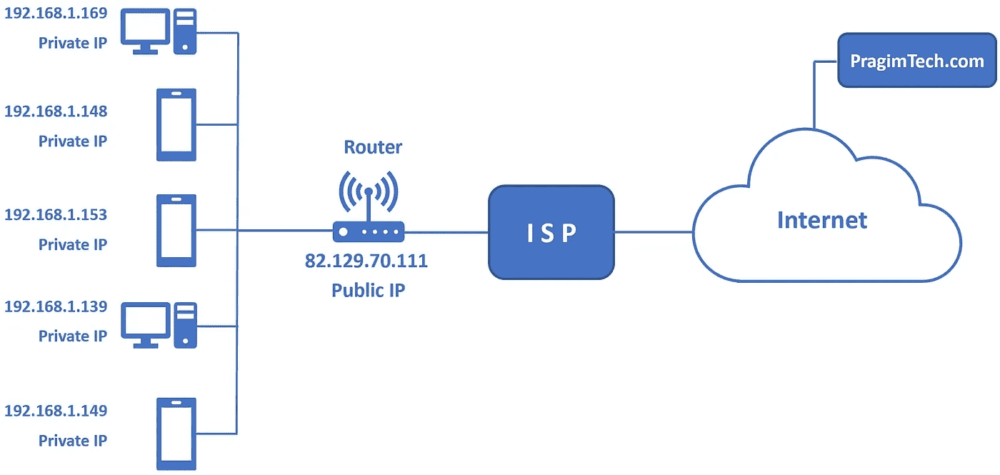

# 想知道数据是如何通过互联网传输的吗？

> 原文：<https://blog.devgenius.io/ever-wonder-how-data-is-transferred-over-the-internet-ec4eb3d6d66f?source=collection_archive---------2----------------------->


互联网上的数据传输

你有没有想过服务器是如何知道我的笔记本电脑发出了请求，它必须只向我的设备发送响应的？我的笔记本电脑或设备在从服务器获取数据后，如何知道它们必须向哪个应用程序发送响应？

在这篇文章中，我将用一种非常简单易懂的方式来解释这个概念。

**首先，我们来了解一下什么是互联网:**

> **互联网**是一个全球性的计算机网络，通过互联设备传输各种数据和媒体。它通过使用遵循**互联网协议(IP)** 和**传输控制协议(TCP)** 的分组路由网络来工作。

如果你不知道什么是 IP 和 TCP 也不用担心。它们只是互联网社会定义的一套规则。我们不需要理解这些协议就能知道数据是如何在互联网上传输的。

只要知道 TCP 和 IP 一起工作，以确保互联网上的数据传输是一致和可靠的，无论您使用哪种设备或在哪里使用它。

所以基本上，互联网的工作方式是，我们从互联网服务器请求数据，然后服务器将数据发送回我们的设备。

当数据通过互联网传输时，数据被分成大小相同的小块，称为数据包。

每个数据包都包含报头，报头解释了数据的来源和结束位置，以及它与其余数据包的位置。

数据包包含 IP 地址。

**现在，这个术语 IP 地址是什么？**

简而言之，IP 地址或互联网协议地址是一系列数字，用来识别网络上的任何设备。计算机使用 IP 地址在互联网和其他网络上相互通信。


IP 地址

**奖金:想知道自己的 IP 地址？**

在终端中键入以下命令。

```
curl ifconfig.me -s
```

我们不会深入 IP 地址的细节，只是知道它是什么。

我们的电脑或设备通过调制解调器或路由器连接到互联网。总之，这些设备允许您连接到全球的其他网络。

这些调制解调器和路由器连接到我们的互联网服务提供商(ISP)。

比方说，你输入一个网址，称为 URL(统一资源定位器)。每个网站都有自己独特的 URL，向您的 ISP 发送您想去的地方的信号。

您的查询被推送到您的 ISP，ISP 连接到几个存储和发送数据的服务器。

接下来，您的浏览器通过 DNS 查找您在搜索引擎中输入的域名的 IP 地址。然后，DNS 会将您在浏览器中键入的基于文本的域名转换为基于数字的 IP 地址。

*   **例:Google.com 变成了 64.233.191.255**

好的，等等，我用了一个新术语 DNS。这是什么？


什么是 DNS？

**域名系统(DNS)** 负责将域名翻译成特定的 IP 地址，以便发起客户端可以加载所请求的互联网资源。

就是这样。这就是 DNS 的作用。

现在让我们回到理解数据传输过程的轨道上来。

有两种类型的 IP 地址:

*   **全球或公共 IP 地址**
*   **本地或私有 IP 地址**



公共 IP 和私有 IP

每台路由器/调制解调器都有一个全局/公共 IP 地址，与之相连的每台设备都有自己的本地 IP 地址。因此，当你请求**google.com**时，互联网看到的是请求来自一个全球/公共 IP 地址，而不是你的本地/私有 IP 地址，它会将数据发送到公共 IP 地址。

那么本地/私有 IP 地址有什么用呢？

当响应到来时，路由器/调制解调器如何知道哪个设备发出了请求？这就是本地/专用 Ip 地址发挥作用的地方，因为每台设备都有自己的本地/专用 IP 地址，所以当您发出请求时，路由器将通过 NAT 知道，这个特定的设备发出了请求。

**又一个新名词 NAT。这是什么？**

NAT 代表网络访问转换器，路由器使用它来了解哪个设备发出了请求。NAT 将本地 IP 地址与路由器/调制解调器的全局 IP 地址进行映射。

更重要的是，即使我们的设备接收到了互联网，它如何知道是哪个应用程序发出了请求？我们可以同时使用多个应用程序，如网络浏览器或游戏应用程序，那么它如何知道将数据发送到哪里呢？

**这是通过识别端口号来实现的。**

**端口号**是一种识别特定进程的方式，当互联网或其他网络消息到达服务器时，该消息将被转发到该特定进程。

*   **例如，如果您发出 HTTP 请求，端口号将为 80，如果您发出 HTTPS 请求，端口号将为 443。**

因此，在端口号的帮助下，您的设备将识别应用程序并只向该应用程序发送数据。

这是在键入网址或从互联网上请求任何东西时，数据是如何传输的一般概述。我希望我让这个概念对你来说更简单。

我将在接下来的文章中发布更多关于计算机网络概念的内容。如果你想知道更多关于计算机网络的知识，请继续关注。

如果您有任何问题或反馈，请发表评论并告诉我，让我们在 [**Twitter**](https://twitter.com/ApoorvD72358398) 、 [**Linkedin**](https://www.linkedin.com/in/apoorv-dubey-8a3a31191/) 和[**insta gram**](https://www.instagram.com/d_apoorv/)**到上联系，共同学习和成长。**