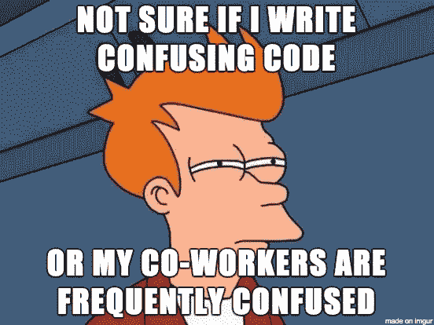

# 每种代码都有它的受众

> 原文：<https://blog.devgenius.io/every-code-has-its-audience-a46f79fbeceb?source=collection_archive---------0----------------------->

由 [You X Ventures](https://unsplash.com/@youxventures?utm_source=medium&utm_medium=referral) 在 [Unsplash](https://unsplash.com?utm_source=medium&utm_medium=referral) 上拍摄的照片

## 我的愚见是谁应该被包括在你的代码审查中

有根据的猜测是，您有时会遇到谁应该参与代码审查的问题。好吧，我和我的同事们发现我们自己在处理这个问题，关于什么是正确的方法的争论有很多不同的方向；因此，我决定对这一关键问题进行深入研究，并写出我的观点。

在你继续阅读之前，有一个澄清，我假设读者同意代码评审作为软件开发的一部分的必要性，同时写下下面几行(支持这个事实的例子——[# 1](https://google.github.io/eng-practices/review/reviewer/)、 [#2](https://auth0.com/blog/conducting-effective-code-reviews/) 和 [#3](https://blog.pragmaticengineer.com/good-code-reviews-better-code-reviews/) )。

你能检查一下我的代码吗？

既然已经说了。我将尝试说明我作为一名代码评审员的经验和信念。

## 职称还是资历？这要看情况而定

我想谈谈房间里的大象，或者换句话说，在选择谁应该执行代码审查时的基本考虑。她是否应该有特定的头衔(技术主管、架构师等。)或资历(有时也指头衔)。

在我看来，代码评审的主要目标之一是知识共享(其他的是更好的交流，发现潜在的问题，改进，等等)。这意味着，为了选择一个合适的人，一个人应该能够分享关于它的见解。因此，应该调整受众(一个或多个参与者，取决于范围)。

一个例子是当一个缺乏经验的工程师(由他的雇主定义)对一个特定的开发语言有广泛的知识，审查一个更有经验的工程师(称为高级)。仅仅因为一个原因，正在开发的代码是用那种特定的语言编写的。

除了技术堆栈体验，还必须考虑领域。举个例子，一个有 15 年经验，但在行业领域有 1-2 年经验的开发人员，会发现自己收到一个只有 5 年经验的工程师对代码的反馈，而且都是在同一个行业。仅仅因为他有重要的领域知识。

## 这么没经验的出来？

不要！

我**相信**团队中的每个人都应该参与到代码评审的两个方面。我无法告诉你有多少次我不得不向某人解释一段代码，并在解释结束时突然提出一个更好的方法。

如果一个“初级”程序员不能理解高级程序员的代码，那么这本身就是对代码的一个很好的衡量。在这种情况下，也许将来应该建议结对编程(以及更好的测试🤔)，来弥合差距。无论如何，是的，有些时候只有少数人理解代码，但希望这些都是例外。想象一下，当某个特定代码出现问题，而理解这个问题的人又不在时，会发生什么。

大概是迷惑— [来源](https://miro.medium.com/max/552/0*Ak-hWgbRp2RSD8iM.png)

为了克服这种担心，确保经验较少的团队成员尽可能多地参与代码评审。这对他们的职业发展和整个团队的成功至关重要。通过这种方式，他们将能够学习代码评审过程、代码库，甚至有机会提问，并了解他们不仅在代码评审中，而且在他们将产生的代码中有什么期望。事实上，任何代码审查都是一个极好的学习机会。

不过，有一点需要注意；应该限制观众以允许适当的评论。此外，请记住，基于开发人员的学习曲线，存在评审因非问题而停滞不前的风险——因此应该对这种方法保持耐心和开放的态度。

## 全部的

代码审查的副作用是双重的；它帮助每个人理解代码库，从而共享知识并形成集体所有权。它为经验较少的开发人员创造了向经验丰富的开发人员学习新的和/或更好的技术的机会。

代码审查是必不可少的一步— [来源](https://www.pinterest.com/pin/81275968247481134/)

此外，这一过程的副产品是，高级人员完善了他们的理解，这确保了每个人都可以遵循代码，并有更多的眼睛可以发现错误。哦，最终，这个团队成长为一个更有经验的团队。