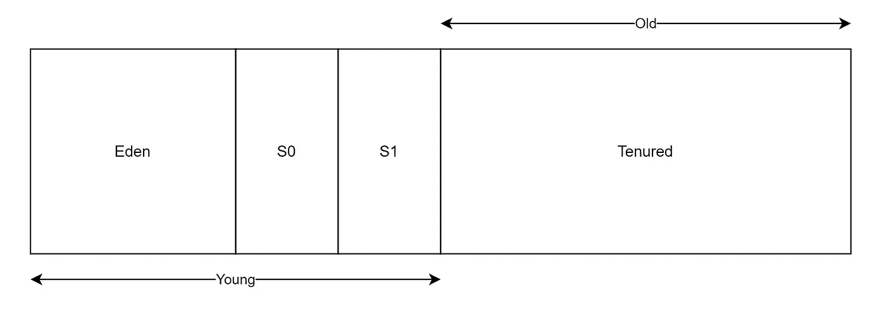

# 你应该知道的每个 JVM 垃圾收集器。

> 原文：<https://blog.devgenius.io/every-jvm-garbage-collector-you-should-know-2b4b3b96282b?source=collection_archive---------4----------------------->

在当今的云原生应用时代，以最少的资源充分利用您的应用已经成为一种新的非功能性需求。如果您正在构建 JVM 应用程序，您可能希望正确地调整堆的大小，以充分利用它。你的堆正在发生的事情可能会对你的应用程序产生影响，如果你想达到最大的**吞吐量**或者如果你想拥有最小的**延迟**，那么选择一个 GC(垃圾收集器)的实现可能会有所帮助。

# 垃圾收集工

垃圾收集器自动管理应用程序的内存管理。这里发生的事情是，分析应用程序的堆使用情况，找出所有活的对象和所有死的对象。一旦找到要删除的对象，实际的删除就发生了，然后堆被压缩。通常，扫描是在不同的*世代中完成的。*大致分为年轻和年老两代。

年轻一代是所有新物体被创造的空间。当年轻一代中的空间被填满时，一个**小 GC** 被调用。在次要 GC 中，年轻代中的所有死对象被收集，并且在指定数量的次要 GC 运行之后(每次次要 GC 活动对象的年龄增加 1 ),一些对象将最终被*移动*到老代。

慢慢地，你的老一代空间将被填满，这时一个**满的 GC** 被调用。完全 GC 很慢，因为它必须处理大量的活的和死的对象。

当运行次要或完整 GC 时，应用程序线程被挂起。应用程序线程的这种暂停被称为 GC 暂停。因此，要求快如闪电的应用程序可能希望最大限度地减少 GC 暂停时间。如果您正在构建一个可以忍受长时间 GC 暂停的应用程序，那么您可能会对优化 GC 吞吐量更感兴趣。

GC 暂停，有时被称为“停止世界事件”，在 GC 中充当安全点，因此非常重要。为了理解这一点，我们可能需要更深入地研究 java 线程的工作方式以及与这些线程所拥有的堆栈的交互。简单来说，我们知道堆栈保存了关于当前正在执行的方法的信息，还保存了对堆中存在的活动对象的引用。因此，当*标记*开始时，您需要确保状态一致，因此 GC 暂停是必要的。开发了不同的 GC 实现来减少 GC 暂停。

现在我们知道了我们要处理的是什么，让我们看看我们拥有的不同 GC 选项。

1.  串行 GC
2.  并行 GC(也称为吞吐量 GC)
3.  CMS GC(并发标记和清除)
4.  G1 GC(垃圾优先)
5.  Shenandoah GC
6.  艾司隆 GC
7.  Z GC

# 串行 GC

串行收集器使用单个线程来执行所有垃圾收集工作，这使得它相对高效，因为线程之间没有通信开销。对于大多数暂停时间要求不高并运行在客户端风格的机器上的应用程序来说，串行 GC 是垃圾收集器的首选。

它最适合于单处理器机器，因为它不能利用多处理器硬件，尽管它在多处理器上对于具有小数据集(大约 100 MB)的应用程序很有用。

串行 GC 的另一个常见用途是在同一台机器上运行大量 JVM 的环境中(在某些情况下，JVM 比可用的处理器还多！).在这种环境中，当 JVM 进行垃圾收集时，最好只使用一个处理器来最小化对其余 JVM 的干扰，即使垃圾收集可能会持续更长时间。串行 GC 很好地适应了这种权衡。

串行收集器是 Java SE 5 和 6 中客户端风格机器的默认设置，或者可以使用选项 **-XX:+UseSerialGC** 显式启用。

# 并行 GC

并行收集器也称为*吞吐量收集器*，它是一个类似于串行收集器的分代收集器。串行和并行收集器的主要区别在于，并行收集器有多个线程，用于加速垃圾收集。

并行采集器适用于在多处理器或多线程硬件上运行的中型到大型数据集的应用程序。您可以使用- **XX:+UseParallelGC** 选项来启用它。当需要完成大量工作并且可以接受长时间暂停时，应该使用这个收集器。例如，像打印报告或账单或执行大量数据库查询这样的批处理。

并行压缩是一种使并行收集器能够并行执行主要收集的功能。如果没有并行压缩，主要的收集是使用单线程执行的，这会极大地限制可伸缩性。如果指定了选项 **-XX:+UseParallelGC** ，则默认启用并行压缩。您可以使用 **-XX:-UseParallelOldGC** 选项禁用它。

# CMS* GC ( *已弃用并在 JDK 14 中删除)*

并发标记清除(CMS)收集器(也称为并发低暂停收集器)收集终身层代。它试图通过与应用程序线程同时执行大部分垃圾收集工作来最大限度地减少垃圾收集造成的暂停。通常并发低暂停收集器不会复制或压缩活动对象。垃圾收集是在不移动活动对象的情况下完成的。如果碎片成为一个问题，分配一个更大的堆。

简单地说，使用这种类型的 GC 的应用程序平均响应较慢，但不会停止响应来执行垃圾收集。

CMS 在 Java 9 中被弃用，在 Java 14 中被删除。

# G1 GC(垃圾优先)

在 Java 9 中，G1 成为缺省的 GC，在 Java 7 中也可以使用。

G1 是一个大部分并发的收藏家。大多数并发收集器与应用程序同时执行一些昂贵的工作。该收集器设计用于从小机器扩展到具有大量内存的大型多处理器机器。它提供了在实现高吞吐量的同时以高概率满足暂停时间目标的能力。

大多数硬件和操作系统配置默认选择 G1，或者可以使用 **-XX:+UseG1GC** 显式启用

与其他收集器不同， *G1* 收集器将堆划分为一组大小相等的堆区域，每个区域都有一个连续的虚拟内存范围。当执行垃圾收集时， *G1* 显示一个并发的全局标记阶段(即阶段 1，称为*标记)*来确定整个堆中对象的活性。

在标记阶段完成后， *G1* 知道哪些区域大部分是空的。它首先在这些区域收集，这通常会产生大量的空闲空间(即阶段 2，称为*清扫)。这就是这种垃圾收集方法被称为垃圾优先的原因。*

*Java 8u20* 引入了一个额外的 *JVM* 参数，用于通过创建相同*字符串的过多实例来减少不必要的内存使用。*这通过将重复的*字符串*值移除到全局单个 *char[]* 数组来优化堆内存。

我们可以通过添加***-XX:+UseStringDeduplication***作为 *JVM* 参数来启用这个参数。

# Shenandoah GC

由 RedHat 开发，然后包含在开放的 JDK 11 的二进制文件中。Shenandoah 就是这样一个 GC，它在 JDK 的 oracle 二进制文件中不可用，所以如果您使用 Oracle 二进制文件，那么您可能希望选择另一个选项(Z GC)。

该收集器是对 G1 收集器的改进，它需要的内存稍微多一点，因此在后台需要更多的数据结构，但它的延迟甚至比 G1 收集器更低。

它是一个暂停时间非常短的收集器。它通过与应用程序并发执行更多垃圾收集工作(包括并发压缩)来减少暂停时间。Shenandoah 的暂停时间与堆大小无关。2GB 堆或 200GB 堆的垃圾收集应该有类似的短暂暂停行为。

Shenandoah 使用了*栈水印*(最初由 ZGC 实现)，它试图同时处理线程栈。这是一个很好的概念，我强烈推荐你在[的 Redhat 博客](https://developers.redhat.com/articles/2021/09/16/shenandoah-openjdk-17-sub-millisecond-gc-pauses#concurrent_thread_processing_in_openjdk_17)上阅读更多相关内容。

要在开放的 jdk 二进制文件上启用 Shenandoah GC，请使用-XX:+UseShenandoahGC。

有了 Java 15，Shenandoah GC 就可以投入生产了。

# 艾司隆 GC

Epsilon 垃圾收集器是在 JDK 11 中作为实验性收集器引入的，它只分配内存。它不能释放任何已分配的内存，所以应用程序很可能因为一个 **OutOfMemoryError** 而崩溃。Epsilon 收集器中的 GC 不进行任何 GC 循环，因此不关心对象图、对象标记、对象复制等。一旦 Java 堆耗尽，就不可能进行分配，也不可能进行内存回收，因此测试将会失败。

最显著的优点是没有 GC 开销，JVM 不会暂停来清除内存，因为它甚至不会尝试释放任何内存。Epsilon GC 已被添加为测试应用程序性能、内存使用、延迟和吞吐量改进的基准。Epsilon Collector 帮助我们计算 Java 虚拟机(JVM)耗尽所有内存并关闭所需的时间。Epsilon GC 有助于测试原始应用程序的性能，不受 GC 的干扰，代码中也没有嵌入 GC 障碍。在 JDK 11 中，默认情况下禁用 Epsilon GC 功能，我们必须启用才能使用此收集器(-XX:+UseEpsilonGC)。

对于对延迟极其敏感的应用程序，要完全了解内存分配、内存占用，并了解垃圾收集对程序性能的影响程度，Epsilon collector 是最好的选择。

# ZGC

ZGC 是一个低延迟的垃圾收集器，可以很好地处理非常大(多 TB)的堆。它是 Oracle 用 Java 11 开发的。像 G1 一样，ZGC 同时处理应用程序。ZGC 是并发的、单代的、基于区域的、NUMA 感知的和紧密的。它不会停止执行应用程序线程超过 10 毫秒。

该收集器适用于需要很短暂停时间的大量内存应用程序。Z 垃圾收集器是一个实验性的特性，通过**-XX:+UnlockExperimentalVMOptions-XX:+use zgc**命令行选项启用。ZGC 支持从 8MB 到 16TB 的堆大小。

使用 ZGC 时，设置最大堆大小非常重要，因为收集器的行为取决于分配率的变化以及数据集的活动量。对于较大的堆，ZGC 工作得更好，但是浪费不必要的内存也是低效的，所以您需要在内存使用和可用于垃圾收集的资源之间进行平衡。

# 如何选择 GC？

现在有一个百万美元的问题:我应该为我的应用程序选择哪一个 GC？除非您的应用程序有相当严格的暂停时间要求，否则首先运行您的应用程序并允许 VM 选择一个收集器。如有必要，调整堆大小以提高性能。如果性能仍然不能满足您的目标，那么按照下面提到的指导原则使用上面的 GC 之一。

1.  如果应用程序的数据集很小(大约 100 MB)，或者如果应用程序将在单个处理器上运行，并且没有暂停时间要求，那么选择带有选项- **XX:+UseSerialGC 的串行收集器。**
2.  如果(a)峰值应用程序性能是第一优先考虑的，并且(b)没有暂停时间要求或者一秒或更长的暂停是可接受的，那么让 VM 选择收集器或者使用 **-XX:+UseParallelGC 选择并行收集器。**
3.  如果响应时间(执行*一个事务*所花费的时间)比总吞吐量(总的*事务数，如批处理*)更重要，并且垃圾收集暂停必须保持较短，那么使用 **-XX:+UseG1GC 选择最并发的收集器。**
4.  如果响应时间具有高优先级，那么使用 **-XX:UseZGC** 或 **-XX:+UseShenandoahGC 选择一个完全并发的收集器。
    专业提示:** ZGC 在大型机器上工作得很好，但是谢南多厄在小型机器上也工作得很好。

这些准则只是为选择收集器提供了一个起点，因为性能取决于堆的大小、应用程序维护的活动数据量以及可用处理器的数量和速度。有时，在 Java 11 及更高版本中，如果您有暂停时间需求，那么建议使用 Epsilon 首先获得基线，然后在其上开始优化。

专业提示:如果你想检查哪个垃圾收集器是默认运行的，那么使用命令:`java -XX:+PrintCommandLineFlags -version`