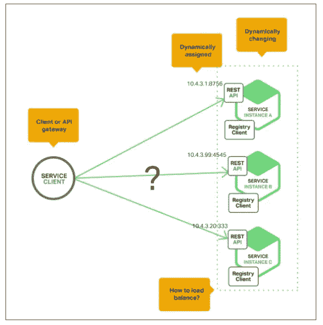
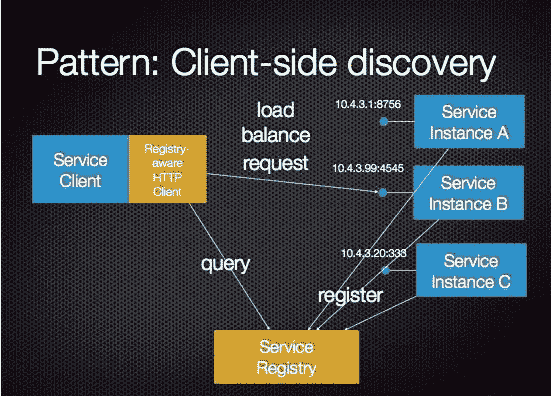
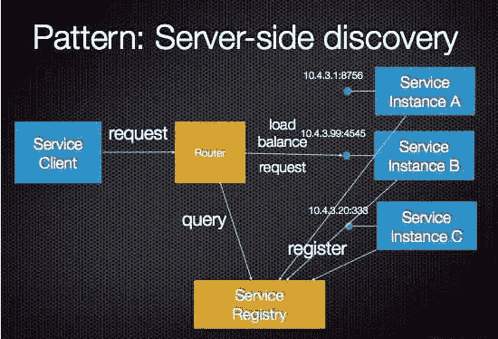
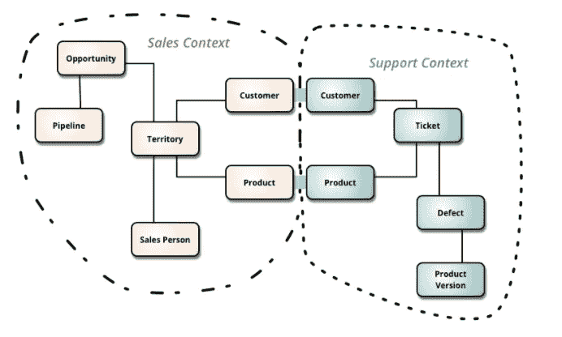

# 开发人员必须了解的关于微服务的一切

> 原文：<https://blog.devgenius.io/everything-a-developer-must-know-about-microservices-dae854782ab?source=collection_archive---------1----------------------->

## 微服务是首选的应用平台，每个开发人员都必须了解它。

杰佛森·桑多斯在 [Unsplash](https://unsplash.com/s/photos/developer?utm_source=unsplash&utm_medium=referral&utm_content=creditCopyText) 上拍摄的照片

微服务已经成为云应用开发的首选应用平台。 [Nginx 进行了一项调查](https://www.nginx.com/resources/library/app-dev-survey/)，他们发现约有 *70%的组织正在使用或调查微服务，其中近 1/3 目前正在生产中使用微服务*。全球研究和咨询公司 Gartner 将微服务定义为，

> **“一个面向服务的应用程序组件，具有严格的范围、强大的封装、松散的耦合、可独立部署和可独立扩展”**

这篇文章是关于刷新你的微服务知识。如果您曾经/没有使用过微服务，您必须/应该知道的一切都已记录在案。*我们开始吧。我们走吧。*

# 那么，微服务到底是什么？

布鲁斯·马尔斯在 [Unsplash](https://unsplash.com/s/photos/question?utm_source=unsplash&utm_medium=referral&utm_content=creditCopyText) 上拍摄的照片

微服务架构(简称微服务)是一种 SDLC 方法，基于这种方法，较大的应用程序被构建为小功能模块的集合。这些功能模块是可独立部署的、可扩展的、针对特定业务目标的，并且通过标准协议(如带有资源 API 的 HTTP 请求/响应和轻量级异步消息传递)相互通信。

拥有微服务架构的主要优势在于，模块可以使用 ***不同的编程语言来实现，拥有自己的数据库，并部署在不同的软件环境上，如内部部署或云。***

# 微服务的优势

微服务有很多优势，这让开发人员比单一应用程序更有优势。

*   多种服务可以独立部署在不同的环境中，如内部部署或云服务提供商
*   可以根据功能独立开发多种服务
*   如果任何一个服务失败，其他服务将继续工作，因为它隔离了失败服务的故障
*   在微服务中，扩展单个组件更容易，因为不像在单片架构中那样需要扩展其他组件
*   多种技术可用于开发同一应用程序中的不同组件。

# 整体式 vs 面向服务 vs 微服务

*   **单片架构**类似于一个大容器，其中应用程序的所有软件组件被组装在一起并紧密打包。
*   **面向服务的架构**是相互通信的服务的集合。通信可以包括简单的数据传递，也可以包括两个或多个协调某些活动的服务。
*   **微服务架构**是一种架构风格，它将应用程序构建为小型自治服务的集合，围绕业务领域建模。

# 微服务应该在什么时候使用？

当您正在使用一个整体应用程序时，当它增长到一定程度时，在伸缩性方面会出现问题，或者当您无法在不同的项目或平台之间重用组件时，当实现新功能变得很痛苦并且更容易出错时，那么您必须使用微服务。

当开始使用新的应用程序时，您肯定希望它易于扩展、维护、部署和测试。使用微服务，这些可以更有效地实现，并跨各种平台使用。

# 服务发现

Docker 映像动态部署在云环境中的任何机器或 IP 和端口组合上，相关服务很难在运行时更新。

服务客户端不知道动态分配的 IP 和端口组合

服务实例具有动态分配的网络位置。此外， ***由于自动伸缩、失败和升级，服务实例的集合会动态变化。因此，您的客户端代码需要使用更复杂的服务发现机制。因此，服务发现被创建来解决这个问题。***

因此，服务发现是在微服务架构下运行的服务之一，它注册在服务网格下运行的所有服务的条目。 ***它是应用和微服务在网络上相互定位的方式。***

## 客户端发现模式

当使用[客户端发现](https://microservices.io/patterns/client-side-discovery.html)时，客户端负责确定可用服务实例的网络位置，并在它们之间平衡负载请求。客户机查询服务注册中心，它是可用服务实例的数据库。然后，客户端使用负载平衡算法选择一个可用的服务实例并发出请求。

客户端发现模式

## 服务器端发现模式

服务发现的另一种方法是[服务器端发现](https://microservices.io/patterns/server-side-discovery.html)模式，客户端通过负载均衡器向服务发出请求。负载平衡器查询服务注册中心，并将每个请求路由到一个可用的服务实例。与客户端发现一样，服务实例在服务注册表中注册和注销。

服务器端发现模式

# 微服务的扩展

*   人们可以通过使用更多的容器来增加服务实例的数量，从而扩展系统。
*   还可以在微服务层应用缓存，这很容易管理，因为微服务是唯一的真实来源，缓存的失效可以非常容易地完成。
*   缓存也可以在 API 网关层引入，在这里可以定义缓存规则，比如何时使缓存失效。
*   当需求减少时，还可以关闭或缩小一些容器。

# 微服务中的通信

与微服务集成的最常用的协议是 REST over HTTP。其他通信协议也可以用于集成，如 **AMQP、卡夫卡、GraphQL** 等。

通信协议大致可以分为两类: ***同步通信*** 和 ***异步通信*** *。*

## **同步通信**

RestTemplate，WebClient，FeignClient 可以用于两个微服务之间的同步通信。理想情况下，我们应该尽量减少微服务之间的同步调用数量，因为网络很脆弱，它们会带来延迟。 **Ribbon** —客户端负载均衡器可用于更好地利用 RestTemplate 上的资源。Hystrix 断路器可以用来优雅地处理局部故障，而不会对整个生态系统产生连锁反应。应该不惜一切代价避免分布式提交，相反，我们应该选择使用异步通信来实现最终的一致性。

## **异步通信**

在这种类型的通信中，客户端不等待响应，而是将消息发送给消息代理。 **AMQP** ( *如***rabbit MQ**)或 **Apache Kafka** 可用于跨微服务的异步通信，以实现最终的一致性。

## 应该使用哪种通信协议？

这里出现了应该使用哪种通信协议的问题。

1.  在处理 HTTP POST/PUT(任何修改数据的东西)请求时，必须使用异步通信，使用一些可靠的队列机制(RabbitMQ、AMQP 等)。)
2.  您可以在 API 网关级别对聚合模式使用同步通信，除了聚合之外，它不应该包含任何业务逻辑。数据值不能在聚合器上转换，否则，它就违背了**有界上下文**的目的。在异步通信中，事件应该在队列中发布。事件包含实际上属于领域的数据，但它并不关注可以对这些数据做什么(动作)。
3.  如果微服务到微服务的通信仍然需要 GET 操作的同步通信，那么您必须为有界上下文划分您的微服务，并在 backlog/technical debt 中创建一些任务。

# 限界上下文

正如马丁·福勒所说，

> ***有界上下文是领域驱动设计的核心模式。这是 DDD 战略设计部门的重点，该部门主要负责处理大型模型和团队。DDD 通过将大型模型划分为不同的有界环境并明确它们的相互关系来处理它们。***

****

**有界背景的图解**

***有界上下文定义了某个子领域适用性的有形边界。*这是一个某个子领域有意义，而其他领域没有意义的领域。它可以是一次谈话，一次演示，一个由人工制品定义物理边界的代码项目。**

# **领域驱动设计**

**领域驱动设计或 DDD 的主要焦点是核心领域逻辑。基于领域的模型检测复杂的设计。这包括与领域专家的定期协作，以解决与领域相关的问题并改进应用程序的模型。**

# **春天的云**

**Spring Cloud 为开发人员提供了在分布式系统中快速构建一些常见模式的工具(*如配置管理、服务发现、断路器、智能路由、微代理、控制总线、一次性令牌、全局锁、领导选举、分布式会话、集群状态*)。**

**微服务架构确实是每个开发人员都必须知道的最受欢迎的应用程序设计方法之一。希望这篇文章能让你对微服务及其组件/概念有所了解。但同样，总有更多的空间。以参考文章结束这篇文章，你可能想看看。**

## **更多参考**

** [## docker——每个开发人员必须学习的最受欢迎的平台

### 实际上，根据 Stackoverflow 调查，它是第二大最受开发者喜爱的平台。

medium.com](https://medium.com/analytics-vidhya/docker-the-most-loved-platform-every-developer-must-learn-6e5bb702c97b)  [## 春天的云

### Spring Cloud 为开发人员提供了在分布式系统中快速构建一些通用模式的工具(例如…

spring.io](https://spring.io/projects/spring-cloud)  [## 微服务架构中的服务发现- NGINX

### 微服务简介构建微服务:使用 API 网关构建微服务:进程间…

www.nginx.com](https://www.nginx.com/blog/service-discovery-in-a-microservices-architecture/) 

如果你喜欢阅读有助于你更好地学习、生活和工作的故事，可以考虑 [*成为*](https://viveknaskar.medium.com/subscribe) *的订阅者。成为会员后，你可以无限制地阅读 10000 篇故事、文章和作家。每月只要 5 美元。* [*如果你使用我的链接*](https://viveknaskar.medium.com/membership) *注册，我将获得一点佣金，帮助我写更多的文章。***