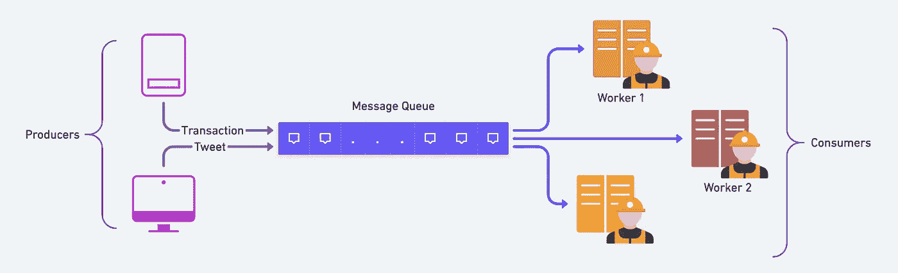
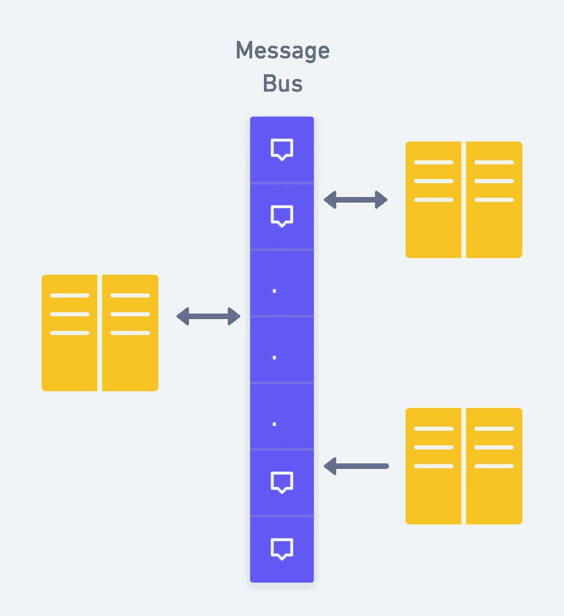
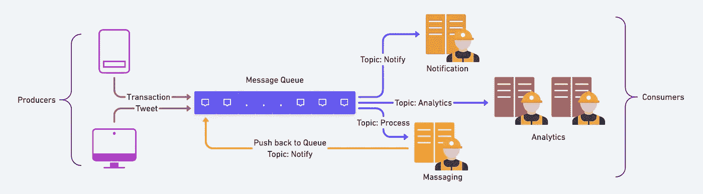

# 关于分布式消息队列的一切

> 原文：<https://blog.devgenius.io/everything-about-distributed-message-queue-ae6597d84b36?source=collection_archive---------3----------------------->

随着整个行业越来越多地采用分布式系统，消息队列正在成为这一重要运动的一部分。从最终用户到应用程序的数据流正在急剧增长。有了这个，我们还需要了解这些请求的性质，即，请求是否必须是同步的，或者是否可以脱机执行？如果是异步的，我们需要一个消息队列来容纳多个这样的异步请求。

## 什么是消息队列

消息队列是一个消息传递目的地，它使用队列数据结构来促进两个服务之间的异步通信，通常用于无服务器和微服务架构中。消息存储在队列中，直到被处理和删除。每条消息只由一个消费者处理一次。MQ 有助于分离重量级处理、缓冲或批处理工作，并平滑尖峰工作负载。

消息队列由两个术语组成:

1.  **消息**:这是从生产者传递给消费者的对象。对象可以是请求、信息、元数据等。
2.  **队列**:这是一个存储消息的临时缓冲区。它使用先进先出的方法将消息从生产者传递到消费者。



基本消息队列

1.  生产者创建消息，并将其发送到消息队列。如果消费者忙于立即处理消息，队列会存储消息，直到消费者有空为止。
2.  消费者从队列中检索消息并开始处理它。
3.  然后，消息队列临时锁定该消息，以防止它被另一个消费者读取。
4.  在使用者完成消息处理后，它从队列中删除消息，以防止其他使用者读取该消息。

这种架构提供了更好的性能，因为本质上是异步的，并且一次消除了对多个系统的依赖。

## 使用 REST API

创建一个临时资源，而不是创建实际的资源。您可以发出一个 [202](http://httpstatus.es/202) (已接受)响应代码，而不是返回一个 [201](http://httpstatus.es/201) (已创建)HTTP 响应。它通知客户机服务器已经接受并理解了请求，但是资源还没有创建。在位置头中发送临时资源。
**请求:**

```
POST /blogs HTTP/1.1
<xml>
    blogdata
</xml>
```

**响应:**

```
HTTP/1.1 202 Accepted
Location: /queue/12345
```

# 消息队列的应用

*   通知引擎
*   计划作业
*   优先任务
*   流媒体服务

这个位置可以存储关于实际资源状态的信息:ETA。一旦实际资源可用，临时资源可以返回 [303](http://httpstatus.es/303) (参见其他)响应。位置头将 URI 返回给最终资源。客户端可以删除临时资源，或者服务器可以过期并稍后返回一个 [410](http://httpstatus.es/410) (消失)。

# 消息队列与消息总线

一个**消息总线**是一个消息传递基础设施，它允许不同的系统通过一组**共享接口** ( **消息总线**)进行通信。



消息总线

**消息队列**的基本思想很简单:

*   两个(或更多)进程可以通过**访问标准系统消息队列**来交换信息。
*   发送进程通过另一个进程可以读取的某个(OS)消息传递模块将消息放入队列。

**消息队列**包含 **FIFO** ( *先进先出*)规则，而**消息总线**不包含。

# 消息队列与共享内存

这有多种原因。为了简化起见，让我们试着把它分成许多点

*   当多个进程同时通信时，需要用同步来保护共享内存数据。如果使用共享内存的读写频率很高，那么实现该功能将会非常复杂。在这种情况下不值得考虑使用。
*   如果所有进程都不需要访问共享内存，但只有极少数进程需要，那么最好用消息队列来实现。
*   如果我们希望与不同的数据包通信，进程 A 将对象 1 发送给进程 B，对象 2 发送给进程 C，对象 3 发送给进程 d，在这种情况下，用消息队列实现更简单。
*   当然，消息队列的顺序是 FIFO(先进先出)。队列中插入的第一条消息是第一个被检索的消息。

# 消息队列与消息代理

消息代理(也称为服务总线)是一个中间件，负责持久化和路由消息，同时允许您将系统分解成更小的部分。消息队列是消息代理的一部分，只是一种持久性机制。

# 消息队列的特性

现在，让我们讨论消息队列应该具备的品质。

*   **Pull / Push Delivery** 提供了检索消息的 Push 和 Pull 选项。拉意味着不断地在队列中查询新消息。推送意味着当消息可用时通知消费者(也称为发布/订阅消息传递)。您还可以使用长轮询来允许拉取在完成之前等待新消息到达指定的时间。
*   **计划/延迟发送**支持为一条消息设置具体的发送时间。如果需要所有消息都有预期的延迟，可以设置延迟队列。
*   **至少一次传递**:可存储多份消息副本，实现冗余和高可用性，并在通信失败或出错时重新发送消息，确保至少传递一次。
*   **恰好一次传递**:当系统不能容忍重复执行时，FIFO 消息队列将通过自动过滤掉重复的消息来确保每条消息恰好传递一次(且只有一次)。
*   **FIFO 队列**:在这些队列中，最老的(或第一个)条目，有时称为队列的“头”，首先被处理。
*   **死信队列**:死信队列是其他队列可以发送在常规队列中无法成功处理的消息的地方。这种方法可以很容易地将它们放在一边进行进一步的检查，而不会阻塞队列处理，也不会在可能永远无法成功使用的消息上花费 CPU 周期。
*   **排序**:大多数消息队列都提供尽力而为的排序，这可以确保消息通常按照发送的顺序传递，并且一条消息至少传递一次。
*   **毒丸消息**:毒丸是可以接收但不能处理的特殊消息。它们是一种机制，用于向消费者发出信号，让其结束工作，不再等待新的输入，类似于关闭客户端/服务器模型中的套接字。
*   **安全性**:消息队列将对试图访问队列的应用程序进行身份验证，并允许您使用加密技术对网络上以及队列本身中的消息进行加密
*   **过滤**:该特性使订阅者能够创建一个消息过滤策略，只获取感兴趣的通知，而不是接收发布到主题的每条消息。
*   **消息优先级**:当程序将消息放入队列中时，它可以对消息进行优先级排序。这种方法决定了新消息在队列中的添加位置。程序可以按照 FIFO 的顺序或者通过获取特定的消息从队列中获取消息。(如果一个程序希望回复它之前发送的请求，它可能希望获得特定的消息。).您可以通过发布/订阅消息队列快速实现这一点。
*   **持久性**:消息队列临时存储消息，直到它们被消费者成功接收和处理。
*   **可靠性**:当系统的不同部分离线时，队列使你的数据持久并减少错误。通过用消息队列分隔各种组件，您创建了更多的容错能力。如果系统的一部分无法访问，另一部分可以继续与队列交互。队列本身也可以被镜像，以获得更高的可用性。
*   **可伸缩性**:我们可以快速增加工作人员的数量来处理大量未完成的任务。

# 消息队列的类型

## 点对点消息队列

这种队列类型通过一个队列从一个应用程序(生产者/发送者)发送到另一个应用程序(消费者/接收者)。一个队列中可以有多个消费者在侦听，但是只有其中一个消费者能够获得消息。因此，它是点对点或一对一的。


点对点消息队列

## 发布/订阅消息队列

发布/订阅消息传递，或发布/订阅消息传递，是无服务器和微服务架构中使用的异步服务到服务通信的一种形式。在发布/订阅模型中，发布到主题的任何消息都会被该主题的所有订阅者立即接收到。发布/订阅消息传递有助于启用事件驱动的架构或分离应用程序，从而提高性能、可靠性和可伸缩性。



发布/订阅消息队列

发布-订阅模型允许消息被异步广播到不同的系统部分。作为消息队列的同级，消息主题提供了一种轻量级机制来广播异步事件通知和端点，从而允许软件组件连接到主题来发送和接收这些消息。与消息队列不同，消息队列对消息进行批处理，直到它们被检索到，而消息主题不需要或只需要很少的排队就可以传输消息，并立即将它们推送到所有订阅者。除非订阅者设置了消息过滤策略，否则订阅该主题的所有组件都将收到每个消息广播。

消息主题的订阅者通常执行不同的功能，并且可以并行地对消息做不同的事情。发布者不需要知道谁在使用它正在广播的信息，订阅者也不需要知道消息来自谁。这种消息传递方式与消息队列略有不同，在消息队列中，发送消息的组件通常知道它要发送到的目的地。

# 缩放考虑

消息队列使您可以根据需要精确扩展。当工作负载达到峰值时，应用程序的多个实例都可以将请求添加到队列中，而没有冲突的风险。随着这些传入请求的增加，您的队列越来越长，您可以将工作负载分布在一群消费者中。生产者、消费者和队列都可以按需增减。

以下是一些可用于扩展的策略:

*   如果信息生产的速度高于消费的速度，就增加工人
*   分区:主题可以有许多分区。这有助于并行。

## 错误处理

*   像死信队列一样分开排队。
*   监控和识别不健康的工人或实例，并替换他们。

# 最后的想法

毫无疑问，消息队列是分布式系统的骨干。您可以配置您的 MQ 来满足您的需要，在一些 nfr 上放松，在一些上受打击。与实时流量相比，我们可以快速扩展和提高性能。许多消息服务器都有内置的复制设置，以提供容错和持久的数据。这里有一些最后的提示:

*   向每个事件添加标准元数据，例如 Origin-UUID(在触发其他事件时传递)和 Seen-By。
*   哪个服务消费/产生哪个事件的文档。
*   仅包括与事件相关的数据；根据需要获取其他数据。

如果你有兴趣了解更多关于消息队列的内部工作，我推荐你去看看 Kafka。许多消息代理或托管消息队列，如 SQS、RabbitMQ、ActiveMQ 等。在进行任何随机服务之前，列出您的消息队列的需求，然后选择一个最适合您需求的。

在这里，我总结一下这次学习；我希望你今天学到了一些新东西。请与更多的同事或朋友分享。最后，考虑成为[的中层成员](https://zonito.medium.com/membership)。谢谢大家！

## 参考资料:

*   【https://docs.oracle.com/cd/E19435-01/819-0069/intro.html 
*   [https://aws.amazon.com/message-queue/](https://aws.amazon.com/message-queue/)