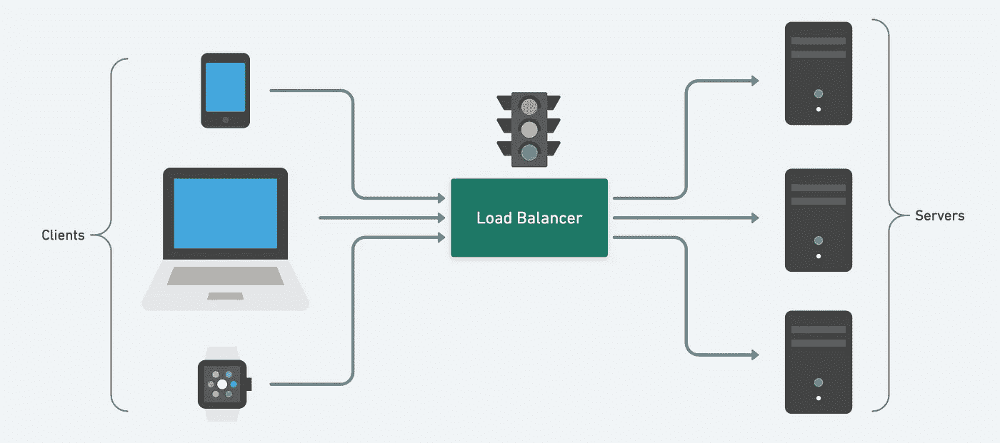
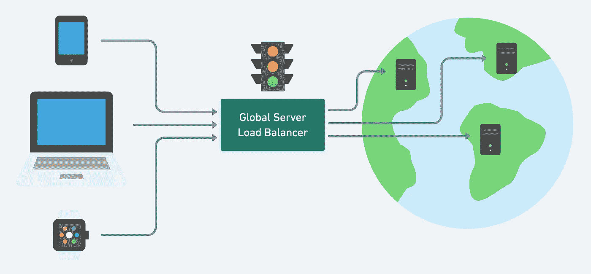
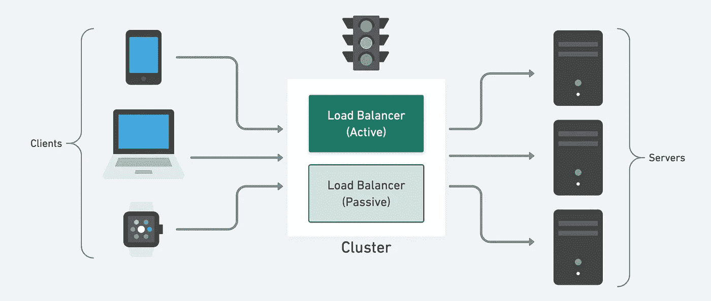
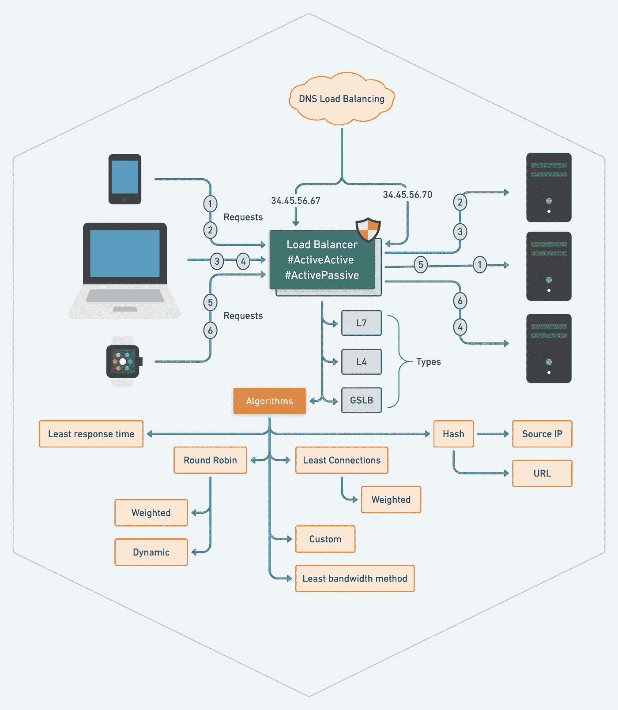

# 关于负载平衡器和备忘单的一切

> 原文：<https://blog.devgenius.io/everything-about-load-balancer-with-cheat-sheet-64b351f0f7b3?source=collection_archive---------0----------------------->

负载平衡器在任何**系统设计**中扮演着重要的角色。其设计的美妙之处在于，每个工程师都认为这是理所当然的，这是最好的系统设计之一，从这个简单而强大的解决方案中可以学到很多东西。LB 充当客户机和服务器之间的中间人；客户端将请求发送到 LB，并在内部通过物理网卡发送到 VIPs，然后转发到连接的 web 服务器。

## **负载平衡器**

简而言之，负载平衡是**基于几种不同的算法在多个服务器**之间分配网络流量。负载平衡由一个叫做负载平衡器的工具或应用程序来处理。负载平衡器可以是基于硬件的，也可以是基于软件的。**硬件负载平衡器**需要安装专用的负载平衡设备；基于软件的负载平衡器可以运行在服务器、虚拟机或云中。

负载平衡器简介

假设服务上的总流量只汇聚到几台机器上。在这种情况下，这不仅会使它们过载，导致应用程序的延迟增加并降低其性能，而且最终也会使它们停机。

负载平衡帮助我们避免所有这些混乱。在处理用户请求时，如果一个服务器出现故障，负载平衡器会自动将未来的请求路由到集群中其他正在运行的服务器。它使服务作为一个整体保持可用。

为了充分利用可伸缩性和冗余，我们可以尝试平衡系统各层的负载。我们可以在三个地方添加 LBs:

*   在用户和网络服务器之间
*   在 web 服务器和内部平台层之间，比如应用服务器或缓存服务器
*   内部平台层和数据库之间。

## 负载平衡的优势

*   用户体验更快、不间断的服务。用户不必等待一台苦苦挣扎的服务器来完成之前的任务。相反，他们的请求会立即传递给更容易获得的资源。
*   服务提供商体验到更少的停机时间和更高的吞吐量。即使整个服务器发生故障，也不会影响最终用户的体验，因为负载平衡器会将其路由到健康的服务器。
*   负载平衡使系统管理员更容易处理传入的请求，同时减少用户的等待时间。
*   智能负载平衡器提供了预测分析等优势，可以在流量瓶颈发生之前确定它们。因此，智能负载平衡器为组织提供了切实可行的见解。这些是自动化的关键，有助于推动业务决策。
*   系统管理员遇到的故障或压力组件更少。负载平衡让几个设备执行少量工作，而不是单个设备执行大量工作。

## **负载平衡器的类型**

在七层 [**开放系统互连(OSI)模型**](https://en.wikipedia.org/wiki/OSI_model) 中，网络防火墙处于一至三级(L1-物理布线，L2-数据链路，L3-网络)。同时，负载平衡发生在第四至第七层之间(**L4-传输**，L5-会话，L6-表示，以及**L7-应用**)。

负载平衡器具有不同的功能，包括:

*   **L4** :根据来自网络和传输层协议的数据引导流量，如 IP 地址和 TCP 端口。
*   **L7** :增加内容切换到负载均衡。它允许基于 HTTP 头、统一资源标识符、SSL 会话 ID 和 HTML 表单数据等属性做出路由决策。
*   **GSLB** : [**全局服务器负载均衡**](https://www.cloudflare.com/learning/cdn/glossary/global-server-load-balancing-gslb/) 将 L4 和 L7 能力扩展到不同地理位置的服务器。

全局服务器负载平衡

*   **DNS 负载均衡**:基于 DNS 的负载均衡是一种特定类型的负载均衡，它使用 DNS 在几台服务器之间分配流量。[更多相关信息](https://zonito.medium.com/scale-applications-by-optimizing-dns-configuration-774350c9cedd)

## **负载均衡算法技术**

根据负载的分布，可以使用不同类型的负载平衡算法。这些算法考虑了服务器的两个方面:I)服务器健康和 ii)预定义的条件。

*   **循环调度算法**:循环调度(RR)算法是请求的循环分配。循环赛有两种类型:
*   **加权循环法**:服务器根据其组成分配一个权重。基于预先指定的效率，负载以循环程序分配。
*   **动态循环**:根据分配的服务器权重的实时计算，将请求转发给关联的服务器。
*   **最少连接数**:通过选择活动事务(连接数)最少的服务器来分配负载。
*   **加权最少连接数**:基于两个因素的负载分配——到每个服务器的当前和活动连接数以及服务器的相对容量。
*   **源 IP 哈希**:基于唯一的哈希键选择服务器——哈希键通过获取请求的源和目的地生成。基于生成的散列密钥，服务器分配给客户机。
*   **URL 哈希** : URL 哈希是一种负载平衡方法，通常用于负载平衡服务器提供每个服务器主要(但不一定)唯一的内容的情况。例如，在一个部署中，缓存服务器池响应对内容的请求。像源 IP 和 URL 散列一样，考虑到 Cookie、方法等，可能有许多这样的散列算法。
*   **最少响应时间**:选择活动连接数最少，平均响应时间最少的后端服务器。它确保了最终客户的快速响应时间。
*   **最小带宽法**:根据服务器的带宽消耗选择后端服务器，即选择消耗带宽最少的服务器(以 Mbps 为单位)。
*   **定制负载方式**:根据负载选择后端服务器。计算服务器负载时会考虑 CPU 使用率、内存和服务器响应时间。该算法适用于可预测的稳定流量；万一流量变化不均匀突然，就不方便了。

## **网络服务器监控**

负载平衡器对服务器进行持续的**健康检查，以确保它们能够处理请求。如果服务器或组运行缓慢，负载平衡器会分配较少的流量给它。如有必要，负载平衡器会从池中移除不健康的服务器，直到它们恢复。**服务器故障转移对可靠性至关重要**:如果没有备份，服务器崩溃可能会导致网站或应用程序瘫痪。故障转移必须快速进行，以避免服务中断。一些负载平衡器甚至会触发新的虚拟化应用服务器的创建，以应对不断增长的需求。**

## **单点故障**

在复杂、健壮的系统设计中，负载平衡器将成为单点故障。如果它崩溃了，你的系统也会崩溃。以下是实现高可用性和避免单点故障的一些方法。

*   **主动被动**:为您提供许多优势，所以考虑购买一对负载平衡器，并将其配置为 H/A 模式。主负载平衡器将网络流量分配给最合适的服务器。相比之下，第二负载平衡器以监听模式运行，以持续监控主负载平衡器的性能，并准备好在主负载平衡器出现故障时随时介入并接管负载平衡任务。
    通过以主动/被动模式运行负载平衡器，可以实现为您的客户保持不间断服务的能力。这种配置的另一个优点是能够处理计划内或计划外的服务中断。

主动-被动方法

*   **主动/主动**:两台或多台服务器聚合网络流量负载，并作为一个团队工作，将负载分配给网络服务器。负载平衡器还可以记住来自用户的信息请求，并将这些信息保存在缓存中。如果他们返回寻找相同的信息，用户锁定先前为他们服务的负载平衡器。信息再次从高速缓存中提供，而网络服务器不必响应。此过程减少了网络流量负载。

## **安全**

负载平衡器解密了 TLS 流量。当负载平衡器在传递请求之前解密流量时，这被称为 TLS 终止。负载平衡器使 web 服务器不必单独完成这项工作。它会将应用程序暴露给可能的攻击。但是，当负载平衡器与 web 服务器位于同一个数据中心时，风险会降低。

**注意**:为了符合**FIPS 140–2 标准**，您需要在负载平衡器和 Web 服务器上安装 TLS 终端。

## 以备忘单结束

根据 REST API 设计的[原则&最佳实践](https://zonito.medium.com/best-practice-and-cheat-sheet-for-rest-api-design-6a6e12dfa89f)的普遍需求，这也是负载平衡器的备忘单。别忘了与感兴趣的人分享。

我结束了这次学习，我希望你今天学到了一些新东西。最后考虑成为[中等会员](https://zonito.medium.com/membership)，谢谢！

