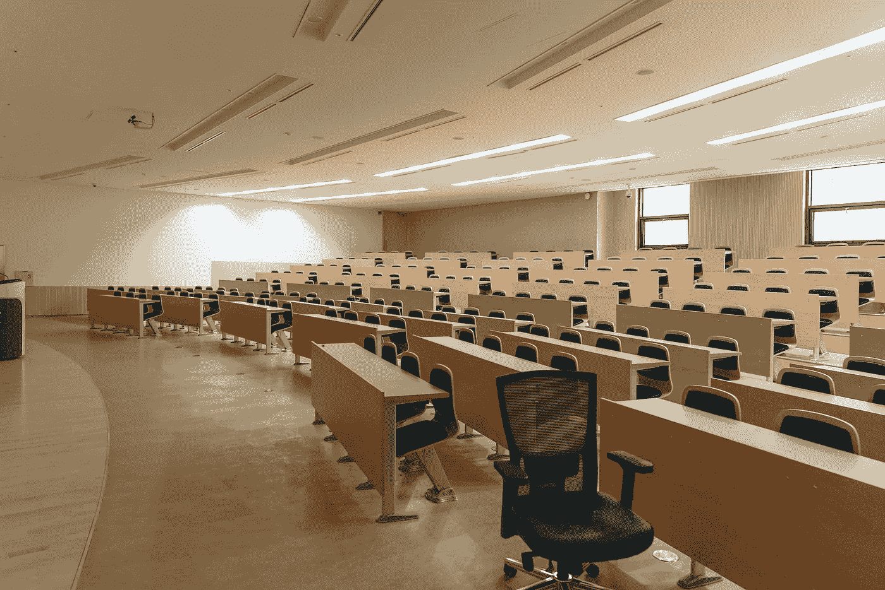

# 我在大学计算机科学第一年学到的一切

> 原文：<https://blog.devgenius.io/everything-i-learned-in-my-first-year-of-computer-science-in-college-a60040d808ef?source=collection_archive---------11----------------------->

# 介绍

大家好，今天我将回顾我在大学第一年所学的一切。我是一名计算机科学专业的学生，主修网络犯罪，现在大二。所以是时候回顾一下第一年学的东西了。第一年有很多你需要在这个领域进步的基础知识。所以让我们来看看我上过的所有课程。

# 课程

# 网络安全基础知识

这门课非常有趣。它有关于网络安全概念的课程，比如黑客如何工作之类的。风险评估和防御也出现在本课程中，还有许多你需要知道的关于网络安全的理论知识。

# 数据库

这门课全是关于 SQL 的。我们学习了 SQL 的基础知识，比如 select 语句和所有其他你需要的 SQL 基础知识。对于不知道 SQL 是什么的人来说，它是用于与数据库通信的语言。

# 电子商务

这是我最不喜欢的课程。我们学会了使用像 oodo 和 google analytics 这样的商业管理工具。很多商业相关的概念和理论的东西。

# 硬件和桌面操作系统

在这门课中，我们学到了很多关于电脑硬件的知识。每一个电脑部件和他们如何工作，他们做了什么，为什么需要它。本课程还包含 Linux 和 Windows 的基础知识。如何正确使用 CLI。总的来说，这是一门非常有趣的课程。

# 问题解决

哦，天啊，这只是数学。它包含了很多关于散列函数和模的内容。这是可以做的，不是我最喜欢的事情，但它可能会更糟。

# 编程基础

我们学习了如何用 Python 编程，学习了编程的基本概念，如循环、if-else、字典、函数等。我们没有写任何大的程序，只是一些小的东西，比如一个反转列表的程序。

# Web 开发

这包含了网络开发的三大部分和你需要进一步发展你的网络开发技能的基本要素。HTML，CSS 和 JavaScript。我们学到了制作网站所需的一切。人们非常重视最佳实践代码。使用好的语义 HTML 标签，编写干净的 JavaScript 代码。

# 应用原型

在你编写应用程序之前，我们学习了很多关于这个阶段的知识。这包含了关于 adobe XD 创建应用程序的线框和 C4 建模思考应用程序背后的结构的课程。我们还有一课是关于为你的应用程序创建一个好的用例，并且在你开始编码之前真正思考你将要创建什么。

# 计算机网络

顾名思义，这是关于一个网络是如何建立和运行的。这是一门相当大的课程，分为理论部分和实践部分。在理论部分，你建立一个模拟网络。在理论部分，你学习一切是如何工作的。比如路由器、交换机、IP 地址等等。工作

# 面向对象编程

这是编程基础的后续。在面向对象编程中，我们转向 Java，学习如何以面向对象的方式编程，并通过自动单元测试保持更好的可管理代码。我们也开始制作一些更大的应用程序，它们确实做了一些事情，但只是基于 CLI。

# 项目沟通

这个课程是关于如何在团队中更好地合作以及如何进行良好的沟通。比如如何做好邮件和演示。这是一个相当小的课程。

# 网络、移动和安全

在这里，我学到了 XSS、SQL 注入等网页测试的基本知识。OWASP 前十名主要是。我还学会了如何用 CSS，通过使用 flexbox 和 grid 来创建更适合移动设备的网站。本课程的最后一部分是如何用 Laravel 制作一个 PHP 框架的 web 应用程序。

# 编程项目

这不是一门课程，而是我必须做的最后一项作业。我们必须制作一个数字版的棋盘游戏，用 HTML、CSS 和 JavaScript 作为游戏服务器的前端，用 Java 作为后端。在这个项目中，我们学到了合作和团队精神。

# 结束了

这是我对大学第一年的总结。那一年我学到了很多东西，很多基础知识都是在第二年扩展的。感谢你阅读这篇文章，我希望你能从中获得一些价值。