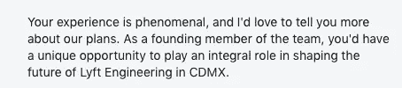
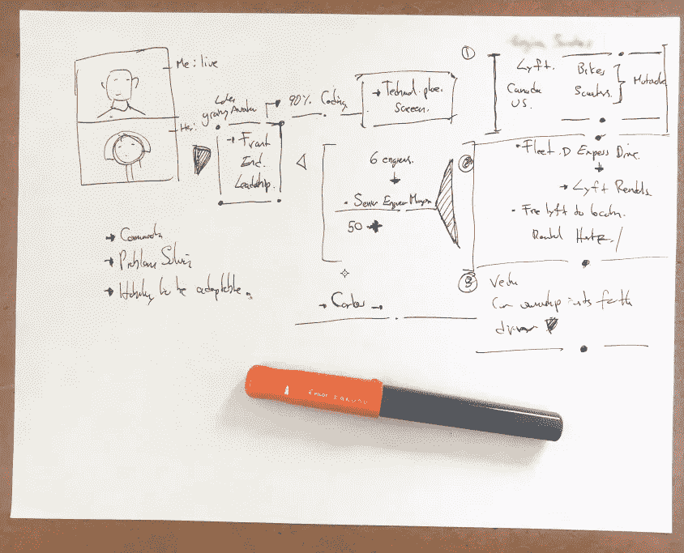
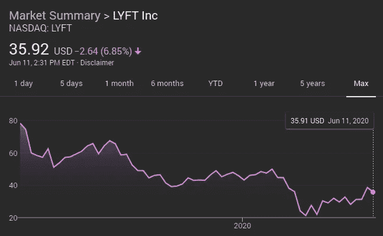

# 电影前 SWE 采访的所有问题。

> 原文：<https://blog.devgenius.io/everything-wrong-with-the-pre-screen-swe-interview-723737d81b61?source=collection_archive---------15----------------------->


## Lyft 版。

`**SWE** = Software Engineer`

## 序文

几年前，在 Linkedin 上被招聘人员发信息变得如此糟糕，以至于我不得不求助于不要联系我的请求。

```
**Recruiters, please read this:**

Open to the following roles: Mid senior, lead roles in Product, FED, Data Science, AI and Design.

Location: Remote, will consider relocating through sponsorships to the EU,US. 

Compensation: Above six figures with equity.
```

还有验证码，因为我更清楚。

```
**Please include the word Keno (my short name) as part of your 
subject line** if you have something that fits or exceeds this description, thanks.
```

这样，当我收到招聘人员的信息时，我马上就知道他们没有看过我的个人资料，我只需删除他们的信息。

## 输入 Lyft

果然，前几天我收到了一条来自 [**Lyft**](https://www.lyft.com) 招聘人员的消息，我们称之为`Maria`(T8 不是她的真名)他们正在墨西哥做一件新事情，目前优步在墨西哥是老大:



所以没有验证码，我应该删除它，但我的好奇心占了上风，所以我最终浪费了一个完美的周五上午，同意接受玛丽亚的电话采访…一个屏幕前的采访。

## 你说的是一次试镜前的采访？

根据 Lyft 的说法，预筛选有一定的作用…

" ***看完你的简历*** *后，你将与一位招聘人员* ***配对，他将指导你完成 Lyf*** *t 的面试过程。为了让你们两个相互熟悉，我们将从一个 30 分钟的简短对话* ***开始，这将帮助你的招聘人员了解你*** *，并确保我们安排你与会说话的人交谈*

每个人都制作自己的 HR kool-aid 并饮用它的问题是，对我们一些开发人员来说，你只是给人以无能、音盲的印象，也许最糟糕的是浪费(我的时间)。

屏幕前的采访只是另一个本来可以是电子邮件的会议，但我会忍受这一次，所以你不必。

## 我我我我。

就像一个糟糕的约会`Maria` *(仍然不是她的真名)*迟到了，决定不露面，尽管她要求视频会议，她也很匆忙，大概是因为在我之后或者午餐之后，她要面试一排候选人，很难说。

寒暄了几句后，接下来是她把 Lyfts 的商业计划硬塞给我，我出于习惯而不是兴趣，疯狂地记着笔记:



## 该问了。

所以你有兴趣更进一步吗？`Maria`说(*不是她实际说的话而是你得到了要点*)。

下一个级别意味着我将同意第 n 层地狱，这是目前的技术面试过程，在 Lyfts 的具体情况下，他们可以被猜测([从他们的网站](https://eng.lyft.com/interviewing-with-lyft-engineering-7d3dd65b2001))为:

```
- Initial Conversations ~30 minutes each
- Technical Phone Screens with code writing tests ~ 1hr each
- On site interviews, solve more problems for them, they'll even through in lunch (maybe) ~3 hrs 
-  Laptop interview: 90 minutes to solve a problem.
```

## 会议的重点

听着，我必须非常诚实，以免浪费时间。

我的年薪是$$$$美元，我只对领导/管理职位或大幅增加我目前的工资感兴趣，我也不认为自己会经历你的面试过程，因为我认为它不起作用，我甚至写过这样的话:

[](https://medium.com/@k3no/hire-me-not-34552237988b) [## 不要雇用我

### 深入技术招聘的世界…和电缆塔！

medium.com](https://medium.com/@k3no/hire-me-not-34552237988b) 

```
Note that all this information was available, on my linkedin profile, my site, here on medium or through a google search.
```

## 车祸

面试很快就偏离了轨道，因为招聘人员绝对不喜欢说出细节，但因为我先去了，她主动提供了一个重要信息:

`“We already have a lead and we are looking for a FED (Front End Developer).”`

然后，她向我保证，Lyft 有领导职位，并试图为我准备下一次与首席经理`Carlos`(他的真名)的面试。

## 谢谢来电

很明显我们已经进行了两次不同的对话，所以最好结束这次通话…

让我考虑一下，我们可以下周再来。(*从*之后就没她的消息了)。

## 两种截然不同的对话

从他们的角度来看，我发现他们对自己的公司和招聘流程评价很高，而我有责任证明自己作为团队一员的价值。

*我的结局更容易用我自己的话来解释:*

如果你想让我从你的圈套里跳出来，你需要拿出比你的商业计划更多的东西，你需要吸引我，因为我已经有了不错的收入和有趣的项目。

## 更多令人挠头的问题:

一些额外的没有意义的事情:

**Lyfts 股票(**看看，看起来健康吗？我们至少应该提一下吧？ **)**



*   卡洛斯在哪里？

如果你已经有一个将要开设办事处的国家经理，为什么他不在电话中？

*   **价值观？**

据`Maria`报道，Lyft 正在寻找(*并且可能会雇佣*)具有以下技能的人:

```
- Communication skills.
- Problem Solving.
- Ability to be adaptable. 
```

然而，他们无法传达自己的需求和他们必须提供的东西，根据股价，有许多未解决的问题，他们无法适应，这要么是他们高度可疑的招聘流程，要么是高速公路。

## 这是一个天罗地网！

结论很简单，亲爱的华生。

Linkedin 上的某个机器人读到我做 FED(我现在主要做 DS/ML)并且我目前在墨西哥城他们未来的办公室附近，向我推荐了`Maria`,他最多看了一眼我的个人资料并发送了一封自动电子邮件，这可以解释音盲和被误导的试镜前面试。

`Lyft… Minimum effort. Sucker recruit… Maximum effort.`

## 什么时候进行预面试

**a)你极度渴望一份工作(不是评判，我也经历过)。**

如果你必须为 X 公司工作(他们要求预先面试),或者你正在寻求每一个可能的工作机会，你可能需要经历上千次预先面试才能找到工作，我认为这是浪费你的时间和精力，但你确实需要。

**b)电话的另一端是利益相关方或公司报价。**

我所说的利益相关者是指能够真正代表你做决定的人，通常是首席技术官、创始人或领导者。在第一次或第二次面试中，我在剩下的面试过程中有过提议和弃权，但有一些来回的电子邮件，关键是 HR 没有参与。

**c)研究目的。**

如果你对这家公司感兴趣，人力资源部门会很乐意告诉你这家公司在做什么，你也可以从这类面试中了解很多关于这个行业/公司的信息，例如，我的观点是做空 Lyfts 的股票可能是个好主意。

## 结论？

如今，科技招聘是如此扭曲和低效，以至于即使你没有在找工作，你也可能被卷入一些大公司或小公司的招聘漏斗，最终浪费你的时间。

如果你在找工作，要注意预先筛选面试，我认为这是对我们时间的巨大浪费，招聘人员可以把它们作为他们工作的一部分(*见我一整天都在进行预先筛选面试*)。但最有可能的是，他们将一事无成。

诀窍是知道哪些可以引导到有意义的地方，所以由你来预先筛选预先筛选者！

感谢阅读。