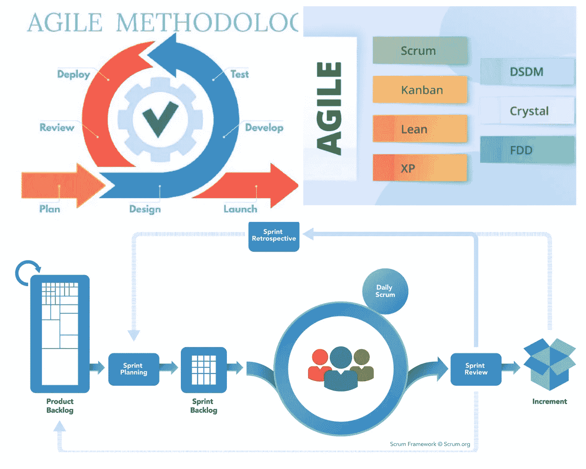
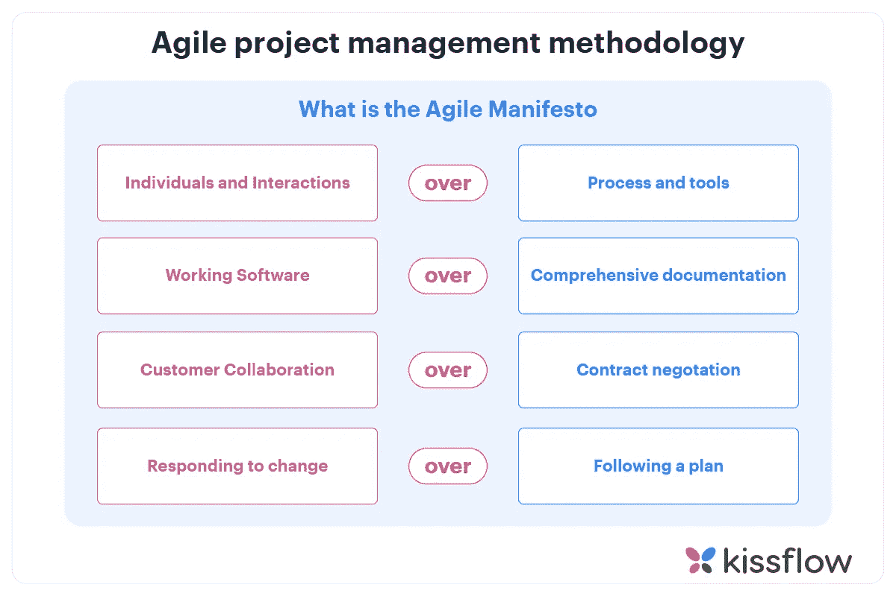
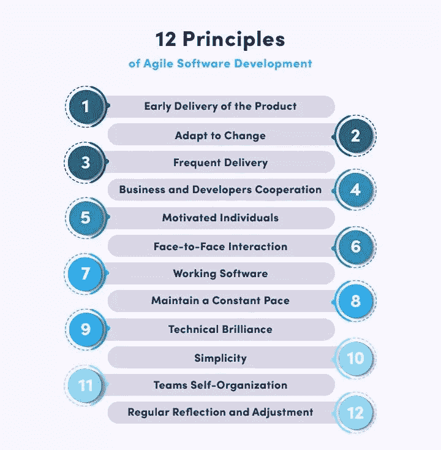
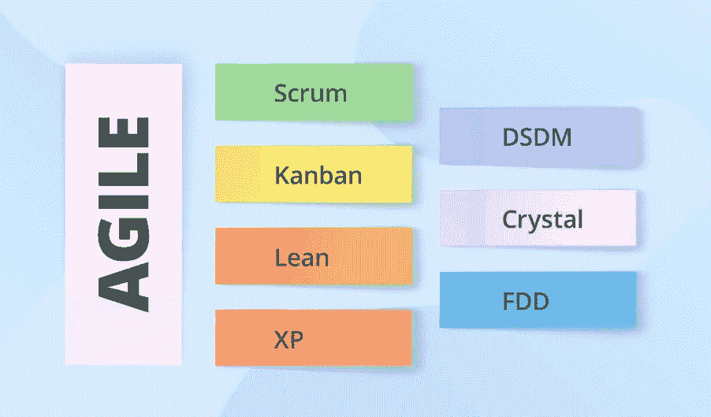
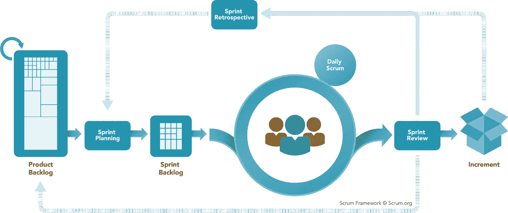
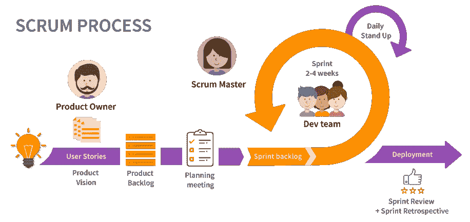

# 关于敏捷和 Scrum 你需要知道的一切——Scrum 团队、事件和工件

> 原文：<https://blog.devgenius.io/everything-you-need-to-know-about-agile-and-scrum-scrum-team-events-and-artifacts-33bf8715c03b?source=collection_archive---------0----------------------->



大家好。在本文中，我们将详细了解敏捷，以及**敏捷宣言、4 个敏捷价值观和 12 个敏捷原则**。然后我们会读到不同的敏捷框架，比如看板、Scrum 等等。

在那之后，我们将深入到 **Scrum 框架**中，在那里我们将详细了解什么是 **Scrum 团队、事件和工件**。在文章的最后，我们将会看到 Scrum 的好处，这使得它在其他敏捷框架中非常流行。

# 什么是敏捷？

敏捷就是应对变化。它是软件开发和管理的迭代方法，帮助团队以更快更好的方式向他们的客户交付价值。

敏捷软件开发团队是一个跨职能的团队，由具有不同技能、专业知识和角色的人组成，他们一起工作来完成一个共同的目标。这些团队使用基于迭代软件开发的敏捷方法，其中需求和解决方案通过**协作、检查和适应**而发展。这允许快速交付高质量的软件和符合客户需求和公司目标的商业方法。

敏捷项目管理最初是为复杂和动态环境的软件项目管理而引入的。由于其受欢迎程度，它甚至被用于非软件领域，如制造、支持、营销或供应链管理。

敏捷与其他软件方法的主要区别在于对人和协作的关注。它提供了灵活性，并适应基于团队和涉众之间频繁协作的变化。

# 什么是敏捷宣言？

敏捷宣言于 2001 年由 17 名软件开发专业人员联合发布，他们认识到需要一个更好的软件开发过程。这个宣言建立在 4 个敏捷价值观和 12 个敏捷原则之上。

敏捷宣言概述了项目和产品管理敏捷的价值、原则和实践。敏捷开发指的是任何与敏捷宣言的概念相一致的开发过程。

# 敏捷的 4 个价值观



图片来源:[https://kiss flow . com/hub fs/Agile-project-management-methodology-100-1 . jpg](https://kissflow.com/hubfs/Agile-project-management-methodology-100-1.jpg)

上图中描述了 4 种敏捷价值观。这些价值观鼓励将人和他们的交互置于过程和工具之前，更快地交付软件，与客户合作，尽可能快地适应变化和反馈。

敏捷的四个价值观展示了一个人应该对任何项目采取的广泛方法。这四个敏捷价值观构成了敏捷宣言的精髓。所有 12 条敏捷原则都基于它们。

# 敏捷的 12 个原则

敏捷的 12 个原则是基于我们上面看到的 4 个敏捷价值观。这些原则旨在创建和支持一种软件开发方法，这种方法关注于客户需求和市场力量的变化，通过这种方法，通过一个灵活的系统可以获得更好的结果。



图片来源:[https://im.ezgif.com/tmp/ezgif-1-273b0c2932.jpg](https://im.ezgif.com/tmp/ezgif-1-273b0c2932.jpg)

这些敏捷原则可以应用于不同规模的团队，它在团队中培养了更紧密、更协作的工作关系。个人将对自己的工作负责。

# 敏捷方法的类型

有各种类型的敏捷方法可以满足不同的场景和需求。但是所有的敏捷方法都是基于敏捷宣言中提到的原则。

这些敏捷方法有助于以更及时的方式为客户生产更好、更高质量的产品。



图片来源:[https://www . SCN soft . com/blog-pictures/custom-software-development/what-is-agile-software-development-03 . png](https://www.scnsoft.com/blog-pictures/custom-software-development/what-is-agile-software-development-03.png)

以下是一些最常见的敏捷框架。

## 1.看板法

看板方法使用视觉来查看已完成工作的进度和剩余工作。看板项目通常通过一个叫做**的看板板**来管理，看板板有三个部分，即“要做的”、“正在做的”和“完成的”看板框架中没有正式的角色

## 2.混乱

Scrum 和看板非常相似，使用了一个类似于看板的板，叫做 **Scrum board** 。这个板是用来跟踪工作进度的。Scrum 框架专注于将工作分解成称为 sprint 的迭代，scrum 团队一次只能计划和执行一个 sprint。Scrum 有 3 个角色，即 Scrum master、产品所有者和开发人员。

## 3.极限编程(XP)

极限编程(XP)是一种致力于团队合作、交流和反馈的方法。在使用称为 Sprints 的较短开发周期方面，它与 scrum 相似。这种技术在客户需求不断变化的动态环境中非常有用。

## 4.透明的

Crystal 是一组较小的敏捷开发方法，包括**水晶黄、水晶清、水晶红、水晶橙**等等。它们中的每一个都有独特的框架，我们需要根据系统重要性、团队规模和项目优先级等因素来选择一个。

## 5.动态系统开发方法(DSDM)

动态系统开发方法(DSDM)框架的建立是为了拥有一个用于快速软件交付的通用行业框架。它基于业务驱动的方法，并提供了八项原则，允许对项目进行修改，但决不能就质量和及时交付进行谈判。DSDM 也使用短跑。

## 6.特征驱动开发

特征驱动开发用于每两周创建一次软件模型。这个框架需要为每个模型特性做开发和设计计划。由于这种方法对文档的要求更加严格，所以它更适合具有高级设计和计划能力的团队。

## 7.精益软件开发

精益软件开发经常和敏捷一起使用，并且可以互换使用。但是这是一个完全不同的方法论，分享了敏捷的大部分价值。

精益软件开发的原则是

*   消除浪费
*   将质量建立在
*   创造知识
*   推迟承诺
*   快速交付
*   尊重他人
*   整体优化

## 8.扩展敏捷框架(安全)

可扩展的敏捷框架(SAFe)是一套在企业范围内实现敏捷实践的组织和工作流模式。

SAFe 促进在大型项目或产品上工作的多个大型敏捷团队之间的**一致、协作和交付**。它是围绕敏捷软件开发、精益产品开发和系统思维形成的。

已经看到了敏捷的 8 个常见框架，让我们深入到 Scrum 框架中。

# 什么是 Scrum？

Scrum 是一个敏捷的框架，遵循增量和迭代的开发方法，关注复杂的项目。Ken Schwaber 和 Jeff Sutherland 在 1995 年提出了使用 Scrum 作为软件开发框架的想法。最初，它仅用于软件开发，由于它的成功，现在它被用于各种领域，如销售、研究、市场营销等等。



图片来源:[https://scrum org-website-prod . S3 . Amazon AWS . com/Drupal/inline-images/2022-10/scrum _ framework . png](https://scrumorg-website-prod.s3.amazonaws.com/drupal/inline-images/2022-10/scrum_framework.png)

Scrum 这个名字来源于橄榄球运动，在比赛因姻亲侵权而停止后，两个队聚在一起争夺球的所有权。Scrums 涉及每队的八名球员，他们绑在一起互相推搡。在软件开发的背景下，Scrum 是团队聚集在一起推动产品前进的地方。


图片来源:[https://d2779tscntxxsw.cloudfront.net/59b1c07807ac4.jpeg?宽度=650 &质量=80](https://d2779tscntxxsw.cloudfront.net/59b1c07807ac4.jpeg?width=650&quality=80)

Scrum 建立在一个叫做**经验主义**的概念上，scrum 团队根据客户的体验和反馈做出决定和改变，同时通过小实验，从中学习和适应。这种经验将有助于 scrum 团队未来的计划和决策

Scrum 有 **3 个支柱，也就是说，正因为如此，Scrum 非常有效和高效**

1.  **透明度**
2.  **检查**
3.  **适应**

信任是 Scrum 团队最重要的特征。如果在 Scrum 团队中没有信任，或者信任被打破，那么在交付工作的过程中可能会出现紧张和障碍。

有 5 个 Scrum 价值观，即

1.  **勇气**
2.  **焦点**
3.  **承诺**
4.  **尊重**
5.  **开放度**

上面的 5 个 Scrum 价值观对于 Scrum 团队如何工作非常关键，因此 Scrum 团队成员在一起工作时必须遵循这些价值观。在实验是取得进步的核心的环境中，Scrum 价值观尤其重要。

# scrum——团队、事件和工件



图片来源:[https://www . tuleap . org/WP-content/uploads/2020/06/Scrum-process-schema-EN-small . png](https://www.tuleap.org/wp-content/uploads/2020/06/Scrum-process-schema-EN-small.png)

## Scrum 团队

Scrum 的基本单位是一个小型团队，也就是 Scrum 团队。Scrum 团队中没有子团队、层级或头衔。它是一个由致力于一个被称为产品目标的目标的人组成的有凝聚力的单位。

Scrum 团队是跨职能的，即他们来自不同的背景，拥有不同的技能和专业知识。但是他们应该意味着拥有为每个 Sprint 创造价值的所有必要技能，而不依赖于 scrum 团队之外的人。这使得 Scrum 团队可以自我管理，他们必须知道如何完成工作。

Scrum 建议成立一个规模不超过 10 人的团队来提高效率。如果规模更大，他们必须重组为多个拥有合适技能和专业知识的 scrum 团队。

Scrum 框架将 Scrum 团队定义为由以下三个角色组成，每个角色都有特定的职责。

1.  **Scrum 大师**

Scrum Master 是负责在团队和组织中建立 Scrum 实践的人。Scrum Master 对 Scrum 团队的效率负责，他们通过让 Scrum 团队在 Scrum 框架内改进实践来做到这一点。

Scrum 大师的一些职责如下

*   在自我管理和跨职能方面指导团队成员
*   帮助 Scrum 团队专注于创造满足完成定义的高价值增量
*   帮助清除 Scrum 团队中的障碍，使他们能够前进
*   确保所有的 Scrum 事件都发生了，并且是积极的、有成效的，并且在规定的时间内完成。
*   领导、培训和指导组织采用 Scrum，消除利益相关者和 Scrum 团队之间的障碍。

**2。产品所有者**

每个产品都有一个被称为产品所有者的角色，负责最大化 scrum 团队交付的产品的价值。每个产品必须只有一个产品负责人，他们的职责如下

*   开发产品目标并明确传达
*   创建产品待办事项并就此进行沟通
*   基于优先级对产品待办事项进行排序
*   确保产品待办事项的透明度，并确保相关人员可以看到并清楚地理解它

**3。开发者**

Scrum 团队中负责为每个 Sprint 创建可用的产品增量的人被称为开发人员。开发人员需要的特定技能通常很广泛，并且会随着工作领域的不同而不同。

开发人员不仅仅是创建代码的人。任何为构建产品做出贡献的人，比如程序员、测试员、分析师、设计师、开发人员等等，在 Scrum 中都被称为开发人员。

Scrum 主管和产品负责人也可以在 Scrum 团队中担任开发人员的额外角色，但是 Scrum 并不推荐这样做

## Scrum 事件

Scrum 团队参与**的五个事件**并生产 t **hree 工件**。

1.  ***冲刺***

> Sprints 是 Scrum 的心脏，在这里想法被转化为价值

Sprint 是 Scrum 团队一起工作并向客户交付价值的迭代周期。Sprint 的时间长度必须为一个月或更短，以保持一致性，并且新的 Sprint 会在上一个 Sprint 结束后立即开始。

***2。冲刺规划***

Sprint 规划活动在每个 Sprint 开始之前进行，它是整个团队在此期间交付内容的计划。

产品所有者和开发人员基于对速度、资源以及任何可能影响可用时间和资源的因素的了解，讨论在这个 Sprint 中可以交付哪些产品待定项

***3。每日混战***

对于 Scrum 团队的开发人员来说，每日 Scrum 是一个 15 分钟的事件，它应该在相同的地点和时间举行，以保持一致性并降低复杂性。这个日常事件有助于团队检查冲刺目标的进展，并消除任何障碍(如果有的话)

***4。冲刺复习***

Scrum 团队向关键涉众展示他们的工作成果，并讨论产品目标的进展。Sprint 评审的目的是检查 Sprint 的结果，并通过收集反馈和实施变更来确定未来的调整。

***5。冲刺回顾***

Sprint 回顾是一个非常重要的 Scrum 事件，它在每个 Sprint 结束时举行。这有助于团队讨论和反思在之前的 Sprint 中发生了什么，并找到提高工作质量和团队合作效率的方法

## Scrum 工件

Scrum 使用三个工件来帮助管理工作，这些工件代表工作或价值。它们旨在最大限度地提高关键信息的透明度。

每一个工件都包含了一个承诺，以确保它提供了增强透明度的信息，并集中了可以衡量进展的焦点

1.  ***产品积压***

产品 backlog 是基于产品目标的产品中已知需要的所有东西的有序列表。它是不断发展的，永远不会完整。

**②*。冲刺积压***

sprint backlog 是团队承诺在给定的 sprint 中完成的所有事情的列表。一旦创建，除了开发团队，没有人可以添加到 sprint backlog 中。

***3。潜在可释放产品增量***

在每个 sprint 的结尾，团队交付一个潜在的可发布的产品增量，这意味着它满足他们一致同意的完成定义。

# Scrum 为什么流行？

在上一节已经了解了 Scrum，让我们看看为什么 Scrum 比其他敏捷框架更受欢迎

*   Scrum 是有文档记录的，是 Scrum 指南，易于实现
*   Scrum 适用于复杂的项目
*   Scrum 帮助团队快速响应不断变化的需求
*   它促进创造力和创新
*   它提高了开发团队的生产力
*   减少浪费并降低成本
*   它总是通过反馈周期确保客户满意
*   Scrum 缩短了上市时间，因为工作是增量交付的，而不是累积的
*   提高灵活性和适应性，并在不同市场和行业中发挥作用
*   Scrum 让团队自组织，让整个团队对工作负责。

在本文中，我们详细了解了什么是敏捷，以及**敏捷宣言、4 个敏捷价值观和 12 个敏捷原则**。然后我们看到了不同的敏捷框架，比如**看板、Scrum** 等等。之后，我们深入研究了 Scrum 框架，在那里我们详细了解了什么是 **Scrum 团队、事件和工件**。我们通过查看 Scrum 的**优势来结束这篇文章，这使得 Scrum 在其他敏捷框架中非常流行。**

我知道这是相当多的信息，很难消化，但希望它对你有用，感谢阅读！！！

请阅读我关于如何准备 Scrum Master 认证的故事

[](https://dineshchandgr.medium.com/how-to-prepare-for-scrum-master-certification-938e723bb957) [## 如何准备 Scrum Master 认证？

### 大家好。在我的上一篇文章中，我详细描述了敏捷和 Scrum。如果…请参考我下面的文章

dineshchandgr.medium.com](https://dineshchandgr.medium.com/how-to-prepare-for-scrum-master-certification-938e723bb957) 

```
If you like to get more updates from me, 
please follow me on Medium and subscribe to email alert.

If you are considering to buy a medium membership, 
please buy through my referral link
```

[](https://dineshchandgr.medium.com/membership) [## 通过我的推荐链接加入 Medium-Dineshchandgr

### 阅读来自 Dineshchandgr 的高质量技术内容，直接跟上技术更新您的会员费…

dineshchandgr.medium.com](https://dineshchandgr.medium.com/membership)